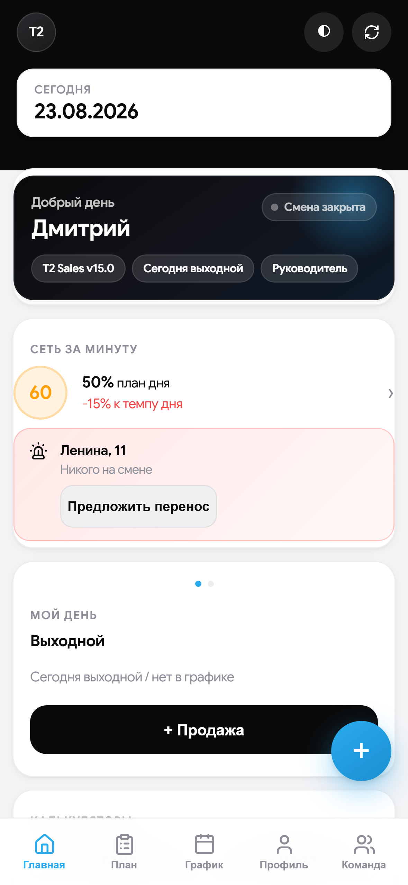
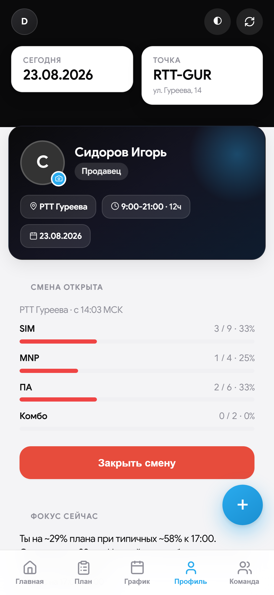
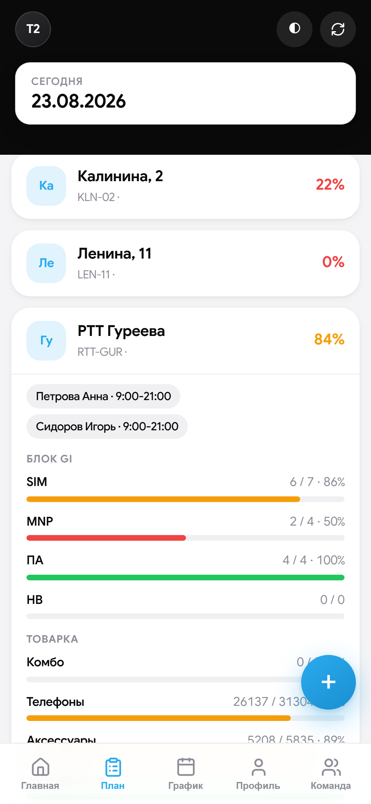
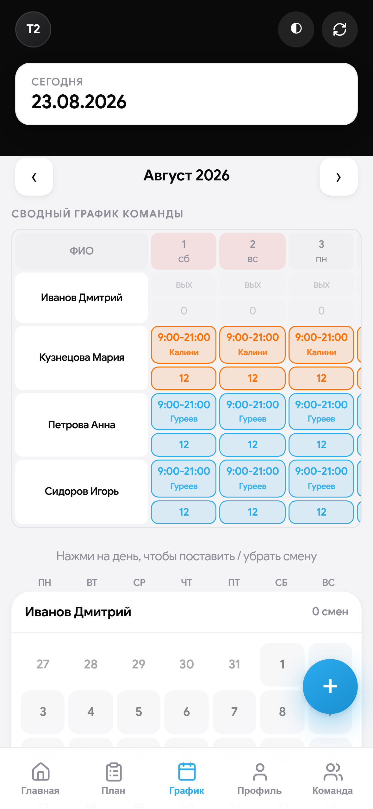
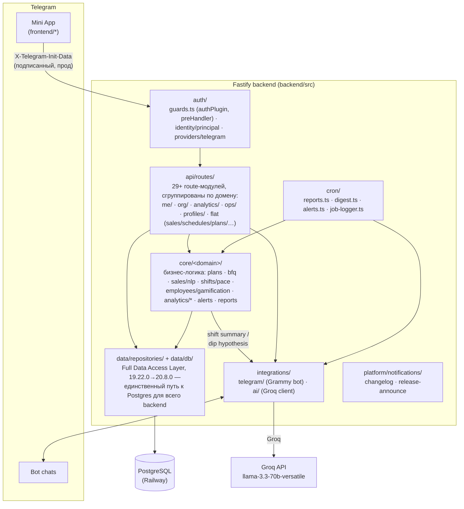

<div align="center">

# T2 Sales

### Операционная система розничных продаж сети T2
**Telegram Mini App · Fastify · PostgreSQL · Grammy · Railway**

[](#21-история-версий)
[](https://github.com/JustT1MExGOD/tele2-app/actions/workflows/ci.yml)


> Не «таблица + бот в чате».
> Единая рабочая среда смены: план, факт, график, касса, BFQ, live-сеть, обучение, роли, отчёты и AI Copilot — в одном касании.

[📐 Архитектура](docs/ARCHITECTURE.md) · [🔒 Безопасность](docs/SECURITY.md) · [🔌 API](docs/API.md) · [🛠 Разработка](docs/DEVELOPMENT.md) · [📚 Все документы](docs/README.md)

</div>

<table>
<tr>
<td width="50%" align="center">
<br>
<sub><strong>Главная</strong> — Command Center: health-score сети, просадки точек в реальном времени</sub>
</td>
<td width="50%" align="center">
<br>
<sub><strong>Профиль</strong> — открытая смена: план/факт по метрикам вживую, AI-подсказка по темпу</sub>
</td>
</tr>
<tr>
<td width="50%" align="center">
<br>
<sub><strong>План</strong> — план дня точки по блокам (GI / Товарка / РТК / Кредиты), кто на смене</sub>
</td>
<td width="50%" align="center">
<br>
<sub><strong>График</strong> — сводный график команды на месяц, точка на каждый день</sub>
</td>
</tr>
</table>

<sub>Скриншоты сняты в изолированном локальном демо-окружении на синтетических тестовых данных (вымышленные имена и цифры) — не с прода.</sub>

---

### Если у вас 20 секунд

- **Что это** — веб-приложение прямо внутри Telegram (Mini App), которым сотрудники магазинов пользуются вместо блокнота, Google Sheets и переписки в чате.
- **Кто пользуется** — продавец на точке (внёс продажу, открыл смену), управляющий сетью (видит всё, раздаёт задачи), супервайзер нескольких сетей, админ.
- **Как это устроено** — Telegram передаёт подписанную личность пользователя → сервер на Fastify проверяет её и права → PostgreSQL хранит единственную версию правды → бот сам присылает отчёты в чат.
- **Почему это не просто CRUD** — офлайн-очередь продаж, живая карта сети, AI-объяснение просадок, геймификация обучения, аудит каждого чувствительного действия.

**Актуальная версия клиента:** `20.18.0` · **Часовой пояс истины:** `Europe/Moscow`

---

## Оглавление

**Что и зачем**

1. [Зачем это существует](#1-зачем-это-существует)
2. [Кому и что даёт](#2-кому-и-что-даёт)

**Как устроено**

3. [Стек и инфраструктура](#3-стек-и-инфраструктура)
4. [Архитектура](#4-архитектура)
5. [Структура репозитория](#5-структура-репозитория)
6. [Модель данных](#6-модель-данных)
7. [Роли и доступ](#7-роли-и-доступ)

**Что внутри**

8. [Функциональность по модулям](#8-функциональность-по-модулям)
9. [Метрики продаж](#9-метрики-продаж)
10. [Планирование](#10-планирование)
11. [Касса](#11-касса)
12. [Telegram-бот и отчёты](#12-telegram-бот-и-отчёты)
13. [Обучение](#13-обучение)

**Как работать**

14. [HTTP API](#14-http-api)
15. [Переменные окружения](#15-переменные-окружения)
16. [Локальный запуск](#16-локальный-запуск)
17. [Деплой на Railway](#17-деплой-на-railway)
18. [Миграции SQL](#18-миграции-sql)
19. [Mini App в BotFather](#19-mini-app-в-botfather)
20. [Типовые сбои](#20-типовые-сбои)

**Куда движется и по каким правилам**

21. [История версий](#21-история-версий)
22. [Дорожная карта](#22-дорожная-карта)
23. [Соглашения по разработке](#23-соглашения-по-разработке)
24. [Безопасность](#24-безопасность)
25. [Чеклист запуска с нуля](#25-чеклист-запуска-с-нуля)

---

## 1. Зачем это существует

Google Sheets + переписка в Telegram живут на одной точке и трёх людях. На сети точек:

| Боль | Почему Sheets не тянет |
|------|------------------------|
| Разные «истины» | копии файла, формулы, ручной ввод |
| Нет ролей | все правят всё или не видят ничего |
| Нет офлайна | продажа потерялась без Wi‑Fi |
| Нет сессии смены | непонятно, кто реально на точке |
| Отчёты вручную | копипаста, ошибки, задержки |
| Онбординг | «почитай чат за месяц» |

**T2 Sales** — источник истины: сотрудник работает в Mini App, бот уведомляет, PostgreSQL хранит факт, Railway держит API.

---

## 2. Кому и что даёт

### Сотрудник (`employee`, `trainee`, `senior`)
- Профиль: смена, дневной/месячный план, BFQ, геймификация (XP/уровень/стрик), история смен
- Продажи только за себя, мульти-метрики, дельты
- Быстрый ввод текстом: «две симки и одно mnp» (NLP-разбор)
- Смена-сессия: open/close + гео + план/факт живьём, пока смена открыта, заметка-передача следующему на этой точке
- Свои задачи (назначает manager) — принять в работу / закрыть
- График, план точек (дневной план — теперь считается от месячного плана точки, не от долей сотрудников), промокоды РТК, калькуляторы (комбо/школа)
- Кастомная аватарка (видна и в «Команде»)
- Офлайн-очередь продаж (без сети — уходит при появлении Wi‑Fi)
- Обязательное обучение с персонажем-маскотом (без skip в первый раз)
- Поддержка / FAQ

### Старший продавец (`senior`)
- Всё сотрудника + касса, BFQ, заявки на доступ, CSV-экспорты, кастомные названия точек
- **Без** Command Center и кабинета супервайзера (видимость аналитики — отдельный флаг от операционных прав)
- **Без** продаж/дельт за ДРУГОГО сотрудника — только за себя, как обычный сотрудник (`canWriteSalesForOthers()`, 20.13.0)

### Управляющий (`manager`)
- Всё senior +, а не «операционно то же самое» — именно на этой границе
- **Command Center** — единый экран «что происходит / где проблема / что делать» вместо трёх разрозненных мест
- **Задачи** — создать/назначить с контекстом прямо из просадки или алерта, тред комментариев
- **Профиль точки** / **Профиль сотрудника** — план/факт/прогноз/тренд/Health Score на одном экране
- **Алерты 2.0** — полный жизненный цикл (open→in_progress→acked/dismissed), включая аномалии (z-score против прогноза, не только план)
- График (bulk, сводная таблица месяца по всей команде), месячные планы сотрудников и точек
- Чужие продажи и дельты (в своей сети), Live-карта сети
- Отдельный курс обучения manager

### Admin
- Всё manager + тикеты поддержки (эскалация к разработчику), назначение ролей (только строго ниже своей), переключатель сети в UI, кабинет супервайзера в режиме просмотра, заведение новых сетей без SQL

### Supervisor
- Свой сектор целиком (несколько сетей сразу) — отдельный визуал, 4 своих вкладки (Обзор/Точки/Люди/Тренд), выполнение и прогноз месячного плана по сектору

### Сеть
- Единые микро/итог отчёты в чат (расписание — по точке, не глобальное), автоанонс версий в отдельный Telegram-канал
- Еженедельная/месячная сводка по сети (страница «Отчёты»), экспорт / BI
- Новые сети и точки без единой строчки SQL — через UI

---

## 3. Стек и инфраструктура

| Слой | Технология | Зачем |
|------|------------|-------|
| Клиент | Telegram WebApp, `index.html` | UI, offline-queue, tutorial |
| API | Node.js 22, Fastify 5, TypeScript | REST + static |
| БД | PostgreSQL (Railway) | источник истины |
| Бот | Grammy | отчёты, напоминания, notify |
| Cron | setInterval, логика МСК | микро/итог, алерты |
| AI | Groq API (`llama-3.3-70b-versatile`) | итог смены + гипотеза при просадке — бесплатно, без vendor lock-in |
| Хостинг | Railway / Nixpacks | API + фронт |

Клиент **не** ходит в БД: Mini App → подписанная `X-Telegram-Init-Data` → API → Postgres.

---

## 4. Архитектура



Клиент **не** ходит в БД напрямую — только через API. Полный разбор слоёв
и живой справочник структуры — **[docs/ARCHITECTURE.md](docs/ARCHITECTURE.md)**.

---

## 5. Структура репозитория

Полное дерево `backend/src/` (layered-структура: `api/`, `core/`, `data/`,
`platform/`, `integrations/`, `auth/`, `cron/`, `workers/`, `shared/`,
`utils/`) — **[docs/ARCHITECTURE.md](docs/ARCHITECTURE.md)**.

---

## 6. Модель данных

| Таблица | Смысл |
|--------|--------|
| `organizations` | сеть точек — branding, `sector_id`, `chat_id`/`sales_thread_id`/`reports_thread_id` |
| `sectors` | группа сетей, назначается супервайзеру целиком |
| `stores` | точки: code, color, `org_id`, `display_name` (кастомное название, 19.7.0), micro-report расписание |
| `employees` | FIO, telegram_id (UNIQUE), role, access_status, org_id, avatar_data/avatar_mime (19.7.0) |
| `schedules` | смена на день (UNIQUE employee+date) |
| `sales` | факт метрик (аддитивная запись, единая точка входа — `applySaleUpsert()`) |
| `sales_audit` | аудит правок метрик (кто/когда/сколько) |
| `sales_events` | сырые события продаж — источник точного heatmap по часу |
| `employee_month_plans` | месячный план человека |
| `store_month_plans` | месячный план точки — независимый ручной ввод (не доля от планов сотрудников, с 15.13.0) |
| `store_plans` | материализованный дневной снапшот плана точки (кэш для BFQ/live/отчётов, крон 6:00 МСК) |
| `store_forecasts` | кэш прогноза (SES + сезонность по дню недели) |
| `store_cash` | факт / 1С |
| `shift_sessions` | open/close смены, handover_note, гео |
| `tasks` / `task_comments` | задачи из просадки/алерта, тред комментариев |
| `smart_alerts` | Alerts 2.0 — полный жизненный цикл, включая `anomaly_vs_forecast` |
| `rtk_promocodes` | пул промокодов, org-scoped |
| `announcements` / `announcement_reads` | объявления сети + кто прочитал |
| `channels` / `channel_messages` | внутренние каналы сети |
| `access_requests` | заявки на доступ (org-scoped по выбору при регистрации) |
| `support_*` | тикеты, FAQ, вложения, шаблоны (эскалация к разработчику, admin-only) |
| `offline_sync_log` | идемпотентность офлайн-очереди по `client_id` |
| `cron_send_log` | claim-защита от повторной отправки авто-отчётов/напоминаний |
| `ai_audit` | лог AI Copilot: kind (`shift_summary`/`dip_comment`/`forecast_summary`), employee/store, prompt, response, model |
| `app_settings` | служебные ключ-значение (напр. `last_announced_version`) |

Критичные UNIQUE: `schedules(employee_id, work_date)`, `store_cash(store_id, cash_date)`,
`employees.telegram_id`, upsert-ключ `sales`, partial unique на одну открытую
`shift_sessions` на сотрудника.

---

## 7. Роли и доступ

Полная лестница (с 15.9.0): `trainee < employee < senior < manager < supervisor < admin`
(`ROLE_LEVEL` в `auth/principal.ts`, см. [ARCHITECTURE.md](docs/ARCHITECTURE.md)).
Назначить можно только роль строго ниже своей (`canAssignRole()`) — admin
без ограничений.

| role | Права |
|------|--------|
| `trainee` | стажёр — минимум прав, растёт до `employee` |
| `employee` | свои продажи, свой план, смена-сессия |
| `senior` | операционно как `manager` (сотрудники/точки/график/касса/экспорты), но **без** продаж за другого сотрудника (`canWriteSalesForOthers()`, 20.13.0) и намеренно **без** Command Center и кабинета супервайзера — разделены «операционные права» и «видимость аналитики» |
| `manager` | всё senior + продажи за другого сотрудника, Command Center, Store/Employee Profile, алерты, задачи |
| `admin` | всё manager + поддержка (эскалация), назначение ролей, переключатель сети, кабинет супервайзера |
| `supervisor` | свой сектор (несколько сетей) целиком — отдельный визуал, отдельные 4 вкладки, не пересекается с обычными 5 |

| access_status | UI |
|---------------|-----|
| `none` | регистрация (пикер сети → форма заявки) |
| `pending` | ожидание одобрения |
| `rejected` / `blocked` | отказ |
| `active` | полный доступ по своей роли |

**Auth — только через подписанную Telegram initData**, не через голый
заголовок (см. §24). `X-Telegram-Id` без initData работает лишь в
локальной разработке или при явном `ALLOW_INSECURE_AUTH=true`.

Мультитенантность: `organizations` (= «сеть точек», с `sector_id`/`chat_id`/
`sales_thread_id`/`reports_thread_id`) группируются в `sectors` — их видит
целиком `supervisor` через `supervisor_sectors`. Почти все read/write роуты
скоуплены по `org_id` через `resolveViewOrgId()`/`assertStoreInOrg()`/
`assertEmployeeInOrg()`; admin может явно переключить сеть просмотра
переключателем в UI (`?org_id=`/`body.org_id`), остальные роли — только
своя сеть, с одним исключением: собственная запись (продажа/смена) видна
всегда, даже если сегодня сотрудник работает на точке чужой сети внутри
той же организации («подмена»).

Восстановление доступа admin при инциденте (SQL, не рутинная операция) —
**[docs/RUNBOOK.md](docs/RUNBOOK.md#восстановление-доступа-admin)**.

---

## 8. Функциональность по модулям

Нижняя навигация (5 вкладок): Главная · План · График · Профиль · Команда
(supervisor — отдельные 4: Обзор · Точки · Люди · Тренд). Разбор каждого
экрана — **[docs/FEATURES.md — навигация](docs/FEATURES.md#навигация)**.

---

## 9. Метрики продаж

Полный список метрик и формулы расчёта (комбо/школа) —
**[docs/FEATURES.md — метрики продаж](docs/FEATURES.md#метрики-продаж)**.

---

## 10. Планирование

Формулы дневного плана сотрудника/точки, материализация снапшота —
**[docs/FEATURES.md — планирование](docs/FEATURES.md#планирование)**.

---

## 11. Касса

```text
Δ = cash_fact − (cash_1c + 2000)
```

---

## 12. Telegram-бот и отчёты

Расписание по точке, itog-альбом из 3 картинок, AI Copilot в отчёте,
защита от задвоенной отправки — **[docs/FEATURES.md — бот и отчёты](docs/FEATURES.md#telegram-бот-и-отчёты)**.
Пайплайн рендера — **[docs/REPORT_IMAGE.md](docs/REPORT_IMAGE.md)**.

---

## 13. Обучение

Персонаж-маскот «Арбузыч», два трека (employee/manager), dry-run практика —
**[docs/FEATURES.md — обучение](docs/FEATURES.md#обучение)**.

---

## 14. HTTP API

Полная таблица эндпоинтов по группам, с указанием файла-обработчика —
**[docs/API.md](docs/API.md)**. Auth: `X-Telegram-Init-Data`
(подписанный, прод) — см. §24. Каждый роут, отдающий чужие/сетевые
данные, гейтится `requireAuth`/`requireActive`/`requireManager`/
`requireSupervisor` + org-scope — см. §7, §24.

---

## 15. Переменные окружения

Полная таблица — **[docs/DEVELOPMENT.md](docs/DEVELOPMENT.md)**.

---

## 16. Локальный запуск

Установка, запуск, прогон тестов на одноразовом Postgres —
**[docs/DEVELOPMENT.md](docs/DEVELOPMENT.md)**. В CI
(`.github/workflows/ci.yml`) то же самое происходит автоматически на
каждый push.

---

## 17. Деплой на Railway

1. Root Directory = **`backend`**  
2. Variables: БД, токен, chat ids  
3. Build: `npm ci && npm run build`  
4. Start: `npm start`  
5. Health: `/health`  
6. **Replicas = 1**  
7. **Деплой ждёт зелёный CI** (с 17.3.0) — `checkSuites: true` на deployment trigger сервиса (Railway GraphQL API, `deploymentTriggerUpdate`, настройки нет в `railway.json` — только через API/дашборд). Красный `.github/workflows/ci.yml` теперь блокирует деплой, а не просто сигнализирует постфактум

Лог успеха: серия `✅ ... routes registered` (по одной на каждый модуль
`routes-*.ts`), `📦 Применены миграции: ...` (если были новые), `🚀 Сервер на 0.0.0.0:…`, `🤖 Bot polling started`.

---

## 18. Миграции SQL

С 17.5.0 — система миграций (`backend/src/db/migrate.ts`), не ad hoc SQL
руками на Railway. Пронумерованные файлы в `backend/migrations/`, трекинг —
таблица `schema_migrations` (`name`, `applied_at`). **Важно**: именно
`backend/migrations/`, не `sql/` на корне репозитория — Root Directory
сервиса на Railway = `backend`, всё, что снаружи, в контейнер не попадает.

**Новое изменение схемы**: создать `backend/migrations/00NN_описание.sql` со
следующим номером — и всё, применяется само:

- **На проде** — автоматически при следующем деплое, до открытия порта
  (`index.ts`, до `app.listen()`). Если миграция падает — сервер не
  стартует (лучше не поднимаемся, чем поднимаемся с неверной схемой);
  `railway.json` → `restartPolicyType: ON_FAILURE` в этом случае будет
  ретраить старт, так что упавшую миграцию нужно чинить новым коммитом,
  а не полагаться на ретраи.
- **В CI** (`.github/workflows/ci.yml`) — `npm run migrate` на чистом
  Postgres на каждый push, тем самым же кодом, что и на проде.
- **Локально** — `cd backend && npm run migrate` (нужен `DATABASE_URL` в
  окружении).

Файл уже применённой миграции задним числом не редактируется — новое
изменение, даже мелкое, всегда новый номер.

`backend/migrations/0001_baseline.sql` — снапшот схемы на момент введения
системы (17.5.0), на самом проде НЕ исполнялся — `schema_migrations` там
сразу засеяна записью об этом файле, чтобы не пытаться заново создать уже
существующие таблицы. Исполняется только на чистой БД (CI, локальный тест).

---

## 19. Mini App в BotFather

Menu Button → URL `https://<service>.up.railway.app/`  
Открывать из Telegram. После деплоя — полное закрытие WebApp (кэш).

---

## 20. Типовые сбои

Полная таблица симптом → причина/действие —
**[docs/TROUBLESHOOTING.md](docs/TROUBLESHOOTING.md)**. Операционные
процедуры (ротация `BOT_TOKEN`, восстановление доступа, откат миграции) —
**[docs/RUNBOOK.md](docs/RUNBOOK.md)**.

---

## 21. История версий

Полная построчная история — **[CHANGELOG.md](CHANGELOG.md)** (60+ записей,
от первых Google Sheets-отчётов до сегодня). Последние пять:

| Версия | Суть |
|--------|------|
| **20.14.0** | Жесты по apple-design skill — перехватываемые свайпы на самодельной пружине вместо CSS-transition, скорость жеста вместо чистой дистанции |
| **20.15.0** | Concurrency & Reliability, часть 1 — idempotency-ключи на `POST /access/requests/:id/approve` (CAS-гонка) и `POST /tasks` |
| **20.16.0** | Concurrency & Reliability, часть 2 — переиспользуемый стенд для race-тестов (N конкурентных запросов), закрыты 2 непроверенных пробела (`POST /me/bind`, `PUT /promos/:id/use`) |
| **20.17.0** | Concurrency & Reliability, часть 3 (финал) — graceful shutdown на SIGTERM/SIGINT, закрывает эпоху 20.15-20.17 ровно по плану |
| **20.18.0** | Explain — первый шаг Intelligence Layer: анализ причин просевшего дня (недоукомплектованность/разрыв явки/сетевая просадка) в `anomaly_vs_forecast`; Platform Layer отложен в backlog за отсутствием реального сигнала |

---

## 22. Дорожная карта

Крупные эпохи проекта — не текущий спринт, а последовательность уже
пройденных и будущих этапов. Актуальный, ещё не закрытый этап —
**Core hardening (20.8-20.22)** ниже; всё, что уже сделано (эпохи 17-20) —
под спойлером для контекста.

<details>
<summary><strong>Пройденные эпохи</strong> (17 → Frontend Foundation, 20.7.0) — по клику</summary>

### Эпоха 17 — «Надёжность перед деньгами» ✅ (17.0.0-17.17.0)
CI на каждый push, тестовый слой авторизации/изоляции сети (149 тестов к
концу эпохи), система миграций, аудит бизнес-корректности (гонки при
открытии/закрытии смены, идемпотентность продажи, денежная точность,
целостность при увольнении). Закрывает почву перед продуктовыми эпохами.

### Эпоха 18 — Command Center suite ✅ (18.0.0-18.11.0)
`18.0` Core Freeze (фиксация ядра под регресс-тестами) → `18.1` Command
Center → `18.2` сводный график команды → `18.3` календарная сетка графика
→ `18.4` Tasks/Action System → `18.5` Store Intelligence (Health Score) →
`18.6` Alerts 2.0 → `18.7` Shift 2.0 (память смены) → `18.8` Employee 2.0
(Health Score) → `18.9` Reports → `18.10` UX-полировка навигации →
`18.11` анонсы версий в отдельный канал.

### Эпоха 19 — Intelligence ✅ частично (19.1.0-19.2.0)
`19.1` Forecast v2 (единая SES-модель + AI-объяснение) → `19.2` Anomaly
Detection (z-score против прогноза). Дальше эпоха не продолжилась своим
изначальным курсом — вместо следующих AI-фич владелец продукта переключился
на большой список UX-правок и security-аудит (ниже), реальная ценность
эпохи Intelligence на этом не закрыта, а поставлена на паузу.

### После 19.2 — UX-батчи и security-аудит ✅ частично (19.3.0-19.21.0)
22-пунктовый список UX-правок от владельца продукта, отгружен батчами:
Главная/Профиль (19.4-19.5), навигация и жесты (19.6, позже часть — свайп
между вкладками и pull-to-refresh — убрана обратно по отзыву, 19.12),
кастомные названия точек/аватарки/график/касса (19.7), Google Sans + иконки
Lucide вместо эмодзи + Android-hardening (19.8), новое оформление карточки
анонса (19.9-19.10). Отдельно — аудит контроля доступа нашёл и закрыл
реальные дыры авторизации (19.11.0, 26 регресс-тестов). Живая
UX-полировка по ходу использования продолжается (19.13.0). Второй раунд
security/архитектурного ревью (20 пунктов) закрыт несколькими заходами: rate
limiting, security headers, прод-гварды на insecure-auth/BOT_TOKEN, короче
срок жизни сессии, magic-bytes на аватарке, зависимости без известных
уязвимостей (19.14.0); единый Fastify error handler с маппингом ошибок
Postgres, аудит зависимостей как gate в CI, контекстные логи (19.15.0,
попутно найден и закрыт баг с отсутствующим `PRIMARY KEY` на `stores.id`,
19.16.0); tenant-check (`assertStoreInOrg`/`assertEmployeeInOrg`) переведён
на preHandler-декораторы на 18 роутах — нельзя случайно забыть в новом коде
(19.17.0); **TypeBox-валидация всех write-роутов** — продажи/касса/график/
смены (19.18.0), доступ/роли/CRUD сотрудников и точек (19.19.0, попутно
пойман и закрыт реальный regression с ajv-коэрсией null→0 на координатах
геолокации), задачи/поддержка/промокоды/объявления (19.20.0), алерты/what-if/
метрики/планы/отчёты/бренд сети (19.21.0, попутно найдены и закрыты два
BFQ-роута, пропущенных ранним заходом) — `request.body as any` в write-роутах
закрыт по всему API, весь эффект **готов** ✅.

### Data/Frontend Foundation — roadmap задан владельцем продукта (19.22.0 → 20.0.0) ✅
Крупные пункты того же ревью получили явный план вперёд вместо разбора по
одному без сквозной цели. Все 6 пунктов закрыты:

- **19.22.0 Data Access Layer** ✅ старт — `src/repositories/`, org-scoped
  queries (`orgId` обязательным первым параметром — структурная гарантия, не
  дисциплина), запрет прямого SQL из migrated-роутов (CI-скрипт,
  ratchet-список). Пилот на одной сущности (Stores — `routes-stores.ts`),
  Employees/Sales/Schedules следующими заходами той же схемой
- **19.23.0 Audit Trail** ✅ — новая таблица `audit_log`, `services/audit.ts`
  (writer), 5 инструментированных действий (смена роли, деактивация
  сотрудника, правка продажи, изменение плана, экспорт CSV), `request_id`
  correlation, `GET /audit` (admin-only) + экран «История действий».
  Смена роли и правка продажи — по-настоящему транзакционны
  (`withTransaction()`, первое появление транзакций в прикладном коде);
  изменение плана — намеренно нет (см. §24, `services/plans.ts` сложнее
  для безопасного встраивания в общую транзакцию, не трогали ради этого)
- **19.24.0 Concurrency & Workflow Integrity** ✅ — разведка перед кодом
  показала, что большая часть уже была защищена ещё в эпоху 17.0: partial
  unique index на открытую смену, CAS на закрытии, UNIQUE на
  `client_id` для `/sync/batch`/`/sales/quick`, UNIQUE на
  `(employee_id, store_id, sale_date)` для продаж — ни одного бага, только
  не было тестов, реально стреляющих ПАРАЛЛЕЛЬНО (добавлены). Найдена и
  закрыта одна настоящая гонка — `materializeStoreDailyPlans()`
  (`services/plans.ts`), см. §24. Optimistic locking нигде не добавлен —
  ни одного места с конкретным риском lost-update не нашлось, добавлять
  спекулятивно не стали
- **19.25.0 Supervisor Scope Cache** ✅ — `services/scope-cache.ts`,
  in-memory TTL-кэш (5 мин) для `resolveSupervisorStores()` — реальный hot
  path кабинета супервайзера/Command Center (`getUserStoreIds`, названный в
  исходном ревью, на поверку оказался мёртвым кодом — нигде не
  вызывается). Redis сознательно не взят — прод на 1 реплике Railway
  (long-polling бота физически не переживает 2 инстанса), in-memory даёт
  ту же корректность без новой инфраструктуры (см. §24). Точечная
  инвалидация при смене сектора супервайзера/роли, полный сброс при
  переносе сети между секторами, `GET /admin/cache-stats` — hit/miss
- **20.0.0 Frontend Foundation** ✅ (**major** — по решению владельца
  продукта, граница эпохи) — первый Vite-билд (`frontend/vite.config.ts`,
  `build.lib`, формат `iife` — совместим с классическими `<script>`, не
  ломает `scripts/smoke-frontend.mjs`), первый настоящий TypeScript
  ES-модуль (`frontend/src/api-client.ts`) на фронтенде, общий контракт
  типов бэк↔фронт (`backend/src/shared/api-types.ts`, переиспользует
  `StoreRecord` из `repositories/stores.ts`, не дублирует), фундамент
  frontend-тестов (vitest + jsdom, `frontend/tests/`). Пилот на двух живых
  GET-эндпоинтах (`/org/stores`, `/metrics`) — `01-core.js` делегирует оба
  вызова новому клиенту без изменения внешнего поведения. Остальные 19
  файлов `frontend/js/` (~350 КБ, 118 разрозненных `fetch()`) переезжают
  на TypeScript следующими версиями эпохи 20 той же пилотной схемой, что
  уже работала для Data Access Layer (19.22.0) и TypeBox (19.18-19.21).
  Замена 71 инлайнового `onclick=` на `addEventListener`/переход на
  строгую CSP — отдельная, более крупная переделка, не часть этого пункта
  (см. §24)

Известное ограничение от владельца продукта на весь этот участок:
**платёжные функции — вне скоупа**, не рассматриваются. Тот же цикл
исследование → план → реализация → верификация → отгрузка, что и весь
предыдущий путь.

### Эпоха 20 — Frontend Foundation ✅ (20.0.0-20.7.0)
`20.0` — билд-инструментарий (Vite), первый typed-модуль, общий контракт
типов, фундамент тестов; пилот на узком срезе (два эндпоинта), не полная
миграция. `20.1` — второй срез: промокоды РТК (`12-promos.js`, 5
эндпоинтов). `20.2` — третий срез: касса + кастомные метрики
(`09-cash-metrics.js`, 4 эндпоинта), попутно найден и закрыт реальный
разнобой в приоритете error/message между файлами — унифицирован на
message-first. `20.3` — четвёртый срез: сводка по сети
(`19-reports.js`, 1 эндпоинт). `20.4` — пятый срез: алерты
(`17-alerts.js`, список/карточка/смена статуса). `20.5` — шестой срез:
задачи (`15-tasks.js`, список/карточка/смена статуса/комментарии — тот
же паттерн, что алерты). `20.6` — седьмой срез: Command Center
(`14-command-center.js`, главный экран + создание задачи из проблемы,
переиспользует `changeAlertStatus` из 20.4.0 напрямую). `20.7` — по
запросу владельца продукта («доделай всё разом») все оставшиеся 13
файлов плюс 2 файла с уже готовым, но не подключённым контрактом
(`16-store-profile.js`, `18-employee-profile.js`) переехали одним
заходом вместо среза за срезом — ~60 новых функций клиента, два новых
хелпера (`requestUpload`/`requestBlob` — multipart и CSV-Blob, не JSON),
многоуровневая схема типизации для больших нетипизированных дашбордов
(§21, 20.7.0). Каждый заход — API-слой на typed-клиент, контракт в
`shared/api-types.ts`, DOM/UI-оркестрация остаётся legacy JS как есть.
Из 118 исходных `fetch()` остались 2 сознательно нетронутых (§21,
20.7.0) — эпоха закрыта.

</details>

### 20.8-20.22 — Core hardening: разрыв с Telegram-ограничением (roadmap владельца продукта, 2026-08-22)
Не новые фичи — цель сделать backend таким, чтобы дальнейшая разработка
почти не увеличивала security debt, прежде чем строить поверх него
Intelligence-слой (эпоха 21) и, при необходимости, отдельные клиенты
(эпоха 22).

- **20.8 Full Data Access Layer** ✅ («главный технический релиз» — по
  оценке владельца продукта) — весь прямой SQL, ещё остававшийся в
  routes/services/cron (алерты, планы и их гоночно-защищённая
  материализация — 19.24.0, кабинет супервайзера, живая карта сети,
  инсайты смены, прогноз, BFQ, геймификация, поддержка, объявления,
  промокоды, кастомные метрики, cron-отчёты и алерты), перенесён в
  `src/repositories/*`. Правило `route → service → repository →
  PostgreSQL` теперь без исключений по всему backend, CI
  (`npm run check:no-direct-sql`) закрывает откат на 54 файлах. Внешнее
  поведение не изменилось ни для одного эндпоинта — рефактор
  архитектуры, не новая функциональность (см. §21, 20.8.0)
- **20.9 Authentication Boundary** ✅ (сужено от исходного «Identity
  Abstraction» по решению владельца продукта — без схемы БД/`identities`,
  только кодовая граница) — `src/auth/` (`identity.ts`,
  `providers/telegram.ts`, `principal.ts`), Telegram-специфика изолирована
  в adapter, `middleware-auth.ts` ре-экспортирует прежние имена без
  изменений для вызывающего кода. `identities`-таблица и мультипровайдерный
  вход — когда появится реальный второй provider (Web/Mobile/SSO), не
  раньше (см. §21, 20.9.0)
- **20.10 Audit & Observability 2.0** ✅ — `audit_log` пополнен `actor_role`/
  `target_org_id`; структурные (pino) логи cron-джобов с длительностью и
  успехом/неудачей (`src/utils/job-logger.ts`); заодно найден и подключён
  никогда не вызывавшийся `startAlertCron()` (контроль 14:00/16:00 не
  срабатывал в проде ни разу) (см. §21, 20.10.0)
- **20.11 Repository Restructuring** ✅ (backend) / 🔄 (frontend) —
  владелец продукта попросил перестроить структуру репозитория вне
  очереди, до Concurrency & Reliability. `backend/src/` переехал из
  плоской структуры (`routes-*.ts`/`services/`/`repositories/` в корне
  `src/`) в layered (`api/routes/`, `core/<domain>/`, `data/`,
  `platform/`, `integrations/`, плюс уже существовавшие `auth/`/`cron/`/
  `workers/`/`shared/`/`utils/`) — механический перенос без изменения
  поведения (103 файла, из них 4 legacy grab-bag файла — `routes-v8.ts`,
  `routes-v14.ts`, `routes-live-alerts.ts`, `routes-core.ts` — разложены
  по реальным доменным границам, где раньше были свалены в одну кучу по
  историческим причинам). Заодно найден и подключён мёртвый
  `startAlertCron()`-путь (см. 20.10.0). `docs/` вынесен из README:
  `ARCHITECTURE.md`, `API.md`, `DEVELOPMENT.md`, `SECURITY.md`,
  `docs/ADR/` (ретроспективные architecture decision records на 6
  ключевых решений), `docs/archive/` — README держит короткие ссылки на
  прежних номерах секций, ничего не переименовано (см. §21, 20.11.0-20.11.1)
- **20.12 Frontend rewrite — первый срез** ✅ — `app/router.ts`
  (typed-реестр страниц, не URL/hash-based), `app/state.ts` (типизированный
  доступ к легаси-сессии `me`, не новое хранилище), первая
  `addEventListener`-кнопка (`features/send-network-digest/`),
  `pages/reports/` заменяет `frontend/js/19-reports.js` файл-в-файл —
  пилот на самой маленькой легаси-странице, продолжается следующими
  версиями той же incremental-схемой, что Frontend Foundation (см. §21,
  20.12.0; альтернативы — `docs/ADR/006`)
- **20.13 Security hardening** ✅ — по внешнему security-аудиту (v20.11.1),
  проверенному по каждому пункту на реальном коде, не принятому на веру.
  Единое правило «продажи за другого» (`canWriteSalesForOthers()`):
  `POST /sales` уже запрещал `senior` вносить продажу за ДРУГОГО
  сотрудника, а `POST /sales/quick`/`POST /sync/batch` через общий
  `isManager()` разрешали — один вопрос, два разных ответа в зависимости
  от точки входа, теперь одна точка правды на все три места. Закрыты 2
  подтверждённых XSS-пробела без экранирования (`07-add-sale.js`,
  `11-v13.js`). Часть находок аудита — уже известные осознанные
  компромиссы (публичные аватары под rate-limit), не новые дыры (см. §21,
  20.13.0)
- **20.14 Жесты по apple-design skill** ✅ — установленный в сессии skill
  `emilkowalski/skills` (`apple-design`) применён к своему же фронтенду:
  свайп-закрытие модалки и свайп между панелями «Мой день»/«Сеть сегодня»
  ехали на CSS `transition` и решали закрыть/переключить чисто по
  дистанции — из-за этого повторный захват элемента, пока он ещё едет
  обратно, давал видимый скачок. Новая `createSpring()` (`01-core.js`,
  ~25 строк без внешней библиотеки) даёт перехватываемость и скорость
  жеста в решении «закрыть/переключить», не только дистанцию; заодно
  `prefers-reduced-motion` перестал быть «убить всё подряд» (см. §21,
  20.14.0)
- **20.15-20.17 Concurrency & Reliability** ✅ — закрыта целиком, ровно
  по плану, без версий сверху
  - `20.15` Idempotency-ключи на критичных операциях ✅ — CAS-гонка в
    `POST /access/requests/:id/approve` (найдена аудитом, не гипотетически:
    два параллельных approve оба создавали сотрудника и слали уведомление),
    `client_id`-защита на `POST /tasks` тем же приёмом, что у `/sales`.
    Естественно-идемпотентная часть write-API (абсолютные перезаписи,
    upsert на реальных UNIQUE) отдельного фикса не потребовала (см. §21,
    20.15.0)
  - `20.16` Adversarial race-condition suite ✅ — переиспользуемый стенд
    (`tests/helpers/concurrency.ts`, N конкурентных запросов, не только 2)
    закрыл 2 реально непроверенных пробела: `POST /me/bind` (код сам
    документировал «узкое окно гонки» комментарием, но ни разу не был
    проверен настоящим конкурентным запросом) и `PUT /promos/:id/use`
    (в 20.15.0 классифицирован «естественно идемпотентен» по чтению кода,
    тоже без реальной проверки) — оба подтверждены эмпирически, не на
    словах (см. §21, 20.16.0)
  - `20.17` Recovery ✅ — из трёх заявленных тем реально нужна была
    только одна: бэкапы — платформенная настройка Railway, не код;
    откат миграций — уже задокументирован как политика «только вперёд»
    (`docs/RUNBOOK.md`), сознательное решение, не пробел. Graceful
    shutdown — единственное, что реально отсутствовало: `SIGTERM` на
    каждом деплое убивал процесс мгновенно, без шанса доотдать начатые
    HTTP-ответы; теперь `app.close()` → `bot.stop()` → `pool.end()`
    по порядку, с жёстким таймаутом (см. §21, 20.17.0)
- ~~**20.19-20.22 Platform Layer** — client-neutral API, Web/PWA,
  desktop-интерфейс для supervisor/admin, mobile-спайк~~ 📦 **отложен в
  backlog без даты** (2026-08-25) — по сверке с владельцем продукта за
  пунктом не стоит ни одной реальной жалобы или запроса, только гипотеза
  без триггера («разным ролям нужны разные рабочие устройства»); Mini App
  работает стабильно, спрос растёт. Дешёвый бесплатный эксперимент перед
  любым кодом, если сигнал появится: открыть текущий Mini App через
  Telegram Desktop и посмотреть, какую ширину он реально получает — до
  постройки отдельного Web/PWA-клиента и второго auth-провайдера
  (Telegram Login Widget поверх уже существующей Authentication Boundary,
  20.9.0)
- **20.18 Explain** ✅ — первый шаг Intelligence Layer / Operations
  Copilot (Explain → Predict → Recommend → Act → Learn), продолжает
  нумерацию эпохи 20 вместо старта отдельной эпохи 21 по решению владельца
  продукта. `anomaly_vs_forecast` (19.2.0) раньше сообщал только ЧТО точка
  провалилась — теперь три детерминированных фактора без LLM
  (understaffing/shift_gap/network_wide) дописываются в тот же алерт (см.
  §21, 20.18.0)

Версии внутри 20.8-20.22 не религия — пункты могут объединяться,
переставляться местами или уходить в backlog по решению владельца
продукта, если реальный объём небольшой, приоритет меняется или сигнал
не подтверждается.

---

## 23. Соглашения по разработке

Полный список — **[docs/DEVELOPMENT.md](docs/DEVELOPMENT.md)**.
Коротко: роуты группируются по домену в `src/api/routes/` (см. §5), даты
только МСК, схема БД только через `backend/migrations/`, `npm run
check:no-direct-sql` держит Data Access Layer, версионирование — MINOR на
каждую правку с changelog-записью только для эпиков (см. §21).

---

## 24. Безопасность

Полный разбор (initData/HMAC, CORS, rate-limit/CSP, TypeBox-валидация,
Data Access Layer, Audit Trail, Concurrency & Workflow Integrity,
Supervisor Scope Cache, Authentication Boundary) —
**[docs/SECURITY.md](docs/SECURITY.md)**. Архитектурные решения с
альтернативами и причинами — **[docs/ADR/](docs/ADR/)**.

---

## 25. Чеклист запуска с нуля

1. Postgres — схема накатывается сама миграциями при первом старте (§18), руками ничего не создавать
2. Env: `DATABASE_URL`, `BOT_TOKEN`, `ADMIN_TELEGRAM_ID`, chat id/thread id сети
3. Deploy backend, 1 реплика, деплой ждёт зелёный CI (§17)
4. BotFather Menu Button → URL сервиса
5. Admin: `access_status='active'` + свой `telegram_id` (§7)
6. Завести сеть (если не default) прямо в приложении — «Команда» → «Управление» → «Сети», без SQL
7. Точки, сотрудники, график, месячные планы сотрудников и точек — дневной снапшот материализуется сам (§10)
8. Mini App → обучение → тестовая продажа

---

<div align="center">

**T2 Sales** — смена, цифры, сеть и AI Copilot в одном приложении.

[📐 Архитектура](docs/ARCHITECTURE.md) · [🔒 Безопасность](docs/SECURITY.md) · [🔌 API](docs/API.md) · [🛠 Разработка](docs/DEVELOPMENT.md) · [⬆ Наверх](#t2-sales)

*README · актуально на v20.18.0 · август 2026*

</div>
