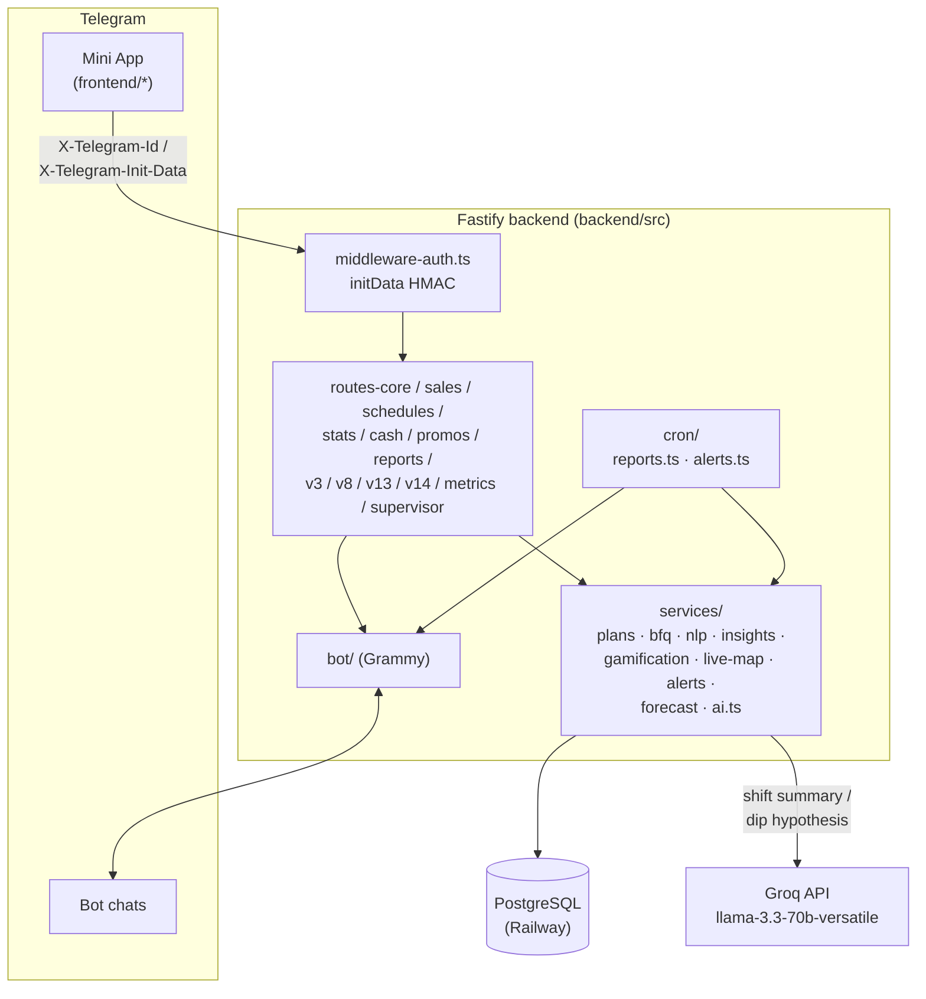

# T2 Sales

### Операционная система розничных продаж сети T2  
**Telegram Mini App · Fastify · PostgreSQL · Grammy · Railway**


> Не «таблица + бот в чате».  
> Единая рабочая среда смены: план, факт, график, касса, BFQ, live-сеть, обучение, роли, отчёты и AI Copilot — в одном касании.

**Актуальная версия клиента:** `15.0.0`  
**Часовой пояс истины:** `Europe/Moscow`

---

## Оглавление

1. [Зачем это существует](#1-зачем-это-существует)
2. [Кому и что даёт](#2-кому-и-что-даёт)
3. [Стек и инфраструктура](#3-стек-и-инфраструктура)
4. [Архитектура](#4-архитектура)
5. [Структура репозитория](#5-структура-репозитория)
6. [Модель данных](#6-модель-данных)
7. [Роли и доступ](#7-роли-и-доступ)
8. [Функциональность по модулям](#8-функциональность-по-модулям)
9. [Метрики продаж](#9-метрики-продаж)
10. [Планирование](#10-планирование)
11. [Касса](#11-касса)
12. [Telegram-бот и отчёты](#12-telegram-бот-и-отчёты)
13. [Обучение](#13-обучение)
14. [HTTP API](#14-http-api)
15. [Переменные окружения](#15-переменные-окружения)
16. [Локальный запуск](#16-локальный-запуск)
17. [Деплой на Railway](#17-деплой-на-railway)
18. [Миграции SQL](#18-миграции-sql)
19. [Mini App в BotFather](#19-mini-app-в-botfather)
20. [Типовые сбои](#20-типовые-сбои)
21. [История версий](#21-история-версий)
22. [Дорожная карта](#22-дорожная-карта)
23. [Соглашения по разработке](#23-соглашения-по-разработке)
24. [Безопасность](#24-безопасность)
25. [Чеклист запуска с нуля](#25-чеклист-запуска-с-нуля)

---

## 1. Зачем это существует

Google Sheets + переписка в Telegram живут на одной точке и трёх людях. На сети точек:

| Боль | Почему Sheets не тянет |
|------|------------------------|
| Разные «истины» | копии файла, формулы, ручной ввод |
| Нет ролей | все правят всё или не видят ничего |
| Нет офлайна | продажа потерялась без Wi‑Fi |
| Нет сессии смены | непонятно, кто реально на точке |
| Отчёты вручную | копипаста, ошибки, задержки |
| Онбординг | «почитай чат за месяц» |

**T2 Sales** — источник истины: сотрудник работает в Mini App, бот уведомляет, PostgreSQL хранит факт, Railway держит API.

---

## 2. Кому и что даёт

### Сотрудник (`employee`)
- Личный кабинет: смена, дневной и месячный план, BFQ  
- Продажи только за себя, мульти-метрики  
- Быстрый ввод: «две симки и одно mnp»  
- Смена-сессия: open / close + гео + самоотчёт  
- График, план точек, промокоды РТК  
- Офлайн-очередь продаж  
- Обязательное обучение (без skip в первый раз)  
- Поддержка / FAQ  

### Управляющий (`manager`)
- Всё employee +  
- График (bulk), месячные планы, materialize дневных планов точек  
- Чужие продажи и дельты  
- Касса, BFQ, заявки на доступ  
- Live-карта, алерты  
- Отдельный курс обучения manager  

### Admin
- Всё manager + тикеты поддержки, роли  

### Supervisor
- Срез только по своим точкам  

### Сеть
- Единые микро/итог отчёты в чат  
- Экспорт / BI  
- Новые точки без новой «таблицы с нуля»  

---

## 3. Стек и инфраструктура

| Слой | Технология | Зачем |
|------|------------|-------|
| Клиент | Telegram WebApp, `index.html` | UI, offline-queue, tutorial |
| API | Node.js 18+, Fastify 5, TypeScript | REST + static |
| БД | PostgreSQL (Railway) | источник истины |
| Бот | Grammy | отчёты, напоминания, notify |
| Cron | setInterval, логика МСК | микро/итог, алерты |
| AI | Groq API (`llama-3.3-70b-versatile`) | итог смены + гипотеза при просадке — бесплатно, без vendor lock-in |
| Хостинг | Railway / Nixpacks | API + фронт |

Клиент **не** ходит в БД: Mini App → `X-Telegram-Id` → API → Postgres.

---

## 4. Архитектура



Клиент **не** ходит в БД напрямую — только через API. «Сегодня» всегда через `todayMoscow()` (`Europe/Moscow`), не UTC контейнера. AI Copilot (`services/ai.ts`) не в горячем пути запросов — вызывается только при закрытии смены и в cron итоговых отчётов, no-op без `GROQ_API_KEY`.

---

## 5. Структура репозитория

```text
tele2-app/
├── README.md
├── docs/INTEGRATION-V13.md
├── sql/                      (ручные миграции: railway-schema-data.sql, ai-copilot.sql, promos.sql)
└── backend/                 ← Root Directory на Railway
    ├── package.json
    ├── tsconfig.json
    ├── railway.json
    ├── src/
    │   ├── index.ts                    (bootstrap: Fastify, cors, static, регистрация модулей, start)
    │   ├── middleware-auth.ts
    │   ├── services/telegram-auth.ts   (проверка initData HMAC)
    │   ├── routes-core.ts              (/stores, /plans)
    │   ├── routes-employees.ts         (CRUD сотрудников/точек)
    │   ├── routes-sales.ts             (/sales)
    │   ├── routes-schedules.ts         (/schedules)
    │   ├── routes-stats.ts             (/stats, /dashboard, прогресс)
    │   ├── routes-cash.ts              (/cash)
    │   ├── routes-promos.ts            (промокоды RTK)
    │   ├── routes-reports.ts           (SVG-отчёты по точке)
    │   ├── routes-v3.ts
    │   ├── routes-plans-v5.ts
    │   ├── routes-v8.ts
    │   ├── routes-support.ts
    │   ├── routes-v13.ts
    │   ├── routes-v14.ts
    │   ├── routes-metrics.ts
    │   ├── routes-supervisor.ts
    │   ├── services/   (plans, bfq, nlp, insights, gamification, live-map, alerts, forecast, metrics-catalog,
    │   │                supervisor-analytics, report-image, tenant, release-announce, ai.ts ← AI Copilot)
    │   ├── bot/        (index.ts, messages.ts)
    │   ├── cron/       (reports.ts)
    │   ├── db/
    │   └── utils/date.ts
    └── frontend/
        ├── index.html   (разметка + подключение styles.css и js/*.js по порядку)
        ├── styles.css
        ├── js/          (01-core → 13-v14, классические <script>, общая глобальная область)
        └── offline-queue.js
```

---

## 6. Модель данных

| Таблица | Смысл |
|--------|--------|
| `stores` | точки: code, color, plan_share |
| `employees` | FIO, telegram_id, role, access_status |
| `schedules` | смена на день (UNIQUE employee+date) |
| `sales` | факт метрик |
| `employee_month_plans` | месячный план человека |
| `store_plans` | дневной/шаблон плана точки |
| `store_cash` | факт / 1С |
| `shift_sessions` | open/close смены |
| `rtk_promocodes` | пул промокодов |
| `support_*` | тикеты, FAQ |
| `sales_audit` | аудит правок |
| `ai_audit` | лог AI Copilot: kind (`shift_summary`/`dip_comment`), employee/store, prompt, response, model |

Критичные UNIQUE: `schedules(employee_id, work_date)`, `store_cash(store_id, cash_date)`, upsert-ключ sales.

---

## 7. Роли и доступ

| role | Права |
|------|--------|
| `employee` | свои продажи и план |
| `manager` | график, планы, чужие продажи, касса, заявки |
| `admin` | всё + поддержка, роли |
| `supervisor` | только свои точки |

| access_status | UI |
|---------------|-----|
| `none` | регистрация |
| `pending` | ожидание |
| `rejected` / `blocked` | отказ |
| `active` | полный доступ |

Заголовок API: **`X-Telegram-Id`**.

Вернуть себе доступ:

```sql
UPDATE employees
SET access_status = 'active', is_active = true, role = 'admin'
WHERE telegram_id = <TG_ID>;
```

---

## 8. Функциональность по модулям

- **Главное** — навигация, инструменты, FAB, Command Center (health-score сети + просадки с AI-гипотезой)  
- **Мой** — кабинет, смена, план, инсайт, XP/стрик, разбор смены с AI-summary при закрытии  
- **Продажи** — мульти-метрики, дельты, offline queue, notify  
- **График** — месяц, цвета точек, bulk  
- **Планы** — месяц с архивом ‹›, 6+«ещё» метрик, materialize точек  
- **BFQ** — рейтинг качества  
- **Касса** — факт / 1С / Δ  
- **Live** — кто на смене, % плана, статус  
- **Промо РТК** — скрытый список, used/keep  
- **Поддержка** — FAQ + тикеты  
- **Access** — заявки и approve  

---

## 9. Метрики продаж

`sim`, `mnp`, `pa`, `combo`, `phones`, `accessories`, `settings`, `insurance`, `wink`, `shpd`, `focus`, `credit_request`, `credit_issued`, `plotter`, `hb`

**Комбо (клиент):**  
`цена×(1−скидка/100) + цена×0.28 + 1900`

---

## 10. Планирование

**День сотрудника:**  
`ceil((план_месяца − факт) / max(1, оставшиеся_смены))`

**День точки:**  
остатки всех сотрудников → / дни до конца месяца → × `plan_share`.

Доли по умолчанию: Космонавтов **55%**, Калинина 2 **25%**, Калинина 11 **20**.

`POST /plans/stores/daily/materialize` пишет `store_plans` на дату.

---

## 11. Касса

```text
Δ = cash_fact − (cash_1c + 2000)
```

---

## 12. Telegram-бот и отчёты

| Событие | Когда (МСК) |
|---------|-------------|
| Микро-отчёт | 10, 12, 14, 16, 18, 20 :00 |
| Итог дня | 21:05 |
| Напоминание смены | 20:00 → личка |

Итог: блоки GI · Товарка · Ростелеком · Кредиты · Прочее.

**AI Copilot в итоговом отчёте** (`cron/reports.ts` → `generateDipComment`): если факт дня по точке < 85% от плана — в подпись к финальному кадру отчёта и в `ai_audit` уходит гипотеза от модели; если план закрыт — заготовленная фраза-похвала без вызова модели. Тот же комментарий подтягивается в Command Center через `/supervisor/health` (`drops[].ai_comment`).

**409 Conflict** = два polling на одном токене → 1 реплика Railway, без локального бота, `deleteWebhook`, опционально `BOT_POLLING=false`.

---

## 13. Обучение

### Сотрудник
Автостарт при первом входе. **Skip запрещён** до `t2_tutorial_done`.  
Практика: тапы по nav/FAB, тесты, комбо, быстрый ввод.  
Карточка сверху на tap-шагах, низ кликабелен.

### Manager
Инструменты → «Обучение manager»: заявки, график, планы, касса, live, роли.

```js
localStorage.removeItem('t2_tutorial_done')
```

---

## 14. HTTP API

База: `https://<app>.up.railway.app`  
Header: `X-Telegram-Id`

| Группа | Примеры |
|--------|---------|
| System | `GET /health` |
| Me / access | `/me`, `/me/day`, `/access/status`, `/access/request` |
| Sales / shifts | `/sales`, `/sales/quick`, `/shifts/open|close`, `/sync/batch` |
| Plans / schedule | `/plans/*`, `/schedules/*` |
| BFQ / cash | `/bfq`, `/cash/table`, `PUT /cash` |
| v13 | `/network/live`, `/me/insight`, `/alerts`, `/forecast/:id` |
| Promo / support | `/promos`, `/support` |
| Export | `/export/bi/daily`, CSV exports |

---

## 15. Переменные окружения

| Variable | Нужно | Описание |
|----------|-------|----------|
| `DATABASE_URL` | да | Postgres |
| `BOT_TOKEN` | да | BotFather |
| `PORT` | Railway | listen port |
| `ADMIN_TELEGRAM_ID` | желательно | admin |
| `REPORT_CHAT_ID` | желательно | чат отчётов |
| `BOT_POLLING` | нет | `false` отключает getUpdates |
| `ALLOW_INSECURE_AUTH` | нет | `true` включает dev-фоллбэк на голый `X-Telegram-Id` без проверки initData (**не включать в проде**) |
| `GROQ_API_KEY` | нет | ключ Groq (console.groq.com, free tier, без карты) — включает AI Copilot; без ключа обе функции no-op'ают |
| `GROQ_MODEL` | нет | override модели, дефолт `llama-3.3-70b-versatile` |

---

## 16. Локальный запуск

```bash
cd backend
npm ci
npm run build
npm start
curl -s localhost:3000/health
```

---

## 17. Деплой на Railway

1. Root Directory = **`backend`**  
2. Variables: БД, токен, chat ids  
3. Build: `npm ci && npm run build`  
4. Start: `npm start`  
5. Health: `/health`  
6. **Replicas = 1**  

Лог успеха: `✅ V13 routes registered`, `🚀 Сервер на 0.0.0.0:…`

---

## 18. Миграции SQL

Накатывать через Railway Query или:

```bash
psql "$DATABASE_URL" -f sql/promos.sql
```

Нужны UNIQUE на schedules, access_status/role у employees, store_cash, v13-таблицы, `rtk_promocodes`.

---

## 19. Mini App в BotFather

Menu Button → URL `https://<service>.up.railway.app/`  
Открывать из Telegram. После деплоя — полное закрытие WebApp (кэш).

---

## 20. Типовые сбои

| Симптом | Действие |
|---------|----------|
| 409 getUpdates | один инстанс бота |
| Отказ в доступе | SQL access_status=active |
| Комбо молчит | UI ≥ 13.2.1 (openModal) |
| Планы-нули | month plan + materialize |
| Касса «не та» | формула +2000 |
| Tutorial перекрывает UI | ≥ 13.4.1 |
| V13 404 | registerV13Routes |

```powershell
$h = @{ "X-Telegram-Id" = "ID" }
Invoke-RestMethod "$base/health"
Invoke-RestMethod "$base/access/status" -Headers $h
Invoke-RestMethod "$base/me" -Headers $h
```

---

## 21. История версий

| Версия | Суть |
|--------|------|
| Sheets + Apps Script | первые отчёты |
| v3–v5 | Mini App, планы, BFQ, bulk |
| v8 | access gate, supervisor |
| v12 | ЛК, касса, multi-metric |
| **v13** | смены, NLP, offline, live, insights |
| **13.3** | месяц+архив, промо, gate UI |
| **13.4** | tutorial employee + manager |
| **14.0–14.1** | Кабинет супервайзера, PNG-отчёты, кастомные метрики |
| **14.2** | initData HMAC-проверка, закрыты открытые роуты, убрана SQL-инъекция в offline sync, XSS-фиксы во фронтенде, отчёты/дашборд считают метрики динамически (кастомные больше не пропадают), убран мёртвый код (routes-v4/v6/v7/promos → routes-employees.ts) |
| **14.3** | Рефакторинг: index.ts (963 строки) разбит на routes-core/sales/schedules/stats/cash/promos/reports.ts; index.html (6091 строка) разбит на styles.css + 13 файлов в frontend/js/. Заодно найден и исправлен баг: `replyTicket` была объявлена дважды (кнопка «Ответить» в разделе «Поддержка» не работала) |
| **14.3.1–14.3.2** | Хотфиксы после разбивки 14.3: 26 GET-запросов во фронтенде не слали `X-Telegram-Init-Data` (получали 401 на защищённых роутах); `todayMoscow()` вызывалась в `01-core.js` до того, как определялась в `02-nav-utils.js` — падал весь скрипт, ломая план/график/кабинет/команду разом |
| **14.4.0** | Техдолг перед AI-эпохой: убрана мёртвая ветка `shift_open`/`shift_close` в `/sync/batch` (офлайн-очередь умеет только `sale`, смены туда никогда не попадали); `middleware-auth-v8.ts` (был просто ре-экспортом) убран, `routes-v8.ts` импортирует `middleware-auth.ts` напрямую; удалены осиротевшие `bot-messages.ts` и `index-snippet.txt`; добавлен `npm run smoke:frontend` — vm-тест порядка подключения `frontend/js/*.js`, ловит класс бага из 14.3.1 |
| **14.5.0** | Command Center v1: виджет «Сеть за минуту» на главной для manager/supervisor/admin (health-score + топ-3 просадки, через `/supervisor/health` — эндпоинт для виджетов существовал с 14.x, но не был подключён ни к одному экрану); в кабинете супервайзера впервые появился список алертов (`/alerts`) с подтверждением (`/alerts/:id/ack`) — раньше эти роуты не имели UI вообще, алерты уходили только админу в личку и накапливались без возможности снять; удалены осиротевшие `supervisor-page.html`/`supervisor-ui.js`/`supervisor-ui.css` (не подключены к index.html, реальный кабинет супервайзера — `08-access-supervisor.js`) |
| **14.6.0** | Смена как сессия: закрытие смены вместо тоста «идеальная / нет» показывает разбор — score, факт/план по SIM/MNP/ПА/Комбо, явную причину «до идеальной смены не хватило» (`ideal_missing` от `/shifts/close`), плюс XP/уровень/стрик за эту смену (`evaluateShiftClose` в gamification.ts считал это и раньше, просто не возвращал наружу — экран его игнорировал) |
| **14.6.1** | Хотфикс: вкладка «Заявки на доступ» перекидывала на главную — в `index.html` отсутствовал контейнер `page-access` (потерялся при разбивке 14.3.0), `switchPage()` не находил элемент и молча падал на home. Кнопка живёт на вкладке «Команда» → «Управление», не на главной |
| **14.7.0** | Отчёт-история: итог дня в чат теперь уходит альбомом из 3 картинок вместо одной — план дня → факт → фокус на завтра (цели + кто в графике + подсказка по пиковому часу из `store_hour_profile`). Тот же resvg-рендерер и та же цепочка фолбэков (PNG → SVG-документ → текст), просто на 3 кадра; при сбое media group откатывается на старый одиночный финал. Превью-страница «Отчёт-картинка» показывает то же самое, что реально уйдёт в чат. Микро-отчёты не менялись |
| **14.8.0** | What-if v2: сценарий из нескольких переносов разом вместо одного (бэкенд `simulateScheduleMoves` уже принимал массив — не хватало только UI: список переносов с добавлением/удалением). Сравнение сценариев A/B: посчитал один набор переносов → «Сохранить как A» → очистил, собрал другой → авто-сравнение при пересчёте. Метрика сравнения — не сумма Δ SIM по сети (перенос внутри сети всегда даёт в сумме ноль, сравнивать по этому бессмысленно), а худшая просевшая точка: какой сценарий меньше вредит своему самому слабому месту |
| **14.9.0** | Автоанонс обновлений: важные версии (minor-эпики, не хотфиксы) сами приходят в рабочий чат картинкой с кратким описанием при старте сервера — тем же resvg-пайплайном, что и отчёты. Список версий для анонса — `src/changelog.ts`; какая версия уже анонсирована — `app_settings.last_announced_version`, отправка отмечается только при успехе. Заодно: `.btn-ghost` использовался в 5 местах (в т.ч. до этой сессии) без единого объявления в CSS — рендерился браузерным дефолтом; добавлен стиль в тон `.btn-main`. Плановый эпик «Порог перед ИИ» сдвинут на 14.10.0 |
| **14.10.0** | Порог перед ИИ: `db/index.ts` и `bot/index.ts` читали `process.env` на верхнем уровне модуля — из-за хостинга ES-импортов это выполнялось раньше `dotenv.config()` в `index.ts`, так что `npm run dev` тихо не видел `.env` (в Railway не заметно — там переменные уже в окружении до старта node). Добавлен `src/env.ts`, первый импорт index.ts, гарантирующий порядок. Убран дублирующий SVG-рендерер в `routes-reports.ts` (`buildDayReportSvgInline`) — параллельная реализация того же пути к тем же данным, не настоящий фолбэк. Статус мультитенантности явно задокументирован в `tenant.ts`: сейчас только branding, изоляция данных — сознательно отложенный эпик 17.0. Полная регрессия по 17 разделам приложения на реальных данных — без единой ошибки |
| **15.0.0** | AI Copilot v1, первая ИИ-эпоха. Сознательно бесплатно и без чата/tool-calling — оба сценария одношаговые, бэкенд сам собирает контекст кодом, модель вызывается через Groq (бесплатный тариф, `llama-3.3-70b-versatile`, без карты): (1) итог смены сотруднику — короткий комментарий сразу после `/shifts/close`, на основе факта/плана/XP; (2) комментарий к просадке точки — встроен в существующий cron итоговых отчётов (`cron/reports.ts`): если факт дня < 85% от плана, модель даёт гипотезу вместо голой цифры; если план закрыт — берётся случайная заготовленная фраза-похвала без вызова модели. Комментарий уходит и в подпись к отчёту в чат, и в БД — оттуда его подтягивает Command Center на главной (`/supervisor/health`, поле `drops[].ai_comment`). Новая таблица `ai_audit` — лог всех промптов/ответов модели. Без ключа `GROQ_API_KEY` обе функции тихо no-op'ают (summary → `null`, комментарий → заготовленный фолбэк-текст), остальное приложение не затронуто |
| **15.0.1** | Хотфикс: касса (`GET /cash/table`, `PUT /cash`) была ошибочно закрыта на `requireManager` — 403 для обычного employee, хотя фронтенд (`09-cash-metrics.js`) всегда показывал форму внесения кассы всем сотрудникам точки, не только управляющим. Заменено на `requireActive` (любой активный сотрудник); неиспользуемый фронтендом `GET /cash` (список) оставлен manager-only |
| **15.0.2** | Итоговый отчёт-альбом (план/факт/фокус на завтра) больше не подписывает каждую из 3 картинок по отдельности — заголовок кадра и так есть на самой картинке. Вместо трёх caption — одно сообщение под альбомом с итогом дня и AI-комментарием (`cron/reports.ts`) |
| **15.0.3** | Manager/admin теперь могут отменить ошибочно внесённую метрику за день (`PUT /sales/:id/zero`, кнопка «Удалить» в карточке сотрудника → «Исправить ошибочный ввод») — `sales` аддитивная, поэтому это обнуление конкретной колонки с записью в `sales_audit`, а не удаление всей записи за день. AI-гипотеза при просадке точки теперь смотрит на все ~18 метрик `store_plans`, а не только SIM/MNP/ПА/Комбо — раньше просадка по, например, страховкам или аксессуарам была для модели невидима |
| **15.0.4** | Удаление кастомных метрик плана получило UI — `DELETE /metrics/:id` существовал на бэкенде (soft-delete, базовые метрики защищены), но был недоступен из приложения. «Управление» → «Метрики плана» теперь показывает список своих метрик с кнопкой «Удалить» перед формой создания новой |
| **15.1.0** | Обучение v3 — «игровой уровень» с персонажем Арбузычем (🍉). Два визуальных режима: полноэкранные cutscene-главы (`#tutorialScreen`) для вступления/переходов/квиза/финала и доработанный coach-оверлей (`#tutorialOverlay`, сильнее затемнение, аватар-бабл) для «нажми сюда» на реальном UI. Оба трека (employee 22 шага, manager 17 шагов) переписаны и разбиты на главы с мини-праздником (`confettiBurst()`) между ними. Добавление продажи в главе «Продажи» теперь тренируют на настоящей форме (`07-add-sale.js`) в dry-run режиме — `window.__tutorialDryRun` перехватывает `submitSale()` до реального `POST /sales`, ничего не пишется в базу и в чат. Новый `POST /me/tutorial-complete` идемпотентно начисляет XP и бейдж (`tutorial_done`/`tutorial_mgr_done`) через уже существующие `addXp`/`grantBadge` — раньше прохождение обучения вообще не было известно бэкенду, только `localStorage` |
| **15.2.2** | Хотфикс: время открытия смены в «Мой» показывало UTC вместо МСК (открыл в 9:55 — писало 6:55) — `sess.opened_at.slice(11,16)` резал сырую UTC ISO-строку без конвертации часового пояса. Новый `timeMoscow()` в `01-core.js` форматирует явно через `Intl.DateTimeFormat` с `timeZone: 'Europe/Moscow'` |
| **15.2.1** | Хотфикс: `store_plans` материализовался только вручную кнопкой «Записать дневные планы в БД» — если никто не нажал, у точки не было плана на день, и отчёт-картинка/«Фокус на завтра» рендерились пустыми (факт 0, план «—»), как случилось с Калининой 11 на 04-05.08. Теперь `cron/reports.ts` в 06:00 МСК сам материализует план на сегодня и на завтра через уже существующий `materializeStoreDailyPlans()` (`services/plans.ts`). Данные за 05-06.08 пересчитаны вручную через продовый `POST /plans/stores/daily/materialize` |
| **15.2.0** | UI-полировка heatmap/прогноз/касса/команда под общий стиль приложения (Command Center, `.cc-*`/`.mt-*` токены вместо инлайн-стилей): heatmap — классы `.hm-cell` вместо сырых inline `rgba()`; прогноз — исправлена вёрстка (`.mt-grid` был 3-колоночным на 4 метрики, теперь `.mt-grid-4`); касса — настоящая строка заголовков колонок; команда — цветной кружок-инициал вместо статичной 👤, тон = есть ли у сотрудника продажи сегодня. Заодно найден и исправлен `var(--muted)` — использовался в 8 местах (`.sv-*`), нигде не был определён. Добавлен `@media (prefers-reduced-motion: reduce)` — раньше не учитывался нигде, при этом две бесконечные анимации (Арбузыч, spotlight-пульс) крутились всегда. Пустые состояния heatmap/промокодов/live-сети больше не показывают технические заметки вроде «Нужен sales_events (sql/v8-0-roadmap.sql)» |

---

## 22. Дорожная карта

| Статус | Пункт |
|--------|-------|
| ✅ готово (15.0.0) | AI Copilot v1 — разбор смены + гипотеза при просадке, бесплатно через Groq |
| ✅ готово (14.8.0) | What-if со сравнением сценариев A/B |
| ✅ готово (13.x) | Точный heatmap по часу продажи (`sales_events`) |
| 🔜 ближайшее | Действие из просадки прямо в кабинете супервайзера, а не только сигнал |
| 🔜 ближайшее | Единообразие метрик — одинаковые подписи/расчёты везде, где они показываются |
| 🗺️ дальше | Объявления «прочитал» |
| 🗺️ дальше | Более точные прогнозы на завтра, подсказки «кого куда поставить» |
| 🏗️ эпик 17.0 | Мультитенант и white-label — `services/tenant.ts` сейчас только branding, изоляция данных сознательно отложена |
| 🏗️ дальше | Картинка-отчёт на отдельном worker — сейчас resvg рендерится в основном процессе |  

---

## 23. Соглашения по разработке

1. Фичи — `routes-vN` + register в `index.ts`  
2. Даты только МСК  
3. `npm run build && npm run smoke:frontend` перед push — build ловит TS-ошибки бэкенда, smoke:frontend ловит ReferenceError от неправильного порядка `frontend/js/*.js` (см. 14.3.1)  
4. Не коммитить `.env`  
5. UI: мержить `index.html`, не накатывать старый кусок поверх v13  
6. Один bot polling  

---

## 24. Безопасность

- Роли на сервере, не только в UI
- Employee ≠ чужие продажи
- Admin id в env
- **initData проверяется на сервере.** Mini App шлёт сырой `tg.WebApp.initData`
  в заголовке `X-Telegram-Init-Data`; бэкенд пересчитывает HMAC по
  `BOT_TOKEN` (`src/services/telegram-auth.ts`) и доверяет `telegram_id`
  только если подпись сходится. Голый `X-Telegram-Id` без initData
  принимается ТОЛЬКО если `BOT_TOKEN` не задан (локальная разработка)
  либо явно включён `ALLOW_INSECURE_AUTH=true` — в проде так быть не должно.
- CORS открыт (`origin: true`) намеренно — Mini App грузится внутри
  Telegram WebView, откуда Origin не всегда предсказуем. Реальная защита —
  проверка initData выше, а не CORS.

---

## 25. Чеклист запуска с нуля

1. Postgres + SQL  
2. Env: DATABASE_URL, BOT_TOKEN, chats  
3. Deploy backend, 1 replica  
4. BotFather Menu Button  
5. Admin: active + telegram_id  
6. Точки, сотрудники, график, месячные планы  
7. Materialize дневных планов  
8. Mini App → обучение → тестовая продажа  

---

**T2 Sales** — смена, цифры, сеть и AI Copilot в одном приложении.  
*README · актуально на v15.0.0 · август 2026*
