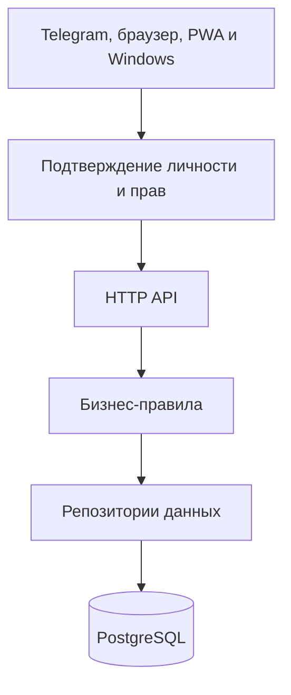

# T2 Sales

[Каталог документации](docs/README.md) · [Быстрый старт](docs/DEVELOPMENT.md) · [История изменений](CHANGELOG.md)

Операционная система розничных продаж сети T2
**Telegram Mini App · Браузер/PWA · Fastify · PostgreSQL · Grammy · Railway**

[](#21-история-версий)
[](https://github.com/JustT1MExGOD/tele2-app/actions/workflows/ci.yml)


> Рабочая среда розничной команды: план, факт, график, касса, BFQ, live-сеть, обучение, роли, отчёты и AI Copilot — в одном касании.

[📐 Архитектура](docs/ARCHITECTURE.md) · [🔒 Безопасность](docs/SECURITY.md) · [🔌 API](docs/API.md) · [🛠 Разработка](docs/DEVELOPMENT.md) · [📚 Все документы](docs/README.md)

<details>
<summary>Содержание: выбрать версию</summary>

- [Интерфейс в демо-окружении](#интерфейс-в-демо-окружении)
- [Проект за минуту](#проект-за-минуту)
- [1. Зачем это существует](#1-зачем-это-существует)
- [2. Кому и что даёт](#2-кому-и-что-даёт)
- [3. Стек и инфраструктура](#3-стек-и-инфраструктура)
- [4. Архитектура](#4-архитектура)
- [5. Структура репозитория](#5-структура-репозитория)
- [6. Модель данных](#6-модель-данных)
- [7. Роли и доступ](#7-роли-и-доступ)
- [8. Функциональность по модулям](#8-функциональность-по-модулям)
- [9. Метрики продаж](#9-метрики-продаж)
- [10. Планирование](#10-планирование)
- [11. Касса](#11-касса)
- [12. Telegram-бот и отчёты](#12-telegram-бот-и-отчёты)
- [13. Обучение](#13-обучение)
- [14. HTTP API](#14-http-api)
- [15. Переменные окружения](#15-переменные-окружения)
- [16. Локальный запуск](#16-локальный-запуск)
- [17. Деплой на Railway](#17-деплой-на-railway)
- [18. Миграции SQL](#18-миграции-sql)
- [19. Mini App в BotFather](#19-mini-app-в-botfather)
- [20. Типовые сбои](#20-типовые-сбои)
- [21. История версий](#21-история-версий)
- [22. Дорожная карта](#22-дорожная-карта)
- [23. Соглашения по разработке](#23-соглашения-по-разработке)
- [24. Безопасность](#24-безопасность)
- [25. Чеклист запуска с нуля](#25-чеклист-запуска-с-нуля)

</details>

## Интерфейс в демо-окружении

| Главная: состояние сети | Профиль: текущая смена |
| --- | --- |
|  |  |

| План дня | График команды |
| --- | --- |
|  |  |

Скриншоты сняты в изолированном локальном демо-окружении на синтетических тестовых данных (вымышленные имена и цифры) — не с прода.

---

## Проект за минуту

- **Что это** — веб-приложение внутри Telegram (Mini App), с 20.35.0-20.47.0 также доступное как обычный сайт (телефон+пароль) и как standalone PWA/иконка на экране iPhone — тот же интерфейс и API, три канала входа. Сотрудники магазинов пользуются им вместо блокнота, Google Sheets и переписки в чате.
- **Кто пользуется** — продавец на точке (внёс продажу, открыл смену), управляющий сетью (видит всё, раздаёт задачи), супервайзер нескольких сетей, админ.
- **Как это устроено** — Telegram передаёт подписанную личность пользователя, либо браузер несёт cookie-сессию (телефон+пароль) → сервер на Fastify проверяет identity и права через общий шов (`auth/principal.ts`) → PostgreSQL хранит единственную версию правды → бот сам присылает отчёты в чат.
- **Почему это не просто CRUD** — офлайн-очередь продаж, живая карта сети, AI-объяснение просадок, геймификация обучения, аудит каждого чувствительного действия.

**Версии в исходном архиве:** backend `20.57.5`, desktop `20.56.7`, relay `20.56.1`. Статус рабочей среды отдельно не проверялся. **Часовой пояс бизнес-дат:** `Europe/Moscow`. [Отчёт об исправлениях](IMPLEMENTATION-20.57.5.md).

---

## 1. Зачем это существует

Google Sheets + переписка в Telegram живут на одной точке и трёх людях. На сети точек:

| Боль | Почему Sheets не тянет |
|------|------------------------|
| Разные «истины» | копии файла, формулы, ручной ввод |
| Нет ролей | все правят всё или не видят ничего |
| Нет офлайна | продажа потерялась без Wi‑Fi |
| Нет сессии смены | непонятно, кто реально на точке |
| Отчёты вручную | копипаста, ошибки, задержки |
| Онбординг | «почитай чат за месяц» |

**T2 Sales** — источник истины: сотрудник работает в Mini App, бот уведомляет, PostgreSQL хранит факт, Railway держит API.

---

## 2. Кому и что даёт

### Сотрудник (`employee`, `trainee`, `senior`)

- Профиль: смена, дневной/месячный план, BFQ, геймификация (XP/уровень/стрик), история смен
- Продажи только за себя, мульти-метрики, дельты
- Быстрый ввод текстом: «две симки и одно mnp» (NLP-разбор)
- Смена-сессия: open/close + гео + план/факт живьём, пока смена открыта, заметка-передача следующему на этой точке
- Свои задачи (назначает manager) — принять в работу / закрыть
- График, план точек (дневной план — теперь считается от месячного плана точки, не от долей сотрудников), промокоды РТК, калькуляторы (комбо/школа)
- Кастомная аватарка (видна и в «Команде»)
- Офлайн-очередь продаж (без сети — уходит при появлении Wi‑Fi)
- Обязательное обучение с персонажем-маскотом (без skip в первый раз)
- Поддержка / FAQ

### Старший продавец (`senior`)

- Всё сотрудника + касса, BFQ, заявки на доступ, CSV-экспорты, кастомные названия точек
- **Без** Command Center и кабинета супервайзера (видимость аналитики — отдельный флаг от операционных прав)
- **Без** продаж/дельт за ДРУГОГО сотрудника — только за себя, как обычный сотрудник (`canWriteSalesForOthers()`, 20.13.0)

### Управляющий (`manager`)

- Всё senior +, а не «операционно то же самое» — именно на этой границе
- **Command Center** — единый экран «что происходит / где проблема / что делать» вместо трёх разрозненных мест
- **Задачи** — создать/назначить с контекстом прямо из просадки или алерта, тред комментариев
- **Профиль точки** / **Профиль сотрудника** — план/факт/прогноз/тренд/Health Score на одном экране
- **Алерты 2.0** — полный жизненный цикл (open→in_progress→acked/dismissed), включая аномалии (z-score против прогноза, не только план)
- График (bulk, сводная таблица месяца по всей команде), месячные планы сотрудников и точек
- Чужие продажи и дельты (в своей сети), Live-карта сети
- Отдельный курс обучения manager

<a id="admin"></a>

### Администратор

- Всё manager + тикеты поддержки (эскалация к разработчику), назначение ролей (только строго ниже своей), переключатель сети в UI, кабинет супервайзера в режиме просмотра, заведение новых сетей без SQL

<a id="supervisor"></a>

### Супервайзер

- Свой сектор целиком (несколько сетей сразу) — отдельный визуал, 4 своих вкладки (Обзор/Точки/Люди/Тренд), выполнение и прогноз месячного плана по сектору

### Сеть

- Единые микро/итог отчёты в чат (расписание — по точке, не глобальное), автоанонс версий в отдельный Telegram-канал
- Еженедельная/месячная сводка по сети (страница «Отчёты»), экспорт / BI
- Новые сети и точки без единой строчки SQL — через UI

---

## 3. Стек и инфраструктура

| Слой | Технология | Зачем |
|------|------------|-------|
| Клиент | Telegram WebApp, `index.html` | UI, offline-queue, tutorial |
| API | Node.js 22, Fastify 5, TypeScript | REST + static |
| БД | PostgreSQL (Railway) | источник истины |
| Бот | Grammy | отчёты, напоминания, notify |
| Cron | setInterval, логика МСК | микро/итог, алерты |
| AI | Groq API (`llama-3.3-70b-versatile`) | итог смены + гипотеза при просадке — бесплатно, без vendor lock-in |
| Хостинг | Railway / Nixpacks | API + фронт |

Клиент **не** ходит в БД: Mini App → подписанная `X-Telegram-Init-Data` → API → Postgres.

---

## 4. Архитектура



Клиент **не** ходит в БД напрямую — только через API. Полный разбор слоёв
и живой справочник структуры — **[docs/ARCHITECTURE.md](docs/ARCHITECTURE.md)**.

---

## 5. Структура репозитория

Полное дерево `backend/src/` (layered-структура: `api/`, `core/`, `data/`,
`platform/`, `integrations/`, `auth/`, `cron/`, `workers/`, `shared/`,
`utils/`) — **[docs/ARCHITECTURE.md](docs/ARCHITECTURE.md)**.

---

## 6. Модель данных

| Таблица | Смысл |
|--------|--------|
| `organizations` | сеть точек — branding, `sector_id`, `chat_id`/`sales_thread_id`/`reports_thread_id` |
| `sectors` | группа сетей, назначается супервайзеру целиком; `dealer_id` (21.0) — кто владеет |
| `dealers` | компания-владелец сектора (ООО/ИП, 21.0) — только ownership-запись, без входа/роли |
| `stores` | точки: code, color, `org_id`, `display_name` (кастомное название, 19.7.0), micro-report расписание |
| `employees` | ФИО; поля `telegram_id` (уникальное), `role`, `access_status`, `org_id`, `avatar_data`/`avatar_mime` (19.7.0) |
| `schedules` | смена на день (UNIQUE employee+date) |
| `sales` | факт метрик (аддитивная запись, единая точка входа — `applySaleUpsert()`) |
| `sales_audit` | аудит правок метрик (кто/когда/сколько) |
| `sales_events` | сырые события продаж — источник точного heatmap по часу |
| `employee_month_plans` | месячный план человека |
| `store_month_plans` | месячный план точки — независимый ручной ввод (не доля от планов сотрудников, с 15.13.0) |
| `store_plans` | материализованный дневной снапшот плана точки (кэш для BFQ/live/отчётов, крон 6:00 МСК) |
| `store_forecasts` | кэш прогноза (SES + сезонность по дню недели) |
| `store_cash` | факт / 1С |
| `shift_sessions` | open/close смены, handover_note, гео |
| `tasks` / `task_comments` | задачи из просадки/алерта, тред комментариев |
| `smart_alerts` | Alerts 2.0 — полный жизненный цикл, включая `anomaly_vs_forecast` |
| `rtk_promocodes` | пул промокодов, org-scoped |
| `announcements` / `announcement_reads` | объявления сети + кто прочитал |
| `channels` / `channel_messages` | внутренние каналы сети |
| `access_requests` | заявки на доступ (org-scoped по выбору при регистрации) |
| `support_*` | тикеты, FAQ, вложения, шаблоны (эскалация к разработчику, admin-only) |
| `offline_sync_log` | идемпотентность офлайн-очереди по `client_id` |
| `cron_send_log` | claim-защита от повторной отправки авто-отчётов/напоминаний |
| `ai_audit` | лог AI Copilot: kind (`shift_summary`/`dip_comment`/`forecast_summary`), employee/store, prompt, response, model |
| `app_settings` | служебные ключ-значение (напр. `last_announced_version`) |

Критичные UNIQUE: `schedules(employee_id, work_date)`, `store_cash(store_id, cash_date)`,
`employees.telegram_id`, upsert-ключ `sales`, partial unique на одну открытую
`shift_sessions` на сотрудника.

---

## 7. Роли и доступ

Полная лестница (с 15.9.0): `trainee < employee < senior < manager < supervisor < admin`
(`ROLE_LEVEL` в `auth/principal.ts`, см. [ARCHITECTURE.md](docs/ARCHITECTURE.md)).
Назначить можно только роль строго ниже своей (`canAssignRole()`) — admin
без ограничений.

| role | Права |
|------|--------|
| `trainee` | стажёр — минимум прав, растёт до `employee` |
| `employee` | свои продажи, свой план, смена-сессия |
| `senior` | операционно как `manager` (сотрудники/точки/график/касса/экспорты), но **без** продаж за другого сотрудника (`canWriteSalesForOthers()`, 20.13.0) и намеренно **без** Command Center и кабинета супервайзера — разделены «операционные права» и «видимость аналитики» |
| `manager` | всё senior + продажи за другого сотрудника, Command Center, Store/Employee Profile, алерты, задачи |
| `admin` | всё manager + поддержка (эскалация), назначение ролей, переключатель сети, кабинет супервайзера |
| `supervisor` | свой сектор (несколько сетей) целиком — отдельный визуал, отдельные 4 вкладки, не пересекается с обычными 5 |

| access_status | UI |
|---------------|-----|
| `none` | регистрация (пикер сети → форма заявки) |
| `pending` | ожидание одобрения |
| `rejected` / `blocked` | отказ |
| `active` | полный доступ по своей роли |

**Auth — два подтверждённых канала**: подписанная Telegram initData
(HMAC на сервере) или браузерная cookie-сессия (телефон+пароль, с
20.35.0), никогда через голый заголовок (см. §24). Оба резолвятся в
identity через общий `identities`-слой (20.48.0). `X-Telegram-Id` без
initData работает лишь в локальной разработке или при явном
`ALLOW_INSECURE_AUTH=true`.

Мультитенантность: `organizations` (= «сеть точек», с `sector_id`/`chat_id`/
`sales_thread_id`/`reports_thread_id`) группируются в `sectors` — их видит
целиком `supervisor` через `supervisor_sectors`. Почти все read/write роуты
скоуплены по `org_id` через `resolveViewOrgId()`/`assertStoreInOrg()`/
`assertEmployeeInOrg()`; admin может явно переключить сеть просмотра
переключателем в UI (`?org_id=`/`body.org_id`), остальные роли — только
своя сеть, с одним исключением: собственная запись (продажа/смена) видна
всегда, даже если сегодня сотрудник работает на точке чужой сети внутри
той же организации («подмена»).

Восстановление доступа admin при инциденте (SQL, не рутинная операция) —
**[docs/RUNBOOK.md](docs/RUNBOOK.md#восстановление-доступа-admin)**.

---

## 8. Функциональность по модулям

Нижняя навигация (5 вкладок): Главная · План · График · Профиль · Команда
(supervisor — отдельные 4: Обзор · Точки · Люди · Тренд). Разбор каждого
экрана — **[docs/FEATURES.md — навигация](docs/FEATURES.md#навигация)**.

---

## 9. Метрики продаж

Полный список метрик и формулы расчёта (комбо/школа) —
**[docs/FEATURES.md — метрики продаж](docs/FEATURES.md#метрики-продаж)**.

---

## 10. Планирование

Формулы дневного плана сотрудника/точки, материализация снапшота —
**[docs/FEATURES.md — планирование](docs/FEATURES.md#планирование)**.

---

## 11. Касса

```text
Δ = cash_fact − (cash_1c + 2000)
```

---

## 12. Telegram-бот и отчёты

Расписание по точке, itog-альбом из 3 картинок, AI Copilot в отчёте,
защита от задвоенной отправки — **[docs/FEATURES.md — бот и отчёты](docs/FEATURES.md#telegram-бот-и-отчёты)**.
Пайплайн рендера — **[docs/REPORT_IMAGE.md](docs/REPORT_IMAGE.md)**.

---

## 13. Обучение

Персонаж-маскот «Арбузыч», два трека (employee/manager), dry-run практика —
**[docs/FEATURES.md — обучение](docs/FEATURES.md#обучение)**.

---

## 14. HTTP API

Полная таблица эндпоинтов по группам, с указанием файла-обработчика —
**[docs/API.md](docs/API.md)**. Auth: `X-Telegram-Init-Data`
(подписанный, прод) — см. §24. Каждый роут, отдающий чужие/сетевые
данные, гейтится `requireAuth`/`requireActive`/`requireManager`/
`requireSupervisor` + org-scope — см. §7, §24.

---

## 15. Переменные окружения

Полная таблица — **[docs/DEVELOPMENT.md](docs/DEVELOPMENT.md)**.

---

## 16. Локальный запуск

Установка, запуск, прогон тестов на одноразовом Postgres —
**[docs/DEVELOPMENT.md](docs/DEVELOPMENT.md)**. В CI
(`.github/workflows/ci.yml`) то же самое происходит автоматически на
каждый push.

---

## 17. Деплой на Railway

1. Root Directory = **`backend`**
2. Variables: БД, токен, chat ids
3. Build: `npm ci && npm run build`
4. Start: `npm start`
5. Health: `/health`
6. **Replicas = 1**
7. **Деплой ждёт зелёный CI** (с 17.3.0) — `checkSuites: true` на deployment trigger сервиса (Railway GraphQL API, `deploymentTriggerUpdate`, настройки нет в `railway.json` — только через API/дашборд). Красный `.github/workflows/ci.yml` теперь блокирует деплой, а не просто сигнализирует постфактум

Лог успеха: серия `✅ ... routes registered` (по одной на каждый модуль
`routes-*.ts`), `📦 Применены миграции: ...` (если были новые), `🚀 Сервер на 0.0.0.0:…`, `🤖 Bot polling started`.

---

## 18. Миграции SQL

С 17.5.0 — система миграций (`backend/src/db/migrate.ts`), не ad hoc SQL
руками на Railway. Пронумерованные файлы в `backend/migrations/`, трекинг —
таблица `schema_migrations` (`name`, `applied_at`). **Важно**: именно
`backend/migrations/`, не `sql/` на корне репозитория — Root Directory
сервиса на Railway = `backend`, всё, что снаружи, в контейнер не попадает.

**Новое изменение схемы**: создать `backend/migrations/00NN_описание.sql` со
следующим номером — и всё, применяется само:

- **На проде** — автоматически при следующем деплое, до открытия порта
  (`index.ts`, до `app.listen()`). Если миграция падает — сервер не
  стартует (лучше не поднимаемся, чем поднимаемся с неверной схемой);
  `railway.json` → `restartPolicyType: ON_FAILURE` в этом случае будет
  ретраить старт, так что упавшую миграцию нужно чинить новым коммитом,
  а не полагаться на ретраи.
- **В CI** (`.github/workflows/ci.yml`) — `npm run migrate` на чистом
  Postgres на каждый push, тем самым же кодом, что и на проде.
- **Локально** — `cd backend && npm run migrate` (нужен `DATABASE_URL` в
  окружении).

Файл уже применённой миграции задним числом не редактируется — новое
изменение, даже мелкое, всегда новый номер.

`backend/migrations/0001_baseline.sql` — снапшот схемы на момент введения
системы (17.5.0), на самом проде НЕ исполнялся — `schema_migrations` там
сразу засеяна записью об этом файле, чтобы не пытаться заново создать уже
существующие таблицы. Исполняется только на чистой БД (CI, локальный тест).

---

## 19. Mini App в BotFather

Menu Button → URL `https://<service>.up.railway.app/`
Открывать из Telegram. После деплоя — полное закрытие WebApp (кэш).

---

## 20. Типовые сбои

Полная таблица симптом → причина/действие —
**[docs/TROUBLESHOOTING.md](docs/TROUBLESHOOTING.md)**. Операционные
процедуры (ротация `BOT_TOKEN`, восстановление доступа, откат миграции) —
**[docs/RUNBOOK.md](docs/RUNBOOK.md)**.

---

## 21. История версий

Полная история сохранена в [CHANGELOG.md](CHANGELOG.md) и справочниках по эпохам. Backend, desktop и relay имеют независимые версии.

## 22. Дорожная карта

Подробные планы прошлых эпох и отметки их выполнения перенесены в [историческую дорожную карту](docs/archive/ROADMAP-HISTORY.md). Невыполненные рекомендации прохода 20.57.5 перечислены в [отчёте об исправлениях](IMPLEMENTATION-20.57.5.md). Предложения не следует считать уже реализованными возможностями.

## 23. Соглашения по разработке

Полный список — **[docs/DEVELOPMENT.md](docs/DEVELOPMENT.md)**.
Коротко: роуты группируются по домену в `src/api/routes/` (см. §5), даты
только МСК, схема БД только через `backend/migrations/`, `npm run
check:no-direct-sql` держит Data Access Layer, версионирование — `MINOR` для функций и эпиков, `PATCH` для исправлений и рефакторинга. Анонсы добавляются для эпиков согласно [рабочему соглашению](CLAUDE.md).

---

## 24. Безопасность

Полный разбор (initData/HMAC, CORS, rate-limit/CSP, TypeBox-валидация,
доступ к данным, журнал аудита, конкурентные изменения, область
супервайзера, аутентификация и криптографическая защита) — **[docs/SECURITY.md](docs/SECURITY.md)**. Какие данные
зашифрованы и почему — **[docs/DATA-SECURITY-ARCHITECTURE.md](docs/DATA-SECURITY-ARCHITECTURE.md)**.
Архитектурные решения с альтернативами и причинами —
**[docs/ADR/](docs/ADR/)**.

---

## 25. Чеклист запуска с нуля

1. Postgres — схема накатывается сама миграциями при первом старте (§18), руками ничего не создавать
2. Настройки: `DATABASE_URL`, `BOT_TOKEN`, HTTPS `MINI_APP_URL`, `ADMIN_TELEGRAM_ID`, идентификаторы чата и темы сети; остальные условия — в [руководстве разработчика](docs/DEVELOPMENT.md)
3. Deploy backend, 1 реплика, деплой ждёт зелёный CI (§17)
4. BotFather Menu Button → URL сервиса
5. Admin: `access_status='active'` + свой `telegram_id` (§7)
6. Завести сеть (если не default) прямо в приложении — «Команда» → «Управление» → «Сети», без SQL
7. Точки, сотрудники, график, месячные планы сотрудников и точек — дневной снапшот материализуется сам (§10)
8. Mini App → обучение → тестовая продажа

---

**T2 Sales** — смена, цифры, сеть и AI Copilot в одном приложении.

[📐 Архитектура](docs/ARCHITECTURE.md) · [🔒 Безопасность](docs/SECURITY.md) · [🔌 API](docs/API.md) · [🛠 Разработка](docs/DEVELOPMENT.md) · [⬆ Наверх](#t2-sales)

*Документация переработана по предоставленному архиву в сентябре 2026 года. Версии компонентов указаны в начале документа.*
