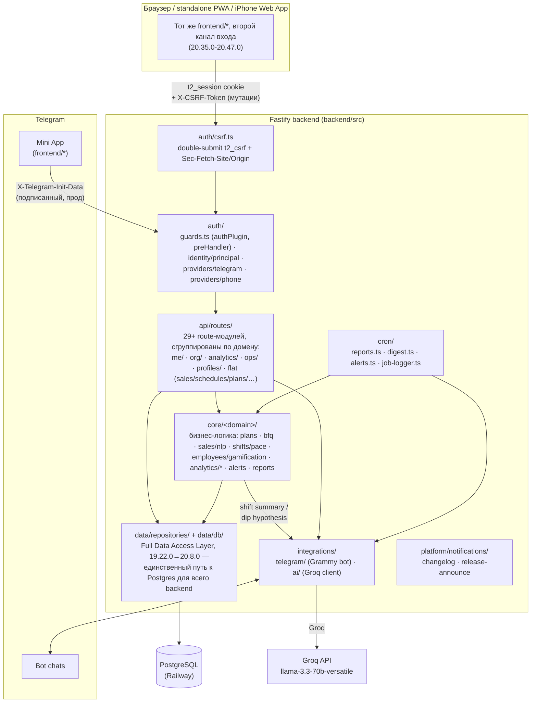

<div align="center">

# T2 Sales

### Операционная система розничных продаж сети T2
**Telegram Mini App · Браузер/PWA · Fastify · PostgreSQL · Grammy · Railway**

[](#21-история-версий)
[](https://github.com/JustT1MExGOD/tele2-app/actions/workflows/ci.yml)


> Не «таблица + бот в чате».
> Единая рабочая среда смены: план, факт, график, касса, BFQ, live-сеть, обучение, роли, отчёты и AI Copilot — в одном касании.

[📐 Архитектура](docs/ARCHITECTURE.md) · [🔒 Безопасность](docs/SECURITY.md) · [🔌 API](docs/API.md) · [🛠 Разработка](docs/DEVELOPMENT.md) · [📚 Все документы](docs/README.md)

</div>

<table>
<tr>
<td width="50%" align="center">
<br>
<sub><strong>Главная</strong> — Command Center: health-score сети, просадки точек в реальном времени</sub>
</td>
<td width="50%" align="center">
<br>
<sub><strong>Профиль</strong> — открытая смена: план/факт по метрикам вживую, AI-подсказка по темпу</sub>
</td>
</tr>
<tr>
<td width="50%" align="center">
<br>
<sub><strong>План</strong> — план дня точки по блокам (GI / Товарка / РТК / Кредиты), кто на смене</sub>
</td>
<td width="50%" align="center">
<br>
<sub><strong>График</strong> — сводный график команды на месяц, точка на каждый день</sub>
</td>
</tr>
</table>

<sub>Скриншоты сняты в изолированном локальном демо-окружении на синтетических тестовых данных (вымышленные имена и цифры) — не с прода.</sub>

---

### Если у вас 20 секунд

- **Что это** — веб-приложение внутри Telegram (Mini App), с 20.35.0-20.47.0 также доступное как обычный сайт (телефон+пароль) и как standalone PWA/иконка на экране iPhone — тот же интерфейс и API, три канала входа. Сотрудники магазинов пользуются им вместо блокнота, Google Sheets и переписки в чате.
- **Кто пользуется** — продавец на точке (внёс продажу, открыл смену), управляющий сетью (видит всё, раздаёт задачи), супервайзер нескольких сетей, админ.
- **Как это устроено** — Telegram передаёт подписанную личность пользователя, либо браузер несёт cookie-сессию (телефон+пароль) → сервер на Fastify проверяет identity и права через общий шов (`auth/principal.ts`) → PostgreSQL хранит единственную версию правды → бот сам присылает отчёты в чат.
- **Почему это не просто CRUD** — офлайн-очередь продаж, живая карта сети, AI-объяснение просадок, геймификация обучения, аудит каждого чувствительного действия.

**Актуальная версия клиента:** `20.54.1` · **Часовой пояс истины:** `Europe/Moscow`

---

## Оглавление

**Что и зачем**

1. [Зачем это существует](#1-зачем-это-существует)
2. [Кому и что даёт](#2-кому-и-что-даёт)

**Как устроено**

3. [Стек и инфраструктура](#3-стек-и-инфраструктура)
4. [Архитектура](#4-архитектура)
5. [Структура репозитория](#5-структура-репозитория)
6. [Модель данных](#6-модель-данных)
7. [Роли и доступ](#7-роли-и-доступ)

**Что внутри**

8. [Функциональность по модулям](#8-функциональность-по-модулям)
9. [Метрики продаж](#9-метрики-продаж)
10. [Планирование](#10-планирование)
11. [Касса](#11-касса)
12. [Telegram-бот и отчёты](#12-telegram-бот-и-отчёты)
13. [Обучение](#13-обучение)

**Как работать**

14. [HTTP API](#14-http-api)
15. [Переменные окружения](#15-переменные-окружения)
16. [Локальный запуск](#16-локальный-запуск)
17. [Деплой на Railway](#17-деплой-на-railway)
18. [Миграции SQL](#18-миграции-sql)
19. [Mini App в BotFather](#19-mini-app-в-botfather)
20. [Типовые сбои](#20-типовые-сбои)

**Куда движется и по каким правилам**

21. [История версий](#21-история-версий)
22. [Дорожная карта](#22-дорожная-карта)
23. [Соглашения по разработке](#23-соглашения-по-разработке)
24. [Безопасность](#24-безопасность)
25. [Чеклист запуска с нуля](#25-чеклист-запуска-с-нуля)

---

## 1. Зачем это существует

Google Sheets + переписка в Telegram живут на одной точке и трёх людях. На сети точек:

| Боль | Почему Sheets не тянет |
|------|------------------------|
| Разные «истины» | копии файла, формулы, ручной ввод |
| Нет ролей | все правят всё или не видят ничего |
| Нет офлайна | продажа потерялась без Wi‑Fi |
| Нет сессии смены | непонятно, кто реально на точке |
| Отчёты вручную | копипаста, ошибки, задержки |
| Онбординг | «почитай чат за месяц» |

**T2 Sales** — источник истины: сотрудник работает в Mini App, бот уведомляет, PostgreSQL хранит факт, Railway держит API.

---

## 2. Кому и что даёт

### Сотрудник (`employee`, `trainee`, `senior`)
- Профиль: смена, дневной/месячный план, BFQ, геймификация (XP/уровень/стрик), история смен
- Продажи только за себя, мульти-метрики, дельты
- Быстрый ввод текстом: «две симки и одно mnp» (NLP-разбор)
- Смена-сессия: open/close + гео + план/факт живьём, пока смена открыта, заметка-передача следующему на этой точке
- Свои задачи (назначает manager) — принять в работу / закрыть
- График, план точек (дневной план — теперь считается от месячного плана точки, не от долей сотрудников), промокоды РТК, калькуляторы (комбо/школа)
- Кастомная аватарка (видна и в «Команде»)
- Офлайн-очередь продаж (без сети — уходит при появлении Wi‑Fi)
- Обязательное обучение с персонажем-маскотом (без skip в первый раз)
- Поддержка / FAQ

### Старший продавец (`senior`)
- Всё сотрудника + касса, BFQ, заявки на доступ, CSV-экспорты, кастомные названия точек
- **Без** Command Center и кабинета супервайзера (видимость аналитики — отдельный флаг от операционных прав)
- **Без** продаж/дельт за ДРУГОГО сотрудника — только за себя, как обычный сотрудник (`canWriteSalesForOthers()`, 20.13.0)

### Управляющий (`manager`)
- Всё senior +, а не «операционно то же самое» — именно на этой границе
- **Command Center** — единый экран «что происходит / где проблема / что делать» вместо трёх разрозненных мест
- **Задачи** — создать/назначить с контекстом прямо из просадки или алерта, тред комментариев
- **Профиль точки** / **Профиль сотрудника** — план/факт/прогноз/тренд/Health Score на одном экране
- **Алерты 2.0** — полный жизненный цикл (open→in_progress→acked/dismissed), включая аномалии (z-score против прогноза, не только план)
- График (bulk, сводная таблица месяца по всей команде), месячные планы сотрудников и точек
- Чужие продажи и дельты (в своей сети), Live-карта сети
- Отдельный курс обучения manager

### Admin
- Всё manager + тикеты поддержки (эскалация к разработчику), назначение ролей (только строго ниже своей), переключатель сети в UI, кабинет супервайзера в режиме просмотра, заведение новых сетей без SQL

### Supervisor
- Свой сектор целиком (несколько сетей сразу) — отдельный визуал, 4 своих вкладки (Обзор/Точки/Люди/Тренд), выполнение и прогноз месячного плана по сектору

### Сеть
- Единые микро/итог отчёты в чат (расписание — по точке, не глобальное), автоанонс версий в отдельный Telegram-канал
- Еженедельная/месячная сводка по сети (страница «Отчёты»), экспорт / BI
- Новые сети и точки без единой строчки SQL — через UI

---

## 3. Стек и инфраструктура

| Слой | Технология | Зачем |
|------|------------|-------|
| Клиент | Telegram WebApp, `index.html` | UI, offline-queue, tutorial |
| API | Node.js 22, Fastify 5, TypeScript | REST + static |
| БД | PostgreSQL (Railway) | источник истины |
| Бот | Grammy | отчёты, напоминания, notify |
| Cron | setInterval, логика МСК | микро/итог, алерты |
| AI | Groq API (`llama-3.3-70b-versatile`) | итог смены + гипотеза при просадке — бесплатно, без vendor lock-in |
| Хостинг | Railway / Nixpacks | API + фронт |

Клиент **не** ходит в БД: Mini App → подписанная `X-Telegram-Init-Data` → API → Postgres.

---

## 4. Архитектура



Клиент **не** ходит в БД напрямую — только через API. Полный разбор слоёв
и живой справочник структуры — **[docs/ARCHITECTURE.md](docs/ARCHITECTURE.md)**.

---

## 5. Структура репозитория

Полное дерево `backend/src/` (layered-структура: `api/`, `core/`, `data/`,
`platform/`, `integrations/`, `auth/`, `cron/`, `workers/`, `shared/`,
`utils/`) — **[docs/ARCHITECTURE.md](docs/ARCHITECTURE.md)**.

---

## 6. Модель данных

| Таблица | Смысл |
|--------|--------|
| `organizations` | сеть точек — branding, `sector_id`, `chat_id`/`sales_thread_id`/`reports_thread_id` |
| `sectors` | группа сетей, назначается супервайзеру целиком; `dealer_id` (21.0) — кто владеет |
| `dealers` | компания-владелец сектора (ООО/ИП, 21.0) — только ownership-запись, без входа/роли |
| `stores` | точки: code, color, `org_id`, `display_name` (кастомное название, 19.7.0), micro-report расписание |
| `employees` | FIO, telegram_id (UNIQUE), role, access_status, org_id, avatar_data/avatar_mime (19.7.0) |
| `schedules` | смена на день (UNIQUE employee+date) |
| `sales` | факт метрик (аддитивная запись, единая точка входа — `applySaleUpsert()`) |
| `sales_audit` | аудит правок метрик (кто/когда/сколько) |
| `sales_events` | сырые события продаж — источник точного heatmap по часу |
| `employee_month_plans` | месячный план человека |
| `store_month_plans` | месячный план точки — независимый ручной ввод (не доля от планов сотрудников, с 15.13.0) |
| `store_plans` | материализованный дневной снапшот плана точки (кэш для BFQ/live/отчётов, крон 6:00 МСК) |
| `store_forecasts` | кэш прогноза (SES + сезонность по дню недели) |
| `store_cash` | факт / 1С |
| `shift_sessions` | open/close смены, handover_note, гео |
| `tasks` / `task_comments` | задачи из просадки/алерта, тред комментариев |
| `smart_alerts` | Alerts 2.0 — полный жизненный цикл, включая `anomaly_vs_forecast` |
| `rtk_promocodes` | пул промокодов, org-scoped |
| `announcements` / `announcement_reads` | объявления сети + кто прочитал |
| `channels` / `channel_messages` | внутренние каналы сети |
| `access_requests` | заявки на доступ (org-scoped по выбору при регистрации) |
| `support_*` | тикеты, FAQ, вложения, шаблоны (эскалация к разработчику, admin-only) |
| `offline_sync_log` | идемпотентность офлайн-очереди по `client_id` |
| `cron_send_log` | claim-защита от повторной отправки авто-отчётов/напоминаний |
| `ai_audit` | лог AI Copilot: kind (`shift_summary`/`dip_comment`/`forecast_summary`), employee/store, prompt, response, model |
| `app_settings` | служебные ключ-значение (напр. `last_announced_version`) |

Критичные UNIQUE: `schedules(employee_id, work_date)`, `store_cash(store_id, cash_date)`,
`employees.telegram_id`, upsert-ключ `sales`, partial unique на одну открытую
`shift_sessions` на сотрудника.

---

## 7. Роли и доступ

Полная лестница (с 15.9.0): `trainee < employee < senior < manager < supervisor < admin`
(`ROLE_LEVEL` в `auth/principal.ts`, см. [ARCHITECTURE.md](docs/ARCHITECTURE.md)).
Назначить можно только роль строго ниже своей (`canAssignRole()`) — admin
без ограничений.

| role | Права |
|------|--------|
| `trainee` | стажёр — минимум прав, растёт до `employee` |
| `employee` | свои продажи, свой план, смена-сессия |
| `senior` | операционно как `manager` (сотрудники/точки/график/касса/экспорты), но **без** продаж за другого сотрудника (`canWriteSalesForOthers()`, 20.13.0) и намеренно **без** Command Center и кабинета супервайзера — разделены «операционные права» и «видимость аналитики» |
| `manager` | всё senior + продажи за другого сотрудника, Command Center, Store/Employee Profile, алерты, задачи |
| `admin` | всё manager + поддержка (эскалация), назначение ролей, переключатель сети, кабинет супервайзера |
| `supervisor` | свой сектор (несколько сетей) целиком — отдельный визуал, отдельные 4 вкладки, не пересекается с обычными 5 |

| access_status | UI |
|---------------|-----|
| `none` | регистрация (пикер сети → форма заявки) |
| `pending` | ожидание одобрения |
| `rejected` / `blocked` | отказ |
| `active` | полный доступ по своей роли |

**Auth — два подтверждённых канала**: подписанная Telegram initData
(HMAC на сервере) или браузерная cookie-сессия (телефон+пароль, с
20.35.0), никогда через голый заголовок (см. §24). Оба резолвятся в
identity через общий `identities`-слой (20.48.0). `X-Telegram-Id` без
initData работает лишь в локальной разработке или при явном
`ALLOW_INSECURE_AUTH=true`.

Мультитенантность: `organizations` (= «сеть точек», с `sector_id`/`chat_id`/
`sales_thread_id`/`reports_thread_id`) группируются в `sectors` — их видит
целиком `supervisor` через `supervisor_sectors`. Почти все read/write роуты
скоуплены по `org_id` через `resolveViewOrgId()`/`assertStoreInOrg()`/
`assertEmployeeInOrg()`; admin может явно переключить сеть просмотра
переключателем в UI (`?org_id=`/`body.org_id`), остальные роли — только
своя сеть, с одним исключением: собственная запись (продажа/смена) видна
всегда, даже если сегодня сотрудник работает на точке чужой сети внутри
той же организации («подмена»).

Восстановление доступа admin при инциденте (SQL, не рутинная операция) —
**[docs/RUNBOOK.md](docs/RUNBOOK.md#восстановление-доступа-admin)**.

---

## 8. Функциональность по модулям

Нижняя навигация (5 вкладок): Главная · План · График · Профиль · Команда
(supervisor — отдельные 4: Обзор · Точки · Люди · Тренд). Разбор каждого
экрана — **[docs/FEATURES.md — навигация](docs/FEATURES.md#навигация)**.

---

## 9. Метрики продаж

Полный список метрик и формулы расчёта (комбо/школа) —
**[docs/FEATURES.md — метрики продаж](docs/FEATURES.md#метрики-продаж)**.

---

## 10. Планирование

Формулы дневного плана сотрудника/точки, материализация снапшота —
**[docs/FEATURES.md — планирование](docs/FEATURES.md#планирование)**.

---

## 11. Касса

```text
Δ = cash_fact − (cash_1c + 2000)
```

---

## 12. Telegram-бот и отчёты

Расписание по точке, itog-альбом из 3 картинок, AI Copilot в отчёте,
защита от задвоенной отправки — **[docs/FEATURES.md — бот и отчёты](docs/FEATURES.md#telegram-бот-и-отчёты)**.
Пайплайн рендера — **[docs/REPORT_IMAGE.md](docs/REPORT_IMAGE.md)**.

---

## 13. Обучение

Персонаж-маскот «Арбузыч», два трека (employee/manager), dry-run практика —
**[docs/FEATURES.md — обучение](docs/FEATURES.md#обучение)**.

---

## 14. HTTP API

Полная таблица эндпоинтов по группам, с указанием файла-обработчика —
**[docs/API.md](docs/API.md)**. Auth: `X-Telegram-Init-Data`
(подписанный, прод) — см. §24. Каждый роут, отдающий чужие/сетевые
данные, гейтится `requireAuth`/`requireActive`/`requireManager`/
`requireSupervisor` + org-scope — см. §7, §24.

---

## 15. Переменные окружения

Полная таблица — **[docs/DEVELOPMENT.md](docs/DEVELOPMENT.md)**.

---

## 16. Локальный запуск

Установка, запуск, прогон тестов на одноразовом Postgres —
**[docs/DEVELOPMENT.md](docs/DEVELOPMENT.md)**. В CI
(`.github/workflows/ci.yml`) то же самое происходит автоматически на
каждый push.

---

## 17. Деплой на Railway

1. Root Directory = **`backend`**  
2. Variables: БД, токен, chat ids  
3. Build: `npm ci && npm run build`  
4. Start: `npm start`  
5. Health: `/health`  
6. **Replicas = 1**  
7. **Деплой ждёт зелёный CI** (с 17.3.0) — `checkSuites: true` на deployment trigger сервиса (Railway GraphQL API, `deploymentTriggerUpdate`, настройки нет в `railway.json` — только через API/дашборд). Красный `.github/workflows/ci.yml` теперь блокирует деплой, а не просто сигнализирует постфактум

Лог успеха: серия `✅ ... routes registered` (по одной на каждый модуль
`routes-*.ts`), `📦 Применены миграции: ...` (если были новые), `🚀 Сервер на 0.0.0.0:…`, `🤖 Bot polling started`.

---

## 18. Миграции SQL

С 17.5.0 — система миграций (`backend/src/db/migrate.ts`), не ad hoc SQL
руками на Railway. Пронумерованные файлы в `backend/migrations/`, трекинг —
таблица `schema_migrations` (`name`, `applied_at`). **Важно**: именно
`backend/migrations/`, не `sql/` на корне репозитория — Root Directory
сервиса на Railway = `backend`, всё, что снаружи, в контейнер не попадает.

**Новое изменение схемы**: создать `backend/migrations/00NN_описание.sql` со
следующим номером — и всё, применяется само:

- **На проде** — автоматически при следующем деплое, до открытия порта
  (`index.ts`, до `app.listen()`). Если миграция падает — сервер не
  стартует (лучше не поднимаемся, чем поднимаемся с неверной схемой);
  `railway.json` → `restartPolicyType: ON_FAILURE` в этом случае будет
  ретраить старт, так что упавшую миграцию нужно чинить новым коммитом,
  а не полагаться на ретраи.
- **В CI** (`.github/workflows/ci.yml`) — `npm run migrate` на чистом
  Postgres на каждый push, тем самым же кодом, что и на проде.
- **Локально** — `cd backend && npm run migrate` (нужен `DATABASE_URL` в
  окружении).

Файл уже применённой миграции задним числом не редактируется — новое
изменение, даже мелкое, всегда новый номер.

`backend/migrations/0001_baseline.sql` — снапшот схемы на момент введения
системы (17.5.0), на самом проде НЕ исполнялся — `schema_migrations` там
сразу засеяна записью об этом файле, чтобы не пытаться заново создать уже
существующие таблицы. Исполняется только на чистой БД (CI, локальный тест).

---

## 19. Mini App в BotFather

Menu Button → URL `https://<service>.up.railway.app/`  
Открывать из Telegram. После деплоя — полное закрытие WebApp (кэш).

---

## 20. Типовые сбои

Полная таблица симптом → причина/действие —
**[docs/TROUBLESHOOTING.md](docs/TROUBLESHOOTING.md)**. Операционные
процедуры (ротация `BOT_TOKEN`, восстановление доступа, откат миграции) —
**[docs/RUNBOOK.md](docs/RUNBOOK.md)**.

---

## 21. История версий

Полная построчная история — **[CHANGELOG.md](CHANGELOG.md)** (60+ записей,
от первых Google Sheets-отчётов до сегодня). Последние пять:

| Версия | Суть |
|--------|------|
| **20.18.0-20.18.1** | Explain — первый шаг Intelligence Layer: анализ причин просевшего дня в `anomaly_vs_forecast`; Platform Layer отложен в backlog; 20.18.1 — хотфикс не связанного race-бага в `POST /me/bind`, пойманного CI |
| **20.19.0** | Predict — прогноз конца дня по темпу (`GET /me/insight`, новый триггер `plan_miss_projected`); заодно найдены и починены две мёртвые фейковые реализации почасового профиля точки, живые роуты звали не ту |
| **20.20.0** | Recommend — детерминированная подсказка «что сделать» (cause→действие, без LLM) предзаполняет создание задачи из алерта в Command Center |
| **20.21.0** | Дилер — новый уровень иерархии над Сектором (ООО/ИП, владеет несколькими секторами), только ownership-запись без своего входа/роли |
| **20.22.0** | Каскадный переключатель Дилер → Сектор → Сеть у admin вместо одного плоского списка сетей |
| **20.23.0** | Learn — сработала ли рекомендация (пятый шаг, закрывает конвейер Explain → Predict → Recommend → Act → Learn); новая admin-сводка `GET /alerts/effectiveness` |
| **20.24.0** | Frontend rewrite продолжен — второй мигрированный экран (промокоды РТК, `frontend/js/12-promos.js` → `src/features/promos/`) |
| **20.25.0** | Frontend rewrite продолжен — третий мигрированный экран (алерты, `frontend/js/17-alerts.js` → `src/pages/alerts/`) |
| **20.26.0** | Frontend rewrite продолжен — четвёртый мигрированный экран (профиль сотрудника, `frontend/js/18-employee-profile.js` → `src/pages/employee-profile/`) |
| **20.27.0** | Frontend rewrite продолжен — пятый мигрированный экран (профиль точки); найден и исправлен реальный баг — `GET /stores/:id/profile` никогда не отдавал `display_name` |
| **20.28.0** | Frontend rewrite продолжен — шестой мигрированный экран (задачи, `frontend/js/15-tasks.js` → `src/pages/tasks/`) |
| **20.29.0** | Frontend rewrite — батч из 13 файлов одним заходом; `frontend/js/` мигрирован полностью, кроме `01-core.js`/`02-nav-utils.js` (общий фундамент, отдельный заход) |
| **20.30.0** | Frontend rewrite закрыт полностью — `01-core.js`/`02-nav-utils.js` → `app/core.ts`/`app/nav.ts`; `frontend/js/` как директория больше не существует |
| **20.32.0** | Production Observability — `/healthz`+`/readyz` с настоящей readiness-семантикой, Prometheus-совместимый `/metrics` (HTTP/DB/jobs/AI) |
| **20.33.0** | Domain Integrity — org-scoping инвариант (Employee/Store/Announcement/Channel → Organization, Channel → Store) закреплён в PostgreSQL пятью новыми FK (`0016_org_scoping_fk.sql`), не только в TypeScript |
| **20.34.0** | Product Analytics — сколько рекомендаций открывают/игнорируют, какие алерты похожи на ложную тревогу, где задача реально меняет исход (`/alerts/effectiveness` расширен, `smart_alerts.first_opened_at`) |
| **20.35.0** | Не-Telegram вход (телефон + пароль), backend-механизм — второй identity provider поверх шва ADR-005 (`auth/providers/phone.ts`), `guards.ts` не изменился ни в одной сигнатуре. Регистрация открытая, тот же flow "заявка → админ одобряет"; сброс пароля — через админа. Ещё не достижим из UI (фронтенд — следующей версией) |
| **20.36.0** | Привязка телефона+пароля из своего профиля — для тех, кто УЖЕ работает через Telegram (`POST /me/link-phone`, тот же принцип identity-из-request.user, что `/me/bind`). Новая секция "Вход с компьютера" в личном кабинете, без новой CSS — переиспользует существующий `.section`/`.row` паттерн |
| **20.37.0** | Экран входа без Telegram — третье состояние существующего `accessGate`-оверлея (login/register/reset), не новая `.page`. `bootApp()` снаружи Telegram больше не пропускает вслепую с `me=null` — сначала проверяет `/me` (валидная cookie-сессия), иначе показывает логин. Заодно починен "TG null" → "Тел. +7…" в очереди заявок и добавлена кнопка "Выйти". Теперь реально можно зайти с компьютера с нуля |
| **20.38.0** | Десктоп-раскладка — один `@media (min-width:860px)` в `styles.css` центрирует всё приложение в 800px-панель вместо растянутого на весь монитор, вместо постраничного редизайна. `.lk-actions-grid` → 4 колонки, модалка → центрированный диалог, первые `:hover`-состояния во всём файле, фон логин-экрана. Не проверено визуально реальным браузером — инструмент недоступен в этом окружении |
| **20.39.0-20.39.1** | Desktop Shell — по развёрнутой критике владельца продукта 20.38 заменён на настоящую раскладку: `.sidebar`+`.shell-main` вместо центрированной панели, один `switchPage()`/`.nav-item` без единой правки JS обслуживает третий nav-контейнер, секции сайдбара гейтятся по ролям целиком. 3 брейкпоинта (860/1200px), swipe→grid на Главной, `.fab` упрощён до фиксированного угла, `.modal-sm/md/lg` size-tier через CSS-переменную. Впервые реальная Playwright-проверка по матрице ширин нашла и закрыла живой регресс — `.bottom-nav` без `!important` мог всплыть поверх десктоп-раскладки. `20.39.1` (хотфикс по ревью владельца) — тот же класс бага в `resize`-обработчике swipe-панелей (inline `height` от mobile-раскладки переживал переход на desktop grid), зазор под FAB на длинных страницах, активный пункт сайдбара получил визуальный индикатор |
| **20.40.0-20.40.4** | Design System + Home Dashboard — сначала `docs/DESKTOP-UX-AUDIT.md`+`docs/DESKTOP-DESIGN.md` (полная инвентаризация ~30 страниц, IA, staged roadmap), только потом код, ровно согласованный кусок: design-система (`.workspace-grid`/`.metric-grid`/`.row--dense`) + полный редизайн Home. Desktop-дашборд — отдельная разметка (`.desktop-dashboard`), не CSS-grid поверх мобильного swipe-DOM (та самая причина багов 20.39.0/20.39.1) — data получены один раз, два render-таргета их потребляют. Порог дашборда ≥1200px, отдельный от shell 860px — в диапазоне 860-1199 виден shell поверх немодифицированного мобильного контента. Swipe-guard'ы 20.39.x (порог 860) заменены одним guard'ом на 1200 внутри `settle()`. Живым Playwright пойманы и закрыты два реальных бага уже в этой версии: дубль виджета "Сеть за минуту" (мобильная секция не была скрыта на десктопе) и пустая 3-я колонка на 1600px+ (структурно только 2 панели, `repeat(3,1fr)` убран). Team/Schedule/Command Center/Supervisor/Admin — staged roadmap 20.41+, код не тронут. `20.40.1` (хотфикс на живых прод-данных владельца) — `.workspace-grid`'s дефолтный `align-items:stretch` растягивал короткую панель под высоту длинной соседней, большая пустая область снизу; `align-items:start`. `20.40.2` (владелец прислал живой прод-скриншот с ролью admin) — нашёл и закрыл реальный access-баг за пределами заявленного scope 20.40: `gateSidebarSection()`-вызовы жили только в Telegram-ветке `bootApp()`, не-Telegram (desktop/phone-login) ветка делала early return до них — секции сайдбара сверх "Обзор" не показывались НИ ОДНОЙ роли на десктопе/телефон-логине, независимо от реальных прав; вынесено в общую `applyRoleGatedNav()`, вызывается из всех 4 веток `bootApp()`. Плюс: остаточная пустая область под "Сеть сегодня"/"Топ за 7 дней" всё ещё оставалась даже с `align-items:start` (grid-строка остаётся высотой самой высокой ячейки) — `.workspace-col`, независимые вертикальные колонки вместо парных строк, настоящая masonry-независимость. Плюс: `.sheet` 1120px-кап (откалиброван под однострочный контент остальных страниц в 20.39) читался как большая пустая область справа для реального workspace-grid — `.sheet:has(#page-home.active)` расширяет до 1440px/1600px только для Home, остальные страницы не тронуты. `20.40.3` — мобильные секции "Калькуляторы"/"Топ за 7 дней"/"Инструменты" оставались видимыми на десктопе НИЖЕ дашборда, хотя тот же контент уже рендерился внутри него — визуальный дубль каждой; скрыты на ≥1200px (тот же приём, что `#commandCenterSection` в 20.40.0). "Калькуляторы" (3 статичные кнопки) заодно перенесены внутрь правой колонки дашборда, под "Сеть за минуту". `20.40.4` — "Быстрые действия" (Касса/Планы и факт/Динамика/Поддержка) той же схемой поднята под "Калькуляторы" в правой колонке, мобильная секция скрыта на ≥1200px |
| **20.41.0** | «Динамика выполнения» — переименовано из "...по сотрудникам" везде, добавлена такая же сводная разбивка по точкам под сотрудниками. Новая `getStoreMonthSummaryTable()` — та же функция, что `getMonthSummaryTable()`, но `storesRepo.listActiveBasic()` вместо сотрудников и уже существовавшие `getStoreMonthFacts`/`getStoreMonthPlan` (были для карточки точки, не хватало только сетевого агрегата). `GET /plans/stores/month`, тот же гейт `requireActive`, что у сотрудников. `loadNetMonth()` — оба среза параллельно (`Promise.all`), общий `renderNetMonthSection()` рендерит обе секции тем же барным стилем, что кабинет супервайзера. 3 новых backend-теста (та же org-изоляция, что у сотрудников), 2 фронтенд-теста |
| **20.42.0-20.42.1** | Команда — первая настоящая `.data-table` (staged roadmap Desktop Page Adaptation из 20.40, Part G). Новый `#teamTableWrap` рядом с `#teamList`, оба питаются одним ответом `loadTeam()`, без нового запроса и без своей фильтрации — скрывается/показывается на shell-пороге 860px (не отдельный 1200px Home — здесь нет swipe-конфликта). Клиентская сортировка (ФИО/Роль — `localeCompare('ru')`, SIM/Комбо/Тел — числовая), настоящий `aria-sort` на заголовках. Уточнено с владельцем: клик по строке у `canViewAnalytics()` сразу уводит на `employee-profile` вместо модалки, остальным — прежняя модалка; клик внутри ячейки действий (`closest('td.actions')`) по строке не переходит. 8 новых фронтенд-тестов, backend не тронут. `20.42.1` (хотфикс) — CI поймал `tsc` ошибку, которую локальная проверка пропустила из-за `| head -100`, маскировавшего пустой вывод устаревшего прогона; `[...querySelectorAll(...)]` в 3 новых тестах требовал `DOM.Iterable` в `lib`, заменено на `Array.from(...)` без изменения `tsconfig.json` |
| **20.43.0** | Бот подчищает за собой сообщения в группах/каналах через 2+ дня — владелец продукта выдал admin-права и доступ к сообщениям, попросил автоудаление везде, где бот пишет в группы/каналы, кроме релиз-канала (архив истории версий навсегда). Новая таблица `bot_sent_messages` (`message_id integer`, не `bigint` — иначе node-postgres отдаёт строкой), `notifyChat`/`notifyChatPhoto`/`notifyChatMediaGroup` (единственный проход всех групповых отправок) захватывают `message_id` из ответа Telegram API и пишут в журнал через `trackGroupMessage()`, пропуская `RELEASE_CHANNEL_ID`. Новый `cron/message-cleanup.ts` (раз в день, 03:00 МСК, тот же паттерн, что `digest.ts`/`alerts.ts`) удаляет сообщения старше 2 дней через `bot.api.deleteMessage()` и убирает строку журнала в любом случае — мёртвые записи не копятся. 6 новых backend-тестов на реальном Postgres, frontend не тронут |
| **20.44.0** | Schedule/Plans — Desktop Page Adaptation, следующий шаг после Team (staged roadmap из 20.40, Part G). Сводный график (`.sum-sch-table`) — только визуальный рестайл под токен `.data-table-wrap`, без сортировки (матрица «сотрудник × день», колонки-дни не атрибуты для сортировки, цветовая подсветка точки не тронута). Планы и факт за месяц (`monthplan`) — новая desktop-таблица `#monthPlanTableWrap`: 6 сортируемых основных метрик постоянно, общий тумблер над таблицей добавляет/убирает 9 EXTRA-колонок сразу для всех строк (не раскрытие по каждой строке, как на мобильных карточках). Клик по строке у `canManage()` — та же модалка `editEmployeeMonthPlan()`, что на карточках; "Итого сеть" не кликабельна и не сортируется. 6 новых фронтенд-тестов, backend не тронут |
| **20.45.0** | Command Center + Supervisor — `.workspace-grid` на списки-секции (staged roadmap из 20.40, Part G, следующий шаг после Schedule/Plans). Никакого нового JS-функционала — только раскладка уже карточно-списочных секций (`.sv-store`/`.sv-drop`/`.sv-rank`/`.progress-block`) в адаптивную сетку вместо одной колонки на десктопе. `#svStoresBody`/`#svPeopleBody` (100% содержимого — карточки) получили grid-правила напрямую по id в CSS; Command Center/«Обзор»/«Тренд» (список — часть контейнера рядом с героем/графиком) — карточки обёрнуты в новый `<div class="workspace-grid">` точечной правкой шаблона. `.sv-hero`/`.sv-chart`/внутренняя разметка карточек не тронуты. 3 новых/расширенных фронтенд-теста, backend не тронут |
| **20.48.0** | Web Security & Trust Layer, часть 1 — Authentication & Session Security: после появления standalone PWA у приложения три канала входа, не один Telegram. Новая `identities`-таблица (schema-level, порог, дважды отложенный ADR-005) — единственный источник правды auth-резолва; `employees.telegram_id`/`phone` остаются для не-auth потребителей. Разная семантика конфликта: Telegram — ownership transfer атомарным `INSERT...ON CONFLICT`, Phone — строгий `409`, не transfer. Найден и исправлен пред-существующий race-баг в `claimTelegramId()`'s CTE (перенос на занятую карточку мог словить ложный 409). Session lifecycle — деактивация/password reset немедленно отзывают все browser-сессии; новые `GET/DELETE /auth/sessions`, `revoke-others`. CSRF (double-submit cookie + Sec-Fetch-Site/Origin), rate-limit `/auth/login` по хэшированному нормализованному телефону не IP, `trustProxy:1`. 10 новых тестов, 383→416 backend |
| **20.49.0** | Web Security & Trust Layer, часть 2 — Browser Security: реальные XSS-фиксы (`esc()`), не гипотетические — `progressHTML()` (nav.ts, самый широкий охват), store name в 7+ файлах, `jsEsc()`/`JSON.stringify()`-в-атрибуте (`dealers`/`cash-metrics`, attribute-breakout — имя с `"` разрывало `onclick="..."`, второго порядка XSS против admin), `promos` note (пишет любой сотрудник, самый низкий барьер входа). Новый `check-dangerous-js-patterns.mjs` (CI-gate, модель — `check-no-direct-sql.mjs`). `Cache-Control: no-store` глобальным хуком на ответы без своего заголовка (avatar/статика не перезаписаны — проверено живым curl). Подтверждено чистым: postMessage, clickjacking, localStorage, open-redirect. Явно отложено — закрытие `unsafe-inline` для `script-src-attr`/`style-src-attr` (265+ мест, отдельная эпоха, сопоставимая с Frontend rewrite). 6 новых тестов, 416→421 backend, 404→411 frontend |
| **20.50.0** | Web Security & Trust Layer, часть 3 — API Abuse Protection: rate-limit на 16 роутах без лимита (AI-роуты `/forecast`/`/shifts/close`, N-запросов-циклы `/staffing-hints`/`/network/live`, полные пересчёты `/admin/rebuild-hour-profiles`/`/alerts/run`, schema-мутация `/metrics`, экспорты, анонимная `/access/*`). `GET /export/sales.csv` — единственный неограниченный export, теперь явная ошибка на диапазон >400 дней вместо тихой обрезки. `what-if.moves` — `maxItems:200`. `/forecast/:storeId` — AI-сводка теперь только для `from===today` (закрыт cache-busting через произвольный `from`, дававший свежий Groq-вызов на каждый запрос). `POST /employees` — idempotency тем же примитивом, что `/tasks` (`claimIdempotencyKey`). Два вывода research-агентов перепроверены и отклонены как ложные (`/sales/audit` уже `LIMIT 500`; `POST /stores` уже корректно даёт 409 через глобальный error handler). 13 новых тестов, 421→432 backend, фронтенд не тронут |
| **20.50.1** | Хотфикс — repo-wide документационный аудит нашёл 4 реальных XSS-пробела, не закрытых 20.49.0 (тот же attribute-breakout/без-esc() класс, пропущенный в других файлах того же прохода): `plans-bfq.ts` monthplan-карточка и desktop-строка (onclick), `promos.ts` список (created_by_name без esc(), карточка того же промокода уже была защищена), `schedule.ts`/`my-plan.ts` `title="..."`. Заодно 3 frontend-тестовых файла переведены с no-op esc()-стаба на реальную реализацию (тот же класс проблемы, что уже чинили в `promos.test.ts` в 20.49.0) — иначе новые regression-тесты ничего не доказывали бы. 4 новых теста с настоящим XSS-payload, 411→415 frontend, backend не тронут |
| **20.51.0** | Application-Level Envelope Encryption — по запросу владельца продукта на hybrid-ratcheting крипто-архитектуру аудит не нашёл в продукте ни одной 1:1 приватной переписки (`channels`/`task_comments`/`announcements` — team-broadcast по дизайну); единственный реальный кандидат — текст support-тикетов. Level 2 (application-level encryption, `backend/src/security/crypto/**` — AES-256-GCM/HKDF/CSPRNG через `node:crypto` built-in, ноль новых зависимостей) реализован для `support_tickets`/`support_messages`: KEK версионирован в env (никогда в Postgres), DEK per-object, AAD связывает ciphertext с объектом, rotation без re-encryption всего хранилища. Level 3 (true E2EE — device identity/handshake/ratchet/PQ) осознанно НЕ реализован — нет продуктового кандидата (см. `docs/ADR/008`), не «отменено», а честно PLANNED. Попутно найден и исправлен пред-существующий баг: `support_tickets` reply-функции писали в несуществующую колонку `updated_at`, `500` на каждый ответ сотрудника в своём тикете. 44+6 новых тестов, 432→482 backend |
| **20.52.0** | Principal Security Audit — MFA & Step-Up, IDOR-фиксы: полный аудит по 10 доверительным поверхностям, объём брифа многонедельный, сделан осознанный триаж. Обязательный MFA для admin/supervisor — WebAuthn/passkey приоритетно (`@simplewebauthn/server`), TOTP fallback (`otplib`), recovery codes, без SMS; TOTP-секрет через уже существующий crypto-слой (20.51.0). Channel-agnostic step-up — bearer-тикет (`X-Step-Up-Token`, TTL 10 мин, привязан к `employee_id`, не к сессии — у Telegram-канала её нет вообще, ADR-005); MFA обязателен без route-interceptor — тикет-эндпоинт сам отказывает без факторов. Session hardening — idle timeout 14 дней + сокращённый абсолютный TTL для admin/supervisor (7 дней). IDOR-аудит закрыл реальные org-scoping пробелы (`/plans/stores/:id/month`, `/employee/progress/:id`, `/alerts/:id/read`, `/announcements/:id/read`) + явные admin-only проверки на 4 роутах. Найден и починен бисекцией воспроизводимый Fastify-баг (второй `onSend`-хук ломал `POST /me/avatar`). Осознанно не реализовано: frontend MFA UI, security-observability события, fuzz-тесты, SBOM — см. `docs/SECURITY.md`. 35 новых тестов, 482→519 backend |
| **20.52.1** | Auth Assurance Hardening — фокусированное ужесточение 20.52.0 (не новая архитектура). Главный найденный пробел (PRIV-MFA-1/2): admin/supervisor без MFA раньше получал полноценную AAL1-сессию, проходившую ВСЕ обычные privileged-роуты — только step-up-gated опасные действия были недостижимы. Новый `auth/assurance.ts` + `requireActive()`-гейт блокирует `403 mfa_enrollment_required` для privileged-роли без фактора на каждом защищённом роуте (кроме enrollment/status/logout), одинаково для Telegram и browser. Закрыт реальный обход MFA через сброс пароля (RESET-1 — `/auth/reset/:token` выдавал сессию сразу даже с настроенным вторым фактором) и ROLE-1 (эскалация роли теперь отзывает существующие сессии сотрудника). Idle-таймаут сессии — раздельный по роли (18ч для admin/supervisor вместо общих 14 дней). WebAuthn `userVerification:'required'` для privileged с обеих сторон (было несогласовано). Step-up-тикет привязан к конкретной browser-сессии, если она есть. TOTP-секрет больше не имеет plaintext-фолбэка (fail closed); production обязан стартовать с `DATA_ENCRYPTION_ENABLED=true` — **требует ручной настройки Railway-переменных перед деплоем**. Строгая base64-валидация KEK/AEAD-полей. Минимальный frontend MFA UI (TOTP-путь: login-challenge, mandatory enrollment, recovery codes once) — без него релиз заблокировал бы всех сегодняшних admin/supervisor. 16+8 новых тестов, 520→544 backend |
| **20.52.2** | Independent audit follow-up — владелец продукта передал результат стороннего security-аудита 20.52.1, каждая находка перепроверена/воспроизведена локально. Подтверждено: новый MFA-гейт из 20.52.1 (`requireActive()`) фактически не покрывал ~15 route-файлов (Command Center, forecast, comms, shifts, tasks, support, supervisor, export и др.), использовавших более слабый `requireAuth` — privileged-функциональность оставалась доступна admin/supervisor без MFA; ~31 вызов заменён, `requireAuth()` удалён из `auth/guards.ts` целиком. TOCTOU-гонки в трёх местах MFA/session-кода (TOTP replay-защита, pending-login consumption, password-reset consumption) — все три теперь atomic `UPDATE...WHERE...RETURNING`, подтверждено тестами с реальным `Promise.all()`. `GET /metrics` был зарегистрирован дважды (Prometheus + бизнес-каталог метрик) — Fastify бросал на дубле, `registerAllRoutes()` тихо глотал ошибку, business-модуль не регистрировался НИ РАЗУ с 20.32.0; Prometheus переехал на `/metrics/system`, регистрация роутов теперь падает громко вместо тихой деградации. Остальные пункты стороннего аудита (Telegram AAL2-семантика — уже документированный trade-off, WebAuthn ceremony, offline-очередь, CSP, CSV-инъекция, AI retention) переданы владельцу продукта отдельным списком, не решены единолично. 8 новых тестов, 544→552 backend |
| **20.53.0** | Full Security & Reliability Hardening — Часть 1 (P0): второй независимый аудит, execution order P0→P1→P2, этот релиз закрывает P0 целиком. Перепроверка показала: 5 из 7 P0-пунктов уже были закрыты в 20.52.2 — зафиксировано как "already fixed", не переделано. Реально новый пункт: Telegram-запросы получали AAL2 просто по факту "у аккаунта настроен фактор", без реальной проверки в текущем доступе (нет server-side сессии, ADR-005) — украденное устройство/сессия с валидной initData давали privileged-доступ без предъявления второго фактора атакующим. Новый Telegram AAL2 grant (`mfa_telegram_grants`, HttpOnly cookie `t2_tg_aal2`, 12ч TTL) — выдаётся только через `POST /auth/mfa/telegram/verify` после реальной MFA-проверки; `checkPrivilegedAssurance()` больше не различает каналы, оба требуют один класс доказательства. Step-up-тикеты теперь привязываются и к Telegram-гранту; грант отзывается при MFA reset/эскалации роли. Новый `check:route-auth` CI-ратчет — ~156 роутов машинно проверяются на наличие централизованного guard или явного public-allowlist с причиной. P1/P2 стороннего аудита (rate limits, WebAuthn ceremony, tenant scope, support confidentiality, crypto rewrap, XSS/CSP, CSV injection, AI governance, offline queue, PWA, version display, config centralization, DB privilege split, CI/TypeScript) сознательно НЕ тронуты, честно перечислены как следующий заход. 29 новых/обновлённых тестов, 552→557 backend |
| **20.54.0** | Security Hardening & Defense in Depth — Часть 2 (P1): третий security-бриф (58 разделов), приоритет P1-A первым, честный P2 вместо частичных фиксов везде. Закрыто полностью, с тестами: распределённый Postgres-backed rate-лимит слой на login/MFA/reset; CSV formula injection (`csvSafeCell()`); офлайн-очередь не чистилась при logout на общем устройстве (`OfflineQueue.clear()`); `MINI_APP_URL` теперь обязателен в проде (раньше тихо отключал CSRF Origin-слой); WebAuthn-аудит (тест-покрытие закрыто, кода-бага не найдено); tenant/supervisor IDOR-аудит (подтвердил: sector-scope сегодня — только dashboard-агрегаты, не confidentiality-граница, задокументировано с владельцем продукта); encryption backfill+key-rotation tooling для support-тикетов (реальные 10 plaintext-строк в проде найдены read-only проверкой, инструмент готов, не запущен на проде); 8 XSS-фиксов (`shift_text`/`store_name`/`full_name`/`mask`) + попутный фикс тестовой инфраструктуры (3 jsdom-теста стабили `esc()` как no-op). CSP tightening и весь P2 сознательно НЕ тронуты — см. `docs/security/20.54-baseline.md`. `MINI_APP_URL` выставлен в Railway перед пушем, задеплоено |
| **20.54.1** | Хотфикс: миграция `0025_security_rate_limit.sql` не была схема-квалифицирована (`public.`), в отличие от каждой другой миграции проекта — прошла на уже существующей локальной test-БД, но упала в CI на свежем контейнере Postgres 18 (`no schema selected to create in`). Воспроизведено локально на свежей БД той же версии перед фиксом |

---

## 22. Дорожная карта

Крупные эпохи проекта — не текущий спринт, а последовательность уже
пройденных и будущих этапов. Актуальный, ещё не закрытый этап —
**Core hardening (20.8-20.22)** ниже; всё, что уже сделано (эпохи 17-20) —
под спойлером для контекста.

<details>
<summary><strong>Пройденные эпохи</strong> (17 → Frontend Foundation, 20.7.0) — по клику</summary>

### Эпоха 17 — «Надёжность перед деньгами» ✅ (17.0.0-17.17.0)
CI на каждый push, тестовый слой авторизации/изоляции сети (149 тестов к
концу эпохи), система миграций, аудит бизнес-корректности (гонки при
открытии/закрытии смены, идемпотентность продажи, денежная точность,
целостность при увольнении). Закрывает почву перед продуктовыми эпохами.

### Эпоха 18 — Command Center suite ✅ (18.0.0-18.11.0)
`18.0` Core Freeze (фиксация ядра под регресс-тестами) → `18.1` Command
Center → `18.2` сводный график команды → `18.3` календарная сетка графика
→ `18.4` Tasks/Action System → `18.5` Store Intelligence (Health Score) →
`18.6` Alerts 2.0 → `18.7` Shift 2.0 (память смены) → `18.8` Employee 2.0
(Health Score) → `18.9` Reports → `18.10` UX-полировка навигации →
`18.11` анонсы версий в отдельный канал.

### Эпоха 19 — Intelligence ✅ частично (19.1.0-19.2.0)
`19.1` Forecast v2 (единая SES-модель + AI-объяснение) → `19.2` Anomaly
Detection (z-score против прогноза). Дальше эпоха не продолжилась своим
изначальным курсом — вместо следующих AI-фич владелец продукта переключился
на большой список UX-правок и security-аудит (ниже), реальная ценность
эпохи Intelligence на этом не закрыта, а поставлена на паузу.

### После 19.2 — UX-батчи и security-аудит ✅ частично (19.3.0-19.21.0)
22-пунктовый список UX-правок от владельца продукта, отгружен батчами:
Главная/Профиль (19.4-19.5), навигация и жесты (19.6, позже часть — свайп
между вкладками и pull-to-refresh — убрана обратно по отзыву, 19.12),
кастомные названия точек/аватарки/график/касса (19.7), Google Sans + иконки
Lucide вместо эмодзи + Android-hardening (19.8), новое оформление карточки
анонса (19.9-19.10). Отдельно — аудит контроля доступа нашёл и закрыл
реальные дыры авторизации (19.11.0, 26 регресс-тестов). Живая
UX-полировка по ходу использования продолжается (19.13.0). Второй раунд
security/архитектурного ревью (20 пунктов) закрыт несколькими заходами: rate
limiting, security headers, прод-гварды на insecure-auth/BOT_TOKEN, короче
срок жизни сессии, magic-bytes на аватарке, зависимости без известных
уязвимостей (19.14.0); единый Fastify error handler с маппингом ошибок
Postgres, аудит зависимостей как gate в CI, контекстные логи (19.15.0,
попутно найден и закрыт баг с отсутствующим `PRIMARY KEY` на `stores.id`,
19.16.0); tenant-check (`assertStoreInOrg`/`assertEmployeeInOrg`) переведён
на preHandler-декораторы на 18 роутах — нельзя случайно забыть в новом коде
(19.17.0); **TypeBox-валидация всех write-роутов** — продажи/касса/график/
смены (19.18.0), доступ/роли/CRUD сотрудников и точек (19.19.0, попутно
пойман и закрыт реальный regression с ajv-коэрсией null→0 на координатах
геолокации), задачи/поддержка/промокоды/объявления (19.20.0), алерты/what-if/
метрики/планы/отчёты/бренд сети (19.21.0, попутно найдены и закрыты два
BFQ-роута, пропущенных ранним заходом) — `request.body as any` в write-роутах
закрыт по всему API, весь эффект **готов** ✅.

### Data/Frontend Foundation — roadmap задан владельцем продукта (19.22.0 → 20.0.0) ✅
Крупные пункты того же ревью получили явный план вперёд вместо разбора по
одному без сквозной цели. Все 6 пунктов закрыты:

- **19.22.0 Data Access Layer** ✅ старт — `src/repositories/`, org-scoped
  queries (`orgId` обязательным первым параметром — структурная гарантия, не
  дисциплина), запрет прямого SQL из migrated-роутов (CI-скрипт,
  ratchet-список). Пилот на одной сущности (Stores — `routes-stores.ts`),
  Employees/Sales/Schedules следующими заходами той же схемой
- **19.23.0 Audit Trail** ✅ — новая таблица `audit_log`, `services/audit.ts`
  (writer), 5 инструментированных действий (смена роли, деактивация
  сотрудника, правка продажи, изменение плана, экспорт CSV), `request_id`
  correlation, `GET /audit` (admin-only) + экран «История действий».
  Смена роли и правка продажи — по-настоящему транзакционны
  (`withTransaction()`, первое появление транзакций в прикладном коде);
  изменение плана — намеренно нет (см. §24, `services/plans.ts` сложнее
  для безопасного встраивания в общую транзакцию, не трогали ради этого)
- **19.24.0 Concurrency & Workflow Integrity** ✅ — разведка перед кодом
  показала, что большая часть уже была защищена ещё в эпоху 17.0: partial
  unique index на открытую смену, CAS на закрытии, UNIQUE на
  `client_id` для `/sync/batch`/`/sales/quick`, UNIQUE на
  `(employee_id, store_id, sale_date)` для продаж — ни одного бага, только
  не было тестов, реально стреляющих ПАРАЛЛЕЛЬНО (добавлены). Найдена и
  закрыта одна настоящая гонка — `materializeStoreDailyPlans()`
  (`services/plans.ts`), см. §24. Optimistic locking нигде не добавлен —
  ни одного места с конкретным риском lost-update не нашлось, добавлять
  спекулятивно не стали
- **19.25.0 Supervisor Scope Cache** ✅ — `services/scope-cache.ts`,
  in-memory TTL-кэш (5 мин) для `resolveSupervisorStores()` — реальный hot
  path кабинета супервайзера/Command Center (`getUserStoreIds`, названный в
  исходном ревью, на поверку оказался мёртвым кодом — нигде не
  вызывается). Redis сознательно не взят — прод на 1 реплике Railway
  (long-polling бота физически не переживает 2 инстанса), in-memory даёт
  ту же корректность без новой инфраструктуры (см. §24). Точечная
  инвалидация при смене сектора супервайзера/роли, полный сброс при
  переносе сети между секторами, `GET /admin/cache-stats` — hit/miss
- **20.0.0 Frontend Foundation** ✅ (**major** — по решению владельца
  продукта, граница эпохи) — первый Vite-билд (`frontend/vite.config.ts`,
  `build.lib`, формат `iife` — совместим с классическими `<script>`, не
  ломает `scripts/smoke-frontend.mjs`), первый настоящий TypeScript
  ES-модуль (`frontend/src/api-client.ts`) на фронтенде, общий контракт
  типов бэк↔фронт (`backend/src/shared/api-types.ts`, переиспользует
  `StoreRecord` из `repositories/stores.ts`, не дублирует), фундамент
  frontend-тестов (vitest + jsdom, `frontend/tests/`). Пилот на двух живых
  GET-эндпоинтах (`/org/stores`, `/metrics`) — `01-core.js` делегирует оба
  вызова новому клиенту без изменения внешнего поведения. Остальные 19
  файлов `frontend/js/` (~350 КБ, 118 разрозненных `fetch()`) переезжают
  на TypeScript следующими версиями эпохи 20 той же пилотной схемой, что
  уже работала для Data Access Layer (19.22.0) и TypeBox (19.18-19.21).
  Замена 71 инлайнового `onclick=` на `addEventListener`/переход на
  строгую CSP — отдельная, более крупная переделка, не часть этого пункта
  (см. §24)

Известное ограничение от владельца продукта на весь этот участок:
**платёжные функции — вне скоупа**, не рассматриваются. Тот же цикл
исследование → план → реализация → верификация → отгрузка, что и весь
предыдущий путь.

### Эпоха 20 — Frontend Foundation ✅ (20.0.0-20.7.0)
`20.0` — билд-инструментарий (Vite), первый typed-модуль, общий контракт
типов, фундамент тестов; пилот на узком срезе (два эндпоинта), не полная
миграция. `20.1` — второй срез: промокоды РТК (`12-promos.js`, 5
эндпоинтов). `20.2` — третий срез: касса + кастомные метрики
(`09-cash-metrics.js`, 4 эндпоинта), попутно найден и закрыт реальный
разнобой в приоритете error/message между файлами — унифицирован на
message-first. `20.3` — четвёртый срез: сводка по сети
(`19-reports.js`, 1 эндпоинт). `20.4` — пятый срез: алерты
(`17-alerts.js`, список/карточка/смена статуса). `20.5` — шестой срез:
задачи (`15-tasks.js`, список/карточка/смена статуса/комментарии — тот
же паттерн, что алерты). `20.6` — седьмой срез: Command Center
(`14-command-center.js`, главный экран + создание задачи из проблемы,
переиспользует `changeAlertStatus` из 20.4.0 напрямую). `20.7` — по
запросу владельца продукта («доделай всё разом») все оставшиеся 13
файлов плюс 2 файла с уже готовым, но не подключённым контрактом
(`16-store-profile.js`, `18-employee-profile.js`) переехали одним
заходом вместо среза за срезом — ~60 новых функций клиента, два новых
хелпера (`requestUpload`/`requestBlob` — multipart и CSV-Blob, не JSON),
многоуровневая схема типизации для больших нетипизированных дашбордов
(§21, 20.7.0). Каждый заход — API-слой на typed-клиент, контракт в
`shared/api-types.ts`, DOM/UI-оркестрация остаётся legacy JS как есть.
Из 118 исходных `fetch()` остались 2 сознательно нетронутых (§21,
20.7.0) — эпоха закрыта.

</details>

### 20.8-20.22 — Core hardening: разрыв с Telegram-ограничением (roadmap владельца продукта, 2026-08-22)
Не новые фичи — цель сделать backend таким, чтобы дальнейшая разработка
почти не увеличивала security debt, прежде чем строить поверх него
Intelligence-слой (эпоха 21) и, при необходимости, отдельные клиенты
(эпоха 22).

- **20.8 Full Data Access Layer** ✅ («главный технический релиз» — по
  оценке владельца продукта) — весь прямой SQL, ещё остававшийся в
  routes/services/cron (алерты, планы и их гоночно-защищённая
  материализация — 19.24.0, кабинет супервайзера, живая карта сети,
  инсайты смены, прогноз, BFQ, геймификация, поддержка, объявления,
  промокоды, кастомные метрики, cron-отчёты и алерты), перенесён в
  `src/repositories/*`. Правило `route → service → repository →
  PostgreSQL` теперь без исключений по всему backend, CI
  (`npm run check:no-direct-sql`) закрывает откат на 54 файлах. Внешнее
  поведение не изменилось ни для одного эндпоинта — рефактор
  архитектуры, не новая функциональность (см. §21, 20.8.0)
- **20.9 Authentication Boundary** ✅ (сужено от исходного «Identity
  Abstraction» по решению владельца продукта — без схемы БД/`identities`,
  только кодовая граница) — `src/auth/` (`identity.ts`,
  `providers/telegram.ts`, `principal.ts`), Telegram-специфика изолирована
  в adapter, `middleware-auth.ts` ре-экспортирует прежние имена без
  изменений для вызывающего кода. `identities`-таблица и мультипровайдерный
  вход — когда появится реальный второй provider (Web/Mobile/SSO), не
  раньше (см. §21, 20.9.0)
- **20.10 Audit & Observability 2.0** ✅ — `audit_log` пополнен `actor_role`/
  `target_org_id`; структурные (pino) логи cron-джобов с длительностью и
  успехом/неудачей (`src/utils/job-logger.ts`); заодно найден и подключён
  никогда не вызывавшийся `startAlertCron()` (контроль 14:00/16:00 не
  срабатывал в проде ни разу) (см. §21, 20.10.0)
- **20.11 Repository Restructuring** ✅ (backend) / 🔄 (frontend) —
  владелец продукта попросил перестроить структуру репозитория вне
  очереди, до Concurrency & Reliability. `backend/src/` переехал из
  плоской структуры (`routes-*.ts`/`services/`/`repositories/` в корне
  `src/`) в layered (`api/routes/`, `core/<domain>/`, `data/`,
  `platform/`, `integrations/`, плюс уже существовавшие `auth/`/`cron/`/
  `workers/`/`shared/`/`utils/`) — механический перенос без изменения
  поведения (103 файла, из них 4 legacy grab-bag файла — `routes-v8.ts`,
  `routes-v14.ts`, `routes-live-alerts.ts`, `routes-core.ts` — разложены
  по реальным доменным границам, где раньше были свалены в одну кучу по
  историческим причинам). Заодно найден и подключён мёртвый
  `startAlertCron()`-путь (см. 20.10.0). `docs/` вынесен из README:
  `ARCHITECTURE.md`, `API.md`, `DEVELOPMENT.md`, `SECURITY.md`,
  `docs/ADR/` (ретроспективные architecture decision records на 6
  ключевых решений), `docs/archive/` — README держит короткие ссылки на
  прежних номерах секций, ничего не переименовано (см. §21, 20.11.0-20.11.1)
- **20.12 Frontend rewrite — первый срез** ✅ — `app/router.ts`
  (typed-реестр страниц, не URL/hash-based), `app/state.ts` (типизированный
  доступ к легаси-сессии `me`, не новое хранилище), первая
  `addEventListener`-кнопка (`features/send-network-digest/`),
  `pages/reports/` заменяет `frontend/js/19-reports.js` файл-в-файл —
  пилот на самой маленькой легаси-странице, продолжается следующими
  версиями той же incremental-схемой, что Frontend Foundation (см. §21,
  20.12.0; альтернативы — `docs/ADR/006`)
- **20.13 Security hardening** ✅ — по внешнему security-аудиту (v20.11.1),
  проверенному по каждому пункту на реальном коде, не принятому на веру.
  Единое правило «продажи за другого» (`canWriteSalesForOthers()`):
  `POST /sales` уже запрещал `senior` вносить продажу за ДРУГОГО
  сотрудника, а `POST /sales/quick`/`POST /sync/batch` через общий
  `isManager()` разрешали — один вопрос, два разных ответа в зависимости
  от точки входа, теперь одна точка правды на все три места. Закрыты 2
  подтверждённых XSS-пробела без экранирования (`07-add-sale.js`,
  `11-v13.js`). Часть находок аудита — уже известные осознанные
  компромиссы (публичные аватары под rate-limit), не новые дыры (см. §21,
  20.13.0)
- **20.14 Жесты по apple-design skill** ✅ — установленный в сессии skill
  `emilkowalski/skills` (`apple-design`) применён к своему же фронтенду:
  свайп-закрытие модалки и свайп между панелями «Мой день»/«Сеть сегодня»
  ехали на CSS `transition` и решали закрыть/переключить чисто по
  дистанции — из-за этого повторный захват элемента, пока он ещё едет
  обратно, давал видимый скачок. Новая `createSpring()` (`01-core.js`,
  ~25 строк без внешней библиотеки) даёт перехватываемость и скорость
  жеста в решении «закрыть/переключить», не только дистанцию; заодно
  `prefers-reduced-motion` перестал быть «убить всё подряд» (см. §21,
  20.14.0)
- **20.15-20.17 Concurrency & Reliability** ✅ — закрыта целиком, ровно
  по плану, без версий сверху
  - `20.15` Idempotency-ключи на критичных операциях ✅ — CAS-гонка в
    `POST /access/requests/:id/approve` (найдена аудитом, не гипотетически:
    два параллельных approve оба создавали сотрудника и слали уведомление),
    `client_id`-защита на `POST /tasks` тем же приёмом, что у `/sales`.
    Естественно-идемпотентная часть write-API (абсолютные перезаписи,
    upsert на реальных UNIQUE) отдельного фикса не потребовала (см. §21,
    20.15.0)
  - `20.16` Adversarial race-condition suite ✅ — переиспользуемый стенд
    (`tests/helpers/concurrency.ts`, N конкурентных запросов, не только 2)
    закрыл 2 реально непроверенных пробела: `POST /me/bind` (код сам
    документировал «узкое окно гонки» комментарием, но ни разу не был
    проверен настоящим конкурентным запросом) и `PUT /promos/:id/use`
    (в 20.15.0 классифицирован «естественно идемпотентен» по чтению кода,
    тоже без реальной проверки) — оба подтверждены эмпирически, не на
    словах (см. §21, 20.16.0)
  - `20.17` Recovery ✅ — из трёх заявленных тем реально нужна была
    только одна: бэкапы — платформенная настройка Railway, не код;
    откат миграций — уже задокументирован как политика «только вперёд»
    (`docs/RUNBOOK.md`), сознательное решение, не пробел. Graceful
    shutdown — единственное, что реально отсутствовало: `SIGTERM` на
    каждом деплое убивал процесс мгновенно, без шанса доотдать начатые
    HTTP-ответы; теперь `app.close()` → `bot.stop()` → `pool.end()`
    по порядку, с жёстким таймаутом (см. §21, 20.17.0)
- ~~**20.19-20.22 Platform Layer** — client-neutral API, Web/PWA,
  desktop-интерфейс для supervisor/admin, mobile-спайк~~ 📦 **отложен в
  backlog без даты** (2026-08-25) — по сверке с владельцем продукта за
  пунктом не стоит ни одной реальной жалобы или запроса, только гипотеза
  без триггера («разным ролям нужны разные рабочие устройства»); Mini App
  работает стабильно, спрос растёт. Дешёвый бесплатный эксперимент перед
  любым кодом, если сигнал появится: открыть текущий Mini App через
  Telegram Desktop и посмотреть, какую ширину он реально получает — до
  постройки отдельного Web/PWA-клиента и второго auth-провайдера
  (Telegram Login Widget поверх уже существующей Authentication Boundary,
  20.9.0)
- **20.18 Explain** ✅ — первый шаг Intelligence Layer / Operations
  Copilot (Explain → Predict → Recommend → Act → Learn), продолжает
  нумерацию эпохи 20 вместо старта отдельной эпохи 21 по решению владельца
  продукта. `anomaly_vs_forecast` (19.2.0) раньше сообщал только ЧТО точка
  провалилась — теперь три детерминированных фактора без LLM
  (understaffing/shift_gap/network_wide) дописываются в тот же алерт (см.
  §21, 20.18.0-20.18.1 — CI на 20.18.0 поймал не связанный с Explain
  race-баг в `POST /me/bind`, хотфикс 20.18.1)
- **20.19 Predict** ✅ — прогноз конца дня по текущему темпу, экстраполяция
  факта на типичную внутридневную форму (`store_hour_profile`). На уровне
  сотрудника — `GET /me/insight` (видно прямо в live-смене), на уровне
  точки — новый `smart_alerts`-триггер `plan_miss_projected` (warn, окно
  15-85% дня, чтобы предупреждать, пока ещё есть время скорректировать, а
  не постфактум). Попутно найдено и починено: у почасового профиля точки
  было по ДВЕ параллельные реализации (реальная на `sales_events` и
  захардкоженная заглушка-кривая) — живые роуты вызывали заглушки, реальные
  простаивали неиспользуемыми; переключено на реальные + добавлен
  автоматический ежедневный пересчёт (было — только вручную кнопкой) (см.
  §21, 20.19.0)
- **20.20 Recommend** ✅ — четвёртый шаг конвейера, Act (создание задачи из
  проблемы Command Center) существовал ещё с 18.4 — Recommend только
  подставляет детерминированную подсказку «что сделать» вместо пустого
  поля (`core/alerts/recommend.ts::suggestAction`, правило cause→действие,
  без LLM). Менеджер по-прежнему сам решает — редактирует или игнорирует
  перед созданием. `network_wide` намеренно без совета (не локальная
  причина), как и алерты до Explain/Predict — не выдумываем совет вне
  подтверждённого скоупа (см. §21, 20.20.0)
- **20.21 Дилер** ✅ — не из конвейера Intelligence Layer, отдельный запрос
  владельца продукта по иерархии сети: над Сектором не было записи о том,
  кто им реально владеет. Новый уровень: Дилер (ООО/ИП) → Сектор → Сеть →
  Точка → Сотрудник. Только ownership-запись для отчётности/договоров —
  без своего входа/роли/дашборда, тем же лёгким приёмом, что уже был у
  самого сектора (заводится по имени из формы редактирования сети, не
  отдельный CRUD-экран). Один дилер может владеть несколькими секторами
  разом (см. §21, 20.21.0)
- **20.22 Каскадный переключатель admin** ✅ — прямое продолжение 20.21.0:
  один плоский список сетей у admin тяжело листать, когда дилеров/секторов
  много. Три select (Дилер → Сектор → Сеть) вместо одного, выбор всё равно
  сходится к одной сети — никакого нового агрегированного вида по
  дилеру/сектору. Чисто фронтенд, `GET /orgs` не менялся с 20.21.0 (см.
  §21, 20.22.0)
- **20.23 Learn** ✅ — пятый и последний шаг конвейера Intelligence Layer
  (Explain → Predict → Recommend → Act → Learn), закрывает его целиком.
  Два измерения без LLM: plan_miss_projected — факт дня против прогноза,
  зафиксированного в момент алерта; anomaly_vs_forecast (тихие дни) —
  рецидив за 7 дней. Оба сравнивают исход "с доведённой до конца задачей"
  и "без" — не просто "стало лучше", а "помог ли вообще Act". Новая
  admin-сводка `GET /alerts/effectiveness`, видна в «Отчётах» (см. §21,
  20.23.0)
- **20.24 Frontend rewrite продолжен** ✅ — план владельца продукта:
  сначала закрыть цикл Intelligence Layer, потом вернуться к фронту.
  Второй мигрированный файл после пилота (`19-reports.js`, 20.12.0):
  `12-promos.js` → `src/features/promos/`, файл-в-файл. Выбран по той же
  логике, что пилот — из 4 самых маленьких оставшихся легаси-файлов
  наименее связанный: ни один другой `frontend/js/*.js` не зовёт его
  функции, нет локального state, даже не подключён к `switchPage()`-
  диспетчеру (см. §21, 20.24.0)
- **20.25 Frontend rewrite продолжен** ✅ — третий мигрированный файл:
  `17-alerts.js` → `src/pages/alerts/`, файл-в-файл. В отличие от
  `promos.js` (модалка) — настоящая `router.ts`-страница той же формы,
  что `reports.js`: `page-alerts` DOM, `window.loadAlertsPage` бриджится
  в `registerPage`/`renderPage`, `02-nav-utils.js` вызывает её неизменно
  (см. §21, 20.25.0)
- **20.26 Frontend rewrite продолжен** ✅ — четвёртый мигрированный файл:
  `18-employee-profile.js` → `src/pages/employee-profile/`, файл-в-файл.
  `openEmployeeProfile(id)` — точка входа из ДРУГИХ легаси-файлов
  (`06-team-bfq.js`, `14-command-center.js`) — на `window.*`, как и
  раньше, они не тронуты. Легаси nav-диспетчер зовёт страницу по
  нестандартному имени (`renderEmployeeProfile()`, без `load`-префикса)
  — мост назван под это имя, а не под общую конвенцию (см. §21, 20.26.0)
- **20.27 Frontend rewrite продолжен** ✅ — пятый мигрированный файл,
  последний из исходных четырёх кандидатов: `16-store-profile.js` →
  `src/pages/store-profile/`, файл-в-файл. Заодно найден и исправлен
  реальный баг: `GET /stores/:id/profile` никогда не отдавал
  `display_name` (данные уже считались в `buildSupervisorDashboard()`, но
  роут забывал пробросить их в свой ответ) — подсказка «текущее название»
  при переименовании точки была всегда пустой. Исправлено на бэкенде, не
  обойдено на фронте (см. §21, 20.27.0)
- **20.28 Frontend rewrite продолжен** ✅ — шестой мигрированный файл:
  `15-tasks.js` → `src/pages/tasks/`, файл-в-файл, почти зеркальная
  форма `pages/alerts/` (20.25.0) плюс тред комментариев. `openTaskDetail`
  — первый случай зависимости МЕЖДУ мигрированными модулями: `pages/alerts/`
  и `pages/store-profile/` уже ссылались на неё через ambient-декларацию,
  теперь `pages/tasks/` даёт настоящую реализацию под тем же именем на
  `window.*` — оба модуля продолжили работать без единой правки (см. §21,
  20.28.0)
- **20.29 Frontend rewrite — батч из 13 файлов** ✅ — после шести файлов по
  одному, явная просьба владельца продукта закрыть оставшееся одним
  коммитом: `09-cash-metrics.js`, `14-command-center.js`,
  `06c-support-tickets.js`, `07-add-sale.js`, `06-team-bfq.js`,
  `03-home.js`, `06b-plans-bfq.js`, `04-schedule.js`, `05-my-plan.js`,
  `11-v13.js`, `13-v14.js`, `10-tutorial.js`, `08-access-supervisor.js` —
  все файл-в-файл, тем же методом. `frontend/js/` теперь содержит только
  `01-core.js`/`02-nav-utils.js` — общий фундамент, на котором
  ambient-декларациями держится вся мигрированная кодовая база, перенос
  которого сознательно отложен как отдельный, более осторожный заход.
  185 новых фронтенд-тестов (120 → 305), бэкенд не тронут (см. §21,
  20.29.0)
- **20.30 Frontend rewrite закрыт полностью** ✅ — последние два файла,
  `01-core.js`/`02-nav-utils.js` → `app/core.ts`/`app/nav.ts`. Другой класс
  миграции, не просто "ещё два файла": единственный источник ~9
  разделяемых мутируемых переменных (`me`, `stores`, `employees`,
  `saleSelection`, `METRICS`, ...), которые полтора десятка уже
  смигрированных модулей читают/пишут ГОЛЫМ идентификатором, унаследовано
  от classic-script эры. Решение — эти два файла устанавливают всё как
  настоящие `window.*` свойства, никогда как локальный `let` (иначе он
  затенил бы глобал в пределах собственного бандла); работает благодаря
  тому, как JS резолвит неквалифицированные идентификаторы через глобальный
  объект — проверено отдельным Node-репро, полным `smoke-frontend.mjs` и
  32 новыми тестами. Ни один из уже смигрированных 19 файлов не тронут.
  `frontend/js/` как директория больше не существует (см. §21, 20.30.0)
- **20.32 Production Observability** ✅ — предложенный "20.31 Repository
  Consolidation" оказался не нужен: backend уже полностью на layered-
  структуре с 20.11.0, Full DAL закрыт с 20.8.0, `check:no-direct-sql`
  давно в CI — вычеркнут без единой строчки кода. `/healthz` (жив ли
  процесс, без внешних зависимостей) + `/readyz` (bootstrap-флаг + живой
  `SELECT 1`, намеренно без bot polling в критерии готовности) +
  `/integrations/health` (конфигурация Telegram/AI, без живых запросов) +
  `/metrics` (Prometheus exposition через `prom-client`, четыре группы:
  HTTP с route-ПАТТЕРНОМ вместо резолвнутого URL, DB агрегатно, Jobs через
  уже существующий `runJob()`, AI через `callGroq()` с новым `operation`).
  Структурные логи не потребовали кода — Fastify's pino + `authPlugin`'s
  child-логгер с 20.9.0 уже всё это отдают. 12 новых тестов + живой smoke
  реального процесса (см. §21, 20.32.0)
- **20.33 Domain Integrity** ✅ — не очередной security-аудит, а вопрос
  "какие бизнес-инварианты живут только в TypeScript, ни разу не закреплены
  в PostgreSQL". Аудит по всем 15 миграциям нашёл: из 7 `org_id`-колонок в
  схеме только 3 (`access_requests`/`regions`/`rtk_promocodes`) имели FK с
  baseline, ещё 4 (`employees`/`stores`/`announcements`/`channels`) — просто
  text-колонки, ничем не защищённые от несуществующего `org_id`, кроме
  приложения (`tenant.ts`); `channels.store_id` — та же история. Перед
  ALTER TABLE — read-only проверка прод-БД: 0 строк-сирот по всем пяти
  колонкам. `0016_org_scoping_fk.sql` закрыл все пять. Дилер→Сектор/Сеть→
  Сектор были закрыты FK ещё в 20.15/baseline, граф плоский — циклов
  структурно не бывает, "Sector hierarchy" из спеки уже была выполнена без
  единой строчки миграции. 6 новых тестов (см. §21, 20.33.0)
- **20.34 Product Analytics** ✅ — Explain/Predict/Recommend/Learn уже
  отвечали "сработала ли рекомендация"; следующий вопрос владельца
  продукта — насколько это вообще помогает людям. Аудит показал: "action
  rate" (рекомендация → задача) был полностью закрыт ещё в 20.23.0 через
  `tasks.alert_id`, "opened rate" не существовал вообще, а
  "false-positive rate"/"AI outcome attribution" были физически
  вычислимы из уже накапливаемых данных, просто не посчитаны. Один новый
  `timestamptz` (`smart_alerts.first_opened_at`, `0017_alert_engagement.sql`)
  вместо join-таблицы — нужна только агрегатная доля "хоть кто-то
  открыл", не список "кто именно". `GET /alerts/effectiveness` расширен
  пятью полями (`open_rate`/`dismissed_rate`/`false_positive_rate`/
  `recovery_rate_with_task`/`recovery_rate_without_task`); экран
  "Эффективность рекомендаций" получил явную дельту "Задача меняет исход:
  +N п.п.". 4 новых бэкенд-теста + 1 фронтенд (см. §21, 20.34.0)
- **20.35 Не-Telegram вход (backend)** ✅ — три сигнала подряд: новый
  дилер просит подключить целый сектор, стажёр вообще не пользуется
  Telegram, а в стране бизнеса Telegram работает только через VPN — риск
  доступности продукта для любого сотрудника, не "неудобно с ноутбука" из
  старой формулировки Web/Desktop. ADR-005 (20.9.0) специально оставил
  `Identity{provider, providerId} → Principal` как шов для будущего
  второго provider'а — этот момент настал. `auth/providers/phone.ts` —
  identity из cookie-сессии, не подписанного initData; `guards.ts` не
  изменился ни в одной сигнатуре гварда. Уточнено с владельцем: телефон+
  пароль (не email — нет провайдера почты), регистрация открытая
  (тот же flow "заявка → админ одобряет", что для Telegram), сброс
  пароля — через админа (нет SMS-провайдера, решение осознанное). Схема —
  `phone`/`password_hash` на `employees`, не отдельная `identities`-
  таблица; сессия — непрозрачный токен в БД (`crypto.randomBytes`,
  `sha256` в БД), не JWT, нового подписывающего секрета не потребовалось.
  Живой smoke на реальном процессе — оба provider'а параллельно на одном
  инстансе. 11 новых тестов. Ещё не достижим из UI — фронтенд следующей
  версией (см. §21, 20.35.0)
- **20.36 Самопривязка телефона** ✅ — другой сценарий, чем 20.35: не "у
  меня нет аккаунта", а "я уже работаю через Telegram, хочу ещё и
  телефон+пароль на всякий случай". `POST /me/link-phone` — без approve
  через `access_requests`, identity уже подтверждена тем же запросом (тот
  же принцип, что `POST /me/bind`, 19.11.0 — целевой `employee_id` всегда
  из `request.user`, никогда из тела). Личный кабинет получил секцию
  "Вход с компьютера" — переиспользует существующий `.section`/`.row`
  паттерн (тот же, что у "Отчёт по точке" на экране отчётов), новой CSS
  не потребовалось. 4 бэкенд-теста + 7 фронтенд (см. §21, 20.36.0)
- **20.37 Экран входа без Telegram** ✅ — последний пробел из 20.35/20.36:
  backend-механизм и самопривязка из профиля уже работали, но зайти "с
  холодного старта" (нет Telegram, нет аккаунта вообще) было буквально
  негде — `bootApp()` снаружи Telegram содержал безусловный debug-пропуск
  ещё с 20.9.0. Экран логина — НЕ новая `.page`, а третье состояние уже
  существующего `accessGate`-оверлея (то же, что "Ожидайте
  подтверждения"/"В доступе отказано" для Telegram-заявок); переиспользует
  `.gate-card`/`.field`/`.btn-main` пиксель-в-пиксель и даже сам
  org/claim-пикер (`loadGateOrgs`/`onGateClaimChange`) — тот оказался не
  Telegram-специфичным. `bootApp()` теперь: `?reset=<token>` в URL → сразу
  смена пароля; иначе пробует `/me` (валидная cookie-сессия пускает как
  раньше); и только если её нет — показывает логин вместо молчаливого
  входа вслепую. `submitPhoneLogin`/`submitPhoneRegister`/
  `submitPasswordReset` — тонкие обёртки над уже готовыми с 20.35
  `/auth/*` роутами, ни одного нового backend-роута не понадобилось.
  Заодно починен "TG null" → "Тел. +7…" в очереди заявок для admin и
  добавлена кнопка "Выйти" в личном кабинете (`POST /auth/logout`
  существовал с 20.35, но не был подключён нигде во фронтенде). Живой
  smoke полного холодного старта на реальной сборке (`npm run
  build:frontend`) — подтверждено, что отданный браузеру бандл реально
  содержит новые функции, не только исходники. 15 новых тестов, все
  фронтенд — backend не тронут ни строкой (см. §21, 20.37.0)
- **20.38 Десктоп-раскладка** ✅ — вход без Telegram (20.37) открыл сайт
  для настоящего браузера, но вся вёрстка mobile-first под Telegram Mini
  App ни разу не адаптирована под широкий экран: во всём `styles.css`
  (2091 строка) существовал ровно один `@media` (`prefers-reduced-motion`),
  `.sheet` не имел `max-width` вообще — растягивался на весь монитор.
  Не редизайн под "десктоп-плотность" контента (переосмысление каждого
  экрана по отдельности — другой масштаб работы), а приём Telegram Web/
  WhatsApp Web/Twitter: то же приложение как единая раскладка, но
  центрированная 800px-панель на широком экране. Один `@media
  (min-width:860px)` в конце CSS правит всё приложение разом — CSS не
  бандлится Vite и не разбит по страницам, ни одной странице отдельно
  трогать не пришлось. `.lk-actions-grid` → 4 колонки вместо 2,
  `.sum-sch-table` честно не перестаёт скроллиться горизонтально даже на
  800px (объективно широкая таблица на месяц дат), но крупнее шрифт и
  колонка с именем. Модалка → центрированный диалог вместо bottom-sheet.
  Отдельный `@media (min-width:860px) and (hover:hover)` — первые
  `:hover`-состояния во всём файле (раньше только `:active` для тача).
  Найдена specificity-ловушка: `showLoginGate()` выставляет фон гейта
  инлайн через `style.cssText` при каждом показе — обойдено `!important`
  с явным комментарием, а не правкой JS. Честно: не проверено визуально
  реальным браузером/скриншотом — инструмент недоступен в этом окружении
  (см. §21, 20.38.0)
- **20.39 Desktop Shell** ✅ — развёрнутая критика 20.38 от владельца
  продукта справедлива: центрирование в 800px-панель — мобильное
  приложение в рамке, не десктоп-интерфейс. Настоящая раскладка: один
  application state + один `switchPage()` + два presentation shell (не
  два приложения) — `.desktop-shell` оборачивает новый `<aside
  class="sidebar">` + `.shell-main` (уже существующие `.app-header`+
  `.sheet`), `.bottom-nav` остаётся сиблингом, скрывается на десктопе.
  `.nav-item` синхронизация — уже существующий нескоупленный
  `document.querySelectorAll('.nav-item')` в `switchPage()` подхватил
  третий контейнер без единой правки JS. Секции сайдбара гейтятся целиком
  тем же приёмом, что уже гейтит кнопки в `bootApp()` — пустой заголовок
  без пунктов не показывается. 3 брейкпоинта (860px раскладка, 1200px
  шире колонка через CSS-переменную `--sidebar-width`), swipe→grid на
  Главной (`!important` поверх инлайн-`transform` + ранний `return` в
  самом drag-обработчике по ширине экрана), `.fab` упрощён до
  фиксированного угла (calc-от-центра-фрейма 20.38 не имеет смысла с
  сайдбаром), `.modal-sm/md/lg` — size-tier через CSS-переменную вместо
  дублирования правил, `.modal-md` на `openAddStore()` как демонстрация.
  Закрыт пробел, честно отмеченный недоступным в 20.38/20.12: реальная
  Playwright-проверка по матрице 390-1920px нашла живой регресс до
  релиза — `enterSupervisorShell()`/`exitSupervisorShell()` ставят
  инлайн `style.display` на bottom-nav независимо от ширины экрана,
  перебивая `.bottom-nav{display:none}` без `!important`; закрыто тем же
  приёмом, что `.swipe-track`. Переделка контента страниц (Home/Команда),
  command palette, плотные десктоп-таблицы — намеренно не в этой версии,
  следующими шагами того же roadmap (см. §21, 20.39.0-20.39.1)
- **20.40 Design System + Home Dashboard** ✅ — владелец продукта прислал
  развёрнутый бриф на полную переделку desktop UX, явно потребовав аудит
  ДО кода. Сначала `docs/DESKTOP-UX-AUDIT.md` (инвентаризация всех ~30
  page id — ключевой вывод: почти каждая страница видна всем, гейтится
  обычно запись, не доступ) и `docs/DESKTOP-DESIGN.md` (IA, design-
  система, staged roadmap), согласовано в диалоге (10+ уточнений от
  владельца), только потом реализация — ровно согласованный кусок:
  design-система (`.workspace-grid`/`.metric-grid`/`.row--dense`
  модификатор, не второй list-компонент) + полный редизайн Home. Team/
  Schedule/Command Center/Supervisor/Admin — staged 20.41+, код не
  тронут. Архитектурное решение, исправляющее источник обоих багов
  20.39.0/20.39.1: десктоп-дашборд Главной — отдельная разметка
  (`.desktop-dashboard`), не CSS-grid поверх мобильного swipe-DOM; данные
  получены один раз, два render-таргета их потребляют. Порог дашборда
  ≥1200px, отдельный от shell 860px (владелец лично поправил первую
  версию плана) — 860-1199 показывает shell поверх немодифицированного
  мобильного контента. Swipe-guard'ы 20.39.x (порог 860) заменены одним
  guard'ом на 1200 внутри `settle()` — идемпотентная проверка перед
  записью, реально ноль обращений к `style` после первого сброса, не
  просто пустая строка на каждый вызов. Живой Playwright поймал два
  реальных бага прямо в этой версии, не только подтвердил ожидаемое:
  дубль "Сеть за минуту" (мобильная секция не была скрыта на десктопе,
  дублировала контент нового дашборда) и пустая 3-я колонка на 1600px+
  (секция структурно вмещает максимум 2 панели ни для одной роли —
  `repeat(3,1fr)` убран, ultrawide просто даёт панелям больше ширины
  через auto-fit, не фиктивное место) (см. §21, 20.40.0-20.40.4)
- **20.41 «Динамика выполнения»** ✅ — владелец продукта: переименовать
  "Динамика выполнения по сотрудникам" в просто "Динамика выполнения"
  везде, добавить под сотрудниками такую же разбивку по точкам. Бэкенд
  уже был наполовину готов — `getStoreMonthFacts()`/`getStoreMonthPlan()`
  существовали давно (карточка точки, редактирование её плана), не
  хватало только агрегата по всей сети сразу. Новая
  `getStoreMonthSummaryTable()` — буквально та же функция, что
  `getMonthSummaryTable()`, `storesRepo.listActiveBasic()` вместо
  сотрудников. `GET /plans/stores/month`, тот же гейт `requireActive`.
  `loadNetMonth()` получает оба среза параллельно (`Promise.all`), общий
  `renderNetMonthSection()` (вынесен из повторявшегося кода) рендерит
  "По сотрудникам"/"По точкам" тем же барным стилем, что уже использует
  кабинет супервайзера. Пустая секция не рендерится вообще — не пустой
  заголовок без карточек под ним. 3 новых backend-теста (та же
  org-изоляция, что у `/plans/employees/month`), 2 фронтенд-теста (см.
  §21, 20.41.0)
- **20.42 Команда — первая `.data-table`** ✅ (20.42.0-20.42.1) — staged roadmap из 20.40
  (Part G): единственная страница, которой реально нужен новый примитив
  без прецедента — сортируемая таблица. `.data-table` заведён ещё в 20.40
  без потребителя ("нет ни одной страницы, которой он нужен прямо
  сейчас") — теперь она есть. Новый `#teamTableWrap` рядом с `#teamList`,
  оба питаются одним и тем же ответом `loadTeam()`, без нового запроса и
  без своей фильтрации по `is_active`; скрывается/показывается на обычном
  shell-пороге 860px, не отдельном 1200px Home — здесь нет конфликта со
  swipe-каруселью. Сортировка клиентская (ФИО/Роль — `localeCompare('ru')`,
  SIM/Комбо/Тел — числовая, не строковая), настоящий `aria-sort` на
  заголовках, не только визуальный chevron. Уточнено с владельцем перед
  кодом: клик по строке у тех, кому доступна аналитика
  (`canViewAnalytics()`), сразу открывает `employee-profile`
  (`openEmployeeProfile`) вместо модалки — остальным прежняя модалка
  `openEmployeeCard`, без изменений; клик где угодно внутри ячейки
  действий (`closest('td.actions')`) не переходит по строке. 8 новых
  фронтенд-тестов, живая Playwright-проверка на 859/860/1440 (мобильный
  список пиксель-в-пиксель, sticky-заголовок и рабочая сортировка на
  десктопе, оба сценария клика по роли подтверждены) — backend не тронут
  ни строкой. `20.42.1` (хотфикс) — CI поймал реальную `tsc`-ошибку
  (`DOM.Iterable` не в `lib`, три новых теста спредили `NodeListOf`),
  которую локальная проверка пропустила из-за `| head -100`, скрывшего,
  что вывод был от устаревшего прогона ДО правки тестов — `Array.from(...)`
  вместо спреда, без изменения `tsconfig.json` (см. §21, 20.42.0-20.42.1)
- **20.43 Автоудаление сообщений бота** ✅ — не из staged desktop-roadmap,
  отдельный запрос владельца продукта: сам выдал боту admin-права и
  доступ к сообщениям в Telegram, попросил подчищать за собой старые
  сообщения. Уточнено в диалоге: везде, где бот пишет в группы/каналы
  (отчёты точек, алерты, дайджесты, продажи/смены), кроме релиз-канала —
  тот остаётся архивом истории версий навсегда. Полностью новая
  возможность: ни журнала `(chat_id, message_id, sent_at)`, ни
  `bot.api.deleteMessage` в проекте раньше не было. Новая таблица
  `bot_sent_messages` (`0019_bot_sent_messages.sql`, `message_id
  integer` — node-postgres иначе отдаёт `bigint` строкой, не числом).
  `notifyChat`/`notifyChatPhoto`/`notifyChatMediaGroup`
  (`integrations/telegram/bot.ts`) — единственный узкий проход всех
  групповых отправок — теперь захватывают `message_id` из ответа
  Telegram API (раньше отбрасывался) и пишут в журнал через
  `trackGroupMessage()`, которая читает `RELEASE_CHANNEL_ID` на каждый
  вызов, а не кэширует модульной константой (иначе не протестировать без
  пересоздания графа зависимостей, включая пул Postgres). `notifyAdmin()`
  технически вызывает `notifyChat(text, ADMIN_ID)` — фатальные алерты в
  личку админа тоже попадают под чистку через 2 дня, осознанное следствие
  общего решения "везде, где бот пишет", проговорённое прямо в
  changelog, а не решённое молча. Новый `cron/message-cleanup.ts`
  смоделирован на `digest.ts`/`alerts.ts` (раз в минуту + ручной гейт по
  `nowTimeMoscow() === "03:00"`, без опции timezone у node-cron) —
  `sweepOldGroupMessages()` находит записи старше 2 дней, поштучно (не
  `Promise.all` — осторожность к Telegram rate-limit) удаляет через
  `bot.api.deleteMessage()`, и в любом случае убирает строку журнала
  (уже удалено вручную — не повод хранить запись вечно). 6 новых
  backend-тестов на реальном Postgres — `BOT_TOKEN` не задан в CI/
  `.env.test`, `bot === null`, `deleteMessage` физически не вызывается
  (тот же null-guard, что везде в `bot.ts`), проверяется только
  поведение таблицы (см. §21, 20.43.0)
- **20.44 Schedule/Plans** ✅ — staged roadmap из 20.40 (Part G),
  следующий шаг после Team (20.42.0). Разбор кода показал, что это две
  разные по природе задачи, не один паттерн: сводный график команды
  (`.sum-sch-table`, `schedule/index.ts::renderSummarySchedule()`) —
  матрица «сотрудник × день месяца» с цветовым кодированием точки прямо в
  ячейке, сортировка колонок-дней физически не имеет смысла; monthplan
  (`plans-bfq/index.ts::loadMonthPlans()`) — список сотрудников с
  метриками, ровно тот архитектурный случай, что уже был у Команды до
  20.42.0. Подтверждено с владельцем: график — только визуальный рестайл
  под токен `.data-table-wrap` (`.sum-sch-scroll{border-radius:var(--radius-lg)}`),
  без структурных изменений — цветовая подсветка точки остаётся, это
  реальная информация, не декор. Monthplan — новая desktop-таблица
  `#monthPlanTableWrap`: 15 метрик всего (6 основных + 9 «ещё») — 6
  сортируемых колонок постоянно, плюс один общий тумблер над таблицей
  (не раскрытие по каждой строке, как на мобильных карточках) добавляет/
  убирает 9 EXTRA-колонок сразу для всех строк. Клик по строке у
  `canManage()` — та же модалка `editEmployeeMonthPlan()`, что сейчас на
  `mt-card-head`; без `canManage()` строка не кликабельна, как на
  карточках. Строка "Итого сеть" — нередактируема, не участвует в
  сортировке, всегда последняя. Живой скриншот поймал реальный баг до
  релиза, не после: `.btn-ghost` по умолчанию `width:100%` (мобильные
  CTA-кнопки) растягивал тумблер "Показать все метрики" на всю ширину
  таблицы — `.data-table-toolbar .btn-ghost{width:auto}` сделал его
  компактным по контенту. 6 новых фронтенд-тестов, живая
  Playwright-проверка на 859/1440 по обеим страницам подтвердила и
  визуально, и через `window.page`/DOM — backend не тронут ни строкой
  (см. §21, 20.44.0)
- **20.45 Command Center + Supervisor** ✅ — staged roadmap из 20.40
  (Part G), следующий шаг после Schedule/Plans: "`.workspace-grid` на
  `.sv-*`/`.cc-*` секции". В отличие от Team/monthplan здесь не
  понадобился новый примитив/JS-функционал — Command Center и все 4
  вкладки супервайзера («Обзор»/«Точки»/«Люди»/«Тренд») уже полностью
  карточно-списочные (`.sv-store`/`.sv-drop`/`.sv-rank`/`.progress-block`),
  на десктопе это был просто один длинный вертикальный список внутри
  `.sheet`, ни одной адаптацией не тронуто с 20.38. `.workspace-grid`
  (Home, 20.40) определён только внутри `@media(min-width:860px)` — на
  мобильном ничего не меняет, добавлять безопасно. Из 6 списков карточек
  2 (`#svStoresBody`/`#svPeopleBody`, 100% содержимого — карточки)
  получили grid-правила напрямую по id в CSS, без правки JS; остальные 4
  (Command Center: точки сети + «Где проблема»; «Обзор»: «Просадки и
  риски»; «Тренд»: «Прогноз по точкам») — список только часть контейнера
  рядом с героем/заголовком/графиком — карточки обёрнуты в новый `<div
  class="workspace-grid">` точечной правкой шаблонной строки.
  `.sv-hero`/`.sv-metrics`/`.sv-chart`/внутренняя разметка `.sv-bars`/
  `«Ещё метрики»` не тронуты — доки говорят "на секции", не "на
  содержимое карточек". Карточки несли собственный `margin` под блочную
  вёрстку — внутри грида это удвоило бы отступ поверх `gap`, добавлен
  сброс `margin:0!important` для карточек — прямых детей грид-контейнеров.
  Пустые списки остаются без обёртки — прежний `.empty`-текст без
  изменений. 3 новых/расширенных фронтенд-теста, живая Playwright-проверка
  на 859/1440 по всем 5 страницам подтвердила: мобильный вид не изменился,
  на десктопе — адаптивная сетка без задвоенных отступов, герой/график/
  заголовки в грид не попали — backend не тронут ни строкой (см. §21,
  20.45.0)
- **20.46 Admin — «максимально функциональный»** ✅ — последний пункт
  staged roadmap из 20.40 (Part G: "`.data-table` на orgs/audit"), но
  владелец продукта явно расширил объём: "учти что админ должен быть
  максимально функциональный". Аудит кода (не догадки) нашёл три реальных
  пробела, подтверждённых в диалоге перед кодом:
  1. **Баг** — повышение сотрудника до `supervisor` (Команда → role-чип
     → `setRole()`) никогда не передавало `sector_id`; `PATCH
     /employees/:id/role` уже поддерживал его опционально и молча не
     писал строку в `supervisor_sectors`, когда его не было — человек
     оставался без сектора без единого сообщения об ошибке, а починить
     это после было негде (`PUT /supervisor/:id/sector` существовал, но
     фронтенд никогда его не вызывал). Теперь `setRole()` при
     `role==='supervisor'` открывает общий модал-пикер сектора
     (`openSectorPickerModal`, `team/index.ts`, переиспользуется и на
     новом экране ниже) — "Назначить и повысить" передаёт `sector_id`
     одним вызовом, "Пропустить, назначу позже" оставляет прежнее
     поведение осознанно, не потеряно молча.
  2. **Новый экран «Дилеры/Секторы»** (`src/pages/dealers`) — дилер/
     сектор раньше заводились только неявно свободным текстом на форме
     сети, не было вообще GET-all эндпоинта. Новый `GET /admin/dealers`
     (`core/orgs/dealers.ts::getDealersTree()` — чистая композиция уже
     существующих плоских выборок, ни одного нового прямого SQL) строит
     дерево дилер→сектор→сети/супервайзеры плюс два хвоста
     (`unassigned_sectors`/`unassigned_supervisors` — чтобы непривязанное
     не терялось молча, как раньше). `PATCH /admin/dealers/:id`/
     `/admin/sectors/:id` — первое в жизни переименование (`sectors.name`
     раньше всегда равнялось `id`). Не `.data-table` (дерево, не
     однородный список) — вложенные `.section`-карточки, переиспользующие
     уже стилизованные `.sv-store`/`.progress-block` классы.
  3. **Аудит-фильтры** — `GET /audit` уже полностью поддерживал
     `action`/`target_type`/`from`/`to`/`limit`/`offset` на бэкенде,
     фронтенд их никогда не вызывал. Панель фильтров + пагинация
     "Показать ещё" (total-count бэкенд не отдаёт) + `.data-table` с
     сортировкой и diff-модалом по клику (полный `before`/`after`, не
     инлайн-JSON в одну строку). Заодно починено: `GET /audit` игнорировал
     `?org_id=` совсем, в отличие от остальных admin-роутов с
     org-переключателем.

  Plus исходный Part G: Сети (`#page-orgs`) → `.data-table` тем же
  паттерном, что Team (20.42.0). Попутно найдено и починено тестами ДО
  пуша: `dealers.id`/`employees.id` — `bigint`, node-postgres отдаёт такие
  колонки строкой, не числом (тот же класс проблемы, что уже была на
  `bot_sent_messages.message_id`, 20.43.0) — `id::int` в новых
  репозиторных функциях. 12 новых backend isolation-тестов + 22 новых/
  расширенных фронтенд-теста (включая регрессию на саму находку 20.42.1:
  inline `onclick="..."` не исполняется через синтетический
  `dispatchEvent` в jsdom, клик по строке проверяется прямым вызовом
  функции). Механическая зачистка оставшихся tool-страниц (bfq/cash/
  heatmap/forecast) на общие примитивы — явно вне объёма этой версии,
  отдельный шаг после (см. §21, 20.46.0)
- **20.47 iPhone Web App/Safari — safe-area слой** ✅ — мобильный
  интерфейс изначально строился как Telegram Mini App; вне Telegram
  (Safari, установка на Home Screen) он не учитывал notch/Dynamic
  Island, Home Indicator и адресную строку Safari. Цель — не новый
  дизайн и не переписанный мобильный интерфейс, а корректный iOS-слой
  поверх существующего визуального языка. Единственный существующий
  механизм детекции Telegram (`window.tg.safeAreaInset` →
  `--tg-content-safe-top`, `core.ts`) расширен, а не продублирован:
  новые `--app-safe-top/bottom/left/right` = `max(--tg-content-safe-top,
  env(safe-area-inset-*, 0px))` — `max()`, не сумма, гарантирует
  отсутствие двойных отступов внутри Telegram (там работает только
  tg-канал, `env()` всегда 0) и корректный отступ в Safari/standalone
  (там работает только `env()`, tg-канал всегда 0). `--bottom-nav-safe-
  offset` = прежние жёсткие 92px (сохранены как safe-area-zero база) +
  `--app-safe-bottom` — одна семантическая переменная вместо
  разрозненных `calc()` на `body`/`.fab`/`.bottom-nav`/`.sheet-modal`/
  `.gate-shell`/tutorial-оверлеях; FAB отталкивается от той же
  переменной, что и bottom-nav, не от отдельного магического числа.
  На устройствах без notch/Home Indicator (Telegram, Android, десктоп)
  `--app-safe-*` резолвятся в `0px` — геометрия побайтово та же, что до
  патча. Найден и учтён реальный пробел: landscape iPhone (до ~926px на
  реальных моделях) reach-ит существующий breakpoint `@860px`
  десктоп-shell — туда тоже добавлены left/right/bottom safe-area на
  `.sidebar`/`.app-header`/`.fab`/`.sheet` (ранее не учитывалось вообще).
  `-webkit-tap-highlight-color:transparent` точечно добавлен на
  `.fab`/`.mchip`/`.btn-main`/`.btn-ghost` — агрессивные глобальные
  `user-select:none`/`touch-action:none` не добавлялись, не требовались.
  PWA/Home Screen metadata (`apple-mobile-web-app-capable`,
  `apple-mobile-web-app-status-bar-style=black-translucent`,
  `theme-color`) — manifest/Service Worker/офлайн-кэш сознательно вне
  объёма. `nav.ts::applyTheme()` синхронизирует `<meta name="theme-
  color">` тем же цветом, что уже уходит в `tg.setBackgroundColor()`.
  Проверено и оставлено БЕЗ изменений как уже корректное: все
  input/select уже 16px (autozoom не воспроизводится), `body`/`.sheet`
  уже имели dvh-фолбэк поверх vh (JS-полифилл `window.innerHeight` не
  понадобился), `overscroll-behavior-y:contain` и tap-highlight на
  `.row`/`.nav-item` уже были на месте. Живой Playwright на 390/393/
  430/768/859/860/1200px подтвердил отсутствие регрессии по брейкпоинтам
  и геометрии — но Chromium не эмулирует реальные Safari safe-area
  insets, поэтому Dynamic Island/Home Indicator, standalone Home Screen,
  светлая/тёмная тема статус-бара и клавиатура при фокусе инпута
  требуют ручной проверки на настоящем iPhone. Backend не тронут ни
  строкой (см. §21, 20.47.0)
- **20.48 Web Security & Trust Layer, часть 1 — Auth & Session
  Security** ✅ — со standalone PWA-слоем (20.47.0) у приложения де-факто
  три канала входа вместо одного доверенного Telegram-канала, на котором
  строилась исходная модель угроз. Владелец продукта предложил эпоху из
  6 частей и сам расставил приоритет — сначала Auth/Session Security;
  план прошёл три раунда детального архитектурного ревью перед стартом
  реализации. Аудит кода показал: многое уже построено (Identity/
  Principal-граница ADR-005, реальная cookie-сессия для phone-входа,
  rate-limit, уже throttled `last_seen_at`, уже свежий токен на каждый
  логин — session fixation структурно невозможна). Работа — закрыть
  подтверждённые пробелы и осознанно перейти порог, дважды отложенный
  ADR-005: schema-level `identities`-таблица (`employee_id, provider,
  provider_key`, `UNIQUE(provider,provider_key)`+`UNIQUE(employee_id,
  provider)`) — единственный источник правды auth-резолва; `employees.
  telegram_id`/`phone` остаются для не-auth потребителей (бот-
  уведомления, Команда). Разная семантика конфликта по provider,
  зафиксированная как инвариант: **Telegram** — ownership transfer
  (steal) разрешён, атомарный `INSERT...ON CONFLICT DO UPDATE` (не
  `DELETE`+`INSERT` — race-safe), `claimTelegramId()` единственная точка
  изменения; **Phone** — transfer НЕ разрешён, конфликт — явный `409`
  (телефон — credential boundary, не recovery-механизм). При разборе
  найден и исправлен реальный, предшествующий этой версии баг:
  `claimTelegramId()`'s CTE не имел data-зависимости между «снять с
  прежнего» и «поставить на нового» — Postgres не гарантировал порядок,
  перенос на уже занятую карточку мог словить ложный `409` вместо
  успешного transfer (единственный существующий тест проверял только
  гонку за НЕзанятую карточку) — пойман новым transfer-тестом ДО пуша.
  Session lifecycle — деактивация и password reset немедленно отзывают
  все активные browser-сессии сотрудника, не полагаясь на `requireActive`
  на следующем запросе; новые `GET/DELETE /auth/sessions`, `POST /auth/
  sessions/revoke-others` — самообслуживание, ownership-scoped, работает
  для любого provider'а. CSRF — double-submit cookie (`t2_csrf`) +
  `Sec-Fetch-Site`/`Origin`-слой, срабатывает от наличия `t2_session`
  cookie, `/auth/login|register|reset` явно исключены (честный вход не
  должен падать в CSRF-отказ из-за старой cookie в браузере). Rate-limit
  `/auth/login` — ключ `sha256(normalizePhone(phone))`, не IP; `trustProxy:
  1`, не `true`. `normalizePhone()`/`validatePhone()` (RU-профиль)
  заменили нестрогий regex; миграция 0020 нормализует существующие
  `employees.phone` с preflight-проверкой на дубли перед backfill. ADR-005
  и `SECURITY.md` §2 обновлены. 10 новых backend-тестов, 383→416 (см.
  §21, 20.48.0)
- **20.49 Web Security & Trust Layer, часть 2 — Browser Security** ✅ —
  владелец продукта сказал «делай всё сразу» на выбор между аудитом+CI-
  gate и полным CSP-рефакторингом одним куском. Исследование (3
  параллельных research-агента, результаты перепроверены вручную на
  реальном коде, не приняты на веру) показало, что «всё сразу» нужно
  разделить на два факта: найдены реальные, эксплуатируемые XSS-дыры (не
  гипотетические), и закрытие `unsafe-inline` для `script-src-attr`/
  `style-src-attr` — 265+ мест в 21 TS-файле + `index.html`, отдельная по
  объёму эпоха (сопоставимо с Frontend rewrite, 20.3.0-20.30.0, ~27
  версий), не один дифф. Решение: в этот проход — всё, что можно
  сделать безопасно и полно прямо сейчас; отдельно, явно
  зафиксировано, не забыто — крупный CSP-рефакторинг.
  Реальные XSS-фиксы (`esc()`, уже существующий, используется как bare
  global в 19+ файлах): `progressHTML()` (`nav.ts`) — самый широкий
  охват, метка кастомной метрики без экранирования рендерится в
  `home`/`my-plan`/`schedule`/`shift`/`store-profile`/`team`; store name
  без `esc()` в 7+ файлах; **attribute-breakout класс** — `jsEsc()`
  (`dealers/index.ts`) экранировал только JS-string-контекст (`'`), не
  HTML-атрибут — имя сектора/дилера/сотрудника с `"` разрывало
  `onclick="..."` и внедряло произвольный обработчик на элемент (второго
  порядка XSS против admin-аккаунта); та же природа бага в
  `cash-metrics/index.ts` (`JSON.stringify()` в атрибуте без HTML-
  экранирования обёртки). `promos/index.ts` note — пишет ЛЮБОЙ активный
  сотрудник (не manager), читает вся сеть — самый низкий барьер входа из
  всех находок. `support/index.ts` FAQ — без активного write-роута,
  defense-in-depth.
  Новый `check-dangerous-js-patterns.mjs` (модель — `check-no-direct-
  sql.mjs`, allowlist+regex, без ESLint/AST) — `document.write`/`eval`/
  `new Function`/строковый `setTimeout`/`setInterval`, 0 совпадений
  сегодня, фиксирует уже достигнутую чистоту как регресс-барьер, не
  чинит новую проблему. `Cache-Control: no-store` глобальным `onSend`-
  хуком (`app.ts`) на ответы без своего явного заголовка — auth/session/
  employee-PII роуты раньше не несли Cache-Control вообще;
  `GET /avatars/:id` (`private, max-age=300`) и статические ассеты
  (`public, max-age=0`) не перезаписаны — проверено живым curl на
  локальном dev-сервере, не только предположением о порядке hook'ов.
  `X-Content-Type-Options`/`Referrer-Policy` уже корректны на helmet-
  дефолтах (проверено чтением исходников `helmet` в `node_modules`) —
  правка не потребовалась, добавлен только regression-тест. Подтверждено
  чистым без изменений: `postMessage` (не используется этим кодом),
  clickjacking (`X-Frame-Options` уже осознанно `false`), localStorage/
  sessionStorage (5 не-auth ключей), open-redirect/`javascript:`-URI (0
  мест). `styleSrc: 'unsafe-inline'` (block-level) — проверено вручную
  перед удалением, не мёртвый код, как показалось research-агенту:
  `shift/index.ts` создаёт реальный `<style>`-блок через
  `document.createElement` для keyframe-анимации конфетти при закрытии
  смены — оставлено как есть, находка задокументирована, не молча
  пропущена. Заодно найдено и исправлено: 2 существующих frontend-теста
  не стабили `esc()` вообще — с новым вызовом внутри падали в
  ReferenceError, тихо давая пустой рендер вместо явной ошибки. 6 новых
  тестов (attribute-breakout проверен реальной `esc()`, не no-op стабом,
  через настоящий XSS-payload — jsdom реально парсит HTML), 416→421
  backend, 404→411 frontend (см. §21, 20.49.0)
- **20.50 Web Security & Trust Layer, часть 3 — API Abuse Protection** ✅
  — по списку владельца продукта: разные лимиты по категориям роутов,
  лимиты не только по IP, body/pagination limits, защита дорогих
  analytics/forecast эндпоинтов, idempotency там, где повтор реально
  опасен. Аудит (3 параллельных research-агента + ручная перепроверка
  каждого спорного вывода на реальном коде) показал: часть инфраструктуры
  уже корректна — глобальный body limit (1MB Fastify-дефолт), лимит на
  аватарку (1.5MB), пагинация `/audit` (≤500) и `/sales/history` (≤2000)
  уже ограничены на уровне репозитория, `trustProxy:1` не дрейфовал. Два
  вывода агентов оказались ложными — перепроверены и отклонены до
  попадания в код: `/sales/audit` уже несёт `LIMIT 500`
  (`data/repositories/sales.ts:320`, первый agent посчитал его
  неограниченным), `POST /stores` уже даёт чистый `409` на двойной
  сабмит через глобальный `setErrorHandler` (`app.ts`), не необработанный
  `500`, как сообщил другой agent.
  **Rate-limit** добавлен на 16 роутов, ранее полагавшихся только на
  глобальный 300/мин-по-IP — тиры по реальной стоимости, не по
  «страшному» имени (`heatmap`/`insights`/`stats` проверены и оказались
  дешёвыми, лимит не добавлен): `GET /forecast/:storeId` и `POST
  /shifts/close` (оба дёргают Groq — реальные деньги за вызов), `GET
  /staffing-hints` и `GET /network/live` (N-запросов-на-точку-сети
  циклы), `POST /admin/rebuild-hour-profiles` и `POST /alerts/run`
  (полный пересчёт/проход по всей сети), `POST /metrics` (`ALTER TABLE`
  на 3 таблицах за вызов), `POST /me/avatar` (write-сторона уже
  лимитированного read), 5 export-роутов, `POST /schedule/what-if(/apply)`,
  и единственная анонимная поверхность API (`/access/orgs`,
  `/access/employees-directory`, `/access/status`).
  **`GET /export/sales.csv`** — единственная export-функция без `LIMIT`
  вообще (`findForCsvExport`, в отличие от `findSalesAudit()` с уже
  существующим `LIMIT 500`); тихая обрезка строк была бы хуже для файла,
  которым реально пользуется бухгалтерия — вместо неё явная `400
  range_too_wide` при диапазоне дат шире 400 дней.
  **`what-if.moves`** не имел `maxItems` (единственной границей была
  мягкая 1MB body limit, каждый move — 2 последовательных запроса) —
  добавлен `maxItems:200`.
  **`GET /forecast/:storeId`** — AI-сводка кэшируется по `(storeId,
  from)`, но `from` был полностью клиентским: разные `from` на каждый
  запрос давали разные кэш-ключи и свежий Groq-вызов на КАЖДЫЙ запрос
  вместо заявленного в комментарии «раз в день на точку». Fix
  соответствует уже заявленному намерению — AI-сводка генерируется
  только для `from===todayMoscow()`.
  **`POST /employees`** — двойной тап/ретрай молча создавал двух
  сотрудников с одинаковым `full_name`/`role`/`org_id` (нет `UNIQUE` на
  `(full_name, org_id)`, `id` — обычный serial); тот же переиспользуемый
  примитив, что уже в `POST /tasks` (`claimIdempotencyKey`,
  `data/repositories/sync-log.ts` — race-safe `UNIQUE(client_id)` +
  `ON CONFLICT DO NOTHING`), опциональный `client_id`, обратная
  совместимость сохранена.
  **Сознательно вне объёма**: identity-based `keyGenerator` (ключ по
  `employee_id`, не IP) для новых лимитов — прецедент `/auth/login`
  (20.48.0) специально узкий, для pre-auth момента, где IP вообще
  единственная альтернатива; обобщение на все уже аутентифицированные
  роуты — отдельное архитектурное решение, не запрошенное в этом списке.
  13 новых/расширенных backend-теста, 421→432 (те же 4 нерелевантных
  RU-locale теста в `org-scoping-fk.test.ts`), фронтенд не тронут ни
  строкой (см. §21, 20.50.0)

Версии внутри 20.8-20.22 не религия — пункты могут объединяться,
переставляться местами или уходить в backlog по решению владельца
продукта, если реальный объём небольшой, приоритет меняется или сигнал
не подтверждается.

---

## 23. Соглашения по разработке

Полный список — **[docs/DEVELOPMENT.md](docs/DEVELOPMENT.md)**.
Коротко: роуты группируются по домену в `src/api/routes/` (см. §5), даты
только МСК, схема БД только через `backend/migrations/`, `npm run
check:no-direct-sql` держит Data Access Layer, версионирование — MINOR на
каждую правку с changelog-записью только для эпиков (см. §21).

---

## 24. Безопасность

Полный разбор (initData/HMAC, CORS, rate-limit/CSP, TypeBox-валидация,
Data Access Layer, Audit Trail, Concurrency & Workflow Integrity,
Supervisor Scope Cache, Authentication Boundary, Cryptographic Data
Protection) — **[docs/SECURITY.md](docs/SECURITY.md)**. Какие данные
зашифрованы и почему — **[docs/DATA-SECURITY-ARCHITECTURE.md](docs/DATA-SECURITY-ARCHITECTURE.md)**.
Архитектурные решения с альтернативами и причинами —
**[docs/ADR/](docs/ADR/)**.

---

## 25. Чеклист запуска с нуля

1. Postgres — схема накатывается сама миграциями при первом старте (§18), руками ничего не создавать
2. Env: `DATABASE_URL`, `BOT_TOKEN`, `ADMIN_TELEGRAM_ID`, chat id/thread id сети
3. Deploy backend, 1 реплика, деплой ждёт зелёный CI (§17)
4. BotFather Menu Button → URL сервиса
5. Admin: `access_status='active'` + свой `telegram_id` (§7)
6. Завести сеть (если не default) прямо в приложении — «Команда» → «Управление» → «Сети», без SQL
7. Точки, сотрудники, график, месячные планы сотрудников и точек — дневной снапшот материализуется сам (§10)
8. Mini App → обучение → тестовая продажа

---

<div align="center">

**T2 Sales** — смена, цифры, сеть и AI Copilot в одном приложении.

[📐 Архитектура](docs/ARCHITECTURE.md) · [🔒 Безопасность](docs/SECURITY.md) · [🔌 API](docs/API.md) · [🛠 Разработка](docs/DEVELOPMENT.md) · [⬆ Наверх](#t2-sales)

*README · актуально на v20.54.1 · август 2026*

</div>
