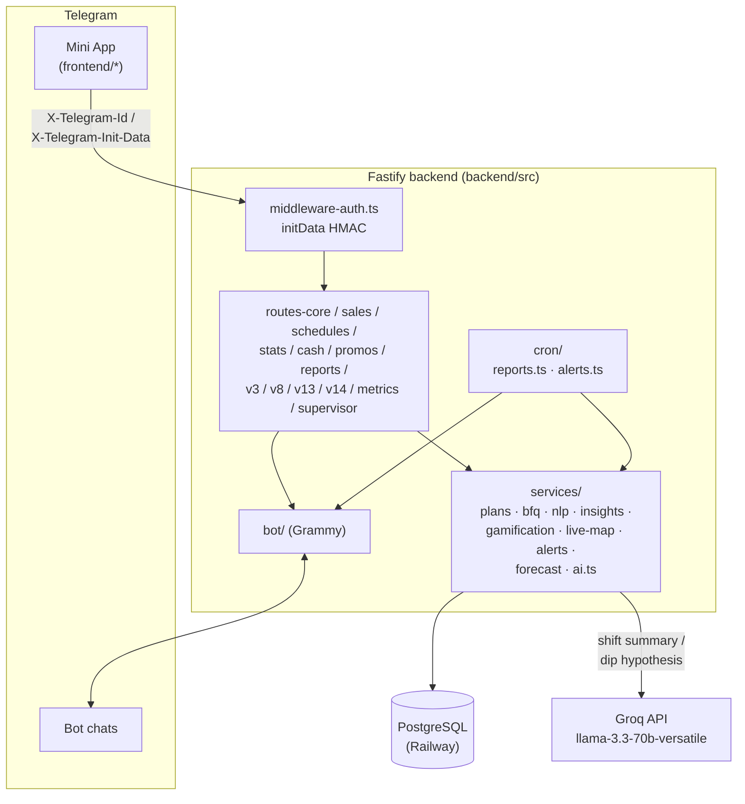

# T2 Sales

### Операционная система розничных продаж сети T2  
**Telegram Mini App · Fastify · PostgreSQL · Grammy · Railway**


> Не «таблица + бот в чате».  
> Единая рабочая среда смены: план, факт, график, касса, BFQ, live-сеть, обучение, роли, отчёты и AI Copilot — в одном касании.

**Актуальная версия клиента:** `17.13.0`  
**Часовой пояс истины:** `Europe/Moscow`

---

## Оглавление

1. [Зачем это существует](#1-зачем-это-существует)
2. [Кому и что даёт](#2-кому-и-что-даёт)
3. [Стек и инфраструктура](#3-стек-и-инфраструктура)
4. [Архитектура](#4-архитектура)
5. [Структура репозитория](#5-структура-репозитория)
6. [Модель данных](#6-модель-данных)
7. [Роли и доступ](#7-роли-и-доступ)
8. [Функциональность по модулям](#8-функциональность-по-модулям)
9. [Метрики продаж](#9-метрики-продаж)
10. [Планирование](#10-планирование)
11. [Касса](#11-касса)
12. [Telegram-бот и отчёты](#12-telegram-бот-и-отчёты)
13. [Обучение](#13-обучение)
14. [HTTP API](#14-http-api)
15. [Переменные окружения](#15-переменные-окружения)
16. [Локальный запуск](#16-локальный-запуск)
17. [Деплой на Railway](#17-деплой-на-railway)
18. [Миграции SQL](#18-миграции-sql)
19. [Mini App в BotFather](#19-mini-app-в-botfather)
20. [Типовые сбои](#20-типовые-сбои)
21. [История версий](#21-история-версий)
22. [Дорожная карта](#22-дорожная-карта)
23. [Соглашения по разработке](#23-соглашения-по-разработке)
24. [Безопасность](#24-безопасность)
25. [Чеклист запуска с нуля](#25-чеклист-запуска-с-нуля)

---

## 1. Зачем это существует

Google Sheets + переписка в Telegram живут на одной точке и трёх людях. На сети точек:

| Боль | Почему Sheets не тянет |
|------|------------------------|
| Разные «истины» | копии файла, формулы, ручной ввод |
| Нет ролей | все правят всё или не видят ничего |
| Нет офлайна | продажа потерялась без Wi‑Fi |
| Нет сессии смены | непонятно, кто реально на точке |
| Отчёты вручную | копипаста, ошибки, задержки |
| Онбординг | «почитай чат за месяц» |

**T2 Sales** — источник истины: сотрудник работает в Mini App, бот уведомляет, PostgreSQL хранит факт, Railway держит API.

---

## 2. Кому и что даёт

### Сотрудник (`employee`)
- Личный кабинет: смена, дневной и месячный план, BFQ  
- Продажи только за себя, мульти-метрики  
- Быстрый ввод: «две симки и одно mnp»  
- Смена-сессия: open / close + гео + самоотчёт  
- График, план точек, промокоды РТК  
- Офлайн-очередь продаж  
- Обязательное обучение (без skip в первый раз)  
- Поддержка / FAQ  

### Управляющий (`manager`)
- Всё employee +  
- График (bulk), месячные планы, materialize дневных планов точек  
- Чужие продажи и дельты  
- Касса, BFQ, заявки на доступ  
- Live-карта, алерты  
- Отдельный курс обучения manager  

### Admin
- Всё manager + тикеты поддержки, роли  

### Supervisor
- Срез только по своим точкам  

### Сеть
- Единые микро/итог отчёты в чат  
- Экспорт / BI  
- Новые точки без новой «таблицы с нуля»  

---

## 3. Стек и инфраструктура

| Слой | Технология | Зачем |
|------|------------|-------|
| Клиент | Telegram WebApp, `index.html` | UI, offline-queue, tutorial |
| API | Node.js 18+, Fastify 5, TypeScript | REST + static |
| БД | PostgreSQL (Railway) | источник истины |
| Бот | Grammy | отчёты, напоминания, notify |
| Cron | setInterval, логика МСК | микро/итог, алерты |
| AI | Groq API (`llama-3.3-70b-versatile`) | итог смены + гипотеза при просадке — бесплатно, без vendor lock-in |
| Хостинг | Railway / Nixpacks | API + фронт |

Клиент **не** ходит в БД: Mini App → `X-Telegram-Id` → API → Postgres.

---

## 4. Архитектура



Клиент **не** ходит в БД напрямую — только через API. «Сегодня» всегда через `todayMoscow()` (`Europe/Moscow`), не UTC контейнера. AI Copilot (`services/ai.ts`) не в горячем пути запросов — вызывается только при закрытии смены и в cron итоговых отчётов, no-op без `GROQ_API_KEY`.

---

## 5. Структура репозитория

```text
tele2-app/
├── README.md
├── docs/INTEGRATION-V13.md
├── sql/                      (ручные миграции: railway-schema-data.sql, ai-copilot.sql, promos.sql)
└── backend/                 ← Root Directory на Railway
    ├── package.json
    ├── tsconfig.json
    ├── railway.json
    ├── src/
    │   ├── index.ts                    (bootstrap: Fastify, cors, static, регистрация модулей, start)
    │   ├── middleware-auth.ts
    │   ├── services/telegram-auth.ts   (проверка initData HMAC)
    │   ├── routes-core.ts              (/stores, /plans)
    │   ├── routes-employees.ts         (CRUD сотрудников/точек)
    │   ├── routes-sales.ts             (/sales)
    │   ├── routes-schedules.ts         (/schedules)
    │   ├── routes-stats.ts             (/stats, /dashboard, прогресс)
    │   ├── routes-cash.ts              (/cash)
    │   ├── routes-promos.ts            (промокоды RTK)
    │   ├── routes-reports.ts           (SVG-отчёты по точке)
    │   ├── routes-me.ts                (/me, /me/bind, /me/day, назначение роли)
    │   ├── routes-bfq.ts               (/bfq полный: расчёт, ручной VMR/штраф, анкета)
    │   ├── routes-export.ts            (история продаж, аудит, CSV-экспорты)
    │   ├── routes-plans-v5.ts          (месячные планы сотрудников/точек, сводная таблица)
    │   ├── routes-v8.ts                (заявки на доступ, супервайзер-сектор)
    │   ├── routes-support.ts
    │   ├── routes-shifts.ts            (/shifts/*, NLP-разбор продажи, офлайн-очередь)
    │   ├── routes-insights.ts          (личная аналитика: /me/insight, /me/self-stats)
    │   ├── routes-live-alerts.ts       (живая карта, умные алерты, what-if)
    │   ├── routes-comms.ts             (объявления сети, каналы)
    │   ├── routes-forecast.ts          (прогноз, heatmap, когорты, BI-экспорт)
    │   ├── routes-v14.ts               (branding, tenant)
    │   ├── routes-metrics.ts
    │   ├── routes-supervisor.ts
    │   ├── services/   (plans, bfq, nlp, insights, gamification, live-map, alerts, forecast, metrics-catalog,
    │   │                supervisor-analytics, report-image, tenant, release-announce, ai.ts ← AI Copilot)
    │   ├── bot/        (index.ts, messages.ts)
    │   ├── cron/       (reports.ts)
    │   ├── db/
    │   └── utils/date.ts
    └── frontend/
        ├── index.html   (разметка + подключение styles.css и js/*.js по порядку)
        ├── styles.css
        ├── js/          (01-core → 13-v14, 16 файлов, классические <script>, общая глобальная область)
        └── offline-queue.js
```

---

## 6. Модель данных

| Таблица | Смысл |
|--------|--------|
| `stores` | точки: code, color, plan_share |
| `employees` | FIO, telegram_id, role, access_status |
| `schedules` | смена на день (UNIQUE employee+date) |
| `sales` | факт метрик |
| `employee_month_plans` | месячный план человека |
| `store_plans` | дневной/шаблон плана точки |
| `store_cash` | факт / 1С |
| `shift_sessions` | open/close смены |
| `rtk_promocodes` | пул промокодов |
| `support_*` | тикеты, FAQ |
| `sales_audit` | аудит правок |
| `ai_audit` | лог AI Copilot: kind (`shift_summary`/`dip_comment`), employee/store, prompt, response, model |

Критичные UNIQUE: `schedules(employee_id, work_date)`, `store_cash(store_id, cash_date)`, upsert-ключ sales.

---

## 7. Роли и доступ

| role | Права |
|------|--------|
| `employee` | свои продажи и план |
| `manager` | график, планы, чужие продажи, касса, заявки |
| `admin` | всё + поддержка, роли |
| `supervisor` | только свои точки |

| access_status | UI |
|---------------|-----|
| `none` | регистрация |
| `pending` | ожидание |
| `rejected` / `blocked` | отказ |
| `active` | полный доступ |

Заголовок API: **`X-Telegram-Id`**.

Вернуть себе доступ:

```sql
UPDATE employees
SET access_status = 'active', is_active = true, role = 'admin'
WHERE telegram_id = <TG_ID>;
```

---

## 8. Функциональность по модулям

- **Главное** — навигация, инструменты, FAB, Command Center (health-score сети + просадки с AI-гипотезой)  
- **Мой** — кабинет, смена, план, инсайт, XP/стрик, разбор смены с AI-summary при закрытии  
- **Продажи** — мульти-метрики, дельты, offline queue, notify  
- **График** — месяц, цвета точек, bulk  
- **Планы** — месяц с архивом ‹›, 6+«ещё» метрик, materialize точек  
- **BFQ** — рейтинг качества  
- **Касса** — факт / 1С / Δ  
- **Live** — кто на смене, % плана, статус  
- **Промо РТК** — скрытый список, used/keep  
- **Поддержка** — FAQ + тикеты  
- **Access** — заявки и approve  

---

## 9. Метрики продаж

`sim`, `mnp`, `pa`, `combo`, `phones`, `accessories`, `settings`, `insurance`, `wink`, `shpd`, `focus`, `credit_request`, `credit_issued`, `plotter`, `hb`

**Комбо (клиент):**  
`цена×(1−скидка/100) + цена×0.28 + 1900`

---

## 10. Планирование

**День сотрудника:**  
`ceil((план_месяца − факт) / max(1, оставшиеся_смены))`

**День точки:**  
остатки всех сотрудников → / дни до конца месяца → × `plan_share`.

Доли по умолчанию: Космонавтов **55%**, Калинина 2 **25%**, Калинина 11 **20**.

`POST /plans/stores/daily/materialize` пишет `store_plans` на дату.

---

## 11. Касса

```text
Δ = cash_fact − (cash_1c + 2000)
```

---

## 12. Telegram-бот и отчёты

| Событие | Когда (МСК) |
|---------|-------------|
| Микро-отчёт | 10, 12, 14, 16, 18, 20 :00 |
| Итог дня | 21:05 |
| Напоминание смены | 20:00 → личка |

Итог: блоки GI · Товарка · Ростелеком · Кредиты · Прочее.

**AI Copilot в итоговом отчёте** (`cron/reports.ts` → `generateDipComment`): если факт дня по точке < 85% от плана — в подпись к финальному кадру отчёта и в `ai_audit` уходит гипотеза от модели; если план закрыт — заготовленная фраза-похвала без вызова модели. Тот же комментарий подтягивается в Command Center через `/supervisor/health` (`drops[].ai_comment`).

**409 Conflict** = два polling на одном токене → 1 реплика Railway, без локального бота, `deleteWebhook`, опционально `BOT_POLLING=false`.

---

## 13. Обучение

### Сотрудник
Автостарт при первом входе. **Skip запрещён** до `t2_tutorial_done`.  
Практика: тапы по nav/FAB, тесты, комбо, быстрый ввод.  
Карточка сверху на tap-шагах, низ кликабелен.

### Manager
Инструменты → «Обучение manager»: заявки, график, планы, касса, live, роли.

```js
localStorage.removeItem('t2_tutorial_done')
```

---

## 14. HTTP API

База: `https://<app>.up.railway.app`  
Header: `X-Telegram-Id`

| Группа | Примеры |
|--------|---------|
| System | `GET /health` |
| Me / access | `/me`, `/me/day`, `/access/status`, `/access/request` |
| Sales / shifts | `/sales`, `/sales/quick`, `/shifts/open|close`, `/sync/batch` |
| Plans / schedule | `/plans/*`, `/schedules/*` |
| BFQ / cash | `/bfq`, `/cash/table`, `PUT /cash` |
| v13 | `/network/live`, `/me/insight`, `/alerts`, `/forecast/:id` |
| Promo / support | `/promos`, `/support` |
| Export | `/export/bi/daily`, CSV exports |

---

## 15. Переменные окружения

| Variable | Нужно | Описание |
|----------|-------|----------|
| `DATABASE_URL` | да | Postgres |
| `BOT_TOKEN` | да | BotFather |
| `PORT` | Railway | listen port |
| `ADMIN_TELEGRAM_ID` | желательно | admin |
| `REPORT_CHAT_ID` | желательно | чат отчётов |
| `BOT_POLLING` | нет | `false` отключает getUpdates |
| `ALLOW_INSECURE_AUTH` | нет | `true` включает dev-фоллбэк на голый `X-Telegram-Id` без проверки initData (**не включать в проде**) |
| `GROQ_API_KEY` | нет | ключ Groq (console.groq.com, free tier, без карты) — включает AI Copilot; без ключа обе функции no-op'ают |
| `GROQ_MODEL` | нет | override модели, дефолт `llama-3.3-70b-versatile` |

---

## 16. Локальный запуск

```bash
cd backend
npm ci
npm run build
npm start
curl -s localhost:3000/health
```

### Тесты (изоляция сети, эпик 17.0)

Тесты пишут и удаляют данные через реальные роуты — только на **локальный**
одноразовый Postgres, никогда на прод (жёсткая проверка в `tests/setup.ts`:
`DATABASE_URL` обязан указывать на `localhost`/`127.0.0.1`).

```bash
# создать backend/.env.test.local (в репозиторий не попадает) с
# DATABASE_URL на свой локальный Postgres, например:
# DATABASE_URL=postgresql://postgres@127.0.0.1:5432/t2_test

cd backend
npm run migrate   # один раз — накатить схему (см. §18, backend/migrations/)
npm test
```

В CI (`.github/workflows/ci.yml`) то же самое происходит автоматически на
каждый push — Postgres поднимается в одноразовом контейнере, схема
накатывается тем же `npm run migrate`, что и на проде.

---

## 17. Деплой на Railway

1. Root Directory = **`backend`**  
2. Variables: БД, токен, chat ids  
3. Build: `npm ci && npm run build`  
4. Start: `npm start`  
5. Health: `/health`  
6. **Replicas = 1**  
7. **Деплой ждёт зелёный CI** (с 17.3.0) — `checkSuites: true` на deployment trigger сервиса (Railway GraphQL API, `deploymentTriggerUpdate`, настройки нет в `railway.json` — только через API/дашборд). Красный `.github/workflows/ci.yml` теперь блокирует деплой, а не просто сигнализирует постфактум

Лог успеха: `✅ V13 routes registered`, `🚀 Сервер на 0.0.0.0:…`

---

## 18. Миграции SQL

С 17.5.0 — система миграций (`backend/src/db/migrate.ts`), не ad hoc SQL
руками на Railway. Пронумерованные файлы в `backend/migrations/`, трекинг —
таблица `schema_migrations` (`name`, `applied_at`). **Важно**: именно
`backend/migrations/`, не `sql/` на корне репозитория — Root Directory
сервиса на Railway = `backend`, всё, что снаружи, в контейнер не попадает.

**Новое изменение схемы**: создать `backend/migrations/00NN_описание.sql` со
следующим номером — и всё, применяется само:

- **На проде** — автоматически при следующем деплое, до открытия порта
  (`index.ts`, до `app.listen()`). Если миграция падает — сервер не
  стартует (лучше не поднимаемся, чем поднимаемся с неверной схемой);
  `railway.json` → `restartPolicyType: ON_FAILURE` в этом случае будет
  ретраить старт, так что упавшую миграцию нужно чинить новым коммитом,
  а не полагаться на ретраи.
- **В CI** (`.github/workflows/ci.yml`) — `npm run migrate` на чистом
  Postgres на каждый push, тем самым же кодом, что и на проде.
- **Локально** — `cd backend && npm run migrate` (нужен `DATABASE_URL` в
  окружении).

Файл уже применённой миграции задним числом не редактируется — новое
изменение, даже мелкое, всегда новый номер.

`backend/migrations/0001_baseline.sql` — снапшот схемы на момент введения
системы (17.5.0), на самом проде НЕ исполнялся — `schema_migrations` там
сразу засеяна записью об этом файле, чтобы не пытаться заново создать уже
существующие таблицы. Исполняется только на чистой БД (CI, локальный тест).

---

## 19. Mini App в BotFather

Menu Button → URL `https://<service>.up.railway.app/`  
Открывать из Telegram. После деплоя — полное закрытие WebApp (кэш).

---

## 20. Типовые сбои

| Симптом | Действие |
|---------|----------|
| 409 getUpdates | один инстанс бота |
| Отказ в доступе | SQL access_status=active |
| Комбо молчит | UI ≥ 13.2.1 (openModal) |
| Планы-нули | month plan + materialize |
| Касса «не та» | формула +2000 |
| Tutorial перекрывает UI | ≥ 13.4.1 |
| 404 на существующем роуте | модуль не в `routeModules` в index.ts — проверь регистрацию |

```powershell
$h = @{ "X-Telegram-Id" = "ID" }
Invoke-RestMethod "$base/health"
Invoke-RestMethod "$base/access/status" -Headers $h
Invoke-RestMethod "$base/me" -Headers $h
```

---

## 21. История версий

| Версия | Суть |
|--------|------|
| Sheets + Apps Script | первые отчёты |
| v3–v5 | Mini App, планы, BFQ, bulk |
| v8 | access gate, supervisor |
| v12 | ЛК, касса, multi-metric |
| **v13** | смены, NLP, offline, live, insights |
| **13.3** | месяц+архив, промо, gate UI |
| **13.4** | tutorial employee + manager |
| **14.0–14.1** | Кабинет супервайзера, PNG-отчёты, кастомные метрики |
| **14.2** | initData HMAC-проверка, закрыты открытые роуты, убрана SQL-инъекция в offline sync, XSS-фиксы во фронтенде, отчёты/дашборд считают метрики динамически (кастомные больше не пропадают), убран мёртвый код (routes-v4/v6/v7/promos → routes-employees.ts) |
| **14.3** | Рефакторинг: index.ts (963 строки) разбит на routes-core/sales/schedules/stats/cash/promos/reports.ts; index.html (6091 строка) разбит на styles.css + 13 файлов в frontend/js/. Заодно найден и исправлен баг: `replyTicket` была объявлена дважды (кнопка «Ответить» в разделе «Поддержка» не работала) |
| **14.3.1–14.3.2** | Хотфиксы после разбивки 14.3: 26 GET-запросов во фронтенде не слали `X-Telegram-Init-Data` (получали 401 на защищённых роутах); `todayMoscow()` вызывалась в `01-core.js` до того, как определялась в `02-nav-utils.js` — падал весь скрипт, ломая план/график/кабинет/команду разом |
| **14.4.0** | Техдолг перед AI-эпохой: убрана мёртвая ветка `shift_open`/`shift_close` в `/sync/batch` (офлайн-очередь умеет только `sale`, смены туда никогда не попадали); `middleware-auth-v8.ts` (был просто ре-экспортом) убран, `routes-v8.ts` импортирует `middleware-auth.ts` напрямую; удалены осиротевшие `bot-messages.ts` и `index-snippet.txt`; добавлен `npm run smoke:frontend` — vm-тест порядка подключения `frontend/js/*.js`, ловит класс бага из 14.3.1 |
| **14.5.0** | Command Center v1: виджет «Сеть за минуту» на главной для manager/supervisor/admin (health-score + топ-3 просадки, через `/supervisor/health` — эндпоинт для виджетов существовал с 14.x, но не был подключён ни к одному экрану); в кабинете супервайзера впервые появился список алертов (`/alerts`) с подтверждением (`/alerts/:id/ack`) — раньше эти роуты не имели UI вообще, алерты уходили только админу в личку и накапливались без возможности снять; удалены осиротевшие `supervisor-page.html`/`supervisor-ui.js`/`supervisor-ui.css` (не подключены к index.html, реальный кабинет супервайзера — `08-access-supervisor.js`) |
| **14.6.0** | Смена как сессия: закрытие смены вместо тоста «идеальная / нет» показывает разбор — score, факт/план по SIM/MNP/ПА/Комбо, явную причину «до идеальной смены не хватило» (`ideal_missing` от `/shifts/close`), плюс XP/уровень/стрик за эту смену (`evaluateShiftClose` в gamification.ts считал это и раньше, просто не возвращал наружу — экран его игнорировал) |
| **14.6.1** | Хотфикс: вкладка «Заявки на доступ» перекидывала на главную — в `index.html` отсутствовал контейнер `page-access` (потерялся при разбивке 14.3.0), `switchPage()` не находил элемент и молча падал на home. Кнопка живёт на вкладке «Команда» → «Управление», не на главной |
| **14.7.0** | Отчёт-история: итог дня в чат теперь уходит альбомом из 3 картинок вместо одной — план дня → факт → фокус на завтра (цели + кто в графике + подсказка по пиковому часу из `store_hour_profile`). Тот же resvg-рендерер и та же цепочка фолбэков (PNG → SVG-документ → текст), просто на 3 кадра; при сбое media group откатывается на старый одиночный финал. Превью-страница «Отчёт-картинка» показывает то же самое, что реально уйдёт в чат. Микро-отчёты не менялись |
| **14.8.0** | What-if v2: сценарий из нескольких переносов разом вместо одного (бэкенд `simulateScheduleMoves` уже принимал массив — не хватало только UI: список переносов с добавлением/удалением). Сравнение сценариев A/B: посчитал один набор переносов → «Сохранить как A» → очистил, собрал другой → авто-сравнение при пересчёте. Метрика сравнения — не сумма Δ SIM по сети (перенос внутри сети всегда даёт в сумме ноль, сравнивать по этому бессмысленно), а худшая просевшая точка: какой сценарий меньше вредит своему самому слабому месту |
| **14.9.0** | Автоанонс обновлений: важные версии (minor-эпики, не хотфиксы) сами приходят в рабочий чат картинкой с кратким описанием при старте сервера — тем же resvg-пайплайном, что и отчёты. Список версий для анонса — `src/changelog.ts`; какая версия уже анонсирована — `app_settings.last_announced_version`, отправка отмечается только при успехе. Заодно: `.btn-ghost` использовался в 5 местах (в т.ч. до этой сессии) без единого объявления в CSS — рендерился браузерным дефолтом; добавлен стиль в тон `.btn-main`. Плановый эпик «Порог перед ИИ» сдвинут на 14.10.0 |
| **14.10.0** | Порог перед ИИ: `db/index.ts` и `bot/index.ts` читали `process.env` на верхнем уровне модуля — из-за хостинга ES-импортов это выполнялось раньше `dotenv.config()` в `index.ts`, так что `npm run dev` тихо не видел `.env` (в Railway не заметно — там переменные уже в окружении до старта node). Добавлен `src/env.ts`, первый импорт index.ts, гарантирующий порядок. Убран дублирующий SVG-рендерер в `routes-reports.ts` (`buildDayReportSvgInline`) — параллельная реализация того же пути к тем же данным, не настоящий фолбэк. Статус мультитенантности явно задокументирован в `tenant.ts`: сейчас только branding, изоляция данных — сознательно отложенный эпик мультитенанта. Полная регрессия по 17 разделам приложения на реальных данных — без единой ошибки |
| **15.0.0** | AI Copilot v1, первая ИИ-эпоха. Сознательно бесплатно и без чата/tool-calling — оба сценария одношаговые, бэкенд сам собирает контекст кодом, модель вызывается через Groq (бесплатный тариф, `llama-3.3-70b-versatile`, без карты): (1) итог смены сотруднику — короткий комментарий сразу после `/shifts/close`, на основе факта/плана/XP; (2) комментарий к просадке точки — встроен в существующий cron итоговых отчётов (`cron/reports.ts`): если факт дня < 85% от плана, модель даёт гипотезу вместо голой цифры; если план закрыт — берётся случайная заготовленная фраза-похвала без вызова модели. Комментарий уходит и в подпись к отчёту в чат, и в БД — оттуда его подтягивает Command Center на главной (`/supervisor/health`, поле `drops[].ai_comment`). Новая таблица `ai_audit` — лог всех промптов/ответов модели. Без ключа `GROQ_API_KEY` обе функции тихо no-op'ают (summary → `null`, комментарий → заготовленный фолбэк-текст), остальное приложение не затронуто |
| **15.0.1** | Хотфикс: касса (`GET /cash/table`, `PUT /cash`) была ошибочно закрыта на `requireManager` — 403 для обычного employee, хотя фронтенд (`09-cash-metrics.js`) всегда показывал форму внесения кассы всем сотрудникам точки, не только управляющим. Заменено на `requireActive` (любой активный сотрудник); неиспользуемый фронтендом `GET /cash` (список) оставлен manager-only |
| **15.0.2** | Итоговый отчёт-альбом (план/факт/фокус на завтра) больше не подписывает каждую из 3 картинок по отдельности — заголовок кадра и так есть на самой картинке. Вместо трёх caption — одно сообщение под альбомом с итогом дня и AI-комментарием (`cron/reports.ts`) |
| **15.0.3** | Manager/admin теперь могут отменить ошибочно внесённую метрику за день (`PUT /sales/:id/zero`, кнопка «Удалить» в карточке сотрудника → «Исправить ошибочный ввод») — `sales` аддитивная, поэтому это обнуление конкретной колонки с записью в `sales_audit`, а не удаление всей записи за день. AI-гипотеза при просадке точки теперь смотрит на все ~18 метрик `store_plans`, а не только SIM/MNP/ПА/Комбо — раньше просадка по, например, страховкам или аксессуарам была для модели невидима |
| **15.0.4** | Удаление кастомных метрик плана получило UI — `DELETE /metrics/:id` существовал на бэкенде (soft-delete, базовые метрики защищены), но был недоступен из приложения. «Управление» → «Метрики плана» теперь показывает список своих метрик с кнопкой «Удалить» перед формой создания новой |
| **15.1.0** | Обучение v3 — «игровой уровень» с персонажем Арбузычем (🍉). Два визуальных режима: полноэкранные cutscene-главы (`#tutorialScreen`) для вступления/переходов/квиза/финала и доработанный coach-оверлей (`#tutorialOverlay`, сильнее затемнение, аватар-бабл) для «нажми сюда» на реальном UI. Оба трека (employee 22 шага, manager 17 шагов) переписаны и разбиты на главы с мини-праздником (`confettiBurst()`) между ними. Добавление продажи в главе «Продажи» теперь тренируют на настоящей форме (`07-add-sale.js`) в dry-run режиме — `window.__tutorialDryRun` перехватывает `submitSale()` до реального `POST /sales`, ничего не пишется в базу и в чат. Новый `POST /me/tutorial-complete` идемпотентно начисляет XP и бейдж (`tutorial_done`/`tutorial_mgr_done`) через уже существующие `addXp`/`grantBadge` — раньше прохождение обучения вообще не было известно бэкенду, только `localStorage` |
| **15.7.0** | «Кого куда поставить» (`services/forecast.ts` → `getStaffingHints()`). Абсолютной меры «нужно N человек» нет — прогноз в штуках метрик, не в человеко-часах, поэтому эвристика относительная: нагрузка на человека в графике (прогноз / headcount по `schedules`) сравнивается со средней по сети на ту же дату; кто выше среднего на 30%+ или вообще без headcount при ненулевом прогнозе — попадает в подсказку. Новый `GET /staffing-hints` (manager/admin), блок на странице «Прогноз» на 7 дней вперёд, кнопка «Предложить перенос» переиспользует `proposeMoveForStore()` из 15.4.0 (расширен вторым параметром — датой). Честно помечено как эвристика, не точный расчёт |
| **15.6.0** | Объявления сети (`/announcements`) не работали вообще — бэкенд отдаёт голый массив (как `/sales`, `/employees`), а фронтенд ждал `{items:[...]}`; `data.items` на массиве всегда `undefined`, экран показывал «Нет объявлений» независимо от реальных данных (в базе на момент фикса лежало 5 штук). Заодно добавлена настоящая причина заводить read-tracking — новый `GET /announcements/:id/reads` (manager/admin) и кнопка «Кто прочитал» показывают по именам, кто уже видел обязательное объявление, а кто ещё нет; раньше read-статус был виден только самому сотруднику про себя |
| **15.5.0** | Единообразие метрик. Метки одной и той же метрики раньше жили в шести независимых копиях (`01-core.js`, `03-home.js`, `04-schedule.js`, `05-my-plan.js` — три штуки в одном файле, `06-team-bfq.js`, `11-v13.js`) и на бэкенде тоже в двух (`routes-metrics.ts` и `services/metrics-catalog.ts`) — расходились по деталям, например «Аксессуары» на одном экране и «Аксы» на другом для одного и того же показателя. Бэкенд: `GET /metrics` теперь просто вызывает `getMetricDefs()` вместо своего отдельного захардкоженного фолбэка. Фронтенд: `METRICS` в `01-core.js` — единственный источник, новые `metricLabel(id)`/`metricShort(id)` читают из него; все экраны переведены на них. Заодно «Мои продажи сегодня» перебирает `METRICS` вместо фиксированного списка из 15 id — кастомные метрики тоже попадают в сводку |
| **15.4.0** | «Действие из просадки»: под каждой карточкой просадки в Command Center (`03-home.js`) и кабинете супервайзера (`08-access-supervisor.js`) — кнопка «Предложить перенос». Ведёт на страницу «Прогноз» и сразу выставляет проблемную точку в поле «На точку» What-if-сценария (`proposeMoveForStore()` в `13-v14.js`, дожидается `fillStoreSelects()` перед подстановкой значения, иначе селект перезатирается) — супервайзеру остаётся выбрать только сотрудника и «с точки». Заодно кабинет супервайзера стал показывать `ai_comment` под просадкой, как и главная — раньше это было только в Command Center |
| **15.3.0** | Прогноз (`services/forecast.ts`) переписан с нуля. Старая модель брала среднее строго по тому же дню недели за последние 8 недель — на датасете короче 8 недель (как сейчас) подходящих точек нет вообще, отсюда прогноз всегда 0 для любой точки. Новая модель: простое экспоненциальное сглаживание (`α=0.3`) для уровня тренда × сезонная поправка на день недели с усадкой к нейтральной 1.0 (`k=3`), пока по дню недели мало наблюдений — даёт осмысленное число с первого дня и уточняется по мере накопления истории. Ответ `/forecast/:storeId` дополнен `history_days`; фронтенд показывает предупреждение, если истории меньше 14 дней. Проверено на реальных данных: Космонавтов (4 дня истории) — 10-13 SIM/день вместо нуля; Калинина 11 (0 продаж в базе вообще) — честный 0 с пояснением вместо молчаливо «сломанного» экрана |
| **15.2.2** | Хотфикс: время открытия смены в «Мой» показывало UTC вместо МСК (открыл в 9:55 — писало 6:55) — `sess.opened_at.slice(11,16)` резал сырую UTC ISO-строку без конвертации часового пояса. Новый `timeMoscow()` в `01-core.js` форматирует явно через `Intl.DateTimeFormat` с `timeZone: 'Europe/Moscow'` |
| **15.2.1** | Хотфикс: `store_plans` материализовался только вручную кнопкой «Записать дневные планы в БД» — если никто не нажал, у точки не было плана на день, и отчёт-картинка/«Фокус на завтра» рендерились пустыми (факт 0, план «—»), как случилось с Калининой 11 на 04-05.08. Теперь `cron/reports.ts` в 06:00 МСК сам материализует план на сегодня и на завтра через уже существующий `materializeStoreDailyPlans()` (`services/plans.ts`). Данные за 05-06.08 пересчитаны вручную через продовый `POST /plans/stores/daily/materialize` |
| **15.2.0** | UI-полировка heatmap/прогноз/касса/команда под общий стиль приложения (Command Center, `.cc-*`/`.mt-*` токены вместо инлайн-стилей): heatmap — классы `.hm-cell` вместо сырых inline `rgba()`; прогноз — исправлена вёрстка (`.mt-grid` был 3-колоночным на 4 метрики, теперь `.mt-grid-4`); касса — настоящая строка заголовков колонок; команда — цветной кружок-инициал вместо статичной 👤, тон = есть ли у сотрудника продажи сегодня. Заодно найден и исправлен `var(--muted)` — использовался в 8 местах (`.sv-*`), нигде не был определён. Добавлен `@media (prefers-reduced-motion: reduce)` — раньше не учитывался нигде, при этом две бесконечные анимации (Арбузыч, spotlight-пульс) крутились всегда. Пустые состояния heatmap/промокодов/live-сети больше не показывают технические заметки вроде «Нужен sales_events (sql/v8-0-roadmap.sql)» |
| **15.8.0** | Эпик мультитенанта, фаза A — секторы и сети точек. *(в записях этого сеанса раньше называлось «эпик 17.0» как внутреннее кодовое имя — не путать с реальной версией 17.0.0+, это другой, более поздний эпик про CI/тесты)* `organizations`/`org_id` существовали в схеме с 14.x, но были write-orphaned (ни один INSERT/UPDATE их не трогал) и влияли только на брендинг — реальные данные читались по всей сети без фильтра. Новая таблица `sectors`, `organizations` получили `sector_id`/`chat_id` (= «сеть точек» по смыслу, переиспользована как есть), `supervisor_sectors` заменяет ручное назначение точек супервайзеру (`supervisor_stores`) — теперь назначение на сектор целиком, супервайзер сразу видит все точки всех сетей внутри (`middleware-auth.ts` → `getUserStoreIds`, `services/supervisor-analytics.ts` → `resolveSupervisorStores`). Уведомления (продажа, микро/итог-отчёты, алерты 14:00/16:00, анонс релиза) теперь роутятся по чату **точки** — `getStoreChatId()`/`getOrgChatId()` в `tenant.ts`, `notifyChat*` уже принимали `chatId`, просто никто его не передавал. Алерты 14:00/16:00 раньше слали одно агрегированное сообщение по всей сети в общий чат — теперь группируются по сети и шлют по сообщению на сеть в её чат. Убран хардкоженный TS-массив `SCHEDULES` в `cron/reports.ts` (3 точки, расписание отчётов руками в коде) — читается из `stores.micro_report_times`/`skip_sunday_micro_times`/`close_time_weekday`/`close_time_sunday`, которые уже были в схеме, но нигде не читались; новая точка получает расписание сразу, без правки кода. `POST /employees`/`POST /stores` и bot-approval пишут `org_id` (раньше не писали никогда); закрыта дыра в `listStoresForOrg()` — молча фолбэчилась на все точки при пустом фильтре. Обратная совместимость: единственная существующая сеть перенесена в `sector='default'`/`org='default'` с тем же `chat_id`, что был в `CHAT_ID` — поведение не изменилось. Изоляция данных на уровне экранов (сотрудники/график/промокоды/касса видны только своей сети) — фаза B, следующим заходом |
| **15.9.0** | Полная лестница ролей вместо плоского `employee/manager/supervisor/admin`: `Стажёр(trainee) → Продавец(employee) → Старший продавец(senior) → Руководитель(manager) → Супервайзер(supervisor) → Admin`. `senior` — новая роль, операционно как руководитель (сотрудники/точки/график/касса/продажи/экспорты — везде, где раньше `requireManager`), но намеренно без доступа к Command Center и кабинету супервайзера — решили разделить «операционные права» и «видимость аналитики» на два независимых флага (`isManager()`/`canManage()` расширены до senior, новый `canViewAnalytics()` на фронте и уже существующий `canViewSupervisor()` на бэке — оба явно НЕ включают senior). Назначение роли (`PATCH /employees/:id/role`) раньше не имело вообще никаких ограничений — любой manager/admin мог поставить кому угодно любую роль, включая admin; теперь `canAssignRole()` в `middleware-auth.ts` разрешает назначать только роль строго ниже своей по уровню (admin — без ограничений, как и было). Заодно найдены и исправлены два бага в той же области: кнопка смены роли в карточке сотрудника (`06-team-bfq.js`) стучалась в `PATCH /employees/:id`, а не `/employees/:id/role` — хендлер роль не трогает (по собственному комментарию в коде), кнопка молча ничего не делала; дублирующий эндпоинт `POST /employees/:id/role` в `routes-v3.ts` имел свой allowlist ролей без `supervisor`, расходящийся с версией в `routes-v8.ts` — выровнен через тот же `canAssignRole()` |
| **15.10.0** | Первая проверка эпика 17.0 на реальных вторых данных: заведена настоящая тестовая сеть (`test_network`, свои 2 точки, свои 2 сотрудника, свой `chat_id`) — уведомления/отчёты по ней подтверждённо уходят в свой чат, а не в общий. Заодно закрыт пробел, который эта проверка сразу вскрыла: `GET/POST /employees` были не scoped по сети — «Команда» показывала сотрудников всех сетей вперемешку. Теперь по умолчанию видна только своя сеть (`COALESCE(org_id,'default') = свой org_id`); у admin в «Команде» появился переключатель сети (`GET /orgs`, admin-only) — по умолчанию видит свою рабочую сеть, но может явно заглянуть/завести сотрудника в любой другой (`?org_id=`/`body.org_id`, тоже только для admin). `GET /me` заодно стал отдавать `org_id` — фронту он был нужен для дефолта переключателя |
| **15.11.0** | Эпик мультитенанта, фаза B завершена — график/касса/промокоды тоже scoped по сети, тем же паттерном, что и «Команда» в 15.10.0 (общий хелпер `resolveViewOrgId()` в `middleware-auth.ts`, переиспользован во всех четырёх разделах). `GET /schedules`, `/schedules/month`, `GET /cash/table`, `/cash`, `GET /promos` фильтруются по сети точки (или по `org_id` самого промокода); `POST /schedules` дополнительно проверяет, что точка принадлежит сети менеджера (403, если нет) — но не ограничивает, какого сотрудника туда поставить, потому что подмена в чужой сети остаётся легитимной (эпик мультитенанта, фаза A). `rtk_promocodes` — миграция `org_id` была добавлена ещё в 15.8.0, но роуты её не использовали до сих пор; `GET/POST /promos/:id`, `/:id/use` тоже проверяют `org_id`, чтобы код чужой сети нельзя было забрать по угаданному id. Переключатель сети у admin (появился в 15.10.0 для «Команды») теперь работает и на «Расписании», «Кассе», «Промокодах» |
| **15.12.0** | Проверка на реальной второй сети (`test_network`) вскрыла, что фаза B в 15.11.0 закрыла не все дыры. Дополнительно scoped: `GET /stats/daily` («Сеть сегодня»), `GET /dashboard` («Топ за 7 дней», по точке продажи — не по «домашней» сети сотрудника, как и весь эпик мультитенанта), `GET /plans/employees/month` («Планы и факт за месяц»), `GET /plans/stores/daily` («План дня по точкам»). Самое широкое: `resolveSupervisorStores()` для manager/admin отдавал `scope = null` («вся БД без фильтра») — Command Center на главной и весь кабинет супервайзера показывали буквально все сети сразу; теперь для manager/admin scope — список точек своей сети (или явно выбранной admin'ом). Заодно исправлена вёрстка `computeStoreDailyPlans()`: хардкоженная `STORE_SHARES` на 3 точки заменена на чтение `stores.plan_share` — колонка была в схеме и даже отредактирована в БД вручную, но код её не читал (тот же паттерн, что `micro_report_times` в 15.8.0). Найдена и исправлена регрессия, которую сама эта фаза едва не внесла: `GET /schedules`/`/schedules/month`, отфильтрованные по сети точки, переставали показывать сотруднику его СОБСТВЕННУЮ смену, если сегодня он подменяет в чужой сети — добавлено исключение «своя запись видна всегда» |
| **15.13.0** | План точки — из «доли от суммы планов сотрудников» в независимый ручной ввод. Новая таблица `store_month_plans` (зеркалит `employee_month_plans`, только на точку) + `GET/PUT /plans/stores/:id/month`, гейт — точка должна принадлежать своей сети (как и `POST /schedules`). `computeStoreDailyPlans()` переписан: вместо суммирования остатков планов всех сотрудников сети и деления по `plan_share` — просто `(план точки на месяц − факт точки с начала месяца) / оставшиеся дни`, ровно та же формула, что уже была для сотрудника (`getEmployeeDailyPlan`), только на уровне точки. Старый шаблон `store_plans` с `plan_date IS NULL` (ручная цифра-фолбэк на день) убран из приоритета в `04-schedule.js` — план точки его полностью заменяет. Планы сотрудников как отдельная сущность (личная статистика/BFQ) не тронуты. У точек, заведённых до этой версии, план на месяц пуст — «План дня по точкам» покажет 0, пока управляющий не введёт план вручную (тап по точке в «Управление») |
| **15.13.1** | Хотфикс: команда `/chatid` боту — прямо в группе/теме отвечает `chat.id` и `message_thread_id` текущей темы. Нужно было для подключения РТТ Гуреева (их группа с темами — отдельная тема «продажи», отдельная «отчёты»), пригодится для любой следующей сети |
| **15.14.0** | Подключена вторая реальная сеть — **РТТ Гуреева** (4 точки: Хорошевская 27, Кожевническая 4, Новослободская 10, Комсомольская пл. 3 — круглосуточная, «итог дня» на 21:00; 8 сотрудников). Основная сеть переименована в **РТТ Бижонов**. Их группа в Telegram — форум с темами (отдельная тема «продажи», отдельная «отчёты»), которого раньше в приложении не было вообще — на сеть был только один `chat_id`. Добавлены `sales_thread_id`/`reports_thread_id` на `organizations`, `notifyChat*` в `bot/index.ts` научились передавать `message_thread_id`, новые `getOrgNotifyTarget()`/`getStoreNotifyTarget()` в `tenant.ts` резолвят чат+тему по назначению (продажа → тема продаж, отчёты/алерты → тема отчётов). Заодно найден и исправлен баг: `checkStoreLagAlert()` (алерт отставания 16:00) считал дневные планы только для сети `default` — вторая сеть вообще не получала бы этот алерт |
| **15.14.1** | Структурная чистка без изменения поведения (без анонса — не эпик). Три разросшихся файла-свалки разбиты по темам: `06-team-bfq.js` (802 строки, команда+BFQ+планы+поддержка+модалки) → `06-team-bfq.js`/`06b-plans-bfq.js`/`06c-support-tickets.js`; `routes-v13.ts` (717 строк) → `routes-shifts.ts`/`routes-insights.ts`/`routes-live-alerts.ts`/`routes-comms.ts`/`routes-forecast.ts`; `routes-v3.ts` (557 строк) → `routes-me.ts`/`routes-bfq.ts`/`routes-export.ts`, а `/schedules/bulk`+`DELETE /schedules` переехали в `routes-schedules.ts` — мутации графика были раскиданы по двум файлам. Заодно: дедуп проверки «точка принадлежит вашей сети» в `assertStoreInOrg()` (была продублирована в `routes-schedules.ts` и `routes-plans-v5.ts`); закрыт пробел — `/schedules/bulk` не проверял принадлежность точки сети вообще, хотя одиночный `POST /schedules` уже проверял; удалён мёртвый код (`cellTone()` во фронтенде, нигде не вызывался) |
| **15.15.0** | Изоляция по сети — последние 6 непроверенных мест. `getLiveNetworkMap()` (живая карта) была самой грубой дырой: показывала имена сотрудников, продажи и кассу вообще всех сетей сразу, без единого фильтра — теперь `orgId` параметр. Аналогично scoped: `GET /forecast/:storeId`, `GET /heatmap/precise/:storeId` (реальный heatmap, который дёргает фронтенд — не путать с параллельным `GET /heatmap/:storeId` в `routes-forecast.ts`, тот не используется) через `assertStoreInOrg()`; `GET /staffing-hints`, `GET /alerts`, `GET /export/bi/daily` через `resolveViewOrgId()`. `newbieCohorts(orgId)` — параметр существовал в сигнатуре и раньше, но нигде не читался в самом SQL-запросе (тот же паттерн, что `plan_share`/`micro_report_times` ранее). Заодно найден и починен независимый баг: `newbieCohorts()` падал с 500 на `invalid input syntax for type date`, когда дата бралась из `created_at` (JS `Date` из pg-драйвера) — `String(date).slice(0,10)` резал `"Tue Jul 28"` вместо ISO |
| **15.15.1** | Хотфикс: заголовок карточки-анонса версии в чат обрезался по краю на длинных названиях (SVG не переносит текст сам) — буллеты уже переносились строками, а заголовок оставался одной строкой на 26px. `wrapText()` в `report-image.ts` сделан переиспользуемым (параметр максимума символов в строке вместо константы), заголовок теперь тоже переносится, версия и буллеты сдвигаются вниз на высоту второй строки заголовка |
| **15.16.0** | Изоляция по сети — объявления, каналы, заявки на доступ (`routes-comms.ts`). `announcements.org_id`/`channels.org_id` существовали в схеме и раньше, но ни один запрос их не читал — тот же паттерн, что `plan_share`/`micro_report_times`: сотрудник любой сети видел объявления и мог читать/писать в каналы вообще всех сетей. `GET/POST /announcements` теперь фильтруют/пишут `org_id`; `GET /announcements/:id/reads` проверяет принадлежность объявления сети менеджера; новый `assertChannelInOrg()` гейтит `GET/POST /channels/:id/messages`. `GET /access/requests` (`routes-v8.ts`) теперь фильтрует заявки по уже существующему сотруднику (`claimed_employee_id`) по его сети; заявка от ещё не найденного в системе гостя сети не имеет и видна всем управляющим — осознанное ограничение данных, не дыра. Заодно починена кнопка «Тикеты поддержки» — показывалась всем manager/senior и падала на 403, хотя `routes-support.ts` изначально задуман только для admin (эскалация к разработчику, не менеджерский инбокс сети) |
| **15.16.1** | Хотфикс, найден по жалобе «график сотрудника показывает мою сеть» при переключении admin между сетями. Настоящая причина оказалась серьёзнее: `GET /sales` вообще не проверял авторизацию и не фильтровал по сети — отдавал продажи ВСЕХ сетей за день (имена, точки, все метрики) кому угодно с любым или вообще без `X-Telegram-Id`. Добавлены `requireActive` + фильтр по сети точки (с self-inclusion, как в `/schedules` — своя продажа видна при подмене в чужой сети). `POST /sales` и `PUT /sales/:id/zero` тоже не проверяли, что точка принадлежит сети менеджера — manager одной сети мог вписать или обнулить продажу на точке вообще любой другой сети; теперь `assertStoreInOrg()`, кроме записи за самого себя (подмена остаётся легитимной). Заодно закрыты 4 места во фронтенде, где `org_id` не передавался при просмотре чужой сети admin'ом: карточка сотрудника, месячный график, форма добавления продажи, бейджи «продажи сегодня» в списке команды — везде тихо подставлялась своя сеть admin'а вместо той, что он смотрит |
| **16.0.0** | Пикер сети при регистрации гостя (`GET /access/orgs`, публичный) — заявка на доступ теперь несёт `org_id` и уходит только manager/supervisor/senior выбранной сети + admin (страховка на случай новой сети без активного управляющего), а не всем сетям сразу. `GET /access/employees-directory` тоже получил `?org_id=` — список «я из списка» раньше показывал сотрудников вообще всех сетей, гость сети B мог заклеймить сотрудника сети A. Важный смежный фикс: одобрение заявки (`POST /access/requests/:id/approve`) раньше создавало сотрудника в сети ОДОБРЯЮЩЕГО менеджера, а не в сети заявки — с admin, теперь получающим cc по заявкам любой сети, это стало реальным риском молча пересоздать сотрудника не в той сети. Деактивирована тестовая `test_network`, которая иначе попала бы в новый публичный пикер. Визуально: новый экран загрузки приложения (splash, `#appSplash`) вместо пустоты до первого ответа `/access/status`; экраны регистрации/ожидания/отказа доведены до токенов дизайн-системы (`.gate-icon`, `.btn-ghost` вместо инлайн-стилей); первое сообщение бота `/start` в приватном чате — с кнопкой «Открыть T2 Sales» (`web_app`-кнопка работает только в приватных чатах, не в групповых — учтено) |
| **16.0.1** | Хотфикс: admin не мог сохранить план точки чужой сети — 403 «Точка не принадлежит вашей сети», хотя сама точка корректно показывалась в списке (уже отфильтрованном переключателем сети). Бэкенд (`PUT /plans/stores/:id/month`) уже умел принимать `org_id` от admin, просто `saveStoreMonthPlan()` во фронтенде его не отправляла — тот же класс пропуска, что чинился весь этот сеанс в других местах |
| **16.1.0** | Новая сеть — без SQL. Admin заводит сеть прямо в приложении («Команда» → «Управление» → «Сети»): название, бренд, цвет, сектор (печатаешь новое имя — заводится тут же, отдельного экрана для секторов нет), chat_id и thread_id тем (узнаются командой `/chatid` боту). `upsertOrg()` раньше писал только 5 branding-полей — `sector_id/chat_id/sales_thread_id/reports_thread_id/is_active` существовали в схеме, но никогда не сохранялись через код; частичное сохранение (создать сеть раньше, чем узнают chat_id, дописать позже) — через `body[key] !== undefined` на новых полях и `COALESCE(...,organizations.x)` на branding-полях, чтобы пропущенное поле не затиралось молча. Форма новой точки получила часы работы/смены/время итога дня и переключатель «круглосуточно» — раньше этих полей не было в UI совсем, каждая точка тихо получала дефолт 10-21 (реальная круглосуточная точка требовала ручного SQL). Заодно `POST /stores` — тот же класс пропуска `org_id`, что чинился весь сеанс: admin не мог создать точку в чужой сети через переключатель |
| **16.2.0** | Кабинет супервайзера — полный рефактор оформления и функционала. Раньше supervisor делил интерфейс с manager: одна страница поверх обычных 5 вкладок, кнопка входа видна manager/admin/supervisor. Теперь — отдельный визуал: свой фиолетовый акцент (`.sv-*` классы в `styles.css` были захардкожены в основной синий, не через токены — перекрашены точечно), свои 4 вкладки (Обзор/Точки/Люди/Тренд, свой `#bottomNavSupervisor`) вместо обычных пяти. Реальная изоляция, не только визуальная: `GET /supervisor/dashboard` (`routes-supervisor.ts`) теперь только `supervisor | admin` — manager убран; `GET /supervisor/health` (виджет «Сеть за минуту» на главной manager/admin) не тронут, это отдельная фича на том же движке. Заодно закрыт смысловой разлад: обычные вкладки Команда/График/Касса резолвили supervisor в его СОБСТВЕННУЮ сеть (`resolveViewOrgId`), а не в весь сектор — то есть кабинет честно показывал весь сектор, а остальные вкладки — только одну случайную сеть; теперь supervisor вообще не монтирует обычные вкладки, только свой сектор. Точки и топ сотрудников в кабинете подписаны названием сети (`org_name`, join на `organizations` в `buildSupervisorDashboard()`) — раньше в кросс-сетевом списке было не видно, откуда какая запись. Admin заходит через кнопку «Кабинет супервайзера» (теперь `canAdmin()`, не `canViewAnalytics()`) с кнопкой «‹ Назад» |
| **16.2.1** | Хотфикс, найден по живой жалобе сразу после 16.2.0: у admin в кабинете супервайзера показывалась только его собственная сеть (РТТ Бижонов), точки РТТ Гуреева не отображались вовсе. `resolveSupervisorStores()` для `role='admin'` резолвит в одну сеть (`orgId`) — верно для `/supervisor/health` (виджет на ГЛАВНОЙ admin — его своя сеть), но не для самого кабинета: там кабинет обещает «весь сектор», а у admin персонального сектора нет, значит логичный эквивалент — вообще все сети. `GET /supervisor/dashboard` для admin теперь `scope: null` напрямую, минуя `resolveSupervisorStores()` |
| **16.3.0** | Кабинет супервайзера — выполнение и прогноз месячного плана. Вкладка «Точки» получила разворачиваемый список «Ещё метрики» — раньше показывались только SIM/MNP/ПА, теперь все 15. Вкладка «Тренд» получила: выполнение месячного плана по сектору целиком (сумма планов и факта всех точек по каждой метрике) и по каждой точке отдельно, плюс прогноз на конец месяца — та же модель, что уже была в `services/forecast.ts` (простое экспоненциальное сглаживание + сезонная поправка на день недели), но батчем одним запросом на весь сектор вместо N+1 по точке, и расширена с 4 метрик (SIM/MNP/ПА/Комбо) до всех 15. Найдены и починены при верификации перед деплоем два реальных бага модели на денежных метриках (Телефоны, Аксессуары): (1) `GROUP BY sale_date` молча пропускал дни без продаж — сглаженный уровень никогда не видел настоящий ноль и не спускался вниз; (2) холодный старт с фолбэком `baseline=1` был откалиброван под мелкие штучные метрики (SIM 0-10) — на суммах в тысячи рублей единственный ненулевой день после серии нулей делил сам на себя на «1» и улетал за 1000% плана. Оба фикса: заполнение пропущенных дней явными нулями + масштабирование холодного старта под реальное среднее метрики вместо универсальной константы |
| **16.4.0** | Новая быстрая вкладка на главной — «Сеть за месяц»: план/факт/% по всем 15 метрикам сразу, сумма по всей команде сети, строками-барами. Данные уже считались (`getMonthSummaryTable()` → `GET /plans/employees/month`, поле `totals.plan`/`totals.pct`), просто не были нигде показаны — существующая карточка «Итого сеть» на «Планы и факт за месяц» использовала только `totals.fact`, без плана и без цвета по проценту выполнения; заодно и её починили |
| **16.5.0** | «Сеть за месяц» получила разбор по сотрудникам — под общим итогом сети тот же барный визуал по каждому сотруднику (план/факт/% по всем метрикам, смены/остаток), реюз `svBarRowHTML`/`svExtraToggleHTML` из кабинета супервайзера. Отдельно — везде, где раньше выбор точки (продажа, график смен, касса, отчёты, тепловая карта) собирался из намеренно кросс-сетевого `GET /stores`, теперь используется новый `GET /org/stores` — точки только своей сети (с тем же admin-переключателем сети, что и в «Команде»); `GET /stores` остаётся кросс-сетевым для мест, которым это реально нужно (аналитика), просто больше не используется как источник для пикеров |
| **17.0.0** | Эпик «Надёжность перед деньгами»: CI на каждый push (`.github/workflows/ci.yml`) — Postgres-контейнер, проверка типов, smoke-тест фронтенда, 36 тестов на слой авторизации/изоляции сети (`vitest`, `backend/tests/`). Весь сеанс регулярно всплывал один и тот же класс багов — эндпоинт забывал отфильтровать данные по сети (сотрудники в 15.11.0, статистика/планы в 15.12.0, продажи без авторизации вообще в 15.16.1, пикеры точек в 16.5.0) — каждый раз находили вручную; теперь это проверяется автоматически. Тестовая БД — свежий schema-only снапшот прод-схемы (`sql/ci-schema.sql`, без данных и паролей, CI поднимает его в одноразовом контейнере — никакого доступа к проду из CI не требуется). Для `app.inject()` без реального порта вынесена `buildApp()` (`backend/src/app.ts`) из `index.ts` — тот теперь только `buildApp()` + `listen()` + бот/крон. Попутно, пока строили тесты именно на этот класс багов, нашли и закрыли реальную дыру: `PUT /cash` вообще не проверял, что точка принадлежит сети сотрудника (в отличие от `/schedules`/`/sales`, где эта проверка уже была) |
| **17.0.1** | Хотфикс первого прогона CI: Postgres-сервис в workflow был версии 16, а `sql/ci-schema.sql` снят `pg_dump` версии 18 (та же версия, что и на проде) — часть схемы не грузилась (`psql` падал с exit 3). Подняли сервис до `postgres:18`, чтобы версия совпадала с прод-БД |
| **17.1.0** | Вторая волна тестов изоляции — статистика/дэшборд (`/stats/daily`, `/dashboard`), живая карта (`/network/live`), планы (`/plans/employees/month`, `/plans/stores/daily`, `/plans/stores/:id/month`), промокоды (`/promos`), объявления и каналы (`/announcements`, `/channels`), заявки на доступ (`/access/requests`) — ещё 26 тестов на те самые места, где раньше находили реальные дыры (15.12.0, 15.15.0, 15.16.0). Итого 62 теста на слой авторизации/изоляции сети |
| **17.2.0** | Аудит всех роутов (`grep` на отсутствие `org_id`/`resolveViewOrgId`/`assertStoreInOrg`) нашёл 4 реальные дыры, которые предыдущие волны эпика 17.0 не задели: `GET /bfq`, `/bfq/:employeeId` были вообще без авторизации — кто угодно без токена мог узнать BFQ любого сотрудника любой сети по id; `GET /sales/history`, `/sales/audit`, `/export/sales.csv`, `/export/bfq.csv`, `/export/schedules.csv` отдавали данные сразу всех сетей любому manager; `/sales/quick` и `/sync/batch` (офлайн-очередь) — параллельные пути внесения продажи в обход основного `POST /sales` — не проверяли ни своего сотрудника, ни свою точку; `GET /reports/day/:storeId` отдавал превью отчёта любой точки по id. Все четыре закрыты тем же паттерном (`resolveViewOrgId`/`assertStoreInOrg` + новый `assertEmployeeInOrg`) и покрыты 22 регрессионными тестами — итого 84 теста изоляции. Заодно докручен admin-переключатель сети на новых проверках (BFQ-карточка в «Команде», CSV-экспорты, превью отчёта) — тот же класс пропуска `org_id`, что чинился весь сеанс |
| **17.3.0** | Ещё 2 дыры того же класса: what-if симуляция переноса смен (`/schedule/what-if`, `/schedule/what-if/apply`) тянула точки ВСЕХ сетей без фильтра — `/apply` реально пишет в `schedules`, то есть можно было переставить чужого сотрудника на точку любой другой сети; теперь сценарий строится только по своей сети. `POST /alerts/:id/ack` гасил алерт по id без проверки сети — manager другой сети мог тихо снять чужой критический алерт. Плюс регрессионные тесты на уже закрытые в 15.15.0 места (`/forecast`, `/heatmap`, `/cohorts/newbies`, `/staffing-hints`, `/export/bi/daily`) — итого 96 тестов изоляции. Заодно переименован «Эпик 17.0» в истории версий 15.8.0-15.16.0 (старое кодовое имя эпика мультитенанта этого же сеанса) — не путать с реальной версией 17.x, это другой, более поздний эпик |
| **17.4.0** | Последний пункт «Дорожной карты»: рендер отчётов (`resvg`, SVG→PNG) вынесен в `worker_threads` (`src/workers/svg-render.worker.ts` + пул из 2 воркеров, `services/svg-render-pool.ts`) — замерено, один рендер занимает 350-400мс синхронной работы, раньше на это время блокировался вообще весь сервер (cron шлёт микро/итоговые отчёты по каждой точке несколько раз в день). Проверено на реальных данных через `buildApp()` + `app.inject('/health')`, поллинг каждые 15мс во время реального рендера — event loop не блокируется, ответ стабильно <1мс. Плюс включён `checkSuites` на deployment trigger Railway — красный CI теперь блокирует деплой |
| **17.5.0** | Система миграций (`src/db/migrate.ts`) вместо ad hoc SQL руками на проде. Пронумерованные файлы в `sql/migrations/` + трекинг в `schema_migrations` — применяются сами: на проде автоматически при старте сервера (до открытия порта), в CI на каждый push, локально `npm run migrate`. `0001_baseline.sql` — снапшот текущей схемы, на самом проде не исполнялся (таблица заранее засеяна записью об этом файле), только на чистой БД (CI/локально). Заодно удалён `sql/ci-schema.sql` — его содержимое теперь и есть `0001_baseline.sql`, поддерживать два файла с одной и той же схемой смысла не было |
| **17.5.1** | Хотфикс: 17.5.0 крашлупился на реальном деплое (`restartPolicyType: ON_FAILURE`, Railway ретраил старт раз в секунду) — миграции лежали в `sql/migrations/` на корне репозитория, а Root Directory сервиса на Railway = `backend`, всё, что снаружи, в контейнер не попадает вообще. Перенесены в `backend/migrations/`. Заодно найден и починен смежный баг, который вскрылся при отладке: `set_config('search_path','',false)` внутри `0001_baseline.sql` (стандартный pg_dump) не транзакционный — переживает даже `ROLLBACK` — и «протекал» на весь пул соединений: следующий случайный запрос, который доставал ту же переиспользуемую коннекцию из пула, падал с «relation X does not exist» на ровном месте. `RESET search_path` теперь явно вызывается перед возвратом клиента в пул. Старый (17.4.0) деплой всё это время продолжал обслуживать реальный трафик — простоя не было |
| **17.6.0** | Алерт в рабочий чат при падении миграции или старта сервера (`alertAndExit()` в `index.ts`, переиспользует уже существовавший, но нигде не подключённый `notifyAdmin()` из `bot/index.ts`) — раньше единственным сигналом были Railway logs, которые никто не смотрит проактивно, именно так сегодня и нашли баг 17.5.0. Таймаут 5с на отправку, чтобы недоступность Telegram не подвесила сам выход из процесса |
| **17.7.0** | Пользователь принёс security-чеклист от стороннего ИИ — большая часть уже была закрыта этим сеансом или неприменима к масштабу проекта, но сплошной проход по всем `PATCH/PUT/DELETE` подтвердил самое главное подозрение и нашёл реальный захват аккаунта: `POST /me/bind` брал telegram_id из тела запроса, а не из подтверждённой Telegram initData — любой мог отвязать чужой telegram_id (в т.ч. admin) и привязать свой, без единой авторизации. Плюс ещё 8 эндпоинтов без проверки сети (`PATCH/DELETE /employees/:id` и `/stores/:id`, `PATCH /employees/:id/role`, `DELETE /schedules`, `GET/PUT /plans/employees/:id/month`, approve/reject заявок на доступ), `PUT /supervisor/:id/sector` сужен до admin (межсетевые полномочия), удалены 2 неиспользуемых уязвимых дубликата эндпоинтов, `employees.telegram_id` получил `UNIQUE` (закрывает race condition в bind/approve — были не в транзакции). 121 тест изоляции |
| **17.8.0** | Оставшиеся 2 пункта из внешнего чеклиста. CORS (`origin: true` → `origin: false`) — фронтенд всегда бьёт на API своим же origin (`window.location.origin`), легитимного кросс-origin браузерного вызова нет; проверено вживую через Playwright (свой origin работает, чужой блокируется). `EXPLAIN (ANALYZE, BUFFERS)` на проде по самым частым запросам подтвердил: `stores`/`employees` без индекса на `org_id` вообще — каждый org-scoped запрос сеанса Seq Scan; сейчас незаметно (7×7 строк), но первое, что упрётся при росте, особенно в N+1-циклах (`getLiveNetworkMap`, `calculateAllBFQ` — по 4 запроса на точку/сотрудника). Добавлены индексы (`stores.org_id`, `employees.org_id`, `sales`/`schedules(store_id, дата)`); сами N+1-циклы намеренно не трогали — преждевременная оптимизация при текущих объёмах (`supervisor-analytics.ts` уже показывает, как это делать правильно — батчем на весь сектор, 16.3.0) |
| **17.9.0** | Начало аудита корректности бизнес-операций (не security-изоляция, а «может ли система прийти в состояние, невозможное в реальной работе»). Первая находка: три места записи продажи (форма, быстрый текстовый ввод, офлайн-очередь) были тремя разошедшимися кусками SQL — только форма писала пол через `GREATEST(0, ...)`, только форма и очередь писали в `sales_audit`/heatmap, быстрый ввод не уведомлял чат вообще. Сведены в один `applySaleUpsert()` (`services/sales-write.ts`). Ни одна точка входа не защищала от повторной отправки — двойной тап или сетевой ретрай после «потерянного» ответа удваивал сумму (запись аддитивная); теперь форма и быстрый ввод тоже принимают `client_id` (тот паттерн, что раньше был только у офлайн-очереди), кнопка дизейблится на тап, а очередь переиспользует `client_id` формы вместо генерации своего — иначе дедуп ломался ровно в сценарии «запрос дошёл, ответ клиент не увидел». 7 новых тестов, итого 128 |
| **17.10.0** | `/shifts/open`/`/shifts/close` ничем не были ограничены по числу вызовов в день — каждый close начислял полную награду (XP + бейджи + streak_days) заново, можно было бесконечно фармить прогресс одним спамом кнопки без единой реальной продажи. Награда теперь не более раза за календарный день; сама смена по-прежнему закрывается нормально каждый раз. Заодно найден смежный скрытый баг: `toDateISO()` читал pg `date`-колонку через `getUTC*()`, хотя node-postgres парсит её в полночь ПО ЛОКАЛЬНОМУ времени процесса — на проде (контейнер в UTC) не проявлялось, но сдвигало дату на день назад при любом локальном TZ восточнее UTC (в т.ч. Europe/Moscow — таймзона самого проекта). Заменено на локальные геттеры. 9 новых тестов, итого 136 |
| **17.11.0** | Настоящие гонки (не последовательный спам, а параллельные запросы) в открытии/закрытии смены. `/shifts/close`: два одновременных запроса на закрытие одной сессии оба награждали XP — гейт из 17.10.0 не ловил гонку с самим собой. Переход в `closed` теперь атомарный compare-and-swap; проигравший получает уже закрытую сессию без повторной награды. `/shifts/open`: два одновременных запроса могли создать два «открытых» сеанса для одного сотрудника — добавлен partial unique index, проигравший получает сессию победителя. 2 новых теста с реальными параллельными запросами, итого 138 |
| **17.12.0** | `store_plans` (дневной снапшот плана точки — источник данных для BFQ, live-карты, дашборда, отчётов, supervisor-аналитики) материализуется только кроном в 6:00 МСК. Правка плана точки (`PUT /plans/stores/:id/month`) снапшот не трогала — новые цифры были видны сразу только в `GET /plans/stores/daily` (единственный живой расчёт), всё остальное показывало бы вчерашний план вплоть до следующего утра. Теперь снапшот на сегодня/завтра пересчитывается сразу после сохранения плана. 1 новый тест, итого 139 |
| **17.13.0** | Самая серьёзная находка за весь заход: BFQ (Качество/Прибыль сотрудника) считал план из `store_plans WHERE plan_date IS NULL` — строки, создающейся ОДИН РАЗ нулями при создании точки и не обновляющейся больше нигде в коде. Реальный, редактируемый план сотрудника (`employee_month_plans`) в расчёт BFQ не попадал никогда — сколько бы менеджер ни менял план через `PUT /plans/employees/:id/month`, BFQ считал против фантомного нулевого плана, что делало коэффициенты качества/прибыли оторванными от реальных целей практически у всех сотрудников. Теперь BFQ берёт план из того же живого источника, что и остальные /plans-эндпоинты — правка видна сразу. Ничего не нужно исправлять в старых данных: BFQ нигде не сохраняется, считается заново на каждый запрос. 1 новый тест, итого 140 |

---

## 22. Дорожная карта

| Статус | Пункт |
|--------|-------|
| ✅ готово (15.7.0) | «Кого куда поставить» — подсказки на неделю вперёд на основе прогноза и графика |
| ✅ готово (15.6.0) | Объявления сети — были полностью нерабочими; плюс «кто прочитал» для manager |
| ✅ готово (15.5.0) | Единообразие метрик — один источник подписей на бэкенде и фронтенде вместо шести копий |
| ✅ готово (15.4.0) | Действие из просадки — кнопка «Предложить перенос» ведёт прямо в What-if с выбранной точкой |
| ✅ готово (15.3.0) | Прогноз на реальной модели (сглаживание + сезонность) вместо среднего по дню недели за 8 недель |
| ✅ готово (15.0.0) | AI Copilot v1 — разбор смены + гипотеза при просадке, бесплатно через Groq |
| ✅ готово (14.8.0) | What-if со сравнением сценариев A/B |
| ✅ готово (13.x) | Точный heatmap по часу продажи (`sales_events`) |
| ✅ готово (15.8.0-15.16.0) | Эпик мультитенанта — секторы/сети точек, чат-роутинг по точке и теме, супервайзер на сектор, все разделы (команда/график/касса/промокоды/объявления/каналы/заявки на доступ/Command Center/статистика/живая карта/прогноз/heatmap/BI-экспорт) изолированы по сети, переключатель сети у admin. Две реальные сети в проде (РТТ Бижонов, РТТ Гуреева) |
| ✅ готово (17.4.0) | Картинка-отчёт на отдельном worker — resvg вынесен из основного процесса в `worker_threads` |  

---

## 23. Соглашения по разработке

1. Фичи — `routes-vN` + register в `index.ts`  
2. Даты только МСК  
3. `npm run build && npm run smoke:frontend` перед push — build ловит TS-ошибки бэкенда, smoke:frontend ловит ReferenceError от неправильного порядка `frontend/js/*.js` (см. 14.3.1)  
4. Не коммитить `.env`  
5. UI: мержить `index.html`, не накатывать старый кусок поверх v13  
6. Один bot polling  

---

## 24. Безопасность

- Роли на сервере, не только в UI
- Employee ≠ чужие продажи
- Admin id в env
- **initData проверяется на сервере.** Mini App шлёт сырой `tg.WebApp.initData`
  в заголовке `X-Telegram-Init-Data`; бэкенд пересчитывает HMAC по
  `BOT_TOKEN` (`src/services/telegram-auth.ts`) и доверяет `telegram_id`
  только если подпись сходится. Голый `X-Telegram-Id` без initData
  принимается ТОЛЬКО если `BOT_TOKEN` не задан (локальная разработка)
  либо явно включён `ALLOW_INSECURE_AUTH=true` — в проде так быть не должно.
- CORS открыт (`origin: true`) намеренно — Mini App грузится внутри
  Telegram WebView, откуда Origin не всегда предсказуем. Реальная защита —
  проверка initData выше, а не CORS.

---

## 25. Чеклист запуска с нуля

1. Postgres + SQL  
2. Env: DATABASE_URL, BOT_TOKEN, chats  
3. Deploy backend, 1 replica  
4. BotFather Menu Button  
5. Admin: active + telegram_id  
6. Точки, сотрудники, график, месячные планы  
7. Materialize дневных планов  
8. Mini App → обучение → тестовая продажа  

---

**T2 Sales** — смена, цифры, сеть и AI Copilot в одном приложении.  
*README · актуально на v15.0.0 · август 2026*
