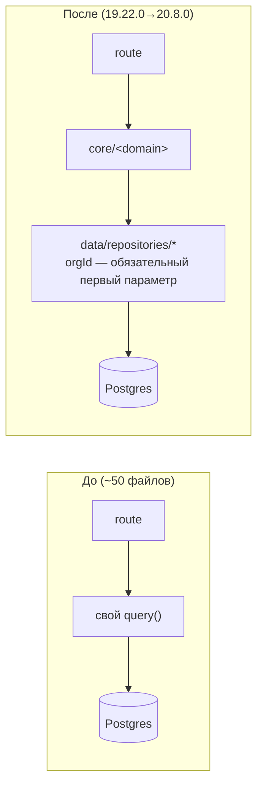

# 001 — Repository pattern для доступа к БД

**Статус**: принято, реализовано (19.22.0 пилот на Stores → 20.8.0 весь backend).

## Контекст

Изначально каждый роут/сервис писал свой `query()`/`pool.query()` напрямую.
Org-scoping (проверка, что читаемая/изменяемая строка принадлежит сети
вызывающего) был дисциплиной — «не забыть добавить `WHERE org_id = $1`» —
а не структурной гарантией. Раскиданный по ~50 файлам SQL усложнял и поиск
всех мест, где читается конкретная таблица, и последовательное применение
одного и того же паттерна конкурентности (upsert vs delete+insert).

## Решение

Единый слой `src/data/repositories/*.ts`, один файл на таблицу/домен.
Правило: `route → service → repository → PostgreSQL`, никогда
`route → SQL`. Каждая функция репозитория над org-scoped таблицей берёт
`orgId` первым обязательным (не optional) параметром — вызвать её без
явного `orgId` физически нельзя, это не проверка внутри тела функции.
CI-скрипт `scripts/check-no-direct-sql.mjs` — allowlist файлов, обязанных
не импортировать `query`/`pool` напрямую, растёт ratchet'ом по мере
переноса; откат уже переехавшего файла на сырой SQL — красный CI.

## Альтернативы

| Вариант | Вердикт | Почему |
|---|:---:|---|
| ORM (Prisma/Drizzle) | ❌ отклонено | Проект уже на raw SQL с тонкой ручной настройкой (составные индексы, `ON CONFLICT` upsert'ы, batched aggregation) — миграция означала бы переписать весь SQL-слой, не просто переставить границы |
| Статус-кво + код-ревью | ❌ отклонено | Ровно та дисциплина, что уже приводила к пропущенным org-scope проверкам (см. README §21, аудит контроля доступа 19.11.0) |
| Единый repository-слой, `orgId` обязателен | ✅ принято | Структурная гарантия вместо дисциплины — физически нельзя вызвать без `orgId` |

## Последствия

- Пилот на одной сущности (Stores, 19.22.0) перед полным переносом —
  подтвердил паттерн (`orgId`-first, injectable query-функция для
  транзакций) на малом риске до масштабирования на весь backend.
- Full DAL (20.8.0) — 31 репозиторий, 56 файлов под CI-ratchet'ом.
- Побочный эффект: несколько реальных багов найдены по ходу переноса, не
  специально искались (напр. `alert_date`-регрессия в 20.8.0, поймана
  существующим тестом на дедупликацию).

## Связанные документы

- [SECURITY.md — Data Access Layer](../SECURITY.md#5-data-access-layer)
- [ARCHITECTURE.md](../ARCHITECTURE.md) — где физически лежит `data/repositories/`
