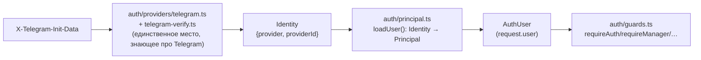

# 005 — Authentication Boundary (Identity/Principal изолированы от Telegram)

**Статус**: принято, реализовано (20.9.0). Второй provider подключён в
20.35; schema-level identity abstraction (`identities`) добавлена в
20.48.0 — см. оба «Обновление» в конце документа.

## Контекст

Владелец продукта заложил в дорожную карту 20.8–20.20 пункт «Identity
Abstraction» — подготовить Core к тому, что Telegram может перестать быть
единственным способом входа (Web/Mobile/SSO в будущем). Изначальная
формулировка была шире, чем то, что реально стоило делать сейчас.

## Решение

Владелец продукта сам сузил объём до кодовой границы, без изменения
схемы БД:

- `src/auth/identity.ts` — provider-agnostic `Identity` (`{provider,
  providerId}`).
- `src/auth/providers/telegram.ts` + `telegram-verify.ts` — вся
  Telegram-специфика (initData/HMAC/заголовки), единственное место,
  которое про неё знает.
- `src/auth/principal.ts` — `Identity → Principal/AuthUser`,
  диспетчеризация по `provider` (сегодня только `'telegram'`, но реальный
  `switch`, не одна ветка с предположением).
- `src/auth/guards.ts` (бывший `middleware-auth.ts`) — тонкая Fastify-
  обвязка поверх этой границы, ре-экспортирует прежние имена (`Role`,
  `AuthUser`, `ROLE_LEVEL`, `canAssignRole`, `loadUser`) без изменений —
  ни один из ~30 роут-файлов, использующих их, не пришлось трогать.

## Альтернативы

| Вариант | Вердикт | Почему |
|---|:---:|---|
| Полная модель `Identity → User → Employee` с таблицей `identities` (исходная формулировка) | ⏸ отложено | Без реального второго provider (Web/Mobile/SSO) миграция схемы под гипотетическую мультипровайдерность — преждевременная сложность. Будет сделана, когда появится конкретный второй provider |
| Оставить `AuthUser`/`Principal` как есть, просто переименовать файл | ❌ отклонено | Не создаёт реальный архитектурный шов, только перекладывает то же самое в другое место |
| Кодовая граница `Identity → Principal` без изменений схемы | ✅ принято | Закрывает реальную задачу (изоляция Telegram-специфики) без преждевременной инфраструктуры |

## Последствия

- Найден и исправлен баг ещё до пуша: первая версия положила `identity`
  прямо в тип `Principal` — оно тут же протекло в тело ответа `GET
  /access/status` (роут отдаёт `request.user` как есть). Исправлено —
  `Identity` остался параметром только у `loadUser()`, никогда частью
  возвращаемого `Principal`.
- Тесты (`tests/unit/auth-boundary.test.ts`) фиксируют саму границу:
  авторизационные примитивы физически не принимают `Identity` в
  сигнатуре; `loadUser()` с гипотетическим будущим provider отдаёт
  безопасный guest, не пытаясь трактовать его как Telegram.

## Обновление (20.35) — второй provider стал конкретным

Причина: Telegram в стране бизнеса доступен только через VPN (риск
доступности для любого сотрудника, не только сценарий "неудобно с
ноутбука"), плюс реальные сотрудники без Telegram вообще.

`Identity.provider` расширен до `'telegram' | 'phone'`
(`src/auth/identity.ts`), `src/auth/providers/phone.ts` — второй адаптер,
зеркало `providers/telegram.ts`, но источник identity — cookie-сессия
(`data/repositories/sessions.ts`), не подписанный initData.
`principal.ts::loadUser()` получил реальный `if` по `identity.provider`
(предсказанный в тексте ADR выше — «диспетчеризация по provider»).
`guards.ts` не изменился ни в одной сигнатуре гварда — только точка
резолва identity в `resolveUser()` — граница сработала ровно так, как
задумывалась.

Полная модель `Identity → User → Employee` с таблицей `identities`
(строка "Альтернативы" выше) снова осознанно НЕ выбрана — `phone`+
`password_hash` легли на `employees` рядом с `telegram_id`, симметрично, а
не в отдельную таблицу: одного дополнительного provider'а недостаточно,
чтобы порог "мультипровайдерность больше не гипотетическая" был пройден
для полной схемы, только для кодовой границы.

## Обновление (20.48.0) — порог пройден

Полная модель `Identity → User → Employee` с таблицей `identities`
(строка "Альтернативы" выше) — до этой версии дважды сознательно
отложена с обоснованием «один provider не оправдывает схему». Владелец
продукта явно решил: providers сегодня технически два (`telegram`/
`phone`), но КАНАЛОВ использования стало три — Telegram Mini App,
телефон-браузер, standalone iPhone Web App/PWA (20.47.0) — и это
реальный, не гипотетический порог.

Новая таблица `identities` (`employee_id, provider, provider_key`,
`UNIQUE(provider,provider_key)` + `UNIQUE(employee_id,provider)`) —
единственный источник правды для `auth/principal.ts::loadUser()`.
`employees.telegram_id`/`phone`/`password_hash` остаются нетронутыми —
используются вне auth-boundary (бот-уведомления, отображение в Команде);
`identities` не заменяет их, а становится resolution-слоем поверх.

Принцип, сформулированный и утверждённый владельцем продукта в процессе
ревью плана, зафиксирован дословно как проектный инвариант:

> Identity ownership transfer preserves existing domain semantics.
> Identity uniqueness prevents duplication, while atomic conflict
> resolution performs ownership transfer within the same transaction as
> synchronization of legacy employee identity fields.

Конкретно это означает разную семантику конфликта по provider —
**Telegram** (ownership transfer/steal разрешён, уже протестированный
self-bind recovery-flow) vs **Phone** (transfer НЕ разрешён, конфликт —
явный `409`; телефон — credential boundary, не recovery-механизм) — и
что `employees`-колонка и `identities`-строка для одного provider
обновляются только внутри ОДНОЙ транзакции, одной функцией
(`claimTelegramId()` — единственная точка изменения Telegram identity),
никогда по отдельности из разных мест кода. Подробности реализации,
включая найденный и исправленный при этом переходе пред-существующий
баг гонки в `claimTelegramId()`'s CTE — [SECURITY.md —
аутентификация](../SECURITY.md#2-аутентификация).

## Связанные документы

- [SECURITY.md — аутентификация](../SECURITY.md#2-аутентификация)
