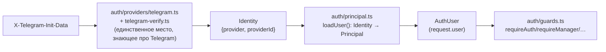

# 005 — Authentication Boundary (Identity/Principal изолированы от Telegram)

**Статус**: принято, реализовано (20.9.0).

## Контекст

Владелец продукта заложил в дорожную карту 20.8–20.20 пункт «Identity
Abstraction» — подготовить Core к тому, что Telegram может перестать быть
единственным способом входа (Web/Mobile/SSO в будущем). Изначальная
формулировка была шире, чем то, что реально стоило делать сейчас.

## Решение

Владелец продукта сам сузил объём до кодовой границы, без изменения
схемы БД:

- `src/auth/identity.ts` — provider-agnostic `Identity` (`{provider,
  providerId}`).
- `src/auth/providers/telegram.ts` + `telegram-verify.ts` — вся
  Telegram-специфика (initData/HMAC/заголовки), единственное место,
  которое про неё знает.
- `src/auth/principal.ts` — `Identity → Principal/AuthUser`,
  диспетчеризация по `provider` (сегодня только `'telegram'`, но реальный
  `switch`, не одна ветка с предположением).
- `src/auth/guards.ts` (бывший `middleware-auth.ts`) — тонкая Fastify-
  обвязка поверх этой границы, ре-экспортирует прежние имена (`Role`,
  `AuthUser`, `ROLE_LEVEL`, `canAssignRole`, `loadUser`) без изменений —
  ни один из ~30 роут-файлов, использующих их, не пришлось трогать.

## Альтернативы

| Вариант | Вердикт | Почему |
|---|:---:|---|
| Полная модель `Identity → User → Employee` с таблицей `identities` (исходная формулировка) | ⏸ отложено | Без реального второго provider (Web/Mobile/SSO) миграция схемы под гипотетическую мультипровайдерность — преждевременная сложность. Будет сделана, когда появится конкретный второй provider |
| Оставить `AuthUser`/`Principal` как есть, просто переименовать файл | ❌ отклонено | Не создаёт реальный архитектурный шов, только перекладывает то же самое в другое место |
| Кодовая граница `Identity → Principal` без изменений схемы | ✅ принято | Закрывает реальную задачу (изоляция Telegram-специфики) без преждевременной инфраструктуры |

## Последствия

- Найден и исправлен баг ещё до пуша: первая версия положила `identity`
  прямо в тип `Principal` — оно тут же протекло в тело ответа `GET
  /access/status` (роут отдаёт `request.user` как есть). Исправлено —
  `Identity` остался параметром только у `loadUser()`, никогда частью
  возвращаемого `Principal`.
- Тесты (`tests/unit/auth-boundary.test.ts`) фиксируют саму границу:
  авторизационные примитивы физически не принимают `Identity` в
  сигнатуре; `loadUser()` с гипотетическим будущим provider отдаёт
  безопасный guest, не пытаясь трактовать его как Telegram.

## Связанные документы

- [SECURITY.md — аутентификация](../SECURITY.md#2-аутентификация)
