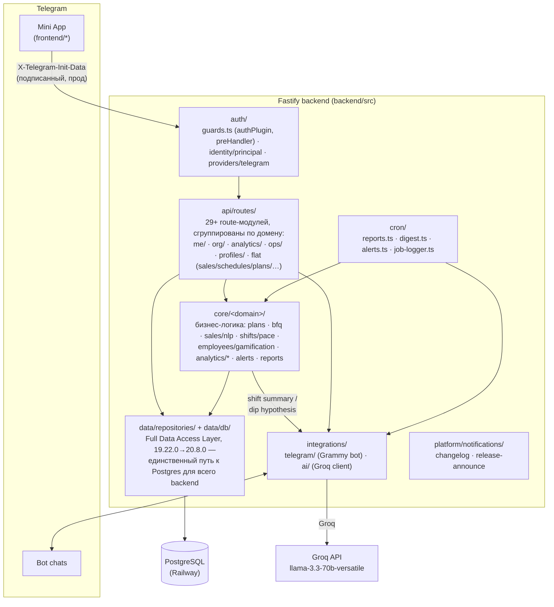

# Архитектура

> Извлечено из README §4/§5 при репо-реструктуризации (20.11.0). Живой
> справочник структуры — обновляется вместе с кодом; README §5 держит
> только короткую ссылку сюда.

## Быстрые факты

| | |
|---|---|
| **Backend** | Fastify + TypeScript, Node 22, layered (`api/` → `core/` → `data/`) |
| **БД** | PostgreSQL (Railway), схема только через `backend/migrations/` |
| **Frontend** | Полностью typed, Vite/iife (`frontend/src/`) — `frontend/js/` classic-script мир закрыт (21.x) |
| **Бот** | Grammy, long-polling, 1 реплика (см. [ADR/002](./ADR/002-supervisor-scope-cache-in-memory.md)) |
| **AI** | Groq (`llama-3.3-70b-versatile`), холодный путь — не в hot path запросов |
| **Хостинг** | Railway, `backend/` — Root Directory, миграции накатываются сами при старте |
| **Auth** | Telegram `initData`, HMAC на сервере — подробно в [SECURITY.md](./SECURITY.md) |

## Диаграмма



Клиент **не** ходит в БД напрямую — только через API. «Сегодня» всегда
через `todayMoscow()` (`Europe/Moscow`), не UTC контейнера. AI Copilot
(`integrations/ai/client.ts`) не в горячем пути запросов — вызывается
только при закрытии смены, в cron итоговых отчётов и при открытии
страницы «Прогноз» (кэшируется на день), no-op без `GROQ_API_KEY`. Рендер
SVG→PNG-картинок (отчёты, карточка анонса версии) — в отдельном пуле
`worker_threads` (`core/reports/svg-pool.ts` + `workers/svg-render.worker.ts`),
не блокирует основной event loop.

## Структура репозитория

```text
tele2-app/
├── README.md
├── CHANGELOG.md               (полная построчная история версий — README держит только последние)
├── CONTRIBUTING.md
├── docs/                      (этот файл + API.md/DEVELOPMENT.md/SECURITY.md/FEATURES.md/ADR/archive/…)
├── sql/                       (исторические ручные SQL-снимки, не источник схемы — см. sql/README.md)
└── backend/                  ← Root Directory на Railway
    ├── package.json
    ├── tsconfig.json
    ├── railway.json
    ├── migrations/               (пронумерованные .sql, применяются сами при старте — см. docs/DEVELOPMENT.md)
    ├── assets/fonts/             (DejaVu Sans — рендер SVG-отчётов; Google Sans TTF — та же resvg-карточка анонса)
    ├── tests/
    │   ├── setup.ts              (жёсткая проверка: DATABASE_URL только localhost/127.0.0.1)
    │   ├── helpers/               (app.ts → buildApp()+inject(), fixtures.ts → TestFixtures)
    │   ├── unit/                  (чистые функции: forecast-модель, job-logger, caption-builder…)
    │   ├── isolation/             (auth/multi-tenant регресс — org-scoping, race conditions, идемпотентность)
    │   └── adversarial/           (security-регресс: auth bypass, unauth disclosure, cross-tenant IDOR, identity spoofing)
    ├── src/
    │   ├── index.ts                     (bootstrap: миграции → buildApp() → listen → бот/крон — единственное место с side effects)
    │   ├── app.ts                       (Fastify instance: cors/helmet/rate-limit/static, регистрирует api/routes/index.ts)
    │   ├── env.ts                       (dotenv, импортируется первым — гарантирует порядок)
    │   ├── migrate-cli.ts               (CLI-обёртка над data/db/migrate.ts)
    │   │
    │   ├── auth/                        (20.9.0, Authentication Boundary — единственное место, знающее про Telegram)
    │   │   ├── identity.ts                (provider-agnostic Identity — {provider, providerId})
    │   │   ├── principal.ts               (Identity → Principal/AuthUser, диспетчеризация по provider)
    │   │   ├── guards.ts                  (authPlugin, requireAuth/requireActive/requireManager/…, org-scope декораторы — бывший middleware-auth.ts)
    │   │   └── providers/
    │   │       ├── telegram.ts              (resolveTelegramIdentity — заголовки/initData → Identity)
    │   │       └── telegram-verify.ts        (HMAC-проверка initData)
    │   │
    │   ├── api/routes/                  (HTTP-слой — тонкие обработчики, вся логика делегирована в core/)
    │   │   ├── index.ts                   (регистрация всех модулей — единая точка, дергается из app.ts)
    │   │   ├── sales.ts · schedules.ts · plans.ts · cash.ts · bfq.ts ·
    │   │   │   promos.ts · metrics.ts · audit.ts · shifts.ts       (плоские домены без вложенной группировки)
    │   │   ├── me/           (index.ts — identity/bind/day; avatar.ts)
    │   │   ├── org/           (employees.ts · stores.ts · access.ts — заявки/секторы · branding.ts — сети/пикер точек)
    │   │   ├── analytics/     (stats · forecast · insights · live · what-if · heatmap · command-center · supervisor)
    │   │   ├── ops/            (tasks · support · comms · reports · export · alerts)
    │   │   └── profiles/       (store.ts · employee.ts — Store/Employee Intelligence, Health Score)
    │   │
    │   ├── core/<domain>/                (бизнес-логика — из бывшего services/, теперь сгруппирована по домену)
    │   │   ├── sales/nlp.ts · shifts/pace.ts · plans/service.ts · bfq/service.ts
    │   │   ├── alerts/service.ts · employees/gamification.ts
    │   │   ├── analytics/     (forecast · anomaly · insights · heatmap · live-map · supervisor · network-digest · what-if)
    │   │   ├── reports/       (image.ts — SVG/PNG-рендер; svg-pool.ts — worker-пул)
    │   │   └── shared/        (tenant.ts — брендинг/сети; scope-cache.ts — Supervisor Scope Cache; metrics-catalog.ts)
    │   │
    │   ├── data/                         (Full Data Access Layer, 19.22.0→20.8.0 — единственное место с прямым SQL)
    │   │   ├── repositories/               (31 файл, по одному на таблицу/домен; orgId обязательным первым параметром
    │   │   │                                у tenant-функций; CI check:no-direct-sql запрещает откат на 56 файлах)
    │   │   └── db/                          (index.ts — пул + query() + withTransaction(); migrate.ts — раннер миграций)
    │   │
    │   ├── platform/notifications/       (changelog.ts — версии для автоанонса; release-announce.ts — CAS-защищённая отправка)
    │   ├── integrations/
    │   │   ├── telegram/                  (bot.ts — Grammy-инстанс, notifyChat/notifyAdmin; messages.ts — шаблоны сообщений)
    │   │   └── ai/client.ts               (Groq — AI Copilot)
    │   ├── cron/                         (alerts.ts · digest.ts · reports.ts · job-logger.ts — структурные pino-логи задач)
    │   ├── workers/svg-render.worker.ts  (resvg SVG→PNG в отдельном потоке)
    │   ├── shared/                       (api-types.ts — контракт бэк↔фронт; errors.ts — serverError(), бывший utils/http-errors.ts)
    │   └── utils/date.ts                 (todayMoscow() и другие МСК-хелперы)
    │
    └── frontend/
        ├── index.html    (разметка + подключение styles.css и dist/*.bundle.js по порядку)
        ├── styles.css
        ├── fonts/        (Google Sans WOFF2 — фронтовый шрифт, отдельно от assets/fonts/ TTF для resvg)
        ├── src/          (весь frontend — Vite, каждый файл собирается в свой iife-бандл, см. ADR/006)
        │   ├── api-client.ts         (typed API-клиент — единственная точка сетевых вызовов)
        │   ├── app/core.ts            (сессия/роли/каталог метрик/gesture-физика — бывший 01-core.js;
        │   │                           владеет window.me/stores/employees/saleSelection/METRICS/...)
        │   ├── app/nav.ts             (toast/тема/switchPage()+loadPage()-диспетчер/swipe — бывший
        │   │                           02-nav-utils.js; грузится сразу после core.ts, тоже первым)
        │   ├── app/router.ts          (registerPage/renderPage — typed-реестр страниц, НЕ URL/hash-based)
        │   ├── app/state.ts           (getSession() — читает window.me, не дублирует источник правды)
        │   ├── pages/            (router.ts-страницы и все остальные: reports/, alerts/,
        │   │                       employee-profile/, store-profile/, tasks/, cash-metrics/,
        │   │                       command-center/, support/, team/, home/, plans-bfq/, schedule/,
        │   │                       my-plan/, shift/, network-admin/, access-supervisor/)
        │   ├── features/         (НЕ router.ts-страницы — send-network-digest/, promos/, add-sale/, tutorial/)
        │   └── shared/legacy-globals.d.ts     (ambient-типы для общих глобалов — me, canManage(), toast() и т.д.)
        └── offline-queue.js
```

**Frontend — один typed-мир** (переезд занял 20.12.0 → 21.x, закрыт
полностью): все 21 экран — настоящие ES-модули, типизированные, собираются
Vite'ом, каждая страница/фича — свой независимый `vite build` (Rollup iife
требует ровно один global namespace на сборку, см. `vite.*.config.ts` в
`frontend/`, склеены в `build:frontend`). `frontend/js/*.js` classic-script
мир, где всё это раньше жило одной общей non-module `<script>`-областью
(порядок подключения важен, `smoke-frontend.mjs` до сих пор это
проверяет — уже для бандлов, не файлов), закрыт последним: `app/core.ts`/
`app/nav.ts` — сегодня формально такие же typed-модули, как и все
остальные, просто грузятся первыми и **владеют** общим состоянием
(`window.me`, `stores`, `employees`, `saleSelection`, `scheduleMonth`,
`planMonth`, `adminViewOrgId`, `METRICS`, `page`), а не просто читают его,
как остальные 19.

Мост между модулями — тот же, что был мостом «typed↔легаси» до 21.x, и не
изменился при закрытии последних двух файлов: `legacy-globals.d.ts`
(модуль читает чужой глобал напрямую, не копирует его логику) и паттерн
`window.<имя> = () => renderPage(name)` (для router.ts-страниц) или
`window.<имя> = <настоящая функция>` (для всего остального) — конвенция
«имя моста подбирается под то, что диспетчер уже зовёт» сохранена и после
того, как сам диспетчер (`app/nav.ts`'s `loadPage()`) стал typed-кодом:
`employee-profile`/`store-profile` диспетчер по-прежнему вызывает
`renderEmployeeProfile()`/`renderStoreProfile()` без `load`-префикса —
переписывать саму конвенцию ради единообразия не стали, раз бага в этом
никакого нет. Для НЕ-страниц (`features/promos/` — модалка, не подключена
к `switchPage()`) на `window.*` подвешены ВСЕ экспортированные функции
разом — HTML зовёт их обратно через `onclick="..."` строки в
сгенерированной innerHTML.

Отдельный механизм — для общего МУТИРУЕМОГО состояния (`me`, `stores`,
`employees`, `saleSelection`, `scheduleMonth`, `planMonth`,
`adminViewOrgId`, `METRICS`, `page`), которое читают/пишут ГОЛЫМ
идентификатором (`me = x`, не `window.me = x`) полтора десятка модулей.
Работает благодаря ECMA-262 Global Environment Record: неквалифицированный
идентификатор резолвится через Declarative Record (что раньше давал
верхнеуровневый `let` classic-скрипта) И Object Record (настоящие
`window.*`-свойства) как единый lookup — так что `app/core.ts`, делая
`window.me = null`, даёт ровно ту же видимость для голого `me` в любом
другом бандле, что раньше давал `let me` в 01-core.js. Присвоение таким
голым идентификатором из другого модуля (`me = await getMe()` в
`src/pages/my-plan`) работает без ошибок даже в строгом режиме — строгий
режим запрещает только СОЗДАНИЕ нового implicit-глобала голым присвоением,
а не запись в уже существующий; `app/core.ts` гарантированно устанавливает
все эти свойства до того, как выполнится код любого другого бандла (он
первый в index.html). Эмпирически проверено — отдельным Node-репро
(`window.X = ...` в одной функции-замыкании, голое `X = y` в другой, без
общего `var`/`let`) и полным прогоном `smoke-frontend.mjs` на реальном
порядке подключения. **Важно**: сам `app/core.ts`/`app/nav.ts` НИКОГДА не
объявляет эти переменные как локальный `let` — только `window.me = ...`,
иначе локальное объявление затенило бы глобал в пределах СОБСТВЕННОГО
бандла и сделало бы его невидимым для всех остальных.

**Критерий «файл мигрирован»**: у него есть модуль в `frontend/src/pages/`
или `features/`, он собирается в свой `dist/{pages,features,app}/*.bundle.js`,
и соответствующий файл в бывшем `frontend/js/` удалён (не просто
продублирован) — сегодня это все 21: `19-reports.js` → `pages/reports/`,
`12-promos.js` → `features/promos/`, `17-alerts.js` → `pages/alerts/`,
`18-employee-profile.js` → `pages/employee-profile/`,
`16-store-profile.js` → `pages/store-profile/`, `15-tasks.js` →
`pages/tasks/` (первая волна, 20.x, по файлу за версию); затем 13 файлов
одним батчем (21.x): `09-cash-metrics.js` → `pages/cash-metrics/`,
`14-command-center.js` → `pages/command-center/`, `06c-support-tickets.js`
→ `pages/support/`, `07-add-sale.js` → `features/add-sale/`,
`06-team-bfq.js` → `pages/team/`, `03-home.js` → `pages/home/`,
`06b-plans-bfq.js` → `pages/plans-bfq/`, `04-schedule.js` →
`pages/schedule/`, `05-my-plan.js` → `pages/my-plan/`, `11-v13.js` →
`pages/shift/`, `13-v14.js` → `pages/network-admin/`, `10-tutorial.js` →
`features/tutorial/`, `08-access-supervisor.js` → `pages/access-supervisor/`;
и наконец `01-core.js`/`02-nav-utils.js` → `app/core.ts`/`app/nav.ts`
(последний, отдельный заход — не часть батча, требовал перевернуть
направление владения общим состоянием, см. выше). `frontend/js/` как
директория больше не существует. Мигрированные модули могут зависеть друг
от друга тем же `onclick="..."`-строковым способом, что и раньше —
`pages/alerts/`/`pages/store-profile/` зовут `openTaskDetail(...)`,
которую реализует `pages/tasks/`; раз это только текст внутри строки, а не
настоящая TS-ссылка, порядок миграции между такими файлами не имел
значения для типов — `tsc` увидел бы ошибку только при обращении к
идентификатору напрямую, чего в шаблонных строках нет. Часть
ambient-глобалов в `legacy-globals.d.ts` писабельные (`let`, не
`const`/`function`) именно по этой причине — `me`, `adminViewOrgId`,
`historyEmployeeFilter`, `stores`, `saleSelection`, `employees`,
`scheduleMonth`, `planMonth`, `METRICS`, `page` — их реальные владельцы
сами typed-код и пишут в них по-настоящему, а не только читают.

**Правило зависимости слоёв**: `api → core → data`, только в одну
сторону. `api/routes/*` может импортировать `core/` и `data/`; `core/*`
может импортировать `data/`, но не `api/` (и на деле не импортирует —
проверено); `data/repositories/*` в норме не должен импортировать из
`core/`/`api/` — репозиторий не должен знать, кто его вызывает. Правило
сегодня нарушено в 2 местах (не гипотетически, а по факту грепа):
`data/repositories/sales.ts` и `supervisor-analytics.ts` тянут функцию/тип
из `core/analytics/*` — известный, не скрытый долг, не фиксился отдельным
заходом ради самого правила, чинить заодно с содержательной правкой этих
файлов, не отдельным рефакторинговым PR.

**Правило регистрации роутов**: каждый модуль в `api/routes/` отвечает за
свой домен; добавление нового — новый файл + строка в
`api/routes/index.ts`'s `routeModules`, ничего в `app.ts` трогать не надо
(`app.ts` вызывает единственную функцию `registerAllRoutes()`).

**Правило доступа к БД**: только через `data/repositories/*` — ни один
файл вне `data/` не должен импортировать `query`/`pool` из
`data/db/index.js` напрямую (кроме `withTransaction()`, это оркестрация,
не сам SQL). `npm run check:no-direct-sql` — CI-ratchet, растёт по мере
переноса следующих файлов, не позволяет откат.

## Связанные документы

- [SECURITY.md](./SECURITY.md) — слои защиты поверх этой структуры (RBAC,
  Data Access Layer, аудит).
- [API.md](./API.md) — таблица эндпоинтов по модулям `api/routes/`.
- [DEVELOPMENT.md](./DEVELOPMENT.md) — как запустить и проверить локально.
- [ADR/](./ADR/) — почему структура именно такая, не другая.
