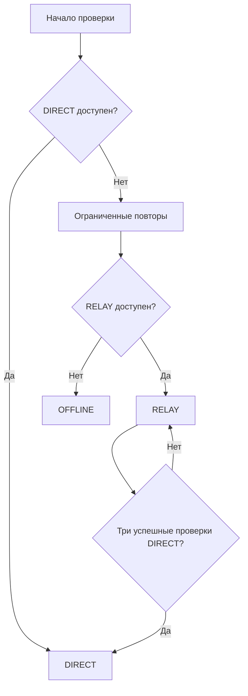

# Сетевой слой приложения Windows

[Документация](README.md) · [Обзор проекта](../README.md)

Руководство описывает выбор соединения, диагностику и передачу запросов через T2 Edge Relay. Обоснование архитектуры — в [ADR о сетевом транспорте](ADR/desktop-network-transport.md).

**Содержание**

- [Режимы и фактическое состояние](#режимы-и-фактическое-состояние)
- [Откуда берётся адрес relay](#откуда-берётся-адрес-relay)
- [Автоматическое переключение](#автоматическое-переключение)
- [Диагностика по уровням](#диагностика-по-уровням)
- [Как передаётся запрос в RELAY](#как-передаётся-запрос-в-relay)
- [Что показывает диагностическая панель](#что-показывает-диагностическая-панель)
- [Проверка на реальном устройстве](#проверка-на-реальном-устройстве)
- [Временно изменить подключение](#временно-изменить-подключение)
- [Откат и влияние на Windows](#откат-и-влияние-на-windows)

## Режимы и фактическое состояние

Предпочтение пользователя и текущее состояние — разные значения.

| Предпочтение | Поведение |
|---|---|
| `auto` | Сначала проверить DIRECT; при подтверждённой неудаче попробовать RELAY |
| `direct_only` | Проверить только DIRECT; при неудаче показать `offline` |
| `relay` | Проверить relay и использовать его принудительно; при неудаче показать `offline` |

Фактическое состояние описано в `desktop/src/main/network/types.ts`: `direct`, `relay`, `windows_compat`, `offline`, `checking`. Значение `windows_compat` предусмотрено контрактом, но низкоуровневый адаптер не реализован.

## Откуда берётся адрес relay

Единственный источник настройки — `loadDesktopConfig()` в `desktop/src/main/config.ts`. Значение выбирается при запуске процесса.

| Приоритет | Условие | Результат |
|---:|---|---|
| 1 | Указана непустая `T2_RELAY_URL` | Используется явно заданный адрес |
| 2 | Адрес не задан, `app.isPackaged === true` | `DEFAULT_PRODUCTION_RELAY_URL`: `https://relay.vincere-mortem.ru` |
| 3 | Адрес не задан, приложение не упаковано | `relayUrl: ''`; relay не настроен |

Допускается HTTPS. Исключение для разработки — `http://localhost` и `http://127.0.0.1`. Оно не предназначено для удалённого сервера.

Для установленного приложения дополнительный BAT-файл с адресом relay обычно не нужен. Для испытаний другого окружения явная переменная остаётся доступной. Пустое значение `T2_RELAY_URL` **не является надёжным способом отключения**: упакованная сборка перейдёт к адресу по умолчанию. Чтобы запретить relay, используйте `T2_NETWORK_MODE=direct_only`.

## Автоматическое переключение



Значения по умолчанию находятся в `DEFAULT_STATE_MACHINE_CONFIG`:

- до трёх проверок для подтверждения недоступности прямого соединения;
- пауза между повторными проверками — 1,5 секунды;
- фоновая проверка DIRECT в автоматическом RELAY — каждые 30 секунд;
- возврат к DIRECT — после трёх последовательных успешных проверок.

Несколько подтверждений защищают от постоянных переключений при нестабильном соединении. Результат устаревшей асинхронной проверки не должен менять новое поколение настроек.

В принудительном `relay` фоновый возврат к DIRECT не выполняется. В `direct_only` обращения к relay не выполняются независимо от результата DIRECT.

## Диагностика по уровням

Проверки проходят последовательно: **DNS → TCP → TLS → HTTP**. После первой ошибки следующий уровень не выдаётся за успешно проверенный. Для HTTP используется `/healthz` основного сервера.

| Результат | Что означает |
|---|---|
| `OK` | Проверка уровня завершилась успешно |
| `DNS_FAILURE` | Не удалось разрешить имя |
| `TCP_FAILURE` | Не удалось установить TCP-соединение |
| `TLS_FAILURE` | Не удалось установить проверенное TLS-соединение |
| `HTTP_FAILURE` | HTTP-проверка не дала ожидаемый результат |
| `TIMEOUT` | Превышено время ожидания |
| `OFFLINE` | Подключение недоступно |
| `UNKNOWN` | Причину нельзя достоверно классифицировать |

Диагностика не делает недоказанных выводов вроде «обнаружен DPI». Сообщение «прямое соединение недоступно» описывает наблюдение, а не предполагаемую причину.

## Как передаётся запрос в RELAY

1. Окно использует отдельную сохраняемую сессию `persist:t2-sales`.
2. В этой сессии регистрируется `session.protocol.handle('https', handler)`.
3. Для исходного origin приложения метод, путь и необходимые метаданные передаются в заголовках запроса `POST /forward`; тело передаётся исходными байтами.
4. Relay направляет запрос единственному `RELAY_UPSTREAM_ORIGIN`.
5. Статус, заголовки и тело ответа возвращаются в Electron без JSON/base64-обёртки.
6. Запросы к другим origin проходят через `session.fetch(request, { bypassCustomProtocolHandlers: true })`, чтобы не зайти повторно в тот же обработчик.

Адрес страницы не подменяется адресом relay. Несколько заголовков `Set-Cookie` сохраняются отдельными значениями. Бинарные загрузки и multipart не преобразуются в текст.

Сервис `relay/` обслуживает HTTP-передачу запросов. Поддержка REST сама по себе не означает поддержку WebSocket upgrade. Для чата предусмотрена сверка через HTTP; подробности — в [описании чата](CHAT.md).

## Что показывает диагностическая панель

Панель добавляется предзагрузочным скриптом и показывает:

- фактическое соединение и предпочтение пользователя;
- результаты DNS, TCP, TLS и HTTP;
- состояние relay: `not_configured`, `checking`, `reachable`, `unreachable`;
- только имя хоста relay, без пути и query-параметров;
- время последнего обновления.

Панель получает ограниченные `NetworkStatus` / `DiagnosticsReport`: категории исходов, длительности, время и имя хоста. Cookies, токены, содержимое запросов и трассировки ошибок в этот контракт не входят.

## Проверка на реальном устройстве

В прежней документации зафиксирован успешный сценарий на Windows без VPN: DNS основного хоста работал, DIRECT завершался тайм-аутом TCP, автоматически включался RELAY, загружались вход и авторизованная главная страница. Это историческое свидетельство конкретного испытания, а не свежая проверка этого архива или всех сетей.

Для приёмки текущей сборки пройти [полный ручной сценарий](DESKTOP-TESTING.md): вход, MFA, чтение и изменение данных, выход, обновление страницы, перезапуск, WebAuthn и CSV. Загрузки одной страницы недостаточно.

## Временно изменить подключение

Примеры для PowerShell, перед запуском приложения:

```powershell
$env:T2_NETWORK_MODE = 'direct_only'
```

```powershell
$env:T2_RELAY_URL = 'https://staging-relay.example.com'
$env:T2_NETWORK_MODE = 'relay'
```

Настройки читаются при запуске; пересборка не нужна. Для возврата к обычному режиму удалите переопределения и перезапустите приложение.

## Откат и влияние на Windows

DIRECT и RELAY не изменяют системный proxy, WinHTTP, DNS, hosts, маршруты, firewall и настройки других программ. RELAY работает внутри процесса, без локального слушающего порта. Низкоуровневой службы WINDOWS_COMPAT сейчас нет.

Для отключения резервного пути достаточно `direct_only`. Для удаления приложения используется штатный деинсталлятор NSIS. Данные пользовательского профиля и результаты конкретного удаления следует проверять отдельно: историческое сообщение об успешном удалении не заменяет проверку текущего установщика.
