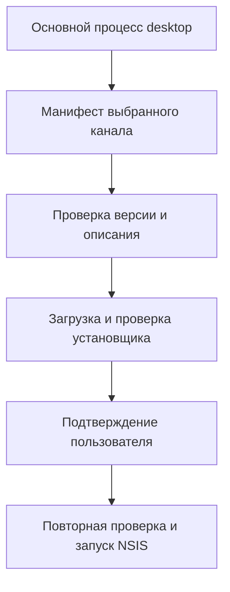

# Обновление приложения Windows

[Документация](README.md) · [Обзор проекта](../README.md)

Механизм обновления получает манифест с отдельного HTTPS-сервера, проверяет установщик и запускает его только после явного действия пользователя. Сетевой маршрут приложения и доставка обновлений независимы.

**Содержание**

- [Архитектура и ответственность](#архитектура-и-ответственность)
- [Каналы и конфигурация](#каналы-и-конфигурация)
- [Формат манифеста](#формат-манифеста)
- [Когда клиент проверяет обновления](#когда-клиент-проверяет-обновления)
- [Загрузка и контроль целостности](#загрузка-и-контроль-целостности)
- [Повторная проверка перед запуском](#повторная-проверка-перед-запуском)
- [Политика цифровой подписи](#политика-цифровой-подписи)
- [Пользовательское подтверждение и IPC](#пользовательское-подтверждение-и-ipc)
- [Размещение файлов](#размещение-файлов)
- [Подготовка и публикация](#подготовка-и-публикация)
- [Откат и диагностика](#откат-и-диагностика)

## Архитектура и ответственность



По умолчанию установленный клиент обращается к `https://updates.vincere-mortem.ru`. Узел обновлений отделён от origin приложения и relay: сбой доступа к Railway не должен лишать пользователя возможности получить исправление. Общий VPS при этом остаётся возможной общей точкой отказа.

Код находится в `desktop/src/main/updater/`:

| Файл | Назначение |
| --- | --- |
| `version.ts` | Числовое сравнение трёх частей версии |
| `manifest.ts` | Структура и строгая проверка манифеста |
| `fetch-manifest.ts` | Получение манифеста выбранного канала |
| `downloader.ts` | Потоковая загрузка, размер и SHA-256 |
| `signature.ts` | Проверка Authenticode и политика подписи |
| `install-launcher.ts` | Проверка имени и запуск установщика через `shell.openPath()` |
| `manager.ts` | Состояние и последовательность операций |

## Каналы и конфигурация

Поддерживаются `stable` и `beta`. Поле `channel` обязано совпадать с каналом запрошенного манифеста. Настройки читает `loadDesktopConfig()` из `desktop/src/main/config.ts` при запуске процесса.

| Приоритет | Источник | Результат |
| --- | --- | --- |
| 1 | Непустые `T2_UPDATE_BASE_URL`, `T2_UPDATE_CHANNEL` | Явная настройка окружения |
| 2 | Упакованная версия без переопределения | Стандартный HTTPS-узел, канал `stable` |
| 3 | Разработка и тесты без переопределения | Пустой адрес: проверки отключены |

`app.isPackaged` определяет установленную сборку; запуск режима разработки не равнозначен ей. Базовый адрес допускает HTTPS, а для локальной разработки — узкое исключение HTTP на `localhost` или `127.0.0.1`. URL установщика по контракту манифеста всё равно должен быть HTTPS.

Пример переопределения в PowerShell перед запуском тестового приложения:

```powershell
$env:T2_UPDATE_BASE_URL = "https://staging-updates.example.com"
$env:T2_UPDATE_CHANNEL = "beta"
```

## Формат манифеста

Ниже учебный пример структуры. Нулевой хеш и размер являются заполнителями, а не реквизитами настоящего релиза. Перед публикацией их формирует скрипт из реального установщика.

```json
{
  "schemaVersion": 1,
  "channel": "stable",
  "version": "20.56.7",
  "publishedAt": "2026-09-07T12:00:00Z",
  "mandatory": false,
  "installer": {
    "filename": "T2Sales-Setup-x64-20.56.7.exe",
    "url": "https://updates.vincere-mortem.ru/releases/T2Sales-Setup-x64-20.56.7.exe",
    "sha256": "0000000000000000000000000000000000000000000000000000000000000000",
    "size": 123456789
  },
  "releaseNotes": "Исправления и улучшения приложения.",
  "minSupportedVersion": "20.56.0"
}
```

| Поле | Правило |
| --- | --- |
| `schemaVersion` | Ровно `1` |
| `channel` | Совпадает с запрошенным каналом |
| `version` | Числовая версия `X.Y.Z`; сравнение не строковое |
| `publishedAt` | Корректная дата |
| `mandatory` | Булево значение; влияет на отметку важности |
| `installer.filename` | Допустимое имя `.exe`, без разделителей пути и `..` |
| `installer.url` | HTTPS, тот же origin, путь внутри `/releases/`, совпадающее имя файла |
| `installer.sha256` | 64 шестнадцатеричных символа |
| `installer.size` | Положительное целое число, максимум 500 МиБ |
| `releaseNotes` | Необязательный обычный текст, максимум 8000 символов |
| `minSupportedVersion` | Необязательная версия `X.Y.Z`, сейчас только справочная |

Для реального установщика используйте имя `T2Sales-Setup-x64-X.Y.Z.exe`: проверка запуска строже общей проверки имени в манифесте. Суффикс наподобие `-beta.1` не соответствует принятому формату версии; канал задаётся отдельно.

Неизвестные поля не становятся командами: возвращаемый валидатором объект не предоставляет полей исполняемой команды, аргументов или произвольного локального пути. Это не означает, что валидатор обязательно отклоняет любой неизвестный ключ — важно отсутствие его передачи в исполняемый контракт.

## Когда клиент проверяет обновления

Первая проверка выполняется примерно через 15 секунд после запуска, последующие — каждые 4 часа. Пользователь также может нажать «Проверить обновления». Получение манифеста ограничено 10 секундами, загрузка — 120 секундами.

При сетевом сбое состояние становится `error` с коротким очищенным сообщением. Проверка не блокирует вход и функции основного приложения. Следующая попытка — плановая или ручная, без непрерывного цикла запросов.

## Загрузка и контроль целостности

1. Клиент повторно проверяет URL относительно разрешённого origin.
2. Выполняет HTTPS-запрос с проверкой TLS; перенаправления автоматически не принимает.
3. Потоково записывает временный файл в `%LOCALAPPDATA%\T2 Sales\updates\<filename>.<random>.download`, параллельно вычисляя SHA-256.
4. Проверяет `Content-Length`, если он есть, и ограничивает фактическое число полученных байтов во время загрузки.
5. После завершения сверяет точный размер и SHA-256; сравнение хеша использует `crypto.timingSafeEqual`.
6. Только после успеха переименовывает временный файл в итоговое имя на том же томе. При несовпадении удаляет временный файл и выставляет ошибку.

Установщик не загружается целиком в оперативную память. При ошибке файл не переводится в состояние готового к установке.

## Повторная проверка перед запуском

Между загрузкой и нажатием кнопки может пройти произвольное время. Поэтому `installUpdate()` повторно проверяет размер, SHA-256 и Authenticode у файла на диске. При неуспехе установка отменяется и сохранённый путь очищается. Защита от повторного вызова предотвращает два параллельных запуска от двойного нажатия.

Повторная проверка уменьшает риск подмены за время ожидания, но сама по себе не доказывает отсутствие любого возможного локального состязания между проверкой и открытием файла. Скомпрометированная учётная запись ОС остаётся за границей этой гарантии.

## Политика цифровой подписи

SHA-256 обязателен при любой политике подписи. Authenticode проверяется через PowerShell; результат учитывается независимо от совпадения хеша.

| Результат | Текущая политика `warn` для `stable` и `beta` |
| --- | --- |
| Корректная подпись | Разрешить после остальных проверок |
| `NotSigned` | Показать предупреждение; допускается установка по решению пользователя |
| `HashMismatch`, `NotTrusted`, `Invalid`, `UnknownError` | Заблокировать установку |

Отсутствие подписи и испорченная подпись — разные состояния. `warn` допускает первое, но не второе. После появления сертификата целевой переход для стабильного канала — `AUTHENTICODE_POLICY.stable = 'required'`; это изменение реализации и процесса выпуска, а не уже действующее правило.

Механизм не отключает SmartScreen или Defender. Наличие правильного SHA-256 в полученном манифесте проверяет соответствие файла этому манифесту; доверие к самому узлу публикации также существенно.

## Пользовательское подтверждение и IPC

Страница получает четыре действия и одну подписку:

```ts
checkForUpdates(): Promise<void>
getUpdateStatus(): Promise<UpdateStatus>
downloadUpdate(): Promise<void>
installUpdate(): Promise<void>
onUpdateStatusChanged(cb): () => void
```

Четыре действия не принимают URL, путь или команду; подписка принимает обработчик. Выбор файла остаётся внутренним состоянием основного процесса. Механизм обновлений не использует прикладные cookie, CSRF-токены и данные авторизации для запросов к узлу обновлений.

Установка выполняется после явного нажатия «Установить сейчас», через `shell.openPath()` без аргументов тихой установки. После успешного запуска приложение планирует завершение примерно через 1,5 секунды. В коде `unref()` относится к таймеру завершения, а не к дескриптору дочернего установщика.

`mandatory: true` показывает отметку «ВАЖНОЕ ОБНОВЛЕНИЕ», но не включает принудительную установку. `minSupportedVersion` проверяется по формату, но сейчас не блокирует старые клиенты и не задаёт отдельного пользовательского предупреждения.

## Размещение файлов

| Путь на сервере | Содержимое |
| --- | --- |
| `/var/www/t2-updates/stable/manifest.json` | Манифест стабильного канала |
| `/var/www/t2-updates/beta/manifest.json` | Манифест тестового канала |
| `/var/www/t2-updates/releases/` | Неизменяемые установщики с версией в имени |

Пример Caddy:

```caddyfile
updates.vincere-mortem.ru {
    root * /var/www/t2-updates
    file_server
    header /*/manifest.json Content-Type "application/json"
    header /*/manifest.json Cache-Control "no-cache"
    header /releases/* Content-Type "application/octet-stream"
    header /releases/* Cache-Control "public, max-age=31536000, immutable"
}
```

Не включайте `browse` и публичную загрузку файлов. Длительное кеширование допустимо только для неизменяемых установщиков: новое содержимое публикуется под новым именем. Манифест должен быстро обновляться у клиентов. Конфигурация — пример для оператора, её изменение не выполняется автоматически.

## Подготовка и публикация

Из каталога `desktop`, после сборки:

```bash
npm run update:prepare -- --channel beta --installer release/T2Sales-Setup-x64-20.56.7.exe --notes "Исправления и улучшения приложения"
```

Дополнительно можно передать `--mandatory` и `--min-supported 20.56.0`. Скрипт вычисляет размер и хеш, извлекает версию из имени, создаёт `update-staging/<channel>/manifest.json` и копирует установщик в `update-staging/releases/`. Параметр `--version` не отменяет требования конечного запуска к стандартному имени установщика.

Подготовка локальная: скрипт не получает доступ к VPS, не хранит его секреты и не изменяет опубликованный манифест.

Публикация — отдельная согласованная операция оператора:

1. Скопируйте новый установщик в `releases/`, не перезаписывая старые версии.
2. Проверьте доступность по окончательному HTTPS-адресу, размер и хеш.
3. Загрузите манифест под временным именем и атомарно замените манифест выбранного канала.
4. Проверьте получение манифеста, загрузку и установку на тестовом клиенте Windows.
5. Для продвижения из `beta` в `stable` подготовьте манифест стабильного канала для того же проверенного установщика и опубликуйте его тем же способом.

При доступном сервере стабильные клиенты обнаружат выпуск на следующей успешной проверке либо вручную. Четырёхчасовой интервал не гарантирует доставку за четыре часа при выключенном приложении или недоступной сети.

## Откат и диагностика

Клиент автоматически принимает только более новую версию. Возврат манифеста к старой версии останавливает распространение проблемного выпуска среди ещё не обновившихся клиентов, но не понижает установленную версию. Основной путь восстановления — новый исправляющий `PATCH`. Храните несколько прошлых установщиков и не удаляйте файл во время возможной загрузки клиентами.

| Симптом | Что проверить |
| --- | --- |
| Новая версия не видна | Канал, числовую версию, кеш манифеста и доступность адреса |
| Манифест отклонён | Обязательные поля, совпадение канала и origin, формат версии |
| Загрузка завершается ошибкой | TLS, перенаправления, размер, SHA-256, тайм-аут |
| Установка запрещена | Результат повторной проверки, Authenticode, имя файла |
| В разработке нет проверок | Непустой `T2_UPDATE_BASE_URL`; это ожидаемое поведение без настройки |

> **Историческое подтверждение.** В материалах проекта записана успешная установка обновления `20.56.4 → 20.56.5` через реальную инфраструктуру. При переработке документации серверы и установщик текущей версии не проверялись.

Связанные руководства: [выпуск](DESKTOP-RELEASE.md), [тестирование](DESKTOP-TESTING.md), [границы доверия](DESKTOP-SECURITY.md).
