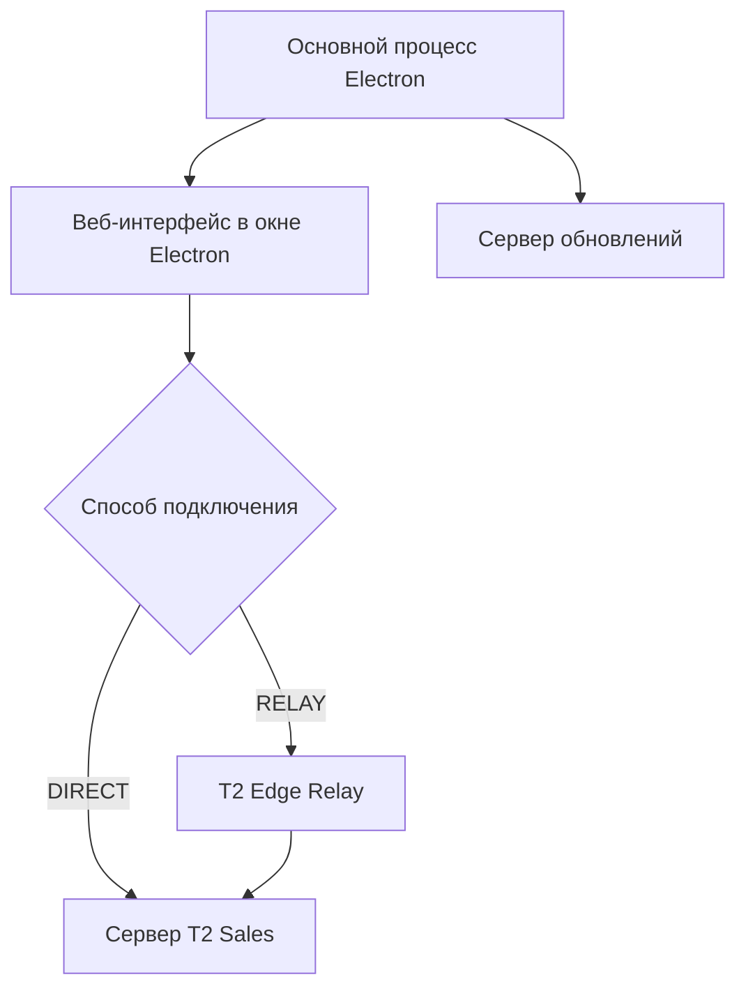

# Приложение T2 Sales для Windows

[Документация](README.md) · [Обзор проекта](../README.md)

T2 Sales Desktop — приложение на Electron, которое открывает существующий веб-интерфейс T2 Sales. Оно добавляет управление сетевым соединением, диагностику и установку обновлений. Отдельной копии бизнес-интерфейса внутри установщика нет: окно загружает страницу с основного адреса приложения.

| Компонент в этом архиве | Версия | Источник |
|---|---|---|
| Сервер и веб-интерфейс | `20.57.5` | `backend/package.json` |
| Приложение Windows | `20.56.7` | `desktop/package.json` |
| Сервис ретрансляции | `20.56.1` | `relay/package.json` |

Версии пакетов независимы. Номер в архиве не доказывает публикацию установщика или развёртывание сервиса. Описанный в прежних отчётах успешный переход `20.56.4 → 20.56.5` относится к конкретному историческому испытанию обновлений.

**Содержание**

- [Из каких частей состоит приложение](#из-каких-частей-состоит-приложение)
- [Почему выбран Electron](#почему-выбран-electron)
- [Локальная разработка](#локальная-разработка)
- [Настройки подключения](#настройки-подключения)
- [Дальнейшее чтение](#дальнейшее-чтение)

## Из каких частей состоит приложение

| Часть | Ответственность | Где смотреть |
|---|---|---|
| Основной процесс Electron | Единственный экземпляр приложения, окно, навигация и жизненный цикл | `desktop/src/main/index.ts`, `window.ts` |
| Управление сетью | Проверки соединения, выбор DIRECT или RELAY, восстановление прямого доступа | `desktop/src/main/network/` |
| Предзагрузочный скрипт | Ограниченный типизированный мост `window.t2Desktop` | `desktop/src/preload/`, `desktop/src/shared/ipc-contract.ts` |
| Веб-интерфейс | Продажи, смены, планы, касса, чат и остальные рабочие экраны | `backend/frontend/` |
| Обновления | Проверка манифеста, загрузка и проверка установщика, запуск после подтверждения | `desktop/src/main/updater/` |
| T2 Edge Relay | Передача запросов приложения одному настроенному серверу | `relay/` |



Сервер обновлений используется напрямую, независимо от выбранного транспорта приложения. Адаптер `WINDOWS_COMPAT` остаётся заглушкой: наличие интерфейса или флага не означает наличие сетевого драйвера.

## Почему выбран Electron

Electron позволяет использовать уже существующий браузерный интерфейс и поставляет собственный Chromium. Приложению не требуется новая реализация страниц или отдельный набор бизнес-правил. WebView2 добавил бы зависимость от соответствующей среды Windows; переход на Tauri потребовал бы другого взаимодействия с нативным слоем. Причины выбора и рассмотренные альтернативы зафиксированы в [архитектурном решении о транспорте](ADR/desktop-network-transport.md).

## Локальная разработка

Выполняйте команды из корня репозитория:

```bash
cd desktop
npm ci
npm run desktop:typecheck
npm run desktop:test
npm run desktop:dev
```

`desktop:dev` сначала собирает приложение, затем запускает настоящее окно Electron. Для сборки Windows-установщика используйте `npm run desktop:package` в подходящей Windows-среде. Команда создаёт установщик NSIS; наличие файла само по себе не означает цифровую подпись или публикацию.

### Если окно не появляется

Проверьте `ELECTRON_RUN_AS_NODE`. Значение `1` запускает Electron как обычный Node.js, без `app` и `BrowserWindow`.

```powershell
Remove-Item Env:ELECTRON_RUN_AS_NODE -ErrorAction SilentlyContinue
npm run desktop:dev
```

Для оболочки Bash:

```bash
env -u ELECTRON_RUN_AS_NODE npm run desktop:dev
```

## Настройки подключения

Настройки читает `desktop/src/main/config.ts` **при запуске процесса**. Встраивания значений окружения в момент сборки здесь нет.

| Переменная | Назначение |
|---|---|
| `T2_PUBLIC_APP_ORIGIN` | Основной HTTPS-адрес веб-приложения |
| `T2_RELAY_URL` | Адрес relay; HTTPS, либо локальный HTTP для `localhost` / `127.0.0.1` |
| `T2_NETWORK_MODE` | Предпочтение `auto`, `direct_only` или `relay` |
| `T2_WINDOWS_COMPAT_ENABLED` | Флаг адаптера совместимости; реализация пока отсутствует |
| `T2_UPDATE_BASE_URL` | Адрес сервера обновлений |
| `T2_UPDATE_CHANNEL` | Канал `stable` или `beta` |

Упакованное приложение может использовать адреса по умолчанию. У локального запуска без явных настроек relay и проверка обновлений не включаются автоматически. Подробный порядок выбора значений приведён в [сетевом руководстве](DESKTOP-NETWORK.md) и [описании обновлений](DESKTOP-UPDATES.md).

## Дальнейшее чтение

| Задача | Документ |
|---|---|
| Понять переключение DIRECT / RELAY | [Сетевой слой](DESKTOP-NETWORK.md) |
| Проверить границы доступа Electron | [Модель безопасности](DESKTOP-SECURITY.md) |
| Прогнать автоматические и ручные проверки | [Тестирование](DESKTOP-TESTING.md) |
| Собрать и выпустить установщик | [Выпуск приложения](DESKTOP-RELEASE.md) |
| Подготовить обновление и манифест | [Система обновлений](DESKTOP-UPDATES.md) |
| Изменить широкую браузерную раскладку | [Дизайн интерфейса](DESKTOP-DESIGN.md) |

Документы о дизайне широкого веб-интерфейса описывают страницы, панели и таблицы. Это другой слой системы, хотя в старых названиях для него тоже используется слово desktop.
