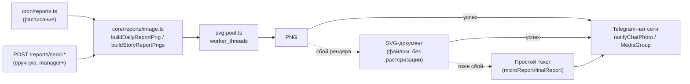

# Картинка-отчёт

> Оформлено в справочный вид при обновлении docs вслед за `SECURITY.md`
> (20.13.0); заодно поправлен путь модуля под layered-структуру 20.11.0
> (`services/report-image.ts` → `core/reports/image.ts`).

## Эндпоинты

| Метод | Путь | Ответ | Доступ |
|---|---|---|---|
| `GET` | `/reports/day/:storeId?date=YYYY-MM-DD&kind=micro` | `{ ok, svg }` — один кадр | ✅ active |
| `GET` | `/reports/day/:storeId?date=YYYY-MM-DD&kind=final` (по умолчанию) | `{ ok, kind:'story', svgs: {plan, fact, tomorrow} }` — 3 кадра | ✅ active |
| `POST` | `/reports/send-micro` | Рендер + отправка PNG в чат сети | 👔 manager+ |
| `POST` | `/reports/send-final` | То же для итога дня (3 кадра) | 👔 manager+ |
| `POST` | `/reports/send-digest` | Ручная отправка недельной/месячной сводки | 👔 manager+ |

Автоматическая отправка по расписанию — `src/cron/reports.ts`; ручная — три
`POST`-роута выше (`src/api/routes/ops/reports.ts`).

## Пайплайн рендера

Единственный рендерер — `core/reports/image.ts` (resvg, шрифты из
`assets/fonts`); параллельной реализации нет (убрана в 14.10.0, дублировала
тот же путь до тех же данных). Рендер идёт в отдельном пуле
`worker_threads` (`core/reports/svg-pool.ts` +
`workers/svg-render.worker.ts`), не блокирует основной event loop — см.
[ARCHITECTURE.md](./ARCHITECTURE.md).



Фолбэк-цепочка — PNG → SVG-документ → простой текст — гарантирует, что
сеть получит отчёт в чат даже при сбое рендера, просто менее наглядным
форматом; ни одна ступень не приводит к тишине.

## Пример вызова

```ts
import { buildDailyReportPng, buildStoryReportPngs } from '../core/reports/image.js';

// один кадр (micro-отчёт в течение дня)
const { png } = await buildDailyReportPng(storeId, date, { kind: 'micro', hourLabel: '14:00' });

// итог дня — 3 кадра альбомом (14.7.0): план → факт → фокус на завтра
const { plan, fact, tomorrow } = await buildStoryReportPngs(storeId, date);
await notifyChatMediaGroup([
  { buffer: plan, filename: `plan_${storeId}_${date}.png`, caption: '📋 план дня' },
  { buffer: fact, filename: `fact_${storeId}_${date}.png`, caption: '🏁 факт дня' },
  { buffer: tomorrow, filename: `tomorrow_${storeId}_${date}.png`, caption: '🔮 фокус на завтра' }
]);
```

## Связанные документы

- [ARCHITECTURE.md](./ARCHITECTURE.md) — где живёт worker-пул в общей структуре.
- [API.md](./API.md) — полная таблица эндпоинтов и уровней доступа.
