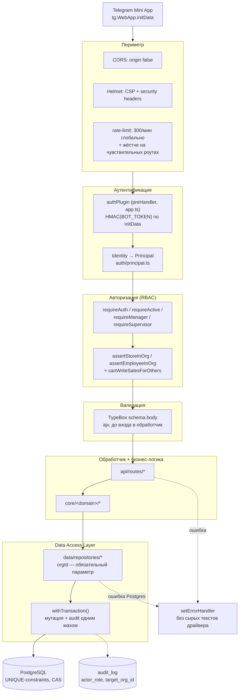

# Безопасность

> Извлечено из README §24 при репо-реструктуризации (20.11.0), переработано
> в 20.13.0 (Security hardening) в архитектурный вид — по слоям защиты, а
> не хронологической лентой правок. Полная построчная история —
> [CHANGELOG.md](../CHANGELOG.md); этот файл — актуальный срез «как оно
> работает сейчас и почему». Кто может навредить и чему конкретно —
> [THREAT-MODEL.md](./THREAT-MODEL.md); что делать при реальном
> инциденте — [RUNBOOK.md](./RUNBOOK.md).
>
> Единственный канонический security-документ проекта — черновик
> `SECURITY BETA.md`, начатый параллельно во время Web Security & Trust
> Layer, слит сюда документационным аудитом (репо-wide, после 20.50.0):
> классификация данных (К1-К5), целевой профиль/roadmap и security review
> gate ниже — из него; сам файл удалён, дублировавшихся разделов не
> осталось.
>
> Классификация статусов, используемая ниже: **IMPLEMENTED** — реально
> существует в коде/схеме/конфиге сегодня; **REQUIRED** — обязательный
> инвариант для нового кода; **PLANNED** — согласованное направление, ещё
> не реализовано. Раздел [Security roadmap](#security-roadmap--целевой-профиль)
> целиком PLANNED, если не отмечено иное.

## Baseline

Пять фактов, которые должны оставаться истинными всегда — если что-то из
этого нарушилось, это инцидент, не «особенность окружения»:

1. `RAILWAY_ENVIRONMENT=production` без `BOT_TOKEN` или с
   `ALLOW_INSECURE_AUTH=true` — сервер **не стартует** (не «работает
   небезопасно», а физически не поднимается).
2. Ни один эндпоинт, отдающий чужие/сетевые данные, не должен работать без
   org-scope проверки — это ловится `tests/isolation/`, не только
   ревью глазами.
3. `data/repositories/*` — единственный путь к Postgres; `npm run
   check:no-direct-sql` красный, если это нарушено.
4. `DATABASE_URL` тестов обязан указывать на `localhost`/`127.0.0.1`
   (`tests/setup.ts` бросает исключение иначе) — тесты пишут и удаляют
   данные, прод не должен быть их песочницей.
5. Секреты (`BOT_TOKEN`, `DATABASE_URL`, `GROQ_API_KEY`) не в репозитории,
   не в логах — если засветились, это `RUNBOOK.md`, не «почистить и
   забыть».

## Принцип

Всё, что решает роль или принадлежность к сети, проверяется **на сервере**
на каждом запросе — UI прячет кнопки для удобства, но ни один экран не
является границей доступа сам по себе. Одна и та же проверка не должна
иметь двух разных ответов в зависимости от того, каким путём запрос попал
в систему (класс проблемы, найденный и закрытый в 20.13.0 — см. [RBAC](#3-авторизация-rbac)
ниже) — это главный урок, зашитый в архитектуру решений этого документа.

## Архитектура защиты

Каждый запрос проходит один и тот же конвейер — от периметра до строки в
Postgres. Ни один роут не может обойти слой, минуя предыдущий: `authPlugin`
навешан глобально на `app.ts` и выполняется до диспетчеризации в конкретный
обработчик, `data/repositories/*` — единственный путь к БД, `orgId` в
каждой repository-функции обязателен, а не опционален.



## Уровни защиты

Defense-in-depth: ни один отдельный уровень не единственная линия обороны
— каждый следующий перекрывает то, что теоретически могло бы просочиться
через предыдущий.

| # | Уровень | Механизм | Где в коде |
|---|---------|----------|------------|
| 1 | Периметр | CORS закрыт, CSP, rate-limit | `app.ts` |
| 2 | Аутентификация | HMAC-проверка initData, TTL сессии, прод-гварды | `auth/providers/telegram*.ts`, `src/index.ts` |
| 3 | Авторизация (RBAC) | Ролевая иерархия + org-scope на каждом чужом ресурсе | `auth/guards.ts` |
| 4 | Валидация ввода | TypeBox-схемы, ajv, коэрсия под контролем | `api/routes/*` (`schema.body`) |
| 5 | Data Access Layer | `orgId` обязателен, единственный путь к Postgres | `data/repositories/*` |
| 6 | Целостность данных | UNIQUE-constraints, compare-and-swap, транзакции | миграции + `data/db/index.ts` |
| 7 | Audit Trail | Кто/что/когда/над кем, транзакционно с мутацией | `data/repositories/audit.ts` |
| 8 | Обработка ошибок | Единый формат, без утечки внутренностей | `app.ts::setErrorHandler`, `shared/errors.ts` |
| 9 | Frontend | Экранирование вывода, CSP, typed-контракт | `frontend/js/*.js`, `frontend/src/api-client.ts` |
| 10 | Cryptographic Data Protection | Application-level envelope encryption (Level 2) на чувствительных полях; E2EE (Level 3) — NOT IMPLEMENTED, см. ADR-008 | `security/crypto/*`, `data/repositories/support.ts` |
| 11 | Multi-Factor Authentication + step-up | WebAuthn/TOTP/recovery codes; channel-agnostic step-up ticket на опасные действия; last-factor removal guard | `auth/mfa/*`, `auth/step-up.ts`, `api/routes/auth/mfa.ts` |

---

### 1. Периметр

- **CORS закрыт** (`origin: false`, с 17.8.0) — Mini App всегда бьёт на API
  своим же origin, легитимного кросс-origin браузерного вызова нет.
- **`@fastify/helmet`** (19.14.0) — CSP собран вручную (`useDefaults: false`),
  не берётся с дефолтов библиотеки: `frame-ancestors` вместо `X-Frame-Options`
  (Telegram Web открывает Mini App в iframe с `web.telegram.org`, `SAMEORIGIN`
  это бы сломал), `crossOriginEmbedderPolicy` выключен (иначе блокируется
  `<script src="https://telegram.org/js/telegram-web-app.js">` — у него нет
  `Cross-Origin-Resource-Policy`). CSP разрешает inline-обработчики
  (`script-src-attr`/`style-src-attr: 'unsafe-inline'`) — вёрстка держится
  на `onclick=`/`style=`-атрибутах; Frontend Foundation (20.0.0-20.30.0,
  переезд `js/*.js`→`src/**/*.ts`) перенесла этот паттерн, не убрала его —
  подтверждено аудитом 20.49.0 (265+ мест, см. [известные
  компромиссы](#известные-компромиссы)). Переход на строгую CSP —
  отдельная запланированная эпоха, не начатая.
- **`@fastify/rate-limit`** (19.14.0) — общий потолок **300 запросов/мин на
  IP**, плюс отдельные более жёсткие лимиты там, где злоупотребление дороже
  обычного:

  | Роут | Лимит | Почему жёстче общего |
  |------|-------|------------------------|
  | `POST /access/request` | 5/мин | Заявка на доступ — публичный, ещё не аутентифицированный по роли путь |
  | `POST /auth/register` | 5/мин | Публичная само-регистрация телефон+пароль (20.35.0) — до личности, как заявка на доступ |
  | `POST /me/link-phone` | 5/мин | Привязка телефона+пароля к своей же карточке (20.36.0) — редкое self-service действие |
  | `POST /auth/login` | 10/мин, ключ — `sha256(normalizePhone(phone))` | 20.48.0: не по IP — закрывает distributed brute-force по одному номеру через много IP; работает ВМЕСТЕ с общим 300/мин-по-IP лимитом, не вместо него |
  | `POST /auth/reset/:token` | 10/мин | Одноразовый токен сброса пароля в URL — сам по себе секрет, но лимит закрывает перебор битых/устаревших токенов |
  | `POST /auth/login/mfa`, `/auth/mfa/step-up`, `/auth/mfa/totp/confirm` | 20/мин | 20.52.0: 6-значный TOTP/recovery-код — брутфорсибельный без лимита |
  | `POST /reports/send-micro`, `/send-final` | 10/мин | Рендер PNG через worker-пул — дорогая CPU-операция |
  | `POST /reports/send-digest` | 10/мин | То же — генерация изображения |
  | `GET /avatars/:employeeId` | 30/мин | Единственный публичный (без сессии) GET-эндпоинт — см. [известные компромиссы](#известные-компромиссы) |
  | `POST /shifts/open`, `POST /sync/batch` | 30/мин | Массовые операции — офлайн-очередь может прислать пачку разом |
  | `POST /sales`, `/sales/quick`, `POST /schedules`, `/schedules/bulk` | 60/мин, 30/мин (bulk) | Основной write-путь, частый, но не безлимитный |
  | `GET /forecast/:storeId`, `POST /shifts/close` | 20/мин, 30/мин | 20.50.0: оба дёргают Groq (AI) — реальные деньги за вызов; `/shifts/close` симметричен уже лимитированному `/shifts/open` |
  | `GET /staffing-hints`, `GET /network/live` | 20/мин | 20.50.0: N последовательных запросов НА КАЖДУЮ точку сети |
  | `POST /admin/rebuild-hour-profiles`, `POST /alerts/run` | 5/мин | 20.50.0: полный пересчёт/проход по всей сети, редкие admin-действия |
  | `POST /metrics` | 5/мин | 20.50.0: `ALTER TABLE` на 3 таблицах за вызов |
  | `POST /me/avatar` | 10/мин | 20.50.0: write-сторона уже лимитированного `GET /avatars/:id` |
  | `GET /sales/audit`, `/export/*.csv`, `/export/bi/daily` | 10-20/мин | 20.50.0: export-роуты, раньше без лимита вообще |
  | `POST /schedule/what-if(/apply)` | 20/мин, 10/мин | 20.50.0: полная симуляция + (для `/apply`) реальные записи в `schedules` |
  | `GET /access/orgs`, `/access/employees-directory`, `/access/status` | 30/мин | 20.50.0: единственная анонимная (без сессии) поверхность API, раньше без лимита — см. [известные компромиссы](#известные-компромиссы) |

  **`trustProxy: 1`** (20.48.0, `app.ts`) — Railway кладёт приложение за
  ровно одним reverse-proxy хопом; доверяем ровно ему, не `true` (который
  принял бы любую цепочку `X-Forwarded-For`) — иначе `request.ip` не
  соответствует реальному клиенту, что подрывает точность IP-based
  rate-limit выше.

  **CSRF (double-submit cookie + Sec-Fetch-Site/Origin, 20.48.0)** —
  мутирующий запрос с cookie-сессией (`t2_session`) обязан нести
  `X-CSRF-Token`, совпадающий с не-`httpOnly` cookie `t2_csrf`
  (`auth/csrf.ts::requireCsrf`, глобальный `preHandler` сразу после
  `authPlugin`). Первый слой — `Sec-Fetch-Site: cross-site` отклоняется
  ещё до сверки токена; без этого заголовка (старые браузеры) — `Origin`
  сверяется с уже существующим `MINI_APP_URL`, не реконструируется из
  `Host`/`X-Forwarded-Host`. Срабатывает от НАЛИЧИЯ `t2_session` cookie,
  не от списка роутов — Telegram-запросы (initData/заголовок, без этой
  cookie) не затронуты вообще. `/auth/login`/`/auth/register`/
  `/auth/reset/:token` — явно исключены: не полагаются на ambient cookie
  authority для авторизации действия (явные credentials в теле), а в
  браузере уже может лежать старая/подставная `t2_session` (session
  fixation) — без исключения честный вход падал бы в CSRF-отказ раньше,
  чем доходил до своей логики.

  **`Cache-Control: no-store` (20.49.0)** — глобальный `onSend`-хук
  (`app.ts`): `if (!reply.getHeader('cache-control')) reply.header(
  'Cache-Control', 'no-store')`. Раньше auth/session/employee-PII
  ответы не несли Cache-Control вообще, полагаясь на умолчания браузера
  — общий кэширующий прокси/CDN мог бы закэшировать чужой ответ.
  Единственное условие покрывает оба существующих исключения без
  явного списка путей: `GET /avatars/:id` ставит свой `private,
  max-age=300` до `onSend`, `@fastify/static` (статика фронтенда)
  выставляет свой `public, max-age=0` тоже до этого хука — оба
  проверены живым curl, не только предположением о порядке хуков.

### 2. Аутентификация

**initData проверяется на сервере**, не на клиенте. Mini App шлёт сырой
`tg.WebApp.initData` в заголовке `X-Telegram-Init-Data`; глобальный
`preHandler`-хук `authPlugin` (навешан один раз в `app.ts`, выполняется
перед каждым роутом) пересчитывает HMAC по `BOT_TOKEN`
(`auth/providers/telegram-verify.ts`) и кладёт в `request.user`
подтверждённую identity — только если подпись сходится. `request.user` —
единственный источник identity во всех роутах; читать заголовок напрямую в
обход `authPlugin` считается багом (класс дыр, закрытый в 19.11.0).

Голый `X-Telegram-Id` без initData принимается **только** если `BOT_TOKEN`
не задан (локальная разработка) либо явно включён
`ALLOW_INSECURE_AUTH=true`. Это не просто конвенция — жёсткий гварт:
`src/index.ts` вообще отказывается стартовать в
`RAILWAY_ENVIRONMENT=production`, если `ALLOW_INSECURE_AUTH=true` **или**
`BOT_TOKEN` не задан. Сама initData-сессия живёт **1 час** (было 24,
снижено в 19.14.0 по рекомендации Telegram) — по истечении роут отвечает
понятным `session_expired`, а не голым 401.

**Authentication Boundary** (`src/auth/`, 20.9.0) — Telegram-специфика
изолирована в `auth/providers/telegram.ts` + `telegram-verify.ts`;
`Identity → Principal` резолвинг (`auth/principal.ts`) диспетчеризует по
`provider`, не предполагает Telegram глобально — подготовка под будущий
Web/Mobile/SSO без переписывания остального кода. `auth/guards.ts` (бывший
`middleware-auth.ts`) — тонкая Fastify-обвязка поверх этой границы,
ре-экспортирует прежние имена без изменений для вызывающего кода.

**Не-Telegram вход (телефон+пароль, 20.35)** — второй provider поверх той
же границы, ADR-005 «сработала ровно так, как задумывалась»:
`auth/providers/phone.ts` резолвит identity из cookie-сессии
(`data/repositories/sessions.ts`), не из подписанного initData. Ни один
гвард в `auth/guards.ts` не изменился — только `resolveUser()` пробует
Telegram первым, phone-сессию вторым (гость внутри Telegram без initData
не подхватывает чужую браузерную сессию с того же устройства). Пароль —
`crypto.scrypt` (не bcrypt/argon2, встроенный модуль), сессия и
одноразовые токены сброса пароля — непрозрачный `crypto.randomBytes(32)`,
в БД только `sha256(...)`, подписывающего секрета не заводили. Регистрация
— открытая, тот же flow «заявка → админ одобряет», что для Telegram
(`access_requests.provider`); сброс пароля — только через админа (нет
SMS-провайдера для self-service, решение владельца продукта).

**Самопривязка телефона (20.36)** — `POST /me/link-phone` даёт уже
авторизованному через Telegram сотруднику добавить телефон+пароль к
СВОЕЙ карточке напрямую, без approve через `access_requests` (identity уже
подтверждена этим же запросом). Тот же принцип, что `POST /me/bind`
(19.11.0): целевой `employee_id` для UPDATE берётся из `request.user`
(подтверждённый Telegram identity), никогда из тела запроса — иначе один
сотрудник мог бы привязать телефон к чужой карточке, зная/угадав её id.

**Identities — schema-level identity abstraction (20.48.0)** — порог,
который ADR-005 дважды сознательно откладывал («один provider не
оправдывает схему»), пройден: три реальных канала использования
(Telegram Mini App, телефон-браузер, standalone PWA) сделали нормализацию
внешний-id→employee lookup оправданной. Новая таблица `identities`
(`employee_id, provider, provider_key`, `UNIQUE(provider,provider_key)` +
`UNIQUE(employee_id,provider)`) — единственный источник правды для
auth-резолва (`auth/principal.ts::loadUser()`); `employees.telegram_id`/
`phone`/`password_hash` остаются нетронутыми для не-auth потребителей
(бот-уведомления, отображение в Команде). Разная семантика конфликта по
provider, зафиксированная как инвариант:
- **Telegram** — ownership transfer (steal) разрешён:
  `identitiesRepo.transferIdentity()`, атомарный
  `INSERT...ON CONFLICT DO UPDATE` (не `DELETE`+`INSERT` — race-safe при
  параллельных claim одного `provider_key`, Postgres сериализует через
  row-lock). Это уже протестированный self-bind recovery-flow
  (`POST /me/bind`, `claimTelegramId()` — единственная точка изменения
  Telegram identity, employees-колонка и identities-строка синим цветом
  внутри одной транзакции, никогда по отдельности).
- **Phone** — transfer НЕ разрешён:
  `identitiesRepo.bindIdentityStrict()`, конфликт с чужим номером —
  сырой `23505` → `409`. Телефон — credential boundary (защищает вход по
  паролю), не recovery-механизм, как Telegram self-bind.

При разборе найден и исправлен реальный, предшествующий 20.48.0 баг:
`claimTelegramId()`'s `WITH cleared AS (...)` CTE не имел data-зависимости
с главным `UPDATE`, поэтому Postgres не гарантировал порядок их
выполнения — при переносе Telegram с уже занятой карточки на другую
(в отличие от гонки за НЕзанятую, которую единственный существующий тест
проверял) constraint мог проверяться раньше, чем прежний владелец
освобождался, давая ложный `409` там, где ожидался успешный transfer.
Фикс — принудительная зависимость `WHERE id=$2 AND (SELECT count(*) FROM
cleared) >= 0`.

**Session lifecycle (20.48.0)** — credential-sensitive изменения
инвалидируют активные browser-сессии немедленно, не полагаясь на то, что
`requireActive` поймает это на следующем запросе позже:
деактивация (`DELETE /employees/:id`) отзывает `employee_sessions` и
telegram-identity (phone переживает, как и раньше `employees.phone`);
`/auth/reset/:token` и `POST /me/link-phone` отзывают ВСЕ существующие
сессии сотрудника до выдачи новой (устройство A украдено → пароль меняют
на B → A не остаётся рабочим). `GET/DELETE /auth/sessions`, `POST
/auth/sessions/revoke-others` — самообслуживание: список/отзыв активных
сессий, ownership-scoped запросом (нельзя отозвать чужую по id), работает
для любого provider'а (Telegram-пользователь тоже видит и может отозвать
свою browser-сессию). Список — только `id/created_at/last_seen_at/current`,
без IP/User-Agent/геолокации (PII/privacy surface, не запрошено).

**Срок жизни сессии** (20.52.0, обновлено) — `employee_sessions.expires_at`
фиксируется при создании (`createSession()`, `data/repositories/sessions.ts`)
абсолютным TTL: **30 дней** для обычных ролей, **7 дней** для
admin/supervisor (§9 брифа — «for privileged users consider shorter
lifetimes»), не продлевается. Cookie `t2_session` несёт тот же `maxAge`.
**Idle-таймаут — раздельный по роли (20.52.1)**: `resolveSession()`
проверяет `last_seen_at > now() - N`, не только `expires_at > now()`
— **14 дней** для обычных ролей, **18 часов** для admin/supervisor
(JOIN на `employees.role`, читается свежо, не снимок на момент
создания сессии). Раньше idle был единой 14-дневной политикой для всех
— при абсолютном TTL уже 7 дней для privileged это делало idle
полностью бессмысленным параметром именно для той роли, ради которой
его в первую очередь стоило заводить (14 > 7 — idle никогда не успевал
сработать раньше абсолютного истечения). `last_seen_at` обновляется
`touchSession()` (троттлинг раз в час — не на каждый запрос).

**Компрометация `BOT_TOKEN`** — секрет уровня «полный контроль над ботом»
(отправка сообщений от его имени, чтение входящих во всех чатах, куда он
добавлен); у нас нет журнала вызовов Bot API задним числом, Telegram его
не отдаёт. Пошаговая процедура ротации и что реально можно проверить
после инцидента — [RUNBOOK.md — ротация BOT_TOKEN](./RUNBOOK.md#ротация-bot_token).

### 3. Авторизация (RBAC)

Иерархия ролей — строго линейная, каждая следующая включает возможности
предыдущей (`ROLE_LEVEL`, `auth/principal.ts`):

```
guest (-1) < trainee (0) < employee (1) < senior (2) < manager (3) < supervisor (4) < admin (5)
```

| Роль | Свои продажи | Продажи за другого | Command Center / кабинет супервайзера | Заявки на доступ | Назначение ролей |
|------|:---:|:---:|:---:|:---:|:---:|
| `trainee` / `employee` | ✅ | ❌ | ❌ | — | — |
| `senior` | ✅ | ❌ **(с 20.13.0)** | ❌ | — | — |
| `manager` | ✅ | ✅ (своя сеть) | ✅ | approve/reject | роли ниже своей |
| `supervisor` | — | — | ✅ (свой сектор) | — | роли ниже своей |
| `admin` | ✅ | ✅ (любая сеть) | ✅ | approve/reject | любые, включая admin |

`senior` — операционно почти everywhere «как manager» (проходит
`requireManager`), **кроме** двух вещей: не видит Command Center/кабинет
супервайзера (см. `canViewAnalytics()` на фронте), и с 20.13.0 не может
вносить/синхронизировать продажу **за другого** сотрудника — это
сознательное продуктовое решение, не оговорка иерархии.

**Единая точка правды для «может ли X писать за Y»** —
`canWriteSalesForOthers()` (`auth/guards.ts`, 20.13.0): узкая проверка
(`manager`/`admin`), отдельная от общего `isManager()` (включает `senior`).
До 20.13.0 три параллельных пути записи продажи — `POST /sales`,
`POST /sales/quick`, `POST /sync/batch` (офлайн-очередь) — решали этот
вопрос по-разному: первый исключал `senior` инлайн-проверкой, два других
пропускали через общий `isManager()`. Один и тот же вопрос имел два разных
ответа в зависимости от точки входа — классический пример того, почему
"верно один раз, забыто во втором похожем месте" опаснее одной явной дыры.
Закрыто по внешнему security-аудиту, зафиксировано регресс-тестами
(`tests/unit/middleware-auth.test.ts`, `tests/isolation/quick-sale-sync.test.ts`).

**Org-scope** — принадлежность к сети проверяется отдельно от роли, на
каждом роуте, читающем или пишущем чужие данные: `assertStoreInOrg()` /
`assertEmployeeInOrg()` (`auth/guards.ts`), либо декораторы
`requireStoreInOrg()` / `requireEmployeeInOrg()` (19.17.0) — preHandler
поверх тех же функций, регистрируются в опциях роута вместо ручного вызова
внутри обработчика (18 роутов переведены). Там, где store/employee id
узнаётся только после fetch внутри самого обработчика, или где
self-write/manager-for-other разруливаются по-разному, декоратор не
подходит технически — оставлено с ручной проверкой намеренно, не забыто.

### 4. Валидация ввода

TypeBox-схемы (`@sinclair/typebox`, 19.18.0) на `schema.body` роута —
Fastify валидирует запрос своим встроенным ajv-компилятором **до** того,
как управление доходит до обработчика; `err.code === 'FST_ERR_VALIDATION'`
в глобальном `setErrorHandler` превращает это в чистый
`{error: 'validation_failed', details: [...]}`. Весь write-API — на
TypeBox, `request.body as any` не осталось. Динамические по форме тела
(кастомные метрики продаж/планов, `sync/batch`-операции, произвольные поля
апдейта сети) сознательно оставлены `additionalProperties: true` — схема не
должна быть строже уже отлаженной ручной логики внутри обработчика.

**Ловушка ajv-коэрсии `null`** (найдена и закрыта в 19.19.0) —
`coerceTypes: true` (Fastify-дефолт) молча превращает `null` в `0` для
числовых полей и в `""` для строковых, без ошибки валидации. Для полей,
которые фронтенд шлёт как `null` намеренно (координаты геолокации при
отказе в доступе, сброс кастомного названия точки), это меняет смысл
данных. Фикс — `Type.Union([Type.Null(), Type.Number()])` **с `Null`
первым**: ajv коэрсит на первом подходящем варианте по порядку. Правило на
будущее: если фронтенд может прислать `null` намеренно — тип обязан быть
`Type.Union([Type.Null(), ...])`, иначе баг тихий.

### 5. Data Access Layer

Org-scoping — структурная гарантия, не «не забыть проверить в каждом
SELECT»: каждая tenant-функция репозитория берёт `orgId` первым
**обязательным** параметром, без него вызвать физически нельзя, и каждый
SQL внутри уже несёт `WHERE COALESCE(org_id,'default') = $orgId`. Весь
backend ходит в Postgres только через `data/repositories/*` — проверяется
в CI (`npm run check:no-direct-sql`, ratchet-список файлов в
`scripts/check-no-direct-sql.mjs`, 56 путей по состоянию на 20.11.0).

### 6. Целостность данных и конкурентность

Реально защищено на уровне схемы, не только логикой в коде:

- `idx_shift_sessions_one_open_per_employee` (partial UNIQUE INDEX) —
  физически не даёт двух открытых смен одному сотруднику.
- Закрытие смены — `UPDATE ... WHERE id=$X AND status='open'`, честный
  compare-and-swap.
- `offline_sync_log.client_id` — настоящий UNIQUE constraint +
  `ON CONFLICT DO NOTHING`, идемпотентность не только в коде.
- `sales` — `UNIQUE(employee_id, store_id, sale_date)`.
- `store_plans` — `UNIQUE(store_id, plan_date)` (миграция 0013) —
  закрывает найденную гонку `materializeStoreDailyPlans()` (крон 6:00 МСК
  vs синхронная правка плана): раньше `DELETE` + голые `INSERT` в цикле без
  constraint'а оставляли окно "плана нет" между delete и insert.

Всё закреплено тестами, которые реально стреляют `Promise.all()` из двух
одновременных запросов, а не проверяют последовательные сценарии.
Optimistic locking (версионирование строк) нигде не добавлен —
`PATCH /stores/:id` и подобные уже делают частичный `UPDATE SET <только
присланные поля>`, не перезапись всей строки, поэтому классический
lost-update сценарий физически не возникает.

**Domain Integrity (20.33.0)** — org-scoping (пункт 5 выше) держала
приложение (`tenant.ts`), но до этой версии ни разу не была закреплена в
самой схеме: `employees.org_id`/`stores.org_id`/`announcements.org_id`/
`channels.org_id`/`channels.store_id` были обычными text-колонками без
`REFERENCES`, в отличие от `access_requests.org_id`/`regions.org_id`/
`rtk_promocodes.org_id`, у которых FK был с baseline. `0016_org_scoping_fk.sql`
закрыл все пять — новый endpoint/воркер, забывший проверить существование
сети/точки перед `INSERT`, получит отказ от Postgres, а не тихую запись
осиротевшей строки. Перед миграцией — read-only проверка прод-БД (0 строк-сирот
по каждой колонке). Дилер→Сектор (`sectors.dealer_id`, 0015) и Сеть→Сектор
(`organizations.sector_id`, baseline) уже были закрыты FK раньше — граф
плоский (ни `sectors`, ни `dealers` не ссылаются сами на себя), циклов
структурно не бывает.

### 7. Audit Trail и Observability

`audit_log` (`data/repositories/audit.ts`, 19.23.0, расширено в 20.10.0) —
единая лента чувствительных действий с полями `actor_role` (снимок роли
актора на момент действия, не текущая) и `target_org_id` (сеть цели,
отдельно от сети актора). `withTransaction()` — смена роли и правка
продажи коммитят мутацию и audit-запись одним махом или откатывают обе.

Структурные (pino JSON) логи фоновых задач (`src/cron/job-logger.ts`,
20.10.0) — старт/длительность/успех-неудача на каждое реальное
cron-действие, тем же форматом, что HTTP-логи Fastify — грепается в
Railway logs одинаково.

### 8. Обработка ошибок

Глобальный `setErrorHandler` (`app.ts`, 19.15.0) — известные коды ошибок
Postgres (дубликат, ссылка на несуществующую запись, некорректный формат)
превращаются в стабильный `{error, message}` без сырого текста драйвера;
роуты со своим `catch` используют тот же принцип через `serverError()`
(`shared/errors.ts`). CI падает на `npm audit --audit-level=high` —
известная уязвимость высокой критичности в зависимостях блокирует мёрдж, а
не остаётся незамеченной до следующего ручного аудита.

### 9. Frontend

Вывод данных пользователя экранируется через `esc()` (после Frontend
Foundation — `frontend/src/app/core.ts`, bare global во всех страницах)
перед вставкой в `innerHTML` — дисциплина проверена аудитом v20.11.1
почти по всем интерполяциям; 2 подтверждённых пробела (имя сотрудника в
модалке правки продажи; текст и пункты AI-инсайта смены) закрыты в
20.13.0.

**Web Security & Trust Layer, часть 2 (20.49.0)** — повторный XSS-аудит
после трёх новых каналов входа (Telegram/phone-браузер/PWA) нашёл ещё 6
реальных пробелов, не закрытых предыдущим аудитом: `progressHTML()`
(метка кастомной метрики, самый широкий охват — 8+ экранов через одну
функцию) и store name в 7 файлах без `esc()`; более тонкий
**attribute-breakout класс** — `jsEsc()` (`dealers/index.ts`) и
`JSON.stringify()` (`cash-metrics/index.ts`) экранировали только
JS-string-контекст значения, но подставляли его в `onclick="..."` —
HTML-атрибут-контекст — без HTML-экранирования; значение с `"` разрывало
атрибут и внедряло произвольный обработчик на элемент (второго порядка
stored XSS против admin через самостоятельно заданное имя сотрудника).
Fix — весь onclick-value оборачивается в `esc()` ПОВЕРХ уже
существующего JS-string-экранирования, слои не путаются. `promos`
note — самый низкий барьер входа (пишет любой активный сотрудник, не
manager). Новый CI-gate (`scripts/check-dangerous-js-patterns.mjs`,
`npm run check:dangerous-js`) фиксирует `document.write`/`eval`/
`new Function`/строковый `setTimeout`/`setInterval` (0 совпадений) как
регресс-барьер на будущее. Подробности — [CHANGELOG.md, 20.49.0](../CHANGELOG.md).

**Frontend Foundation** (`frontend/src/`, 20.0.0→20.7.0) — typed
API-клиент (`api-client.ts`, 91 функция) сознательно бросает на не-ok/
сетевой ошибке, сам не глотает и не подставляет фолбэк. Общий контракт
(`shared/api-types.ts`) даёт компилируемую гарантию, что реализация роута и
тип ответа не разойдутся. Формат Vite-сборки — **iife** (не es/umd):
легаси-файлы `frontend/js/*.js` — классические синхронные
`<script src=...>`, ожидающие общую глобальную область к моменту
выполнения; IIFE сохраняет ту же семантику загрузки.

### 10. Cryptographic Data Protection

Полный разбор — [docs/DATA-SECURITY-ARCHITECTURE.md](./DATA-SECURITY-ARCHITECTURE.md)
(таблица данных по классам), [ADR/007](./ADR/007-application-level-envelope-encryption.md)
(что реализовано), [ADR/008](./ADR/008-e2ee-not-implemented.md) (что нет
и почему). Здесь — статус коротко, по слоям, ничего не заявлено сверх
того, что реально в коде:

| Слой | Статус | Что это |
|---|---|---|
| TLS (transport) | IMPLEMENTED | Railway/HTTPS — граница транспорта, не application-уровень |
| Хешированные credentials/tokens | IMPLEMENTED | `password_hash` — `crypto.scrypt` (необратимо, не шифрование); `employee_sessions.token_hash`/`employee_password_resets.token_hash` — `sha256` одноразовых секретов. Никогда не «шифрование, которое можно расшифровать» — восстанавливать эти значения не нужно, см. §44 несовместимость целей |
| **Application-Level Envelope Encryption (Level 2)** | IMPLEMENTED | `backend/src/security/crypto/**` (20.51.0) — AES-256-GCM, DEK per-object, KEK версионирован вне PostgreSQL, HKDF-derived wrap-key, AAD связывает ciphertext с id/типом объекта. Потребители: `support_tickets.message`/`admin_reply`, `support_messages.body` (owner/admin читают по требованию, не E2EE), и `employee_totp.secret_encrypted` (20.52.0/20.52.1 — TOTP-секрет, fail-closed без фолбэка, см. ниже) |
| **True E2EE (Level 3)** | NOT IMPLEMENTED | Ни одна фича продукта сегодня не является приватной перепиской 1:1 (см. ADR-008) — строить device identity/handshake/ratchet ради несуществующего private channel означало бы придумывать продуктовую фичу, не защищать существующую |
| Post-quantum (ML-KEM/hybrid) | NOT IMPLEMENTED | Зависит от E2EE-слоя, которого нет; не заявляем «post-quantum secure» нигде в документации, пока PQ-слой не реализован полностью |

**Ключевая иерархия (Level 2)**:

```
Master Key / KEK (env ENCRYPTION_KEKS, версионирован, ротируется)
       │
       ▼ HKDF-SHA256, domain label t2/envelope/wrap-key/v1
  Wrap Key
       │
       ▼ AES-256-GCM
  Data Encryption Key (DEK) — CSPRNG, один на объект, хранится только wrapped
       │
       ▼ AES-256-GCM, AAD = {type, id, ...}
  ciphertext поля
```

**Rotation** — `ENCRYPTION_ACTIVE_KEY_VERSION` управляет только тем,
каким KEK шифруются НОВЫЕ записи; `unwrapDek()` резолвит любую известную
версию из `ENCRYPTION_KEKS`, поэтому старые записи остаются читаемыми
без re-encryption всего хранилища при добавлении новой версии.

**Downgrade-инвариант** — `DATA_ENCRYPTION_ENABLED` гейтит только
запись; чтение уже зашифрованной строки расшифровывается всегда,
независимо от текущего состояния флага. Выключить флаг нельзя сделать
эквивалентом «рассекретить всё обратно» — это и есть требование §32/§48.7
не допускать silent downgrade в plaintext.

**Fail-closed** — повреждённый/чужим ключом зашифрованный конверт
никогда не возвращает мусор или тихий plaintext-фолбэк: `decryptField()`
бросает `DecryptionError`/`InvalidEnvelopeError`; на уровне репозитория
(`data/repositories/support.ts`) единичное чтение резервируется явным
`[ошибка расшифровки]`-маркером с логированием только класса ошибки
(`errorClass`, не текст/содержимое), не 500 на весь список и не
подстановка plaintext.

**Секреты не логируются** — ни KEK, ни DEK, ни plaintext не появляются в
логах/audit_log/ответах API; см. `security/crypto/errors.ts`/`log.ts` —
сообщения ошибок содержат только класс ошибки и метаданные (`alg`/`kid`/
`table`/`id`), никогда сырые байты.

**Production обязан иметь шифрование включённым (CRYPTO-1, 20.52.1)** —
`assertProductionEncryptionRequired()` (`index.ts`, только под
`RAILWAY_ENVIRONMENT=production`) не даёт серверу стартовать, если
`DATA_ENCRYPTION_ENABLED` не `true` — раньше проверялось только "если
включено — то корректно", выключенное состояние было легитимным для
production. Теперь, когда шифрование защищает не только опциональный
support-ticket-текст, но и TOTP-секреты (реальный authentication
material — enrollment сам бросает `EncryptionDisabledError` без него),
тихая работа без него в production больше не приемлема. Не влияет на
dev/test — там флаг по умолчанию выключен, тесты сами включают его
глобально в `tests/setup.ts` тестовым (не production) ключом.

**Строгая base64-валидация (CRYPTO-1, 20.52.1)** — `Buffer.from(str,
'base64')` не бросает на невалидном/non-canonical входе (тихо
отбрасывает posторонние символы) — не проверка валидности сама по себе.
`strictBase64Decode()` (`security/crypto/random.ts`) применяется везде,
где base64-строка приходит извне доверенной границы: KEK
(`ENCRYPTION_KEKS`), nonce/tag/ciphertext AEAD-полей конверта. AEAD
tag-проверка (GCM) уже страховала от эксплуатации испорченных байт как
таковых — это про дисциплину fail-closed на входе, не про новую дыру,
которая была эксплуатируема раньше.

### 11. Multi-Factor Authentication (MFA)

Полное архитектурное решение —
[docs/ADR/009](./ADR/009-mfa-step-up.md). Библиотеки — только vetted:
`@simplewebauthn/server`/`@simplewebauthn/browser` (WebAuthn/passkey),
`otplib` v13 (TOTP, дефолтные плагины `NobleCryptoPlugin`/
`ScureBase32Plugin` — `@noble/hashes`/`@scure/base`). Ни один
криптографический примитив не написан самостоятельно.

**Иерархия факторов**: WebAuthn/passkey (приоритетный) → TOTP
(совместимый fallback) → recovery codes (последний резерв). SMS не
используется ни для одного из них.

**Auth Assurance model (AAL1/AAL2/AAL3, 20.52.1)** — явные, разные
понятия, не смешиваются:
- **AAL1** — только primary-аутентификация (пароль или Telegram initData
  HMAC). Достаточно для обычных ролей; для admin/supervisor — только для
  входа и MFA-enrollment роутов, см. ниже.
- **AAL2** — подтверждённый фактор ЕСТЬ у аккаунта (для Telegram, где
  сессии нет вообще, ADR-005) ИЛИ конкретная browser/phone-сессия САМА
  прошла MFA при выдаче (`employee_sessions.mfa_verified_at`, для
  browser/phone). Два разных, явно различаемых сигнала —
  `auth/assurance.ts::checkPrivilegedAssurance()` возвращает
  `mfa_enrollment_required` (фактора нет вообще) отдельно от
  `mfa_reverification_required` (фактор есть, но ЭТА сессия не проходила
  MFA — например, была выдана до enrollment).
- **AAL3** — свежий step-up (см. ниже) для конкретного опасного действия
  прямо сейчас, не "было пройдено когда-то в этой сессии".

**Login-time второй фактор** — свойство конкретного аккаунта (есть ли
подтверждённый TOTP/WebAuthn), не глобальная политика по роли: `POST
/auth/login` с паролем возвращает `{mfa_required:true, mfa_token}`
вместо сессии, если фактор подтверждён; `POST /auth/mfa/login`
довершает вход. `mfa_token` — опаque, single-use, 5 минут
(`mfa_pending_logins`). Та же логика в `POST /auth/reset/:token`
(20.52.1, RESET-1) — сброс пароля для аккаунта с MFA тоже не выдаёт
сессию сразу, требует MFA так же, как обычный вход.

**PRIV-MFA-1/2 — MFA реально обязателен, не только для опасных действий
(20.52.1)** — `auth/guards.ts::requireActive()` блокирует `403
mfa_enrollment_required` для admin/supervisor без подтверждённого
фактора на КАЖДОМ защищённом роуте, кроме явно помеченных
enrollment/status/logout (`{allowMfaEnrollment:true}`) — иначе
enrollment стал бы недостижим. Вычисляется один раз в `authPlugin`
(`auth/assurance.ts`), одинаково для Telegram (пересчитывается заново
на каждый запрос) и browser-сессий. Раньше (20.52.0) mandatory
обеспечивался только тем, что step-up физически недостижим без
фактора — обычные privileged-функции (не step-up-gated) оставались
доступны на голом AAL1; это было осознанно отклонённой альтернативой
("блокировка всего API" виделась слишком широкой), но оказалось
недостаточным для реального требования "MFA обязателен", не "MFA
обязателен только для самых опасных действий". См.
[ADR/009, раздел "20.52.1 revision"](./ADR/009-mfa-step-up.md).

**Покрытие гейта завершено (20.52.2)** — независимый security-аудит
нашёл, что новый гейт из 20.52.1 фактически не покрывал ~15 route-файлов
(`command-center.ts`, `forecast.ts`, `comms.ts`, `shifts.ts`, `tasks.ts`,
`support.ts`, `supervisor.ts`, `export.ts` и др.), использовавших более
слабый `requireAuth` (только "identity resolved", без access_status и
без MFA-гейта) вместо `requireActive()` — Command Center и другая
privileged-функциональность оставались доступны admin/supervisor без
MFA в обход заявленной политики. Найдено и подтверждено воспроизведением
локально (не поверено на слово). Все ~31 вызова заменены на
`requireActive()`; неиспользуемый `requireAuth()` удалён из
`auth/guards.ts` целиком, чтобы не оставлять привлекательный обходной
путь для будущего кода. `promos.ts` использовал собственный
дублирующий resolver (`resolveEmployeeFromRequest()`, проверял
access_status, но не MFA) — заменён на `requireActive()`.

**Атомарность single-use claim'ов (20.52.2)** — тот же аудит нашёл
TOCTOU-гонки в трёх местах этого же MFA/session-кода, где
resolve-и-consume были раздельными запросами: TOTP replay-защита
(`recordTotpUse()`), consumption pending-login токена
(`consumePendingLogin()`), consumption токена сброса пароля (слит в
`claimPasswordReset()`). Все три теперь — один atomic `UPDATE...WHERE
...IS NULL...RETURNING`, тот же паттерн, что уже был в
`consumeRecoveryCode()`/`consumeWebAuthnChallenge()`. Подтверждено
regression-тестами с реальным `Promise.all()` (не последовательными
await) — ровно один из двух конкурентных запросов побеждает в каждом
случае. Сброс пароля также обёрнут в одну DB-транзакцию (claim + смена
пароля + отзыв сессий) — раньше падение между шагами могло сжечь
одноразовый токен, не сменив пароль.

**Duplicate-route fail-open (20.52.2)** — тот же аудит нашёл, что
`GET /metrics` был зарегистрирован дважды: Prometheus-эндпоинт (`app.ts`,
20.32.0) и бизнес-каталог кастомных метрик (`api/routes/metrics.ts`,
существует с ранних версий). Fastify бросает на повторной регистрации
роута — `registerAllRoutes()` ловил эту ошибку в try/catch и продолжал,
логируя в `console.error`, который никто не читает проактивно. Business
metrics-модуль (GET/POST/DELETE) не регистрировался НИ РАЗУ с момента
появления Prometheus-эндпоинта — воспроизведено локально, не было ни
одного теста на этот роут. Исправлено: Prometheus переехал на
`/metrics/system`; `registerAllRoutes()` теперь бросает (не глотает)
ошибку регистрации любого модуля — `buildApp()`/`index.ts` используют
тот же `alertAndExit`, что уже применён к миграциям/BOT_TOKEN/шифрованию,
не тихая частичная деградация. Добавлено регресс-тестовое покрытие
для `/metrics` (`tests/isolation/metrics-catalog-route.test.ts`) —
раньше отсутствовало полностью, что и позволило багу остаться
незамеченным.

**Step-up (AAL3, "свежее подтверждение для ЭТОГО действия")** —
channel-agnostic непрозрачный bearer-тикет (`mfa_step_up_tickets`, 10
минут), не session-freshness: у Telegram-запросов нет server-side
сессии, куда можно было бы класть "MFA было пройдено N минут назад"
(initData перепроверяется заново каждый раз, ADR-005) — тикет работает
одинаково для Telegram и browser. Получить тикет (`POST
/auth/mfa/step-up`) физически невозможно без хотя бы одного
подтверждённого фактора. С 20.52.1 тикет также привязывается к
конкретной browser/phone-сессии, если запрос её нёс
(`mfa_step_up_tickets.session_token_hash`) — украденный тикет не
работает из другой сессии того же сотрудника; для Telegram (нет
сессии) остаётся employee-scoped, как раньше.

Step-up-gated действия сегодня: `PATCH /employees/:id/role` при
эскалации в admin ИЛИ supervisor (расширено с одного admin — 20.52.1,
§12: supervisor видит данные всего сектора, тот же класс риска), `POST
/access/requests/:id/approve` при выдаче admin/supervisor через
approve-путь (второй, отдельный от PATCH код-путь для той же
операции — 20.52.1), `POST /auth/admin/reset-password/:employeeId`,
`POST /employees/:id/mfa/reset`. Осознанно НЕ step-up-gated: демоушен
ИЗ admin/supervisor (не эскалация — а требование step-up там мешало бы
containment при реальном инциденте, см. RUNBOOK.md); `POST
/metrics`/export-роуты (задокументированный trade-off, см. "Известные
компромиссы").

**ROLE-1 — эскалация роли отзывает существующие сессии (20.52.1)** —
`PATCH /employees/:id/role` и `POST /access/requests/:id/approve`
вызывают `sessionsRepo.deleteAllForEmployee()`, когда новая роль
admin/supervisor и отличается от прежней: без этого уже открытая (до
назначения роли) browser-сессия унаследовала бы privileged-доступ на
следующий же запрос (role читается заново из БД на каждый запрос,
`principal.ts::loadUser()`), не проходя MFA вообще.

**Last-factor removal guard (MFA-3)** — отключение TOTP/отзыв
последнего WebAuthn-credential блокируется (`last_mfa_factor`, 400) для
admin/supervisor, если после этого не останется ни одного фактора.
Обычные роли (MFA не обязателен политикой) — без ограничения.

**Recovery codes** — CSPRNG (`crypto.randomBytes`), показываются один
раз в plaintext, дальше хранится только `sha256`-хеш (opaque bearer
secret, не recoverable material — тот же принцип, что session/reset
токены, см. §44 брифа). Атомарно single-use
(`UPDATE...WHERE used_at IS NULL...RETURNING`, race-safe). Регенерация
инвалидирует весь предыдущий набор целиком. Использование
recovery-кода при логине/step-up пишет отдельное audit-событие
(`mfa.recovery_code_used`, 20.52.1) — высокоценный сигнал (основной
фактор был недоступен).

**TOTP replay-защита** — принятый time-step запоминается
(`employee_totp.last_time_step`), `afterTimeStep` в `otplib.verify()`
отклоняет повторное использование того же/более раннего окна, даже с
верным кодом.

**TOTP-1 — секрет никогда не хранится plaintext (20.52.1)** —
`upsertPendingTotp()` бросает `EncryptionDisabledError`, если
`DATA_ENCRYPTION_ENABLED` не `true` (раньше — молча падал на
`{plain: secret}` в той же jsonb-колонке). Production обязан стартовать
с шифрованием включённым (`assertProductionEncryptionRequired()`,
`index.ts`) — см. §10 ниже.

**WebAuthn `userVerification` — строго для privileged (20.52.1)** —
регистрация и аутентификация для admin/supervisor требуют
`userVerification:'required'` с обеих сторон (генерация опций И
серверная проверка, `requireUserVerification`); раньше опции просили
`'discouraged'`/`'preferred'`, а проверка уже по умолчанию требовала UV
(`@simplewebauthn/server`'s default `true`) — несогласованность, могла
привести к отказу для честно enrolled non-UV-аутентификатора. Для
обычных ролей — `'preferred'`/мягкая проверка.

**Известные пробелы этого захода** (см. также финальный отчёт аудита):
полноценная WebAuthn-церемония (реальный authenticator response) не
покрыта end-to-end тестами — только граничные проверки
(malformed/чужой credential id/"не настроено"/UV-опции). Frontend UI
(20.52.1) реализован для TOTP-пути (login-challenge, mandatory
enrollment, recovery codes once) — WebAuthn-регистрация/аутентификация
в браузере сознательно отложена (требует полноценной ceremony-логики,
TOTP уже полностью закрывает mandatory-политику без риска лишить
доступа существующих admin/supervisor).

---

## Известные компромиссы

Не всё в этом списке — недосмотр; часть — осознанные решения с понятной
ценой, принятые владельцем продукта. Разница важна: внешний аудит (v20.11.1)
изначально характеризовал часть этих пунктов как «дыры», но при проверке
на реальном коде оказалось, что они — задокументированные trade-off'ы, не
новые находки.

| Риск | Текущая защита | Почему принято как есть |
|------|-----------------|--------------------------|
| Публичные аватарки (`GET /avatars/:employeeId`) без сессии | rate-limit 30/мин | `` физически не может послать `Authorization`-заголовок; подписанные ссылки с TTL — больший рефакторинг, отложен, не забыт |
| CSP разрешает `unsafe-inline` для `script-src-attr`/`style-src-attr` | Остальная CSP строгая (`default-src 'self'`, `object-src 'none'` и т.д.); реальные XSS-дыры, которые эта строгость закрыла бы дополнительным слоем, устранены адресно в 20.49.0 (`esc()` у источника инъекции, не только у её исполнения) | Точный объём подтверждён аудитом 20.49.0: 265+ `onclick=`/`onchange=`/`oninput=` (21 TS-файл + `index.html`) + ~400 `style=`. Закрытие требует перевода на event-delegation/CSS-классы поэкранно с тестами — сопоставимо по объёму с Frontend rewrite (20.3.0-20.30.0, ~27 версий). Запланировано отдельной эпохой (Web Security & Trust Layer, следующая часть), не забыто |
| `styleSrc: 'unsafe-inline'` (block-level) | Единственный потребитель — `shift/index.ts`, keyframe-анимация конфетти через `document.createElement('style')` | Не убирать без замены (nonce/hash или отказ от динамического `<style>`) — сломает анимацию молча (CSP-нарушения для стилей не бросают JS-ошибку) |
| Supervisor Scope Cache — in-memory, не Redis | 5-минутный TTL, точечная инвалидация при смене сектора/роли | Прод — 1 реплика Railway (`grammy`-бот на long-polling не переживёт вторую реплику без перехода на webhook); Redis добавил бы сетевой failure mode без выигрыша в корректности при одной реплике. **Уточнение**: кэш обслуживает только `resolveSupervisorStores()` (кабинет супервайзера/Command Center, `core/analytics/supervisor.ts`) — общий `getUserStoreIds()` (`auth/guards.ts`), используемый другими роутами для фильтрации по сектору, ходит в `supervisor_sectors` напрямую, кэш не трогает; расхождение TTL между путями структурно невозможно, потому что кэш не единственный источник данных |
| `check-dangerous-js-patterns.mjs` (CI) не проверяет `innerHTML`/`onclick=` эвристикой | Сознательный выбор (высокий false-positive без AST, см. сам скрипт) | Значит новый недоэкранированный sink не поймается автоматически — только ручным/периодическим аудитом, как этот. Четыре конкретных места такого класса (`promos.ts` список, `plans-bfq.ts`×2, `schedule.ts`/`my-plan.ts` `title=`) найдены этим документационным аудитом и закрыты в 20.50.1 — не гипотетический риск, реальный прецедент |
| Динамические тела запроса (кастомные метрики, `sync/batch`, `what-if moves`) вне строгой TypeBox-схемы | `additionalProperties: true` + ручная фильтрация в обработчике (regex на ключи, `Number()`) | Схема не должна быть строже уже отлаженной ручной логики; форма тела определяется каталогом метрик динамически |
| `GET /access/orgs` + `GET /access/employees-directory` публичны без сессии | Отдают только названия сетей и список имён/id для формы регистрации, не бизнес-данные (продажи/кассу/роли); с 20.50.0 — 30/мин лимит (раньше вообще без лимита) | Нужны гостю ДО того, как у него есть identity — пикер сети и «я из списка» на регистрации; разведка оргструктуры — реальная, но малая цена (см. [THREAT-MODEL.md](./THREAT-MODEL.md)) |
| `normalizePhone()` (20.48.0) принимает только RU-формы, международные номера отклоняются | `validatePhone()` даёт понятный 400, не тихую порчу данных | Проект целиком русскоязычный (`Europe/Moscow`); `libphonenumber` ради узкой задачи не тянули — расширить при реальной потребности в международных номерах |
| `POST /metrics`/`DELETE /metrics/:id` — любой manager (не только admin) мутирует ГЛОБАЛЬНЫЙ каталог кастомных метрик (`ALTER TABLE` на 3 таблицах), общий для всех сетей | `requireManager` — не гейтится по org, каталог метрик архитектурно один на всё приложение | Найдено security-аудитом 20.52.0, не исправлено — сужение до admin-only было бы продуктовым решением (кто должен заводить метрики), не чисто security-фиксом; см. финальный отчёт |

## RBAC — таблица прав по ролям

| Действие | trainee/employee | senior | manager | supervisor | admin |
|----------|:---:|:---:|:---:|:---:|:---:|
| Вносить свою продажу | ✅ | ✅ | ✅ | — | ✅ |
| Вносить продажу за другого сотрудника | ❌ | ❌ | ✅ (своя сеть) | — | ✅ (любая сеть) |
| Видеть Command Center / аналитику сети | ❌ | ❌ | ✅ | ✅ (свой сектор) | ✅ |
| Одобрять заявки на доступ | ❌ | ❌ | ✅ | ❌ | ✅ |
| Назначать роли | ❌ | ❌ | ниже своей | ниже своей | любые |
| Менять сектор/сеть точки | ❌ | ❌ | ❌ | ❌ | ✅ |
| Переключать сеть просмотра (`org_id` override) | ❌ | ❌ | ❌ (игнорируется) | ❌ | ✅ |

## Тестовое покрытие

Снимок на v20.50.0 (число файлов растёт с каждой версией — не инвариант,
не полагаться на конкретные цифры при чтении старого коммита):

| Категория | Файлов | Что фиксирует |
|-----------|:---:|----------------|
| `tests/unit/` | 12 | Чистые функции — RBAC-примитивы (`auth-boundary`, `middleware-auth`), forecast-модель, job-logger, phone-нормализация, observability, cron-идемпотентность |
| `tests/isolation/` | 59 | Org-scoping, race conditions, идемпотентность, auth/session/CSRF/rate-limit — реальные роуты через `app.inject()`. Отдельно по auth-периметру: `csrf.test.ts`, `identities.test.ts`, `login-rate-limit.test.ts`, `phone-auth.test.ts`, `session-lifecycle.test.ts`, `sessions-admin.test.ts`, `api-abuse-rate-limits.test.ts` |
| `tests/adversarial/` | 5 | Конкретные прошлые инциденты: `auth-bypass-unverified-header`, `cross-tenant-write`, `identity-spoofing`, `input-validation`, `unauthenticated-disclosure` — не «работает ли», а «не повторится ли снова» |

Adversarial-тесты — не общая проверка happy path, а закреплённая память о
реальных прошлых дырах: каждый тест назван по классу проблемы, которую он
не даёт повторить молча. Отдельного слоя frontend security-тестов нет —
`frontend/tests/` (24 файла) проверяет typed API-клиент и мигрированные
страницы, `esc()`-дисциплина закреплена внутри тех же page-тестов
(`vi.stubGlobal('esc', esc)` реальной реализацией), не отдельным набором.

## Классификация данных

Ориентир для вопроса «что здесь чувствительное» при добавлении нового
роута/поля — не формальный compliance-документ:

| Класс | Примеры | Правило обращения |
|-------|---------|-------------------|
| К1 — учётные и платёжные факты сети | продажи, касса, планы, смены, экспорты CSV/BI | Только аутентифицированный субъект + роль + org-scope; экспорт — под rate-limit (20.50.0) |
| К2 — персональные и кадровые | ФИО, telegram_id, телефон, роль, статус доступа, аватар | Минимизация в публичных ответах; аватар без сессии — известный компромисс с rate-limit |
| К3 — идентификаторы и сессии | initData, cookie-сессия, токены сброса пароля | На сервере — только хеш одноразовых секретов (`sha256`); сырое значение не хранится |
| К4 — служебные секреты контура | `BOT_TOKEN`, `DATABASE_URL`, `GROQ_API_KEY` | Вне кода, вне логов, ротация по [RUNBOOK.md](./RUNBOOK.md) |
| К5 — открытые справочники регистрации | названия сетей, краткий каталог сотрудников для заявки | Допускается без сессии; состав ответа урезан, без продаж/кассы/ролей; с 20.50.0 — под rate-limit |

## Security roadmap — целевой профиль

Направление, не факт сегодняшнего дня — ничего в этом разделе не
`IMPLEMENTED`. Часть пунктов, стоявших здесь до Web Security & Trust
Layer (20.48.0-20.50.0), уже закрыта и убрана отсюда в основной текст
документа выше (явный revoke сессии, `httpOnly`/`Secure`/`SameSite`
на обеих cookie, CSRF double-submit) — здесь остаётся только то, чего
реально ещё нет в коде:

| Направление | Сейчас | Целевое состояние |
|---|---|---|
| Reuse отозванной сессии | Механизм есть (удалённая строка → `resolveSession()` не находит её), но нет именного adversarial-теста, явно проверяющего запрос СРАЗУ ПОСЛЕ `DELETE /auth/sessions/:id`/logout | Именной regression-тест — обязательный gate перед тем, как считать это закрытым классом |
| Отдельная временная блокировка аккаунта после N неудачных попыток входа | Нет — только rate-limit по времени (10/мин, хешированный телефон, см. [threat-model](./THREAT-MODEL.md)) | Порог + временная блокировка на `/auth/*`, отдельно от общего rate-limit |
| Полноценная WebAuthn-церемония в тестах | Покрыты только граничные проверки (malformed input, чужой credential id, "не настроено", UV-опции) — реальный authenticator response не симулируется | Виртуальный/software authenticator в test suite |
| Frontend UI для WebAuthn (enrollment/login) | TOTP-путь реализован (login-challenge, mandatory enrollment, recovery codes once — 20.52.1); WebAuthn browser-ceremony UI сознательно отложен — TOTP уже закрывает mandatory-политику без риска лишить доступа | Экраны WebAuthn register/authenticate в `frontend/src/**` |
| Журнал допуска со стабильными кодами | Часть событий в `audit_log` (роль, деактивация, экспорт, MFA enable/disable/reset, recovery-code use — 20.52.1), но без единой таксономии кодов и без структурного event-stream отдельно от audit_log | Стабильные коды `AUTH_FAILURE`/`SESSION_REVOKED`/`MASS_EXPORT`/`ACCESS_DENIED` |
| Строгий CSP без inline | `scriptSrc`/`default-src`/`object-src` уже строгие; `script-src-attr`/`style-src-attr`/`styleSrc` — `unsafe-inline` (см. [известные компромиссы](#известные-компромиссы)) | Event-delegation вместо `onclick=`, nonce/hash для нужных `<style>` — отдельная эпоха по объёму, сопоставимая с Frontend rewrite |
| SAST / secret-scanning в CI | `npm audit --audit-level=high` — только известные уязвимости зависимостей; нет CodeQL/Semgrep/gitleaks/trufflehog, нет Dependabot | Хотя бы один SAST-скан + secret-scanning как gate CI |
| Отдельная временная блокировка аккаунта после N неудачных попыток MFA-кода | Только rate-limit по времени (20/мин на `/auth/mfa/*`) | Порог + временная блокировка, отдельно от общего rate-limit |
| Idempotency-based ключ по `employee_id` вместо IP для уже аутентифицированных лимитов | Все лимиты выше `/auth/login` — по IP (сознательно, 20.50.0) | Отдельное архитектурное решение, не запрошено в текущем скоупе — см. [20.50.0 в CHANGELOG](../CHANGELOG.md) |

Не входит и не должно появляться как факт: HSM, PCI DSS, сертификация по
152-ФЗ как продукта, WAF операторского класса, хранение платёжных данных
(платёжный контур в продукте отсутствует и не планируется).

## Security review gate — перед правкой допуска

Перед любой правкой `auth/`, cookie, initData, ролей или публичных
маршрутов — обязательные проверки (нарушение без записи в changelog и
без теста — регресс контроля, даже если «на стенде всё открывается»):

1. Прод по-прежнему не стартует без `BOT_TOKEN` и с `ALLOW_INSECURE_AUTH=true`.
2. Чужие продажи/касса/планы/сотрудники другой сети недоступны без org-scope — есть тест.
3. Один и тот же write (продажа, смена роли, экспорт) не расходится в зависимости от точки входа (URL/канал).
4. Новый секрет не попадает в ответ API, в лог и в клиентский `localStorage`.
5. Если закрыт новый класс атаки — добавлен именной adversarial-тест с названием класса, не общий happy-path тест.

## Связанные документы

- [ARCHITECTURE.md](./ARCHITECTURE.md) — общая структура репозитория и
  диаграмма потока запроса.
- [docs/ADR/005](./ADR/005-authentication-boundary.md) — решение о
  выделении Authentication Boundary (20.9.0).
- [docs/DATA-SECURITY-ARCHITECTURE.md](./DATA-SECURITY-ARCHITECTURE.md) —
  таблица данных по классам защиты (кто должен видеть plaintext, кто
  владеет ключом).
- [docs/ADR/007](./ADR/007-application-level-envelope-encryption.md) —
  Application-Level Envelope Encryption (Level 2), 20.51.0.
- [docs/ADR/008](./ADR/008-e2ee-not-implemented.md) — почему E2EE
  (Level 3) не реализован.
- [docs/ADR/009](./ADR/009-mfa-step-up.md) — MFA и channel-agnostic
  step-up, 20.52.0.
- [CHANGELOG.md](../CHANGELOG.md) — полная построчная хронология каждой
  security-правки с датами и версиями.
