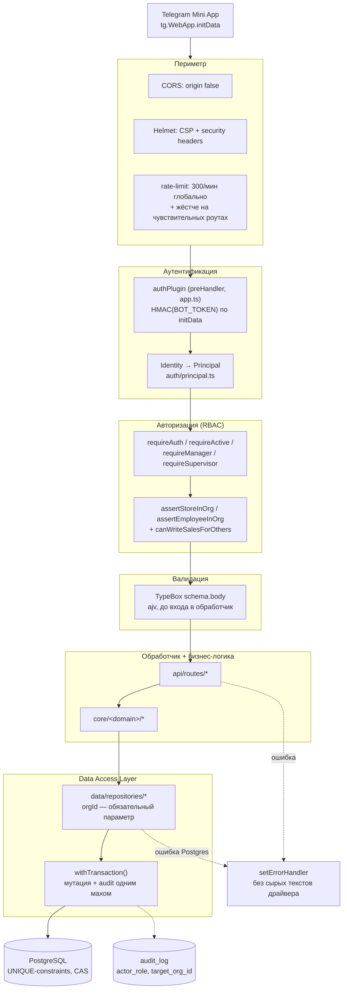

# Безопасность

> Извлечено из README §24 при репо-реструктуризации (20.11.0), переработано
> в 20.13.0 (Security hardening) в архитектурный вид — по слоям защиты, а
> не хронологической лентой правок. Полная построчная история осталась в
> README §21 (История версий); этот файл — актуальный срез «как оно
> работает сейчас и почему».

## Принцип

Всё, что решает роль или принадлежность к сети, проверяется **на сервере**
на каждом запросе — UI прячет кнопки для удобства, но ни один экран не
является границей доступа сам по себе. Одна и та же проверка не должна
иметь двух разных ответов в зависимости от того, каким путём запрос попал
в систему (класс проблемы, найденный и закрытый в 20.13.0 — см. [RBAC](#авторизация-rbac)
ниже) — это главный урок, зашитый в архитектуру решений этого документа.

## Архитектура защиты

Каждый запрос проходит один и тот же конвейер — от периметра до строки в
Postgres. Ни один роут не может обойти слой, минуя предыдущий: `authPlugin`
навешан глобально на `app.ts` и выполняется до диспетчеризации в конкретный
обработчик, `data/repositories/*` — единственный путь к БД, `orgId` в
каждой repository-функции обязателен, а не опционален.



## Уровни защиты

Defense-in-depth: ни один отдельный уровень не единственная линия обороны
— каждый следующий перекрывает то, что теоретически могло бы просочиться
через предыдущий.

| # | Уровень | Механизм | Где в коде |
|---|---------|----------|------------|
| 1 | Периметр | CORS закрыт, CSP, rate-limit | `app.ts` |
| 2 | Аутентификация | HMAC-проверка initData, TTL сессии, прод-гварды | `auth/providers/telegram*.ts`, `src/index.ts` |
| 3 | Авторизация (RBAC) | Ролевая иерархия + org-scope на каждом чужом ресурсе | `auth/guards.ts` |
| 4 | Валидация ввода | TypeBox-схемы, ajv, коэрсия под контролем | `api/routes/*` (`schema.body`) |
| 5 | Data Access Layer | `orgId` обязателен, единственный путь к Postgres | `data/repositories/*` |
| 6 | Целостность данных | UNIQUE-constraints, compare-and-swap, транзакции | миграции + `data/db/index.ts` |
| 7 | Audit Trail | Кто/что/когда/над кем, транзакционно с мутацией | `data/repositories/audit.ts` |
| 8 | Обработка ошибок | Единый формат, без утечки внутренностей | `app.ts::setErrorHandler`, `shared/errors.ts` |
| 9 | Frontend | Экранирование вывода, CSP, typed-контракт | `frontend/js/*.js`, `frontend/src/api-client.ts` |

---

### 1. Периметр

- **CORS закрыт** (`origin: false`, с 17.8.0) — Mini App всегда бьёт на API
  своим же origin, легитимного кросс-origin браузерного вызова нет.
- **`@fastify/helmet`** (19.14.0) — CSP собран вручную (`useDefaults: false`),
  не берётся с дефолтов библиотеки: `frame-ancestors` вместо `X-Frame-Options`
  (Telegram Web открывает Mini App в iframe с `web.telegram.org`, `SAMEORIGIN`
  это бы сломал), `crossOriginEmbedderPolicy` выключен (иначе блокируется
  `<script src="https://telegram.org/js/telegram-web-app.js">` — у него нет
  `Cross-Origin-Resource-Policy`). CSP разрешает inline-обработчики
  (`script-src-attr`/`style-src-attr: 'unsafe-inline'`) — вёрстка легаси-
  страниц держится на `onclick=`/`style=`-атрибутах; переход на строгую CSP
  требует более крупной переделки фронтенда (см. дорожную карту, README §22
  — 20.12.0 начала обратный процесс, первая кнопка уже на `addEventListener`).
- **`@fastify/rate-limit`** (19.14.0) — общий потолок **300 запросов/мин на
  IP**, плюс отдельные более жёсткие лимиты там, где злоупотребление дороже
  обычного:

  | Роут | Лимит | Почему жёстче общего |
  |------|-------|------------------------|
  | `POST /access/requests` | 5/мин | Заявка на доступ — публичный, ещё не аутентифицированный по роли путь |
  | `POST /reports/send-micro`, `/send-final` | 10/мин | Рендер PNG через worker-пул — дорогая CPU-операция |
  | `POST /reports/send-digest` | 10/мин | То же — генерация изображения |
  | `GET /avatars/:employeeId` | 30/мин | Единственный публичный (без сессии) GET-эндпоинт — см. [известные компромиссы](#известные-компромиссы) |
  | `POST /shifts/open`, `POST /sync/batch` | 30/мин | Массовые операции — офлайн-очередь может прислать пачку разом |
  | `POST /sales`, `/sales/quick`, `POST /schedules` (bulk) | 60/мин | Основной write-путь, частый, но не безлимитный |

### 2. Аутентификация

**initData проверяется на сервере**, не на клиенте. Mini App шлёт сырой
`tg.WebApp.initData` в заголовке `X-Telegram-Init-Data`; глобальный
`preHandler`-хук `authPlugin` (навешан один раз в `app.ts`, выполняется
перед каждым роутом) пересчитывает HMAC по `BOT_TOKEN`
(`auth/providers/telegram-verify.ts`) и кладёт в `request.user`
подтверждённую identity — только если подпись сходится. `request.user` —
единственный источник identity во всех роутах; читать заголовок напрямую в
обход `authPlugin` считается багом (класс дыр, закрытый в 19.11.0).

Голый `X-Telegram-Id` без initData принимается **только** если `BOT_TOKEN`
не задан (локальная разработка) либо явно включён
`ALLOW_INSECURE_AUTH=true`. Это не просто конвенция — жёсткий гварт:
`src/index.ts` вообще отказывается стартовать в
`RAILWAY_ENVIRONMENT=production`, если `ALLOW_INSECURE_AUTH=true` **или**
`BOT_TOKEN` не задан. Сама initData-сессия живёт **1 час** (было 24,
снижено в 19.14.0 по рекомендации Telegram) — по истечении роут отвечает
понятным `session_expired`, а не голым 401.

**Authentication Boundary** (`src/auth/`, 20.9.0) — Telegram-специфика
изолирована в `auth/providers/telegram.ts` + `telegram-verify.ts`;
`Identity → Principal` резолвинг (`auth/principal.ts`) диспетчеризует по
`provider`, не предполагает Telegram глобально — подготовка под будущий
Web/Mobile/SSO без переписывания остального кода. `auth/guards.ts` (бывший
`middleware-auth.ts`) — тонкая Fastify-обвязка поверх этой границы,
ре-экспортирует прежние имена без изменений для вызывающего кода.

### 3. Авторизация (RBAC)

Иерархия ролей — строго линейная, каждая следующая включает возможности
предыдущей (`ROLE_LEVEL`, `auth/principal.ts`):

```
guest (-1) < trainee (0) < employee (1) < senior (2) < manager (3) < supervisor (4) < admin (5)
```

| Роль | Свои продажи | Продажи за другого | Command Center / кабинет супервайзера | Заявки на доступ | Назначение ролей |
|------|:---:|:---:|:---:|:---:|:---:|
| `trainee` / `employee` | ✅ | ❌ | ❌ | — | — |
| `senior` | ✅ | ❌ **(с 20.13.0)** | ❌ | — | — |
| `manager` | ✅ | ✅ (своя сеть) | ✅ | approve/reject | роли ниже своей |
| `supervisor` | — | — | ✅ (свой сектор) | — | роли ниже своей |
| `admin` | ✅ | ✅ (любая сеть) | ✅ | approve/reject | любые, включая admin |

`senior` — операционно почти everywhere «как manager» (проходит
`requireManager`), **кроме** двух вещей: не видит Command Center/кабинет
супервайзера (см. `canViewAnalytics()` на фронте), и с 20.13.0 не может
вносить/синхронизировать продажу **за другого** сотрудника — это
сознательное продуктовое решение, не оговорка иерархии.

**Единая точка правды для «может ли X писать за Y»** —
`canWriteSalesForOthers()` (`auth/guards.ts`, 20.13.0): узкая проверка
(`manager`/`admin`), отдельная от общего `isManager()` (включает `senior`).
До 20.13.0 три параллельных пути записи продажи — `POST /sales`,
`POST /sales/quick`, `POST /sync/batch` (офлайн-очередь) — решали этот
вопрос по-разному: первый исключал `senior` инлайн-проверкой, два других
пропускали через общий `isManager()`. Один и тот же вопрос имел два разных
ответа в зависимости от точки входа — классический пример того, почему
"верно один раз, забыто во втором похожем месте" опаснее одной явной дыры.
Закрыто по внешнему security-аудиту, зафиксировано регресс-тестами
(`tests/unit/middleware-auth.test.ts`, `tests/isolation/quick-sale-sync.test.ts`).

**Org-scope** — принадлежность к сети проверяется отдельно от роли, на
каждом роуте, читающем или пишущем чужие данные: `assertStoreInOrg()` /
`assertEmployeeInOrg()` (`auth/guards.ts`), либо декораторы
`requireStoreInOrg()` / `requireEmployeeInOrg()` (19.17.0) — preHandler
поверх тех же функций, регистрируются в опциях роута вместо ручного вызова
внутри обработчика (18 роутов переведены). Там, где store/employee id
узнаётся только после fetch внутри самого обработчика, или где
self-write/manager-for-other разруливаются по-разному, декоратор не
подходит технически — оставлено с ручной проверкой намеренно, не забыто.

### 4. Валидация ввода

TypeBox-схемы (`@sinclair/typebox`, 19.18.0) на `schema.body` роута —
Fastify валидирует запрос своим встроенным ajv-компилятором **до** того,
как управление доходит до обработчика; `err.code === 'FST_ERR_VALIDATION'`
в глобальном `setErrorHandler` превращает это в чистый
`{error: 'validation_failed', details: [...]}`. Весь write-API — на
TypeBox, `request.body as any` не осталось. Динамические по форме тела
(кастомные метрики продаж/планов, `sync/batch`-операции, произвольные поля
апдейта сети) сознательно оставлены `additionalProperties: true` — схема не
должна быть строже уже отлаженной ручной логики внутри обработчика.

**Ловушка ajv-коэрсии `null`** (найдена и закрыта в 19.19.0) —
`coerceTypes: true` (Fastify-дефолт) молча превращает `null` в `0` для
числовых полей и в `""` для строковых, без ошибки валидации. Для полей,
которые фронтенд шлёт как `null` намеренно (координаты геолокации при
отказе в доступе, сброс кастомного названия точки), это меняет смысл
данных. Фикс — `Type.Union([Type.Null(), Type.Number()])` **с `Null`
первым**: ajv коэрсит на первом подходящем варианте по порядку. Правило на
будущее: если фронтенд может прислать `null` намеренно — тип обязан быть
`Type.Union([Type.Null(), ...])`, иначе баг тихий.

### 5. Data Access Layer

Org-scoping — структурная гарантия, не «не забыть проверить в каждом
SELECT»: каждая tenant-функция репозитория берёт `orgId` первым
**обязательным** параметром, без него вызвать физически нельзя, и каждый
SQL внутри уже несёт `WHERE COALESCE(org_id,'default') = $orgId`. Весь
backend ходит в Postgres только через `data/repositories/*` — проверяется
в CI (`npm run check:no-direct-sql`, ratchet-список файлов в
`scripts/check-no-direct-sql.mjs`, 56 путей по состоянию на 20.11.0).

### 6. Целостность данных и конкурентность

Реально защищено на уровне схемы, не только логикой в коде:

- `idx_shift_sessions_one_open_per_employee` (partial UNIQUE INDEX) —
  физически не даёт двух открытых смен одному сотруднику.
- Закрытие смены — `UPDATE ... WHERE id=$X AND status='open'`, честный
  compare-and-swap.
- `offline_sync_log.client_id` — настоящий UNIQUE constraint +
  `ON CONFLICT DO NOTHING`, идемпотентность не только в коде.
- `sales` — `UNIQUE(employee_id, store_id, sale_date)`.
- `store_plans` — `UNIQUE(store_id, plan_date)` (миграция 0013) —
  закрывает найденную гонку `materializeStoreDailyPlans()` (крон 6:00 МСК
  vs синхронная правка плана): раньше `DELETE` + голые `INSERT` в цикле без
  constraint'а оставляли окно "плана нет" между delete и insert.

Всё закреплено тестами, которые реально стреляют `Promise.all()` из двух
одновременных запросов, а не проверяют последовательные сценарии.
Optimistic locking (версионирование строк) нигде не добавлен —
`PATCH /stores/:id` и подобные уже делают частичный `UPDATE SET <только
присланные поля>`, не перезапись всей строки, поэтому классический
lost-update сценарий физически не возникает.

### 7. Audit Trail и Observability

`audit_log` (`data/repositories/audit.ts`, 19.23.0, расширено в 20.10.0) —
единая лента чувствительных действий с полями `actor_role` (снимок роли
актора на момент действия, не текущая) и `target_org_id` (сеть цели,
отдельно от сети актора). `withTransaction()` — смена роли и правка
продажи коммитят мутацию и audit-запись одним махом или откатывают обе.

Структурные (pino JSON) логи фоновых задач (`src/cron/job-logger.ts`,
20.10.0) — старт/длительность/успех-неудача на каждое реальное
cron-действие, тем же форматом, что HTTP-логи Fastify — грепается в
Railway logs одинаково.

### 8. Обработка ошибок

Глобальный `setErrorHandler` (`app.ts`, 19.15.0) — известные коды ошибок
Postgres (дубликат, ссылка на несуществующую запись, некорректный формат)
превращаются в стабильный `{error, message}` без сырого текста драйвера;
роуты со своим `catch` используют тот же принцип через `serverError()`
(`shared/errors.ts`). CI падает на `npm audit --audit-level=high` —
известная уязвимость высокой критичности в зависимостях блокирует мёрдж, а
не остаётся незамеченной до следующего ручного аудита.

### 9. Frontend

Вывод данных пользователя экранируется через `esc()` (`01-core.js`) перед
вставкой в `innerHTML` — дисциплина проверена аудитом v20.11.1 почти по
всем интерполяциям; 2 подтверждённых пробела (имя сотрудника в модалке
правки продажи, `07-add-sale.js`; текст и пункты AI-инсайта смены,
`11-v13.js`) закрыты в 20.13.0.

**Frontend Foundation** (`frontend/src/`, 20.0.0→20.7.0) — typed
API-клиент (`api-client.ts`, 91 функция) сознательно бросает на не-ok/
сетевой ошибке, сам не глотает и не подставляет фолбэк. Общий контракт
(`shared/api-types.ts`) даёт компилируемую гарантию, что реализация роута и
тип ответа не разойдутся. Формат Vite-сборки — **iife** (не es/umd):
легаси-файлы `frontend/js/*.js` — классические синхронные
`<script src=...>`, ожидающие общую глобальную область к моменту
выполнения; IIFE сохраняет ту же семантику загрузки.

---

## Известные компромиссы

Не всё в этом списке — недосмотр; часть — осознанные решения с понятной
ценой, принятые владельцем продукта. Разница важна: внешний аудит (v20.11.1)
изначально характеризовал часть этих пунктов как «дыры», но при проверке
на реальном коде оказалось, что они — задокументированные trade-off'ы, не
новые находки.

| Риск | Текущая защита | Почему принято как есть |
|------|-----------------|--------------------------|
| Публичные аватарки (`GET /avatars/:employeeId`) без сессии | rate-limit 30/мин | `` физически не может послать `Authorization`-заголовок; подписанные ссылки с TTL — больший рефакторинг, отложен, не забыт |
| CSP разрешает `unsafe-inline` для обработчиков | Остальная CSP строгая (`default-src 'self'`, `object-src 'none'` и т.д.) | Легаси-вёрстка держится на `onclick=`/`style=`; переход требует переписать разметку, идёт постепенно с 20.12.0 |
| Supervisor Scope Cache — in-memory, не Redis | 5-минутный TTL, точечная инвалидация при смене сектора/роли | Прод — 1 реплика Railway (`grammy`-бот на long-polling не переживёт вторую реплику без перехода на webhook); Redis добавил бы сетевой failure mode без выигрыша в корректности при одной реплике |
| Динамические тела запроса (кастомные метрики, `sync/batch`, `what-if moves`) вне строгой TypeBox-схемы | `additionalProperties: true` + ручная фильтрация в обработчике (regex на ключи, `Number()`) | Схема не должна быть строже уже отлаженной ручной логики; форма тела определяется каталогом метрик динамически |

## RBAC — таблица прав по ролям

| Действие | trainee/employee | senior | manager | supervisor | admin |
|----------|:---:|:---:|:---:|:---:|:---:|
| Вносить свою продажу | ✅ | ✅ | ✅ | — | ✅ |
| Вносить продажу за другого сотрудника | ❌ | ❌ | ✅ (своя сеть) | — | ✅ (любая сеть) |
| Видеть Command Center / аналитику сети | ❌ | ❌ | ✅ | ✅ (свой сектор) | ✅ |
| Одобрять заявки на доступ | ❌ | ❌ | ✅ | ❌ | ✅ |
| Назначать роли | ❌ | ❌ | ниже своей | ниже своей | любые |
| Менять сектор/сеть точки | ❌ | ❌ | ❌ | ❌ | ✅ |
| Переключать сеть просмотра (`org_id` override) | ❌ | ❌ | ❌ (игнорируется) | ❌ | ✅ |

## Тестовое покрытие

| Категория | Файлов | Что фиксирует |
|-----------|:---:|----------------|
| `tests/unit/` | 7 | Чистые функции — RBAC-примитивы, forecast-модель, job-logger |
| `tests/isolation/` | 43 | Org-scoping, race conditions, идемпотентность — реальные роуты через `app.inject()` |
| `tests/adversarial/` | 5 (26 тестов) | Конкретные прошлые инциденты: auth bypass, unauthenticated disclosure, cross-tenant IDOR, identity spoofing, некорректный ввод — не «работает ли», а «не повторится ли снова» |

Adversarial-тесты — не общая проверка happy path, а закреплённая память о
реальных прошлых дырах: каждый тест назван по классу проблемы, которую он
не даёт повторить молча.

## Связанные документы

- [ARCHITECTURE.md](./ARCHITECTURE.md) — общая структура репозитория и
  диаграмма потока запроса.
- [docs/ADR/005](./ADR/005-authentication-boundary.md) — решение о
  выделении Authentication Boundary (20.9.0).
- README §21 «История версий» — полная построчная хронология каждой
  security-правки с датами и версиями.
