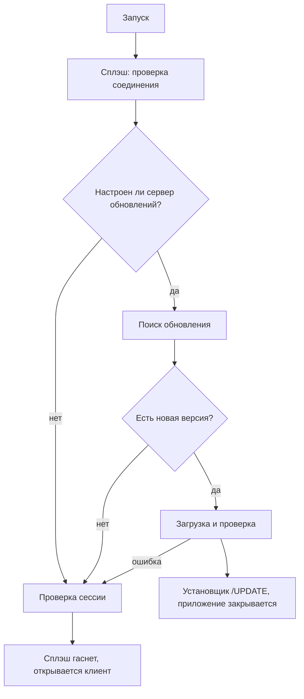

# Архитектура нативного приложения

[Каталог документации](../../docs/README.md) · [Нативное приложение](../README.md)

Как устроен нативный клиент для Windows: из каких модулей он состоит, как ходит на сервер, как запускается, как рисует интерфейс и анимации. Для тех, кто дорабатывает код. Перечень экранов — в [FEATURES.md](FEATURES.md), команды сборки — в [DEVELOPMENT.md](DEVELOPMENT.md). Модуль `shared` (сеть, модели, вход, тема) общий с Android-клиентом; что в Android устроено иначе (навигация, хранение сессии, экраны) — в [ANDROID.md](ANDROID.md#устройство).

**Содержание**

- [Модули](#модули)
- [Путь запроса к серверу](#путь-запроса-к-серверу)
- [Сеть DIRECT и RELAY](#сеть-direct-и-relay)
- [Запуск приложения](#запуск-приложения)
- [Оболочка и навигация](#оболочка-и-навигация)
- [Оформление и анимации](#оформление-и-анимации)
- [Общие компоненты](#общие-компоненты)
- [Работа без сети](#работа-без-сети)
- [Интеграция с Windows](#интеграция-с-windows)
- [Обновления и установщик](#обновления-и-установщик)

## Модули

```text
native/
  shared/       Kotlin Multiplatform, цель jvm()
  desktopApp/   Compose Desktop, зависит от :shared
  installer/    WPF-установщик (отдельно от Gradle-модулей; собирается задачей compileSetupStub)
```

| Слой | Пакет | Что в нём |
| --- | --- | --- |
| Общий | `ru.t2sales.shared.api` | `createHttpClient`, `ApiException`, `ApiTypes.kt` (типы ответов), `ReportsApi.kt` (все API-классы: `AuthApi`, `HomeApi`, `TeamApi`, `ScheduleApi`, `SalesApi`, `PlansApi` и др.), `FileCookiesStorage` |
| Общий | `ru.t2sales.shared.auth` | `AuthRepository` (вход, код MFA, проверка сессии), `platformConfigDir()` |
| Общий | `ru.t2sales.shared.theme` | Токены цвета, радиусов и отступов (`T2Tokens.kt`), тема Compose |
| Общий | `ru.t2sales.shared.navigation` | `Screen` — закрытый набор всех экранов |
| Приложение | `ru.t2sales.desktop.di` | `AppContainer` — один экземпляр клиента и всех API |
| Приложение | `ru.t2sales.desktop.network` | Сеть DIRECT/RELAY |
| Приложение | `ru.t2sales.desktop.update` | Обновления |
| Приложение | `ru.t2sales.desktop.ui.*` | Экраны и компоненты |

`Main.kt` создаёт `AppContainer`, показывает сплэш, затем клиент.

## Путь запроса к серверу

`createHttpClient` (`shared/api/HttpClient.kt`) собирает клиент Ktor:

1. **Cookie.** `HttpCookies` с файловым хранилищем `FileCookiesStorage` (`~/.t2sales/cookies.json`): сессия переживает перезапуск, как в браузере.
2. **CSRF.** Плагин добавляет заголовок `X-CSRF-Token` (значение из cookie `t2_csrf`) ко всем запросам, кроме `GET`, `HEAD`, `OPTIONS`. Повторяет `readCsrfCookie()` из веб-клиента.
3. **Ошибки.** Перехват `HttpSend` превращает любой не-2xx ответ в `ApiException(statusCode, code, message)` — то же, что бросает `request()` в веб-клиенте.
4. **JSON.** `ignoreUnknownKeys = true`, без преобразования имён: поля повторяют имена из `backend/src/shared/api-types.ts` как есть.
5. **WebSocket.** Плагин `WebSockets` нужен чату.

Движок — OkHttp. Адрес сервера задаёт `ApiConfig.PROD_API_BASE`.

## Сеть DIRECT и RELAY

Порт сетевого менеджера Electron (`desktop/src/main/network/*`). Файлы в `desktopApp/.../network/`:

| Файл | Роль |
| --- | --- |
| `NetworkStateMachine.kt` | Правила переходов между состояниями по результатам диагностики |
| `Diagnostics.kt` | Проверка по слоям: DNS, TCP, TLS, HTTP |
| `NetworkManager.kt` | Хозяин состояния; читает настройки, запускает диагностику |
| `RelayInterceptor.kt` | Перехватчик OkHttp: в режиме RELAY переписывает запрос в `POST {relay}/forward` с заголовками `x-t2-method`, `x-t2-path`, `x-t2-had-origin` |

Режим выбирается так: переменная `T2_NETWORK_MODE` при запуске, иначе выбор из панели в прошлый раз, иначе `auto`. Допустимые значения: `auto`, `direct_only`, `relay`. Адрес ретранслятора: `T2_RELAY_URL`, по умолчанию `https://relay.vincere-mortem.ru` (только https; http допускается для локального стенда на loopback). Панель состояния — по нажатию на индикатор «Прямое» в шапке (`ui/shell/NetworkIndicator.kt`).

## Запуск приложения

Клиент открывается не сразу: сначала небольшое окно-сплэш выполняет подготовку (`ui/boot/BootSequence.kt`), затем открывается основное окно.



Правила:

- Проблема с обновлением никогда не блокирует запуск: ошибка приводит к запуску установленной версии.
- Сплэш показывается не менее ~2 с.
- Результат проверки сессии (`me`) передаётся клиенту; нет сессии — открывается экран входа.
- Основное окно после сплэша выводится на передний план (`window.toFront()`) и проявляется анимацией `MainEntrance`.

`SplashScreen.kt` — прозрачное безрамочное окно 480×520 dp, всегда сверху, перетаскиваемое. Оно намеренно всегда тёмное, независимо от выбранной темы.

Подробности обновления — в [UPDATES.md](UPDATES.md).

## Оболочка и навигация

- `Screen` (`shared`) — закрытый класс со всеми экранами.
- `AppNav` — статическая точка перехода: `AppNav.go(screen)`, `current`, `previous`, `openStore(id)`. Нужна, чтобы любой экран мог перейти на другой, не пробрасывая колбэки.
- `AppShell` — боковое меню (`Sidebar`, видимость пунктов зависит от роли), шапка (аватар, заголовок, индикатор сети, тема, обновление, «Сегодня» и «Точка»), скругленный лист с содержимым, кнопка «+» (быстрая продажа), карточка обновления, уведомления, палитра команд.
- Главный `when (screen)` в `Main.kt` сопоставляет `Screen` с экраном.
- Чат занимает всю область и не прокручивается оболочкой; остальные экраны лежат в прокручиваемой колонке шириной до 1400 dp.

Меню в боковой панели повторяет веб: набор разделов зависит от роли (`manager`, `admin`, `supervisor`), см. `SECTIONS` в `Sidebar.kt`.

## Оформление и анимации

**Токены.** `T2Colors` (свет и тьма переключаются полем `T2Colors.dark`), `T2Radius`, `T2Spacing` в `shared/theme/T2Tokens.kt` повторяют переменные `styles.css`. Тема хранится в Java Preferences (`ThemePrefs`).

**Словарь движения** — `ui/components/Motion.kt`. Единые длительности и кривая (`Motion.Emphasized`: быстрый старт, мягкое торможение), чтобы все экраны двигались одинаково. Правило: анимация помогает глазу проследить изменение и играет один раз при появлении; для обычного интерфейса 150–450 мс.

| Инструмент | Что делает |
| --- | --- |
| `ScreenEnter(key)` | Экран проявляется и выезжает на 18 dp; играет при смене экрана, не при обновлении данных |
| `Modifier.reveal(index, stepMs)` | Каскад: блоки появляются один за другим |
| `animatedInt`, `animatedFloat` | Число или доля отсчитывается от нуля и плавно переходит к новому значению |
| `Modifier.shimmer()`, `SkeletonBlock` | Мерцающая заглушка вместо спиннера при загрузке |
| `pressSpring()` | Пружина нажатия для кнопок |
| `LoadingBlock`, `SkeletonBlock` | Заглушка загрузки из мерцающих полос; используется вместо спиннеров |
| `DialogEnter` | Диалог «вырастает» на месте: проявление, подъём и масштаб. Диалоги Compose — отдельные окна, поэтому анимируется их содержимое |

Где применено: смена экрана в `AppShell`, каскад и счётчики на главной, заполнение полосок в `ProgressRow`, кнопка `MainButton` (наведение и нажатие), пункты бокового меню, палитра команд, выпадающие списки, тепловая карта часов, сплэш.

## Общие компоненты

| Компонент | Файл | Замечание |
| --- | --- | --- |
| `DropdownField`, `DropdownItem`, `PopoverPanel` | `components/Dropdowns.kt` | Единый выпадающий список по ширине поля, со скруглением, тенью, галочкой на текущем значении, управлением с клавиатуры; `PopoverPanel` — карточка у якоря (панель сети). Стандартный `DropdownMenu` Material в приложении не используется |
| `SelectField`, `Field`, `FieldBox`, `MainButton` | `components/Forms.kt` | Поля и кнопка в стиле `.btn-main` и `.field` из веба |
| `SheetDialog` | `components/SheetDialog.kt` | Диалог-лист: заголовок, кнопка закрытия, прокручиваемое содержимое |
| `T2Toast`, `ToastHost` | `components/Toast.kt` | Уведомления: `T2Toast.show(текст, ошибка)` |
| `AvatarImage` | `components/AvatarImage.kt` | Аватар с загрузкой по `employee_id` |
| `PageSection` | `components/Layout.kt` | Карточка секции |
| `CommandPalette` | `ui/shell/CommandPalette.kt` | Палитра команд на Ctrl+K; список экранов берётся из `Sidebar.navigationTargets()` по роли |

Окно-обёртка сочетаний клавиш находится в `Main.kt`: Ctrl+K открывает палитру, Ctrl+N — «Добавить продажу»; работает только пока пользователь вошёл (`AppNav.signedIn`).

## Работа без сети

Ограничена продажами: каждая продажа на сервере идемпотентна по `client_id` (`POST /sales`), поэтому её безопасно отправлять повторно. Остальные действия без сети не ставятся в очередь, а сообщают об ошибке.

| Часть | Файл | Что делает |
| --- | --- | --- |
| `SalesOutbox` | `offline/SalesOutbox.kt` | Очередь на диске (`~/.t2sales/pending-sales.json`, запись через временный файл и атомарную замену). Отправляет по порядку, раз в 20 с и по кнопке |
| `SaleFormCache` | `offline/SaleFormCache.kt` | Последние данные формы продажи (сотрудники, точки, метрики, точка сотрудника на сегодня) для открытия без сети |
| `OutboxPill`, диалог | `ui/shell/OutboxUi.kt` | Индикатор в шапке и список очереди |

Как решается судьба записи при отправке:

| Ответ | Что происходит |
| --- | --- |
| Успех или повтор с тем же `client_id` (сервер отвечает прежним результатом) | Запись удаляется |
| Нет ответа вообще (ошибка сети, таймаут, ретранслятор недоступен) | Запись остаётся, проход прерывается, повтор позже |
| 401, 403, 408, 425, 429, 5xx | Запись остаётся, проход прерывается (нужен повторный вход или сервер занят) |
| Другие 4xx, в том числе 409 «требует сверки» и 400 «некорректное значение» | Запись помечается «проверить» и сама больше не отправляется; человек решает и удаляет её |

Момент продажи сохраняется в `occurred_at` при внесении, а не при отправке: часовая карта (Heatmap) остаётся верной. Запись принадлежит сотруднику, который её внёс: в чужой сессии на общем компьютере очередь не видна и не отправляется. Повреждённый файл очереди откладывается в `.bad`, приложение запускается с пустой очередью.

Форма «Добавить продажу» при каждом успешном ответе сервера обновляет кэш; если сервер недоступен и кэш есть (для этого же сотрудника), форма открывается из него с пометкой «Нет связи: данные от …».

## Интеграция с Windows

Код в `desktopApp/.../system/` (кроме защиты входа) и в `Main.kt`.

| Возможность | Как устроена |
| --- | --- |
| Трей | `Tray` из Compose Desktop; меню значка, `trayState.sendNotification` для уведомлений Windows. Окно управляется флагом `AppWindow.visible`: закрытие прячет его, а не завершает приложение (`TrayPrefs.hideOnClose`) |
| Вызов окна | `AppWindow.show()` увеличивает `frontTick`; окно по нему выходит вперёд и разворачивается. Так работают значок, хоткей и повторный запуск |
| Одна копия | `SingleInstance`: установленное приложение занимает порт 47613 на loopback; второй экземпляр отправляет туда «покажись» и завершается. Запуск из исходников не ограничивается |
| Автозапуск | `Autostart`: значение в `HKCU\Software\Microsoft\Windows\CurrentVersion\Run` (команда `reg`), запуск с ключом `--tray` (без сплэша, окно скрыто). Доступен только у установленного приложения |
| Глобальный хоткей | `GlobalHotkey`: `RegisterHotKey` через JNA на отдельном потоке с циклом сообщений (Ctrl+Alt+P) открывает мини-окно `QuickSale`. Занято другой программой: хоткея нет, приложение работает |
| Быстрая продажа | `quick/QuickSale.kt`: отдельное прозрачное безрамочное окно всегда сверху (без обёртки темы: она закрасила бы прозрачный фон). Перед показом запоминается окно, владевшее вводом (`GetForegroundWindow`), при закрытии ввод возвращается ему. Текст разбирает `SaleText` (порт `nlp.ts`), фамилию для руководителя отделяет `splitEmployee` (однозначное совпадение, слова-метрики и числа именем не считаются). Отправка: `POST /sales/quick` (сервер сам находит точку по смене; `client_id` защищает от дубля); нет ответа сервера: продажа с точкой из кэша формы уходит в очередь `SalesOutbox` |
| Тема как в Windows | `SystemTheme.isDark()` читает `AppsUseLightTheme` из реестра через JNA (`Advapi32Util`); цикл в `Main.kt` раз в 20 секунд, пока включён `ThemePrefs.auto` |
| Уведомления | `NotificationWatcher` раз в минуту читает открытые алерты и непрочитанные объявления теми же запросами, что и экраны. Уже виденные номера хранятся в Preferences; первый просмотр только запоминает, ничего не объявляя. Уведомление показывается, только если окно не в фокусе (`AppNotifier.whenAway`) |
| Окно | `WindowPrefs`: размер, положение и «развёрнуто» сохраняются через 0,7 с после последнего изменения; положение вне видимых мониторов отбрасывается |
| Защита входа | `SecretProtector` (`shared`, jvmMain): `WindowsDpapi` через JNA (`Crypt32Util`) с дополнительной энтропией. `FileCookiesStorage` пишет файл с префиксом `T2DPAPI1:` и base64 зашифрованных данных через временный файл и атомарную замену; старый открытый файл читается и переписывается зашифрованным. Данные, которые нельзя расшифровать (другая учётная запись, другой ПК, порча), означают «не выполнен вход» |
| Кэш чтения | `ReadCache`: по файлу на ключ в `~/.t2sales/cache/<id сотрудника>/`, ключи очищаются от опасных символов. Главная показывает сохранённую копию сразу и заменяет её свежей; при отсутствии ответа сервера остаётся копия с пометкой. Ответ сервера с ошибкой (`ApiException`) кэшем не подменяется |

Зависимость: JNA 5.14.0 (`net.java.dev.jna:jna`, `jna-platform`) в `shared` (jvmMain) и в `desktopApp`.

## Обновления и установщик

Код обновлений — `desktopApp/.../update/` (`Manifest.kt`, `UpdateNetwork.kt`, `UpdateSecurity.kt`, `UpdateManager.kt`). Установщик — `installer/setup/*.cs`. Оба описаны отдельно, чтобы не дублировать: [UPDATES.md](UPDATES.md) и [installer/README.md](../installer/README.md).

Признак «установленное приложение»: системное свойство `jpackage.app-path`. Только в установленном приложении включается проверка обновлений по умолчанию; запуск из исходников ничего не проверяет, пока не задан `T2_UPDATE_BASE_URL`.
