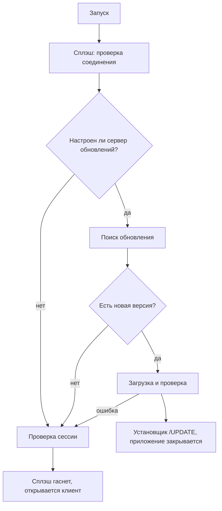

# Архитектура нативного приложения

[Каталог документации](../../docs/README.md) · [Нативное приложение](../README.md)

Как устроен нативный клиент: из каких модулей он состоит, как ходит на сервер, как запускается, как рисует интерфейс и анимации. Для тех, кто дорабатывает код. Перечень экранов — в [FEATURES.md](FEATURES.md), команды сборки — в [DEVELOPMENT.md](DEVELOPMENT.md).

**Содержание**

- [Модули](#модули)
- [Путь запроса к серверу](#путь-запроса-к-серверу)
- [Сеть DIRECT и RELAY](#сеть-direct-и-relay)
- [Запуск приложения](#запуск-приложения)
- [Оболочка и навигация](#оболочка-и-навигация)
- [Оформление и анимации](#оформление-и-анимации)
- [Общие компоненты](#общие-компоненты)
- [Обновления и установщик](#обновления-и-установщик)

## Модули

```text
native/
  shared/       Kotlin Multiplatform, цель jvm()
  desktopApp/   Compose Desktop, зависит от :shared
  installer/    WPF-установщик (отдельно от Gradle-модулей; собирается задачей compileSetupStub)
```

| Слой | Пакет | Что в нём |
| --- | --- | --- |
| Общий | `ru.t2sales.shared.api` | `createHttpClient`, `ApiException`, `ApiTypes.kt` (типы ответов), `ReportsApi.kt` (все API-классы: `AuthApi`, `HomeApi`, `TeamApi`, `ScheduleApi`, `SalesApi`, `PlansApi` и др.), `FileCookiesStorage` |
| Общий | `ru.t2sales.shared.auth` | `AuthRepository` (вход, код MFA, проверка сессии), `platformConfigDir()` |
| Общий | `ru.t2sales.shared.theme` | Токены цвета, радиусов и отступов (`T2Tokens.kt`), тема Compose |
| Общий | `ru.t2sales.shared.navigation` | `Screen` — закрытый набор всех экранов |
| Приложение | `ru.t2sales.desktop.di` | `AppContainer` — один экземпляр клиента и всех API |
| Приложение | `ru.t2sales.desktop.network` | Сеть DIRECT/RELAY |
| Приложение | `ru.t2sales.desktop.update` | Обновления |
| Приложение | `ru.t2sales.desktop.ui.*` | Экраны и компоненты |

`Main.kt` создаёт `AppContainer`, показывает сплэш, затем клиент.

## Путь запроса к серверу

`createHttpClient` (`shared/api/HttpClient.kt`) собирает клиент Ktor:

1. **Cookie.** `HttpCookies` с файловым хранилищем `FileCookiesStorage` (`~/.t2sales/cookies.json`): сессия переживает перезапуск, как в браузере.
2. **CSRF.** Плагин добавляет заголовок `X-CSRF-Token` (значение из cookie `t2_csrf`) ко всем запросам, кроме `GET`, `HEAD`, `OPTIONS`. Повторяет `readCsrfCookie()` из веб-клиента.
3. **Ошибки.** Перехват `HttpSend` превращает любой не-2xx ответ в `ApiException(statusCode, code, message)` — то же, что бросает `request()` в веб-клиенте.
4. **JSON.** `ignoreUnknownKeys = true`, без преобразования имён: поля повторяют имена из `backend/src/shared/api-types.ts` как есть.
5. **WebSocket.** Плагин `WebSockets` нужен чату.

Движок — OkHttp. Адрес сервера задаёт `ApiConfig.PROD_API_BASE`.

## Сеть DIRECT и RELAY

Порт сетевого менеджера Electron (`desktop/src/main/network/*`). Файлы в `desktopApp/.../network/`:

| Файл | Роль |
| --- | --- |
| `NetworkStateMachine.kt` | Правила переходов между состояниями по результатам диагностики |
| `Diagnostics.kt` | Проверка по слоям: DNS, TCP, TLS, HTTP |
| `NetworkManager.kt` | Хозяин состояния; читает настройки, запускает диагностику |
| `RelayInterceptor.kt` | Перехватчик OkHttp: в режиме RELAY переписывает запрос в `POST {relay}/forward` с заголовками `x-t2-method`, `x-t2-path`, `x-t2-had-origin` |

Режим выбирается так: переменная `T2_NETWORK_MODE` при запуске, иначе выбор из панели в прошлый раз, иначе `auto`. Допустимые значения: `auto`, `direct_only`, `relay`. Адрес ретранслятора: `T2_RELAY_URL`, по умолчанию `https://relay.vincere-mortem.ru` (только https; http допускается для локального стенда на loopback). Панель состояния — по нажатию на индикатор «Прямое» в шапке (`ui/shell/NetworkIndicator.kt`).

## Запуск приложения

Клиент открывается не сразу: сначала небольшое окно-сплэш выполняет подготовку (`ui/boot/BootSequence.kt`), затем открывается основное окно.



Правила:

- Проблема с обновлением никогда не блокирует запуск: ошибка приводит к запуску установленной версии.
- Сплэш показывается не менее ~2 с.
- Результат проверки сессии (`me`) передаётся клиенту; нет сессии — открывается экран входа.
- Основное окно после сплэша выводится на передний план (`window.toFront()`) и проявляется анимацией `MainEntrance`.

`SplashScreen.kt` — прозрачное безрамочное окно 480×520 dp, всегда сверху, перетаскиваемое. Оно намеренно всегда тёмное, независимо от выбранной темы.

Подробности обновления — в [UPDATES.md](UPDATES.md).

## Оболочка и навигация

- `Screen` (`shared`) — закрытый класс со всеми экранами.
- `AppNav` — статическая точка перехода: `AppNav.go(screen)`, `current`, `previous`, `openStore(id)`. Нужна, чтобы любой экран мог перейти на другой, не пробрасывая колбэки.
- `AppShell` — боковое меню (`Sidebar`, видимость пунктов зависит от роли), шапка (аватар, заголовок, индикатор сети, тема, обновление, «Сегодня» и «Точка»), скругленный лист с содержимым, кнопка «+» (быстрая продажа), карточка обновления, уведомления, палитра команд.
- Главный `when (screen)` в `Main.kt` сопоставляет `Screen` с экраном.
- Чат занимает всю область и не прокручивается оболочкой; остальные экраны лежат в прокручиваемой колонке шириной до 1400 dp.

Меню в боковой панели повторяет веб: набор разделов зависит от роли (`manager`, `admin`, `supervisor`), см. `SECTIONS` в `Sidebar.kt`.

## Оформление и анимации

**Токены.** `T2Colors` (свет и тьма переключаются полем `T2Colors.dark`), `T2Radius`, `T2Spacing` в `shared/theme/T2Tokens.kt` повторяют переменные `styles.css`. Тема хранится в Java Preferences (`ThemePrefs`).

**Словарь движения** — `ui/components/Motion.kt`. Единые длительности и кривая (`Motion.Emphasized`: быстрый старт, мягкое торможение), чтобы все экраны двигались одинаково. Правило: анимация помогает глазу проследить изменение и играет один раз при появлении; для обычного интерфейса 150–450 мс.

| Инструмент | Что делает |
| --- | --- |
| `ScreenEnter(key)` | Экран проявляется и выезжает на 18 dp; играет при смене экрана, не при обновлении данных |
| `Modifier.reveal(index, stepMs)` | Каскад: блоки появляются один за другим |
| `animatedInt`, `animatedFloat` | Число или доля отсчитывается от нуля и плавно переходит к новому значению |
| `Modifier.shimmer()`, `SkeletonBlock` | Мерцающая заглушка вместо спиннера при загрузке |
| `pressSpring()` | Пружина нажатия для кнопок |

Где применено: смена экрана в `AppShell`, каскад и счётчики на главной, заполнение полосок в `ProgressRow`, кнопка `MainButton` (наведение и нажатие), пункты бокового меню, палитра команд, выпадающие списки, тепловая карта часов, сплэш.

## Общие компоненты

| Компонент | Файл | Замечание |
| --- | --- | --- |
| `DropdownField`, `DropdownItem`, `PopoverPanel` | `components/Dropdowns.kt` | Единый выпадающий список по ширине поля, со скруглением, тенью, галочкой на текущем значении; `PopoverPanel` — карточка у якоря (панель сети). Стандартный `DropdownMenu` Material в приложении не используется |
| `SelectField`, `Field`, `FieldBox`, `MainButton` | `components/Forms.kt` | Поля и кнопка в стиле `.btn-main` и `.field` из веба |
| `SheetDialog` | `components/SheetDialog.kt` | Диалог-лист: заголовок, кнопка закрытия, прокручиваемое содержимое |
| `T2Toast`, `ToastHost` | `components/Toast.kt` | Уведомления: `T2Toast.show(текст, ошибка)` |
| `AvatarImage` | `components/AvatarImage.kt` | Аватар с загрузкой по `employee_id` |
| `PageSection` | `components/Layout.kt` | Карточка секции |
| `CommandPalette` | `ui/shell/CommandPalette.kt` | Палитра команд на Ctrl+K; список экранов берётся из `Sidebar.navigationTargets()` по роли |

Окно-обёртка сочетаний клавиш находится в `Main.kt`: Ctrl+K открывает палитру, Ctrl+N — «Добавить продажу»; работает только пока пользователь вошёл (`AppNav.signedIn`).

## Обновления и установщик

Код обновлений — `desktopApp/.../update/` (`Manifest.kt`, `UpdateNetwork.kt`, `UpdateSecurity.kt`, `UpdateManager.kt`). Установщик — `installer/setup/*.cs`. Оба описаны отдельно, чтобы не дублировать: [UPDATES.md](UPDATES.md) и [installer/README.md](../installer/README.md).

Признак «установленное приложение»: системное свойство `jpackage.app-path`. Только в установленном приложении включается проверка обновлений по умолчанию; запуск из исходников ничего не проверяет, пока не задан `T2_UPDATE_BASE_URL`.
